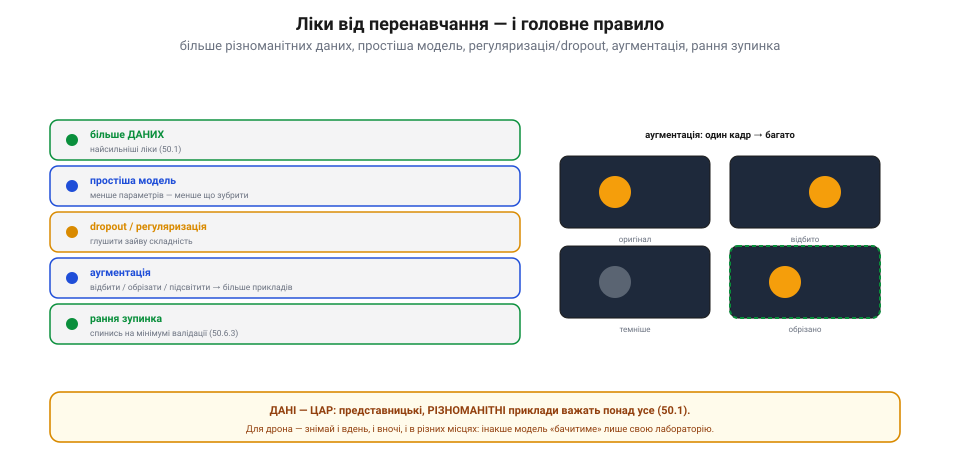

# Перенавчання: коли модель зубрить приклади замість закономірності

<preknowlist>
- [Що таке машинне навчання](topic:algorithms/what-is-ml) — модель як функція, що сама налаштовується за прикладами з відомими відповідями.
- [Градієнтний спуск](topic:algorithms/gradient-descent) — як навчання підбирає ваги, крок за кроком зменшуючи похибку; що таке темп навчання, епоха й гіперпараметр.
</preknowlist>

Навчити модель означає підібрати їй ваги так, щоб [похибка на прикладах](topic:algorithms/gradient-descent) стала якомога меншою. Тиснемо на цю мету — і похибка на **бачених** прикладах справді падає, аж до нуля. Та ось питання, з якого починається вся тема: навіщо нам модель, що бездоганно відповідає на приклади, правильні відповіді до яких ми **й так уже знаємо**? Уся її цінність — у роботі на **новому**, чого вона ніколи не бачила. І тут відкривається прірва: низька похибка на бачених даних не просто нічого не гарантує на небачених — вона буває **прямим симптомом** біди.

Ця біда зветься **перенавчання** (англ. *overfitting* — надмірне припасування): модель замість того, щоб **схопити закономірність**, просто **зазубрює** приклади разом із їхніми випадковостями. А те, чого ми насправді хочемо, — **узагальнення** (англ. *generalization* — робити загальним): здатність правильно відповісти на те, чого не бачив. Уся тема — про те, чому зубріння взагалі можливе, як його розпізнати й чим лікувати.

### Чому зубріння взагалі можливе: місткість і шум

Щоб зрозуміти перенавчання, спершу спитаймо: чому модель узагалі **може** зазубрити? Відповідь — у природі даних. Кожен реальний приклад складається з **двох** частин: справжньої закономірності (те, що ми хочемо вивчити) і **шуму** — випадкової домішки від похибок виміру, дрібниць, чистого випадку. Мета — витягти перше й **знехтувати** другим. Але модель наперед не знає, де тут закон, а де шум; вона бачить лише точки.

Тепер усе залежить від того, наскільки модель **гнучка**, — від її **місткості** (англ. *capacity* — місткість, об'єм): наскільки звивисту функцію вона здатна зобразити. Грубо місткість міряють кількістю вільних параметрів — [ваг](topic:algorithms/neuron-layer).


*Та сама вибірка, три різні місткості. Жорстка пряма не може вигнутися під дані — проходить повз саму закономірність (недонавчання). Плавна крива ловить тренд і нехтує шумом (добра підгонка). Дуже гнучка крива протискається крізь кожну точку, повторюючи й випадковий шум (перенавчання): ідеально на цих точках, безпорадно на нових.*

Розглянь три випадки на тих самих точках. **Жорстка** модель — пряма: у неї так мало свободи, що вона фізично **не може** вигнутися під кожну точку, тож змушена усереднювати й ловить хіба грубий напрям. Якщо закономірність і справді пряма — добре; та якщо вона крива, пряма промахнеться **повз саму суть** — це **недонавчання** (англ. *underfitting* — недостатнє припасування): модель надто проста навіть для закону. На іншому кінці — **дуже гнучка** модель: параметрів стільки, що крива може вигинатися як завгодно й **пройти крізь кожну точку**. А раз вона проходить крізь кожну — то підганяється й під **шум**, приймаючи випадкову домішку за частину закону. Оце і є **перенавчання**. Посередині — **добра підгонка**: місткості рівно стільки, щоб зобразити закономірність, і не стільки, щоб облягти ще й шум.

Звідси перша тверда думка: перенавчання можливе саме тому, що **вільної гнучкості в моделі більше, ніж треба закономірності**, — і надлишок вона витрачає на шум. Проста, жорстка модель зазубрити не здатна; біда приходить разом із місткістю.

### Симптом: розрив між баченим і небаченим

Гаразд, модель могла зазубрити. Як **побачити**, що вона таки зазубрила, а не зрозуміла? За характерним симптомом. Уяви двох учнів перед іспитом. Перший **завчив** відповіді на питання минулих років — слово в слово, не тямлячи суті. Другий **розібрався** в предметі. На точно тих самих торішніх питаннях обидва блиснуть однаково. Різниця виявиться лише на **нових** питаннях: хто зрозумів — відповість, хто завчив — попливе.


*Симптом — розрив. Перенавчена модель блищить на бачених прикладах (тут 99%) і провалюється на небачених (60%). Достоту як учень, що завчив торішні білети: на них відповість, а на нових питаннях попливе. Точність на тренуванні сама собою нічого не важить — важить лише точність на новому.*

Отже, і з моделлю: дивитися **лише** на точність на бачених прикладах — марно, бо там завчений і тямущий нерозрізненні. Розрізняє їх одне — точність на **небаченому**. Перенавчена модель показує майже ідеальні, скажімо, 99% на тренувальних даних і провалюється до 60% на нових; той **розрив** між «блискуче на баченому» і «погано на небаченому» — і є головний, безпомилковий симптом перенавчання. А проста, недонавчена модель погана **однаково** там і там — розрив малий, зате похибка висока всюди. Аналогія з учнем має межу: модель не «лінива» й не «хитрує» — вона просто чесно оптимізує рівно те, що ми їй задали (похибку на бачених даних), тож розрив не моральна вада, а прямий наслідок надлишкової місткості. І звідси головне правило вимірювання: **висока точність на тренуванні сама собою не варта нічого**; важить лише те, як модель тримається на тому, чого не бачила.

### Два корені похибки: зміщення й дисперсія

Недонавчання й перенавчання виглядають як дві різні біди — та за ними стоїть **одна вісь**, і побачити її варто, бо саме вона пояснює, **чому** гнучкість тягне за собою зубріння. Проведімо уявний дослід. Збери **багато разів** свіжу тренувальну вибірку з того самого джерела й щоразу наново навчи модель. Що може піти не так — двома способами.

Перший: модель **систематично** промахується повз закономірність, хоч яку вибірку їй дай, — бо надто жорстка, щоб ту закономірність узагалі зобразити. Цей сталий ухил звуть **зміщенням** (англ. *bias* — ухил, упередження). Другий: модель щоразу дає **геть іншу** криву, бо тісно облягає випадковий шум **саме цієї** вибірки. Цей розкид відповідей від вибірки до вибірки звуть **дисперсією** (лат. *dispersio* — розсіювання; англ. *variance*).

Тепер видно суть. Жорстка модель (пряма) — **велике зміщення, мала дисперсія**: стабільно, з вибірки у вибірку, промахується однаково повз суть. Гнучка модель — **мале зміщення, велика дисперсія**: у середньому вловлює тренд, але щоразу інакше, бо ганяється за шумом. **Перенавчання — це і є режим великої дисперсії:** модель так щільно припасувалася до випадковостей своєї вибірки, що на будь-якій іншій (тобто на нових даних) розсипається. Більша місткість **зменшує зміщення, але роздуває дисперсію**, і найкраща модель — там, де їхня сума найменша. Точний кількісний розклад похибки на зміщення², дисперсію й непереборний шум — окрема, красива тема: [компроміс зміщення й дисперсії](topic:algorithms/bias-variance-tradeoff). Для перенавчання досить утримати головне: **зубріння = висока дисперсія**.

### Як чесно виміряти: тренувальний, валідаційний, тестовий

Якщо єдине, що важить, — точність на небаченому, то це небачене треба **мати** й ніколи його не «підглядати». Тому дані ділять на **три** частини з різними ролями.


*Три ролі даних. На тренувальному модель учиться; на валідаційному підбирають гіперпараметри й ловлять перенавчання; тестовий чіпають один раз для чесної оцінки. Унизу — криві похибки за епохами: тренувальна весь час падає, а валідаційна спершу падає, тоді росте. Її мінімум — момент зупинки (рання зупинка).*

**Тренувальний** набір — на ньому модель **вчиться**, [підбирає ваги](topic:algorithms/gradient-descent). **Валідаційний** — недоторканний під час самого навчання; на ньому по ходу розробки перевіряють, як модель тримається на небаченому, **підбирають гіперпараметри** (місткість моделі, темп навчання, силу штрафів) і **ловлять** початок перенавчання. **Тестовий** — резерв, який чіпають **один-єдиний раз**, наприкінці, щоб дістати **чесну** оцінку. І золоте правило, непорушне: **ніколи не оцінюй модель на даних, на яких вона вчилася**, — бо так виміряєш зубріння, а не вміння.

Чому валідаційний і тестовий — **окремо**, адже обидва «небачені»? Бо щойно ти почав **підбирати** щось за валідаційним набором — обирати архітектуру, крутити гіперпараметри під найкращий результат саме на ньому, — ти помалу **припасовуєшся вже й до нього**. Валідаційний потроху «протікає» в модель через твої рішення, і його оцінка стає надто оптимістичною. Тому тримають ще один, тестовий, якого не торкалися **жодного разу** під час підбору: лише він дає незабруднену цифру.

А **як саме** валідація ловить перенавчання під час навчання — видно з кривих похибки. Тренувальна похибка з кожною [епохою](topic:algorithms/gradient-descent) все падає (модель усе краще припасовується до бачених даних). Валідаційна ж спершу теж падає — модель вивчає справжню закономірність, корисну й на небаченому, — а тоді, у певний момент, **починає рости**: з цієї миті модель уже вчить не закон, а шум, і на небаченому їй **гіршає**. Точка, де валідаційна крива завертає вгору, — і є початок перенавчання. Звідси простий і дуже дієвий прийом: спинити навчання рівно на **мінімумі** валідаційної похибки — це **рання зупинка** (англ. *early stopping*).

Одне застереження: поділ **краде** дані. Якщо прикладів обмаль, відрізати чималий шмат на валідацію боляче — а без нього похибку не зміряєш чесно. Вихід — **[крос-валідація](topic:algorithms/cross-validation)**: дані ділять на кілька частин і по черзі роблять кожну валідаційною, а решту — тренувальною, тоді усереднюють; так кожен приклад устигає побути й у навчанні, й у перевірці.

### Демонстрація в числах: нульова похибка як пастка

Найкраще перенавчання відчути на маленькому прикладі, де все видно руками. Справжня закономірність нехай буде проста — пряма `y = x`. Але наші три тренувальні точки прийшли з **шумом**: середні дві трохи збиті вбік від прямої. Підженемо до них дві моделі різної місткості — **пряму** (степінь 1) і **параболу** (степінь 2) — і подивимось на похибку (тут — середньоквадратичну, MSE) на тренуванні й на двох **небачених** точках.

**Три точки з шумом навколо прямої y = x; підганяємо поліном методом найменших квадратів і міряємо похибку на нових точках.**

```cpp
#include <cstdio>
#include <cmath>
#include <vector>
#include <algorithm>
using namespace std;

// Розв'язати лінійну систему M·c = b (n×n) методом Гаусса з вибором головного елемента.
vector<double> solve(vector<vector<double>> M, vector<double> b) {
    int n = (int)b.size();
    for (int col = 0; col < n; col++) {
        int piv = col;                                   // головний рядок — найбільший за модулем у стовпці
        for (int r = col + 1; r < n; r++)
            if (fabs(M[r][col]) > fabs(M[piv][col])) piv = r;
        swap(M[col], M[piv]); swap(b[col], b[piv]);
        for (int r = col + 1; r < n; r++) {              // виключення нижче діагоналі
            double f = M[r][col] / M[col][col];
            for (int k = col; k < n; k++) M[r][k] -= f * M[col][k];
            b[r] -= f * b[col];
        }
    }
    vector<double> c(n);                                 // зворотний хід
    for (int r = n - 1; r >= 0; r--) {
        double s = b[r];
        for (int k = r + 1; k < n; k++) s -= M[r][k] * c[k];
        c[r] = s / M[r][r];
    }
    return c;
}

// Підігнати поліном степеня d до точок (x,y) методом найменших квадратів (нормальні рівняння).
vector<double> polyfit(const vector<double>& x, const vector<double>& y, int d) {
    int m = d + 1;
    vector<vector<double>> M(m, vector<double>(m, 0.0));
    vector<double> b(m, 0.0);
    for (size_t i = 0; i < x.size(); i++) {
        vector<double> p(2 * d + 1);                     // степені x_i: 1, x, x², ...
        p[0] = 1.0;
        for (int k = 1; k <= 2 * d; k++) p[k] = p[k - 1] * x[i];
        for (int r = 0; r < m; r++) {
            for (int col = 0; col < m; col++) M[r][col] += p[r + col];
            b[r] += p[r] * y[i];
        }
    }
    return solve(M, b);
}

double predict(const vector<double>& c, double x) {
    double y = 0.0, xp = 1.0;
    for (double ck : c) { y += ck * xp; xp *= x; }
    return y;
}

double mse(const vector<double>& c, const vector<double>& x, const vector<double>& y) {
    double s = 0.0;
    for (size_t i = 0; i < x.size(); i++) {
        double e = predict(c, x[i]) - y[i];
        s += e * e;
    }
    return s / x.size();
}

int main() {
    // Справжня закономірність — пряма y = x. Тренувальні точки з шумом у середині.
    vector<double> xtr = {0, 1, 2}, ytr = {0.0, 1.2, 1.9};
    // Небачені (тестові) точки — теж на прямій y = x.
    vector<double> xte = {3, 4}, yte = {3.0, 4.0};

    for (int d = 1; d <= 2; d++) {
        vector<double> c = polyfit(xtr, ytr, d);
        printf("степінь %d:  train MSE = %.4f   test MSE = %.4f\n",
               d, mse(c, xtr, ytr), mse(c, xte, yte));
    }
    return 0;
}
```

Вивід:

```
степінь 1:  train MSE = 0.0139   test MSE = 0.0090
степінь 2:  train MSE = 0.0000   test MSE = 2.8250
```

Ось воно, чорним по білому. Парабола має **три** вільні коефіцієнти й трьома точками цілком розпоряджається — тож проходить крізь **кожну** з них точно, і її тренувальна похибка **рівно нуль**. Пряма (степінь 1) стільки свободи не має, тож на тренуванні лишає невеликий залишок (0.0139). За наївним критерієм «менша похибка на даних» парабола перемогла всуху. Та варто спитати про **небачене** — і все перевертається: пряма тримається чудово (0.0090), а парабола, яка вигнулася під шум середніх точок, на нових точках дає безглуздя (2.8250) і що далі, то дужче відлітає геть. Нульова похибка на тренуванні виявилась не тріумфом, а **пасткою**: зайва місткість пішла не на закон, а на шум. Це та сама висока дисперсія, але вже не як абстракція, а як конкретне число.

### Ліки — і чому вони діють

Перенавчання настало — що робити? Усі перевірені ліки б'ють в одну точку: **зменшити дисперсію**, не даючи моделі облягати шум. Ось вони, від найсильніших.


*Ліки проти перенавчання, усі — про приборкання дисперсії: більше різноманітних даних (найсильніше), простіша модель, регуляризація й dropout, аугментація, рання зупинка. А над усіма прийомами — правило «дані-цар»: представницькі, різноманітні приклади важать більше за будь-яку архітектуру.*

**Більше даних** — найдієвіші ліки. Що більше різних прикладів, то важче їх просто завчити: крізь тисячу точок жодна крива вже не «протисне» шум так, щоб догодити кожній, — модель **змушена** узагальнювати. Формально: з ростом вибірки дисперсія падає. **Простіша модель / менша місткість** — прибрати зайву гнучкість, якою нема чого зубрити (менше параметрів, дрібніша мережа): це трохи додає зміщення, зате помітно гасить дисперсію. **[Регуляризація](topic:algorithms/regularization)** — не зменшуючи модель, **штрафувати** її за складність (за роздуті ваги), щоб спуск сам обирав простіше, гладше пояснення даних; сюди ж належить **dropout** — випадкове вимикання нейронів під час навчання, що не дає їм змовлятися на заучуванні шуму. **[Аугментація](topic:algorithms/data-augmentation)** (лат. *augmentum* — приріст) — дешево **розмножити** дані, штучно наробивши з кожного прикладу багато варіантів (відбити, обрізати, підсвітити знімок), і тим збити зубріння. І **рання зупинка** — спинитись на мінімумі валідаційної похибки, не давши навчанню зайти в зубріння.

Та над усіма прийомами стоїть одне правило, важливіше за будь-яку хитру архітектуру: **[дані — цар](topic:algorithms/what-is-ml)**. Представницькі, **різноманітні** приклади з усіх умов, де модель працюватиме, лікують перенавчання надійніше, ніж будь-який штраф. Для бортового детектора на дроні це буквально: збирай кадри і вдень, і вночі, і в різну погоду, і в різних місцях — інакше модель «знатиме» лише твою лабораторію.

> 🔧 **Навіщо це.** У щоденній роботі перенавчання — не рідкісна екзотика, а **типовий стан** свіжонавченої моделі, і діагностика завжди та сама: тримай **окремо** тренувальний, валідаційний і тестовий набори, ніколи не оцінюй на тренувальних і стеж за **розривом** тренувальної й валідаційної похибок. Мала похибка на тренуванні, велика на валідації, розрив росте — **перенавчання**: вмикай ранню зупинку, [регуляризацію](topic:algorithms/regularization) чи dropout, спрости модель. Похибка висока **однаково** там і там — навпаки, **недонавчання**: дай моделі більше місткості або вчи довше. А перш ніж крутити архітектуру, згадай, що найдешевші й найнадійніші ліки — **[більше різноманітних даних](topic:algorithms/what-is-ml)** та аугментація.

### Розумний Ганс: коли іспит складено за підказкою

Є ще одна, найпідступніша грань перенавчання — коли модель **чесно** проходить і валідацію, і тест, а в реальному світі однаково осоромлюється. Найкращу пересторогу тут дав не комп'ютер, а кінь. На початку XX століття Німеччина дивувалася жеребцеві на прізвисько **Розумний Ганс** (нім. *Kluger Hans*): він, здавалося, вмів рахувати — вистукував копитом правильні відповіді на арифметичні задачі. 1907 року психолог **Оскар Пфунгст** розкрив фокус: Ганс не рахував, а читав **мимовільні** рухи й напруження людини, що ставила питання, і спинявся, коли копито доходило до правильного числа. Досить було, щоб сам питач **не знав** відповіді, — і «геній» розсипався. Ганс блискуче «складав іспит», не тямлячи в арифметиці, бо вхопився за **підказку**, а не за суть.

Модель робить те саме, коли в даних є **побічна прикмета**, що випадково збігається з відповіддю. Класичний задокументований приклад: класифікатор, навчений відрізняти вовків від собак, насправді розпізнавав **сніг** — бо на всіх навчальних фото з вовками був сніжний фон (це показали 2016 року, спеціально розбираючи, на що саме дивиться модель). Він **не бачив** вовка; він бачив тло. І ось у чому пастка, дотична до всього сказаного вище: якщо ця сама прикмета — сніг, водяний знак, освітлення твоєї лабораторії — сидить **і в тренувальному, і у валідаційному, і в тестовому** наборах (бо всі вони знімалися однаково), то модель пройде всі три перевірки блискуче. Розрив похибок буде малий, симптом мовчатиме — а в полі, де снігу немає, модель провалиться. Це і є **ефект Розумного Ганса**: узагальнення, чесно зміряне на даних із тим самим прихованим упередженням, ще не означає стійкості, коли обстановка **зміниться**. Єдиний захист — перевіряти модель на справді **інших** умовах, ніж ті, де збирали дані.

Отож уся тема стягується в одну переорієнтацію погляду: **мета навчання — не точність на баченому, а узагальнення на небачене**, і кожне рішення, від місткості моделі до поділу даних, служить саме цьому. А коли модель нарешті навчена й чесно перевірена на узагальнення, лишається останній клопіт — **вмістити** її в крихітний бортовий чип, де мало пам'яті й обчислень: це вже інша робота — [TinyML і квантування](topic:algorithms/tinyml).
