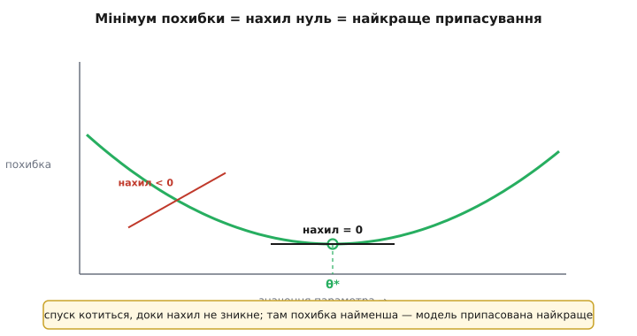
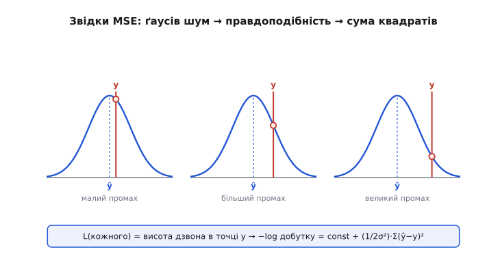
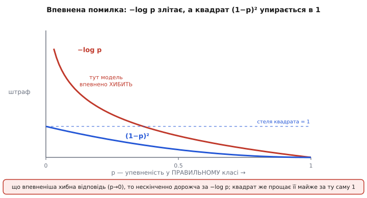

# 🧮 Математика похибки: чому саме MSE й перехресна ентропія

Учитель навчає модель через одне число — **похибку** (англ. *loss* — втрата): наскільки передбачення розходиться з правильною міткою. Зменшуй це число крок за кроком — і модель усе точніше відтворює зв'язок «вхід → відповідь». Але звідки береться **саме таке** число? Чому для передбачення температури беруть **середній квадрат** відхилення, а для вибору класу — дивну на вигляд **перехресну ентропію** з логарифмом? І чому «мінімум похибки» — це справді «найкраще припасування», а не просто гарні слова?

Тут ми виведемо обидві міри **з першопричини**, а не оголосимо готовими. Виявиться, що жодна з них не вигадана заради зручності: кожна — це прямий наслідок одного питання «за яких параметрів **спостережені дані найімовірніші**?». Різні припущення про те, як народжується мітка, дають різні похибки — і саме тому MSE природна для чисел, а перехресна ентропія для класів.

## Означення: похибка як число над параметрами

Модель — це набір **параметрів** θ (ваг): підкрутиш їх — зміниться передбачення ŷ на кожному вході. Похибка **L(θ)** бере всі передбачення на наборі даних, порівнює їх з мітками й згортає розбіжність в одне число. Формально це функція, що кожному набору параметрів ставить у відповідність невід'ємне число: чим воно менше, тим ближче передбачення до міток; нуль — ідеальне влучання в усі.

Домовимось про позначення на весь текст. Приклад має **істину** yᵢ (мітка від учителя) і **передбачення** ŷᵢ (те, що видала модель); індекс *i* пробігає всі *n* прикладів набору. «Дах» над y (ŷ, читається «ігрек-дах») — усталений значок передбаченого, на відміну від справжнього y.

> 🔧 **Навіщо це.** Похибка — це не оцінка «в журнал», а **рельєф**, яким котиться навчання. [Градієнтний спуск](book:algorithms/gradient-descent) уміє мінімізувати лише одну функцію — тож усе, чого ти хочеш від моделі, доводиться **закодувати** в цю єдину L(θ). Помилишся у виборі формули — і спуск сумлінно доведе модель до мінімуму **не тієї** похибки. Тому розуміти, звідки міра береться, важливіше, ніж пам'ятати саму формулу.

## Мінімум похибки = найкраще припасування

Спершу знімемо туман з фрази «найкраще припасування». Візьмімо найпростішу можливу модель: вона на **будь-який** вхід відповідає одним і тим самим числом *c*. Питання: яке *c* найкраще, якщо похибка — середній квадрат відхилення від міток?

Запишемо похибку як функцію одного числа *c* і знайдемо її дно. У дні **[похідна](book:math/derivative) дорівнює нулю** — рельєф там горизонтальний, спускові нема куди йти. Це і є визначення мінімуму, і воно ж дає точну відповідь:

```
L(c)  = (1/n) · Σ (c − yᵢ)²
L′(c) = (1/n) · Σ 2·(c − yᵢ) = 0
      ⇒ Σ (c − yᵢ) = 0
      ⇒ n·c = Σ yᵢ
      ⇒ c = (1/n) · Σ yᵢ      ← середнє арифметичне міток
```

Ось воно, точне «найкраще припасування»: під квадратичною похибкою найкраще стале передбачення — це **середнє** міток. Не приблизно, не «десь там» — рівно середнє, і виводиться воно з умови «нахил = нуль». Оце й ховається за словами «мінімум похибки»: конкретна точка, де похідна зникає, і в ній параметри набувають цілком певного, найкращого значення.


*Мінімум = нахил нуль. Над кожним значенням параметра похибка підіймає свою висоту — виходить **чаша**. Ліворуч від дна нахил від'ємний (спуск тягне праворуч-униз), праворуч — додатний; у самій нижній точці θ* нахил **зникає**. Саме там похибка найменша, а модель припасована найкраще. «Знайти найкращі параметри» = «дійти туди, де похідна похибки дорівнює нулю».*

Для справжньої моделі з мільйонами ваг рельєф не одновимірна чаша, а гори в багатовимірному просторі, і нахил стає **градієнтом** — вектором похідних по кожній вазі. Але принцип той самий: найкращі ваги там, де градієнт похибки обертається в нуль, і спуск шукає саме цю точку. Уся конкретика двох задач — лише в тому, **яку** L(θ) ми туди спускаємо.

## Регресія: чому квадрат, а не просто промах

Модель передбачає **число** — температуру, відстань, час до розряду. Промах природно міряти різницею e = ŷ − y. Але брати саму різницю не можна: промах +2 і −2 однаково погані, а додавши їх, ми дозволимо їм **погасити** одне одного — модель, що завищує на одних прикладах і занижує на інших рівно настільки ж, виглядала б бездоганною. Треба міра, байдужа до знаку. Напрошуються дві: модуль |e| і квадрат e². Чому переможе квадрат — і то не з естетики?

Відповідь у тому, **звідки беруться промахи**. Виміри рідко точні: до справжнього значення завжди домішується випадковий **шум** — тремтіння давача, округлення, тисяча дрібних непідконтрольних причин. Коли багато незалежних дрібних збурень складаються, їхня сума розподілена за **дзвоном Ґаусса** (нормальний розподіл) — це наслідок центральної граничної теореми, одна з найстійкіших закономірностей у природі. Тож розумно припустити: мітка y — це справжнє значення (яке модель хоче вгадати, ŷ) плюс ґаусів шум навколо нього.

А тепер ключове питання методу максимальної правдоподібності: за яких параметрів **спостережені мітки найімовірніші**? Щільність ґаусового дзвона з центром ŷ у точці y — це exp(−(y−ŷ)²/2σ²), помножена на сталу. Імовірність побачити **весь** набір незалежних прикладів — добуток таких дзвонів. Добуток незручний; візьмемо його логарифм (він монотонний — де максимум добутку, там і максимум логарифма), і добуток розсиплеться в суму:

```
правдоподібність  P = Πᵢ  const · exp( −(yᵢ − ŷᵢ)² / 2σ² )
−log P            = const + (1/2σ²) · Σ (yᵢ − ŷᵢ)²
```

Дивись, що сталося. Стала й дільник 2σ² не залежать від параметрів моделі — на пошук мінімуму вони не впливають. Лишається **Σ(yᵢ − ŷᵢ)²** — рівно сума квадратів помилок. Мінімізувати її й означає **максимізувати правдоподібність** даних під припущенням про ґаусів шум. Ось звідки квадрат: він не обраний за зручність, а **випливає** з логарифма ґаусового дзвона. Поділивши на *n*, дістаємо звичну **середньоквадратичну похибку** (*mean squared error*, MSE):

```
MSE = (1/n) · Σ (ŷᵢ − yᵢ)²
```


*Звідки береться квадрат. Припускаємо, що мітка y — це передбачення ŷ плюс **ґаусів шум**: навколо ŷ стоїть дзвін, і що далі мітка від центру, то нижча його висота в точці y — то **менш імовірний** цей приклад. Імовірність усього набору — добуток дзвонів; беремо −log (перетворює добуток на суму), сталі відкидаємо — і лишається **сума квадратів** відхилень. MSE не вигадана: вона є логарифмом ґаусової правдоподібності.*

Тепер зрозуміла й поведінка MSE. Квадрат карає великий промах **непропорційно**: промах на 3 коштує 9, а не втричі більше за промах на 1. Для моделі це наказ «спершу приборкай грубі помилки». Часто це саме те, що треба. Але та сама риса обертається вадою на **викидах** — поодиноких диких точках (зіпсований вимір, помилка запису): один промах на 100 дає штраф 10000 і перетягує весь спуск на себе, змушуючи модель спотворюватись заради кількох хибних точок. Це не поломка MSE, а прямий наслідок її походження: ґаусів дзвін вважає великі відхилення майже неможливими, тож коли вони все ж трапляються, міра «дивується» надміру. Коли викиди — норма даних, беруть стійкіші міри (модуль помилки чи компроміс Губера); [оглядова стаття про функції втрат](book:algorithms/loss-functions) розбирає їх поряд.

**Умова: MSE на трьох прогнозах температури.** Істина `{8.0, 3.0, 9.0}`, модель дала `{7.6, 5.0, 8.7}`.

:::tabs
```cpp
// Середньоквадратична похибка для масиву прогнозів
float mse(const float *pred, const float *truth, int n) {
    float sum = 0.0f;
    for (int i = 0; i < n; i++) {
        float e = pred[i] - truth[i];   // помилка зі знаком
        sum += e * e;                    // квадрат прибирає знак і роздуває великі
    }
    return sum / (float)n;
}
// e   = {-0.4,  2.0, -0.3}
// e²  = { 0.16, 4.00, 0.09}
// сума = 4.25  →  MSE = 4.25 / 3 ≈ 1.42
```
```python
import numpy as np

# Середньоквадратична похибка для масиву прогнозів
def mse(pred, truth):
    e = np.asarray(pred) - np.asarray(truth)   # помилка зі знаком
    return np.mean(e * e)                        # квадрат прибирає знак і роздуває великі

# e   = [-0.4,  2.0, -0.3]
# e²  = [ 0.16, 4.00, 0.09]
# сума = 4.25  →  MSE = 4.25 / 3 ≈ 1.42
```
:::

Один промах на 2.0 (другий приклад) дав 4.00 із 4.25 сумарного штрафу — майже все. Це голос квадрата: «розберися передусім із великим промахом».

## Класифікація: чому логарифм упевненості

Другий світ — модель не називає число, а обирає **клас**: кіт чи пес, справний чи в тривозі, одна з тисячі міток. Її вихід — це вже не одне значення, а **впевненості**: набір чисел від 0 до 1, що в сумі дають 1 і кажуть, наскільки модель вірить у кожен клас (0.9 — «майже певен, що кіт»). Штрафувати таке квадратом можна, але недоречно: нам болить не «на скільки розійшлися числа», а **наскільки впевнено модель схибила** щодо правильного класу. Виведемо природну міру так само — з правдоподібності.

Візьмімо двійковий випадок: клас або 1, або 0, а модель видає *p* — свою впевненість, що клас = 1. Це розподіл Бернуллі: ймовірність побачити справжню мітку y дорівнює *p*, якщо y = 1, і (1−p), якщо y = 0. Обидва випадки одним виразом: **P(y) = pʸ·(1−p)¹⁻ʸ** (підстав y=1 — лишається *p*; y=0 — лишається 1−p). Правдоподібність усього набору — добуток; беремо −log (добуток → сума, максимум правдоподібності → мінімум цієї суми):

```
−log P(y) = −[ y·log p + (1−y)·log(1−p) ]     ← бінарна перехресна ентропія
```

Це і є **перехресна ентропія** (*cross-entropy*) для одного прикладу. Для *K* класів формула ще прозоріша: істинний клас позначають вектором, де на правильній позиції 1, на решті 0, і в сумі виживає лише **один** доданок — той, що відповідає правильному класу. Тож фактично штраф зводиться до `−log(p правильного класу)`: дивимось на впевненість, яку модель дала **істинному** класу, і штрафуємо за її логарифм зі знаком мінус.


*Перехресна ентропія проти квадрата на впевненій помилці. По горизонталі — впевненість `p`, яку модель дала **правильному** класу; по вертикалі — штраф. `−log p` (червона) при `p → 0` (модель упевнено обрала хибне) **злітає до нескінченності**; квадратичний штраф `(1−p)²` (синя) навіть за найгрубішої помилки впирається в **стелю 1**. Ось математична причина, чому перехресна ентропія карає самовпевнену помилку незрівнянно суворіше.*

Тепер — головне «ЧОМУ» всієї теми: **чому −log штрафує впевнену помилку сильніше за квадрат**. Порівняймо два штрафи за те, що модель дала правильному класу впевненість *p*: перехресну ентропію −log p і квадратичний штраф (1−p)². Підставмо числа:

```
p (правильному класу)   −log p        (1−p)²
   0.5   (вагання)        0.69          0.25
   0.1   (схибила)        2.30          0.81
   0.01  (впевнено ні)    4.61          0.98
   0.001 (певна помилка)  6.91          0.998
```

Різниця разюча. Коли модель дає правильному класу мізерні 0.001 — тобто **впевнено кричить «ні»** там, де насправді «так», — квадрат карає її на жалюгідні 0.998 (упирається в стелю 1, скільки б не помилялась). А перехресна ентропія — на 6.91 і зростає **без межі**: чим ближче хибна впевненість до одиниці, тим нескінченно дорожчий штраф. Причина в самій формі −log: біля нуля логарифм провалюється в мінус нескінченність, тож −log злітає вгору. Квадрат же обмежений: (1−p)² не може перевищити 1, бо *p* лежить у [0, 1].

Але справжня причина, чому це важливо для **навчання**, глибша за самі числа штрафу — вона в **нахилі**. Спуск рухає ваги пропорційно похідній похибки: крутіший нахил — більший поштовх. У квадрата (1−p)² похідна за *p* дорівнює −2(1−p); коли модель упевнено помиляється (p → 0), нахил завмирає біля скромних −2 — сигнал слабне саме тоді, коли помилка найгрубіша, і спуск **ледь ворушить** ваги. У перехресної ж ентропії похідна −log p дорівнює −1/p; при p → 0 вона **вибухає** до нескінченності — спуск дістає велетенський поштовх виправити саме впевнену помилку. Оце і є суть: перехресна ентропія не просто **числом** карає самовпевненість дужче — вона дає навчанню **сильний градієнт** там, де квадрат його майже гасить. Тому класифікатори вчаться на ній швидше й не застрягають, самовдоволено помиляючись.

І це не хитрий трюк, а знову **максимальна правдоподібність**: мінімізувати перехресну ентропію = шукати параметри, за яких спостережені мітки найімовірніші під моделлю. Сама міра −log росте з [теорії інформації Шеннона](book:algorithms/entropy): −log p — це кількість **біт**, потрібних, щоб закодувати подію, у яку вірили з упевненістю *p*. Упевнено помилитися = витратити безліч біт на подію, якій приписали майже нульову ймовірність, а вона сталася. Шеннон заклав це 1948 року в «A Mathematical Theory of Communication» (усталений факт); звідти −log і прийшла у втрати класифікаторів.

**Умова: перехресна ентропія для одного знімка, 3 класи.** Істина — клас 0 («кіт»); модель дала впевненості `{0.7, 0.2, 0.1}`.

:::tabs
```cpp
#include <math.h>
// Перехресна ентропія одного прикладу: штраф лише за впевненість
// у ПРАВИЛЬНОМУ класі (решта мають «істину» 0 і випадають)
float cross_entropy(const float *p, int correct) {
    float pc = p[correct];
    if (pc < 1e-7f) pc = 1e-7f;   // захист від log(0) → −∞ (інакше NaN отруїть спуск)
    return -logf(pc);
}
// p = {0.7, 0.2, 0.1}, правильний клас 0 → pc = 0.7
// штраф = −ln(0.7) ≈ 0.357   (вагалась, але вгадала — помірно)
//
// якби дала правильному класу 0.02 (упевнене «ні»):
// штраф = −ln(0.02) ≈ 3.91   — на порядок більший за самовпевненість
```
```python
import numpy as np

# Перехресна ентропія одного прикладу: штраф лише за впевненість
# у ПРАВИЛЬНОМУ класі (решта мають «істину» 0 і випадають)
def cross_entropy(p, correct):
    pc = max(p[correct], 1e-7)   # захист від log(0) → −∞ (інакше nan отруїть спуск)
    return -np.log(pc)

# p = [0.7, 0.2, 0.1], правильний клас 0 → pc = 0.7
# штраф = −ln(0.7) ≈ 0.357   (вагалась, але вгадала — помірно)
#
# якби дала правильному класу 0.02 (упевнене «ні»):
# штраф = −ln(0.02) ≈ 3.91   — на порядок більший за самовпевненість
```
:::

Захист `if (pc < 1e-7f)` — не формальність: модель цілком може видати правильному класу рівно 0, і тоді `logf(0)` дасть мінус нескінченність, `NaN` розповзеться по вагах і спуск розвалиться. Впевненості перед логарифмом **підрізають** крихітним порогом — типова пастка реалізації.

## Дві задачі — дві природні міри

Тепер видно, чому це **не** дві випадкові формули, а дві сторони одного принципу. Питання завжди те саме — «за яких параметрів мітки найімовірніші?» — а відповідь розгалужується від того, **як народжується мітка**:

```
регресія  (число):  мітка = істина + ґаусів шум   →  −log = Σ(ŷ−y)²   →  MSE
класифікація (клас): мітка ~ Бернуллі/категорійний →  −log = −Σ y·log p →  перехресна ентропія
```

Обидві — це логарифм правдоподібності зі знаком мінус, лише для різних припущень про шум. Тому MSE природна для чисел (там шум ґаусів і симетричний), а перехресна ентропія — для класів (там «шум» — це невизначеність, з якою модель ставить на класи). І мінімум обох — це та сама точка «нахил дорівнює нулю», у якій, як ми вивели на початку, параметри набувають найкращого значення: під MSE передбачення тягнеться до середнього істин, під перехресною ентропією впевненості тягнуться до справжніх частот класів.

> 🔧 **Навіщо це.** Обираючи похибку, ти обираєш **припущення про свої дані**. Числовий вихід із приблизно симетричним шумом → **MSE** (гладко, карає грубі промахи, тягне до середнього). Вибір класу → **перехресна ентропія** (карає самовпевнену помилку нескінченно, дає сильний градієнт її виправити). Не бери квадрат для класифікації «бо простіше»: біля впевненої помилки його нахил майже зникає, і модель годинами вчиться того, що перехресна ентропія виправляє за кроки. А коли модель поводиться дивно — не влучає, застрягає, ігнорує рідкісний клас, — підозрюй передусім, чи **та** похибка стоїть під задачею, бо спуск чесно мінімізує рівно те число, яке ти йому дав.

Історична примітка про сам квадрат помилки. Метод найменших квадратів **першим опублікував** француз Адрієн-Марі Лежандр 1805 року (додаток до праці про орбіти комет). Німець Карл Фрідріх Ґаусс 1809-го заявив, що користувався ним ще з 1795-го, — спалахнула суперечка про першість, і Лежандр слушно зауважив, що першість визначає **публікація**. Проте саме Ґаусс пішов далі за метод: у «Theoria Motus» він **пов'язав** найменші квадрати з теорією ймовірностей і **вивів нормальний розподіл**, постулювавши, що найкраща оцінка — арифметичне середнє (усталений факт). Тобто той самий місток «ґаусів шум ↔ сума квадратів», яким ми щойно пройшли, першим перекинув Ґаусс — за півтора століття до того, як він став фундаментом навчання регресійних моделей.
