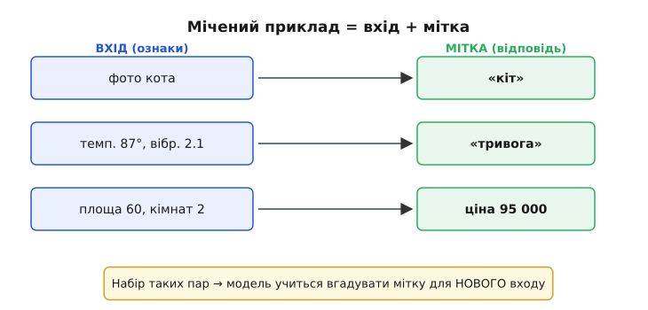
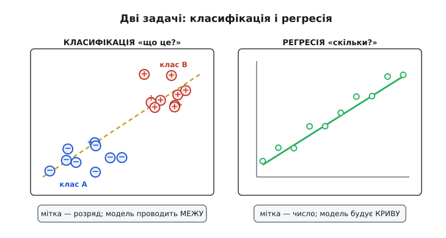
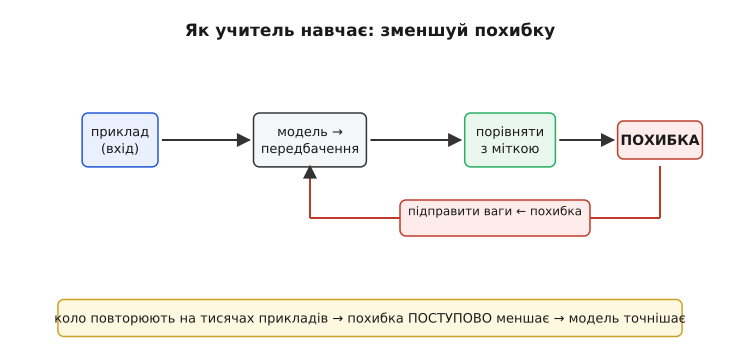

# Навчання з учителем: приклади з відповідями

Уяви, що ти вчиш дитину відрізняти яблуко від груші. Ти не диктуєш правил про форму й колір — ти просто береш плід за плодом і кажеш: «це яблуко», «це груша», «а це знову яблуко». За десяток прикладів дитина сама вловлює, у чому різниця, і впевнено називає **новий**, ще не бачений плід. Оце і є **навчання з учителем** (англ. *supervised learning*): моделі показують приклади **разом із правильними відповідями**, і вона вчиться відтворювати зв'язок «вхід → відповідь» так, щоб дати правильний вихід на новому, небаченому вході.

Слово «учитель» тут дуже точне. Хтось (людина, датчик, історія подій) заздалегідь **підписав** кожен приклад правильною відповіддю — і ці підписи скеровують навчання, як учитель скеровує учня. Прибери підписи — і це вже [навчання без учителя](book:algorithms/unsupervised-learning), зовсім інша задача: там модель мусить шукати структуру сама, без жодної підказки, що є правильним.

### Мічений приклад: пара «вхід — відповідь»

Уся конструкція стоїть на одній цеглинці — **міченому прикладі** (англ. *labeled example*). Це просто пара: **вхід** (те, що модель бачить) і **мітка** (англ. *label* — ярлик, підпис — правильна відповідь до цього входу).


*Мічений приклад — серце навчання з учителем. Кожен приклад це **пара**: **вхід** (набір ознак — чисел, що описують об'єкт) і **мітка** (правильна відповідь, яку дав «учитель»). Фото — мітка «кіт»; показники двигуна — мітка «справний»; параметри квартири — мітка-ціна. Модель отримує тисячі таких пар і вчиться відображати вхід у мітку так, щоб вгадувати мітку для **нового** входу, якого в наборі не було.*

Вхід майже завжди подають як набір чисел — **ознак** (англ. *feature* — риса, властивість). Фото це ознаки-пікселі; двигун — температура, тиск, оберти; квартира — площа, кількість кімнат, поверх. Мітка — це те **єдине**, що ми хочемо передбачати: назва класу, число, рішення «так/ні». Модель під час навчання бачить **і** вхід, **і** мітку кожного прикладу; під час роботи вона бачить **лише** вхід і мусить видати мітку сама. Уся суть навчання з учителем зводиться до цього переходу: від «мені показали і вхід, і відповідь» до «мені дали тільки вхід — вгадай відповідь».

> 🔧 **Навіщо це.** На дроні мічені приклади збираєш ти сам. Хочеш детектор перешкод — літаєш, знімаєш кадри й **підписуєш** кожен: «є перешкода» / «немає» (а для рамки навколо об'єкта — ще й координати). Хочеш передбачати заряд батареї — записуєш напругу, струм, температуру й **справжній** залишковий час як мітку. Якість підписів вирішує все: переплутав мітки — навчиш модель плутати так само. Тому збирання й чесне мічення даних — не нудна підготовка, а **половина** інженерної роботи.

### Дві задачі: класифікація і регресія

Мітки бувають двох різних сортів — і від цього залежить, яку з двох головних задач ти розв'язуєш.


*Дві задачі навчання з учителем. **Класифікація** (лат. *classis* — розряд): мітка — це **клас** із кінцевого списку («кіт»/«пес», «справний»/«тривога»). Модель проводить **межу** між областями простору й каже, у яку область потрапив новий приклад. **Регресія** (лат. *regressio* — повернення): мітка — **неперервне число** (ціна, температура, час до розряду). Модель будує **криву** й повертає число для нового входу. Питання «до якого розряду?» — класифікація; «скільки саме?» — регресія.*

**Класифікація** відповідає на питання «**що це** / до якого розряду?». Міток тут скінченна кількість: кіт чи пес; літера А, Б чи В; двигун справний, у нормі чи в тривозі. Модель ділить простір ознак на області й для нового входу каже, у яку область він потрапляє. Коли класів рівно два (є/немає, свій/чужий), кажуть **двійкова** класифікація — найчастіший випадок у бортовій техніці.

**Регресія** відповідає на питання «**скільки** саме?». Мітка — неперервне число: ціна квартири, завтрашня температура, хвилини до розряду батареї, відстань до перешкоди в метрах. Тут модель не проводить межу, а будує **криву** (чи поверхню) й повертає число. Назва «регресія» — історичний спадок від Френсіса Ґалтона, що в 1880-х помітив «повернення до середнього» в рості нащадків; сам термін прижився, хоч до сучасного передбачення чисел стосунок має лише за формою.

Різниця не косметична. Класифікатор помиляється **дискретно** (назвав пса котом — груба помилка), регресор — **поступово** (сказав 4.8 метра замість 5.0 — майже влучив). Тому й міряють якість по-різному: у класифікації рахують **частку правильних** відповідей, у регресії — **наскільки далеко** передбачене число від справжнього. Але математичне серце в обох одне: підібрати параметри моделі так, щоб її відповіді якнайкраще збігалися з мітками.

### Як «учитель» насправді вчить: похибка, яку зменшують

Тут криється головне «ЧОМУ» всієї теми. Учитель не вкладає знання в модель силоміць — він лише **порівнює** відповідь моделі з правильною міткою й показує, **наскільки та схибила**. А далі модель сама підправляється, щоб схибити менше. Ключова величина — **похибка** (англ. *loss* — втрата): одне число, що каже, як сильно передбачення розходиться з міткою.


*Як учитель насправді вчить. Модель бачить **вхід**, видає **передбачення**; учитель порівнює його з **міткою** й обчислює **похибку** (наскільки схибила). За похибкою модель трохи **підправляє свої числа** (ваги) — так, щоб наступного разу схибити менше. Коло повторюють на тисячах прикладів, і похибка **поступово меншає** — модель усе точніше відтворює зв'язок «вхід → мітка». Оце покрокове зменшення похибки й називають навчанням.*

Механізм такий. На кожен приклад модель видає передбачення, учитель рахує похибку між ним і міткою, а тоді параметри моделі трохи зсувають — у бік, що похибку зменшує. Повторюєш це на всьому наборі багато разів, і сумарна похибка сповзає донизу: модель усе точніше вгадує мітки. Саме цей спуск похибкою й виконує [градієнтний спуск](book:algorithms/gradient-descent) — робочий двигун навчання для [нейромереж](book:algorithms/neuron-layer) і багатьох інших моделей. Похибку рахують по-різному для двох задач: у регресії — типово **середній квадрат відхилення** (наскільки число промахнулося, у квадраті); у класифікації — міра, що штрафує за впевненість у **хибному** класі. Виведення й порівняння цих мір винесене в [окрему математичну вставку](book:algorithms/supervised-learning/math-loss-functions.md).

Тут же й межа, за яку легко перечепитися. Мета навчання — **не** відповідати ідеально на приклади зі свого набору, а **вгадувати мітку на новому** вході. Модель можна натренувати до нуля похибки на бачених прикладах — просто **зазубривши** їх, — і вона з тріском провалиться на реальних даних. Це називають [перенавчанням](book:algorithms/overfitting), і саме тому чесно міряють якість лише на **відкладених** прикладах, яких модель ніколи не бачила. Навчання з учителем сильне рівно доти, доки модель **узагальнює**, а не запам'ятовує.

### Найпростіший учень: сусіди за схожістю

Щоб побачити навчання з учителем без жодної магії, візьмімо алгоритм, який узагалі майже нічого не «навчає», а працює прямо на прикладах — **k найближчих сусідів** (англ. *k-nearest neighbors*, k-NN). Ідея дитяча: щоб класифікувати новий приклад, знайди серед мічених найсхожіші на нього й **проголосуй** їхніми мітками. Схожий на котів — отже, кіт.

«Схожість» тут — це **близькість** у просторі ознак: що менша відстань між двома наборами чисел, то приклади схожіші. Береш новий вхід, міряєш відстань до кожного міченого прикладу, вибираєш `k` найближчих і повертаєш мітку, що серед них трапляється **найчастіше**. Жодного тривалого навчання: увесь «навчений» стан — це просто збережений набір прикладів.

**Умова: класифікувати давач за двома ознаками (температура, вібрація); k = 3.**

:::tabs
```cpp
#include <math.h>
#include <stdint.h>

#define N 6        // скільки мічених прикладів у пам'яті
#define K 3        // скільки сусідів опитуємо

typedef struct { float temp, vib; int label; } Sample;  // label: 0 = норма, 1 = тривога

// Навчальний набір: пари ознак + правильна мітка («учитель» їх підписав)
static const Sample train[N] = {
    { 40.0f, 0.2f, 0 }, { 42.0f, 0.3f, 0 }, { 39.0f, 0.25f, 0 },  // спокійні
    { 85.0f, 1.8f, 1 }, { 88.0f, 2.1f, 1 }, { 90.0f, 1.9f, 1 },   // тривожні
};

// Квадрат відстані між входом і прикладом (корінь брати не треба — порядок той самий)
static float dist2(float t, float v, const Sample *s) {
    float dt = t - s->temp, dv = v - s->vib;
    return dt * dt + dv * dv;
}

// Класифікація нового входу (t, v) голосуванням K найближчих сусідів
int knn_classify(float t, float v) {
    int   idx[K];                 // індекси поточних K найближчих
    float best[K];                // їхні квадрати відстаней
    for (int j = 0; j < K; j++) { best[j] = INFINITY; idx[j] = -1; }

    for (int i = 0; i < N; i++) {          // пройти всі приклади
        float d = dist2(t, v, &train[i]);
        // якщо ближче за найдальшого з поточних K — вставити на його місце
        int worst = 0;
        for (int j = 1; j < K; j++)
            if (best[j] > best[worst]) worst = j;
        if (d < best[worst]) { best[worst] = d; idx[worst] = i; }
    }

    int votes = 0;                          // сума міток сусідів (0 або 1)
    for (int j = 0; j < K; j++)
        votes += train[idx[j]].label;
    return (votes * 2 > K) ? 1 : 0;         // більшість голосів → клас
}
```
```python
import numpy as np

K = 3   # скільки сусідів опитуємо

# Навчальний набір: ознаки (temp, vib) + правильна мітка («учитель» їх підписав)
train_X = np.array([
    [40.0, 0.20], [42.0, 0.30], [39.0, 0.25],   # спокійні   → 0 = норма
    [85.0, 1.80], [88.0, 2.10], [90.0, 1.90],   # тривожні   → 1 = тривога
])
train_y = np.array([0, 0, 0, 1, 1, 1])

# Класифікація нового входу (t, v) голосуванням K найближчих сусідів
def knn_classify(t, v):
    d2 = np.sum((train_X - [t, v]) ** 2, axis=1)  # квадрати відстаней (корінь зайвий)
    nearest = np.argsort(d2)[:K]                    # індекси K найближчих
    votes = np.bincount(train_y[nearest])           # рахуємо голоси міток
    return int(np.argmax(votes))                    # більшість голосів → клас
```
:::

Новий вхід `(86.0, 2.0)` ляже поруч із трьома «тривожними» прикладами — три голоси за клас 1, і функція поверне **тривогу**. Вхід `(41.0, 0.28)` оточать «спокійні» — поверне **норму**. Зверни увагу на дві речі, і в них уся суть навчання з учителем на найпростішому прикладі. По-перше, **мітки з train роблять усю роботу**: приберемо підписи — і голосувати нема чим. По-друге, модель **не вивела правила** — вона просто тримає приклади й порівнює; це чесне, хоч і «ліниве», навчання з учителем. Історія самого правила найближчого сусіда — окрема цікава розповідь про [секретний авіаційний звіт 1951 року](book:algorithms/supervised-learning/hist-nearest-neighbor.md), що пролежав ненадрукованим майже сорок років.

> 🔧 **Навіщо це.** k-NN спокушає простотою — жодного навчання, кілька рядків коду, — і на **малих** наборах він чудовий для швидкої перевірки ідеї прямо на мікроконтролері. Але пастка в ціні **вжитку**: щоб класифікувати один вхід, він міряє відстань до **кожного** збереженого прикладу, тож із тисячами прикладів на кожен кадр це задорого для [бортового чипа](book:algorithms/compute-cost). Тому в реальному польоті беруть моделі, які всю важку роботу роблять **під час навчання** (наперед), а на борту лічать **швидко** — як [нейромережеві детектори](book:algorithms/nn-detectors). k-NN лишається безцінним для **прототипу** й для розуміння суті: подивитися на сусідів — і є відповідь.

### Ознаки: те, на що модель дивиться

Є ще один бік, від якого навчання з учителем виграє або програє **ще до** будь-якого алгоритму, — які саме **ознаки** ти подаєш на вхід. Модель бачить світ **тільки** крізь ознаки; чого в них немає, того для неї не існує.

Уяви, що вчиш модель відрізняти справний двигун від несправного, але подаєш лише **середню** температуру за годину. Якщо несправність проявляється **різкими стрибками**, а не середнім рівнем, — модель приречена: у її ознаках сигналу про поломку **просто немає**, хоч який розумний алгоритм. Додай ознаку «розмах коливань температури» — і та сама модель раптом легко розділить класи. Часто вдалий вибір ознак важить **більше**, ніж вибір алгоритму: правильно описати вхід — половина успіху. Це мистецтво добирати й конструювати ознаки називають **інженерією ознак** (англ. *feature engineering*); [глибокі нейромережі](book:algorithms/cnn) частково автоматизують його, самі вибудовуючи корисні ознаки з сирих пікселів, — але й вони безсилі, якщо потрібного сигналу в даних немає взагалі.

І остання, найважливіша думка. Навіть із бездоганними ознаками й алгоритмом модель **не краща за свої мітки**. Мітки ставить учитель — людина чи процес, — і якщо він систематично помиляється, модель **вивчить** ту саму помилку й повторюватиме її впевнено. Навчання з учителем не творить знання з нічого; воно **переносить** у модель те знання (і ті хиби), що вже закладене в підписаних прикладах. Тому чесний, представницький, правильно мічений набір — не деталь, а **фундамент** усього.

### Підсумок теми

Навчання з учителем — це коли моделі дають **мічені приклади** (пари «вхід + правильна відповідь») і вона вчиться відтворювати зв'язок вхід → мітка, щоб вгадувати мітку на **новому** вході. Мітки бувають двох сортів, і від цього залежить задача: **класифікація** (мітка — клас із кінцевого списку, модель проводить межу) чи **регресія** (мітка — неперервне число, модель будує криву). «Учитель» навчає не силоміць, а через **похибку** — число, що каже, наскільки передбачення розходиться з міткою; зменшуючи похибку крок за кроком, модель усе точніше відтворює зв'язок. Але мета — **узагальнення** на небачене, а не зубріння прикладів, тож якість міряють на відкладених даних. Найпростіший учень — **k найближчих сусідів**: голосує мітками найсхожіших збережених прикладів, без жодного навчання. І понад усе — **дані**: модель бачить світ лише крізь свої **ознаки** й ніколи не буває кращою за **мітки**, якими її годують. Це один із трьох родів навчання поряд із [навчанням без учителя](book:algorithms/unsupervised-learning) (структура без міток) і [навчанням з підкріпленням](book:algorithms/reinforcement-learning) (дія й винагорода замість готових відповідей).
