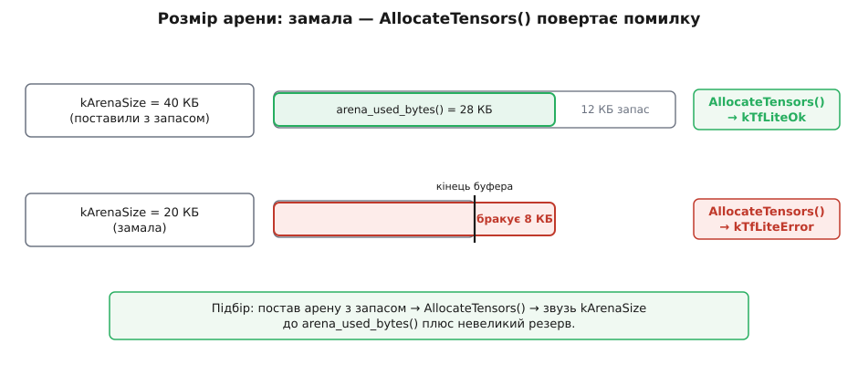

# 📋 Контракт TensorFlow Lite Micro: як прогнати модель на чипі

Щоб квантована модель ожила на мікроконтролері, назовні стирчить лише жменя об'єктів C++ — це їхня довідка на прикладі **TensorFlow Lite Micro** (TFLM), рушія, що став де-факто взірцем для виводу на найдрібнішому залізі. Усе інше в бібліотеці — деталі реалізації; читачеві-інженеру треба знати саме цей контракт: **шість об'єктів і один виклик**.

Спершу — карта. Модель лежить у флеші як масив байтів; резолвер каже, які ядра операцій узагалі є; арена — це єдиний буфер робочої пам'яті; рушій зшиває їх докупи; вхідний і вихідний тензори — вікна, куди кладеш дані й звідки читаєш; `Invoke()` — власне прогін. Далі кожен з них — окремо, із сигнатурами й пастками.

![Шість обʼєктів TFLM у вертикальному конвеєрі: g_model[] у флеші → MicroMutableOpResolver → tensor_arena[] в ОЗП → MicroInterpreter → AllocateTensors() → input/Invoke/output](/book/algorithms/machine-learning/tinyml/img/api-wiring.svg)
*Увесь контракт на одній карті: модель-байти й ядра живуть у флеші (тільки читання), арена — в ОЗП (читання-запис), а `MicroInterpreter` зшиває їх; `AllocateTensors()` розмічає арену, і далі йде цикл виводу `input(0) → Invoke() → output(0)`.*

> 🔧 **Навіщо цей контракт саме такий.** На мікроконтролері немає ні файлової системи, ні операційної системи, ні `malloc`, на який можна покластися. Тож усе, що на великому комп'ютері сховане (завантажити файл, виділити пам'ять, кинути виняток при помилці), тут **стирчить назовні** й лягає на інженера: модель ти вшиваєш у прошивку сам, пам'ять віддаєш своїм статичним буфером, а кожну помилку ловиш кодом повернення, бо кинути виняток нікому.

## 1. Модель як байти: `g_model[]` і `GetModel`

Модель — це файл `.tflite` у форматі **flatbuffer** (його читають прямо з байтів, без розпакування). Файлової системи на чипі нема, тож модель вшивають **у саму прошивку** як звичайний масив. Міст від файлу до масиву — утиліта `xxd`:

```bash
xxd -i model.tflite > model_data.cc
```

На виході — згенерований C-файл:

```cpp
alignas(16) const unsigned char g_model[] = { 0x1c, 0x00, 0x00, 0x00, /* … */ };
const unsigned int g_model_len = 12345;
```

`xxd` сам вирівнювання **не додає** — його дописують руками: `alignas(16)`. Flatbuffer моделі мусить лежати за адресою, кратною 8 (TFLM тримається 16), інакше на строгих ядрах (Cortex-M) читання полів дасть **hard fault**. Далі байти перетворюють на об'єкт моделі й звіряють версію схеми:

| Виклик | Повертає | Що робить |
|---|---|---|
| `tflite::GetModel(g_model)` | `const tflite::Model*` | обгортає масив байтів як модель (без копіювання) |
| `model->version()` | `uint32_t` | версія схеми flatbuffer у моделі |
| `TFLITE_SCHEMA_VERSION` | конст. | версія, яку розуміє цей рушій — мусять збігтися |

## 2. Резолвер операцій: `MicroMutableOpResolver<N>`

Рушій, ідучи графом моделі, для кожного вузла питає резолвер: «а є в тебе ядро для цієї операції?». **Резолвер — це реєстр**: ти явно вписуєш у нього тільки ті ядра, що справді є в моделі. У цьому вся суть `MicroMutableOpResolver` супроти «зареєструвати все»: кожне ядро — це код у флеші, тож реєструвати згортку, повнозв'язний шар і софтмакс, коли модель має лише їх, означає **не тягнути** у прошивку решту сотні операцій.

```cpp
tflite::MicroMutableOpResolver<3> resolver;   // N = скільки Add… нижче
resolver.AddConv2D();
resolver.AddFullyConnected();
resolver.AddSoftmax();
```

Параметр шаблона `N` — це **місткість** реєстру (максимум записів), відома на етапі компіляції. Викликів `Add…` має бути **не більше** за `N`, інакше черговий `Add…` поверне `kTfLiteError`. Найуживаніші методи:

| Виклик | Операція в моделі |
|---|---|
| `AddConv2D()` | згортка |
| `AddDepthwiseConv2D()` | поканальна згортка (серце MobileNet) |
| `AddFullyConnected()` | повнозв'язний шар |
| `AddMaxPool2D()` / `AddAveragePool2D()` | підвибірка (пулінг) |
| `AddReshape()` | зміна форми тензора |
| `AddSoftmax()` / `AddLogistic()` | нормування у ймовірності |
| `AddQuantize()` / `AddDequantize()` | перехід float ↔ int8 на краях графа |
| `AddAdd()` / `AddMul()` | поелементні дії (залишкові з'єднання) |

Який набір потрібен саме твоїй моделі — видно з її графа (наприклад, у переглядачі **Netron**). Для швидкого прототипу є `tflite::AllOpsResolver`, що реєструє геть усе, — але він роздуває флеш, тож у прошивку йде тільки вибірковий `MicroMutableOpResolver`.

## 3. Арена тензорів: `tensor_arena[kArenaSize]`

Уся робоча пам'ять виводу — проміжні тензори (активації) плюс службовий стан рушія — живе в **одному** буфері, який виділяєш ти. TFLM ніколи не кличе `malloc`; він лише розкладає все всередині цієї арени.

```cpp
constexpr int kArenaSize = 24 * 1024;              // байтів; підбирається дослідно
alignas(16) static uint8_t tensor_arena[kArenaSize];
```

`static` (а не на стеку) — щоб великий буфер не переповнив стек; `alignas(16)` — з тієї ж причини, що й для моделі. Скільки саме байтів треба — наперед невідомо, бо це залежить від архітектури моделі. Розмір **підбирають дослідно**: постав із запасом, поклич `AllocateTensors()`, спитай `arena_used_bytes()` — це справжній пік використаного — і звузь `kArenaSize` до нього плюс невеликий резерв.

| Символ | Тип | Зміст |
|---|---|---|
| `tensor_arena` | `uint8_t[]` | увесь буфер робочої пам'яті виводу |
| `kArenaSize` | `size_t` | його розмір; замалий → `AllocateTensors()` дасть помилку |
| `interpreter.arena_used_bytes()` | `size_t` | скільки байтів реально пішло (кликати **після** `AllocateTensors`) |


*Замала арена ловиться відразу на `AllocateTensors()`: угорі 40 КБ вистачає (використано 28, запас 12) і виклик повертає `kTfLiteOk`; унизу 20 КБ на ті самі 28 КБ не вистачає — рушій упирається в кінець буфера й повертає `kTfLiteError`. Тому арену ставлять з запасом, а тоді звужують до `arena_used_bytes()`.*

> 🔧 **Навіщо статичний буфер.** Фіксована арена — це і є вся ідея надійності на чипі. Динамічна купа мала б два лиха: **фрагментацію** (пам'ять начебто є, та суцільного шматка нема) і **тихе вичерпання** посеред польоту. Один буфер незмінного розміру означає, що пам'ять або влазить **на етапі збірки**, або ні — і жодних несподіванок у полі.

## 4. Рушій: `MicroInterpreter` і `AllocateTensors()`

`MicroInterpreter` зшиває докупи модель, резолвер і арену:

```cpp
MicroInterpreter(const Model* model, const MicroOpResolver& op_resolver,
                 uint8_t* tensor_arena, size_t tensor_arena_size,
                 MicroResourceVariables* resource_variables = nullptr,
                 MicroProfilerInterface* profiler = nullptr,
                 bool preserve_all_tensors = false);
```

Останні три аргументи мають усталені значення й у простому випадку не потрібні. **Увага на версію**: старі приклади TFLM передавали ще й `tflite::ErrorReporter*` останнім аргументом — його **прибрали**, і повідомлення тепер ідуть через `MicroPrintf(...)`. Код, скопійований зі старих туторіалів, через це не збереться.

Основні методи об'єкта:

| Метод | Сигнатура | Що робить |
|---|---|---|
| `AllocateTensors()` | `TfLiteStatus` | розмічає арену під тензори; кликати **раз** перед `Invoke` |
| `Invoke()` | `TfLiteStatus` | проганяє граф моделі |
| `input(i)` | `TfLiteTensor*` | i-й вхідний тензор |
| `output(i)` | `TfLiteTensor*` | i-й вихідний тензор |
| `inputs_size()` / `outputs_size()` | `size_t` | скільки входів / виходів |
| `arena_used_bytes()` | `size_t` | реально використано арени |
| `initialization_status()` | `TfLiteStatus` | чи вдалося збудувати рушій |

`AllocateTensors()` — момент істини: саме тут ловляться **замала арена** й **брак зареєстрованого ядра**. Поки він не повернув `kTfLiteOk`, чіпати тензори або кликати `Invoke()` не можна.

## 5. Тензори вводу й виводу: `TfLiteTensor*` і квантовані масштаби

`input(0)` і `output(0)` повертають `TfLiteTensor*` — вікно у відповідний шматок арени. Ключові поля структури:

| Поле | Тип | Зміст |
|---|---|---|
| `data.int8` | `int8_t*` | дані (об'єднання; є й `data.f`, `data.uint8`, `data.i32`…) |
| `type` | `TfLiteType` | тип елемента, напр. `kTfLiteInt8` |
| `dims` | `TfLiteIntArray*` | форма: `dims->size`, `dims->data[k]` |
| `bytes` | `size_t` | розмір даних тензора в байтах |
| `params.scale` | `float` | масштаб квантування |
| `params.zero_point` | `int32_t` | зсув нуля |

Головна тонкість — **квантовані масштаби**. Числа в int8-тензорі — це не самі величини, а **номери рівнів**; переклад туди-сюди задають `scale` і `zero_point`, зашиті в модель на етапі конвертації. Формули:

```
q    = round(real / scale) + zero_point      # real → int8 (потім затиснути в [-128, 127])
real = scale · (q − zero_point)              # int8 → real
```

**Наповнити вхід величиною real = 0.6** при `scale = 0.0235`, `zero_point = −1`:

```
q = round(0.6 / 0.0235) + (−1)
  = round(25.53) − 1
  = 26 − 1 = 25            → input->data.int8[0] = 25
перевірка: 0.0235 · (25 − (−1)) = 0.0235 · 26 = 0.611   (похибка округлення ≈ 0.011)
```

**Прочитати вихід**, де `q = 100`, `scale = 0.00390625` (тобто 1/256), `zero_point = −128`:

```
real = 0.00390625 · (100 − (−128))
     = 0.00390625 · 228 = 0.890625        → ймовірність класу ≈ 0.89
```

`scale` і `zero_point` беруть **із самого тензора** (`input->params.scale` тощо), бо для входу й виходу вони різні. Пропустиш цей переклад — модель однаково прожене int8-байти, лише кожне число буде зсунуте на невидимий множник, і на виході — впевнена нісенітниця.

> 🔧 **Навіщо масштаб.** int8-значення в тензорі — це індекс у словнику рівнів, а `scale` із `zero_point` — сам словник. Без нього байти ще не є числами; наповнити вхід «сирими» величинами, оминувши переклад, — те саме, що подати телефонний номер замість самого числа.

## 6. Прогін і коди помилок: `Invoke()` і `TfLiteStatus`

`interpreter.Invoke()` проходить граф і повертає `TfLiteStatus`. Винятків на чипі нема, тож **перевіряти статус треба щоразу**:

| Код | Значення | Коли трапляється |
|---|---|---|
| `kTfLiteOk` | `0` | усе гаразд |
| `kTfLiteError` | `1` | загальна помилка: замала арена, брак ядра, поганий вхід |
| `kTfLiteUnresolvedOps` | — | у графі є операція без зареєстрованого ядра |

Ширший перелік (`kTfLiteDelegateError`, `kTfLiteApplicationError`…) визначено у спільному C-API TFLite, та на шляху мікрорушія практично завжди повертається `kTfLiteOk` або `kTfLiteError`; діагностику друкує `MicroPrintf`.

## Мінімальний робочий приклад

Усі шість об'єктів у зборі — від байтів моделі до класу-відповіді:

```cpp
#include "tensorflow/lite/micro/micro_interpreter.h"
#include "tensorflow/lite/micro/micro_mutable_op_resolver.h"
#include "tensorflow/lite/micro/micro_log.h"          // MicroPrintf
#include "tensorflow/lite/schema/schema_generated.h"
#include "model_data.h"                                // g_model[], згенероване xxd
#include <math.h>                                      // lroundf

// Арена — єдиний робочий буфер в ОЗП. Розмір із запасом, потім звузити.
constexpr int kArenaSize = 24 * 1024;
alignas(16) static uint8_t tensor_arena[kArenaSize];

int run_once(const float sensor[], int n, int* out_class) {
  // Модель із байтів + звірка версії схеми.
  const tflite::Model* model = tflite::GetModel(g_model);
  if (model->version() != TFLITE_SCHEMA_VERSION) {
    MicroPrintf("версія схеми моделі не збігається");
    return -1;
  }

  // Резолвер: лише ядра, що є в моделі (N = їх кількість).
  tflite::MicroMutableOpResolver<3> resolver;
  resolver.AddConv2D();
  resolver.AddFullyConnected();
  resolver.AddSoftmax();

  // Рушій зшиває модель, ядра й арену.
  tflite::MicroInterpreter interpreter(model, resolver, tensor_arena, kArenaSize);

  // Розмітити арену — тут падає замала арена або брак ядра.
  if (interpreter.AllocateTensors() != kTfLiteOk) {
    MicroPrintf("AllocateTensors: збільш kArenaSize або додай операції");
    return -1;
  }
  MicroPrintf("арена: %d із %d Б", (int)interpreter.arena_used_bytes(), kArenaSize);

  // Вхід: перевести real → int8 через масштаб тензора.
  TfLiteTensor* input = interpreter.input(0);
  const float s = input->params.scale;
  const int   z = input->params.zero_point;
  for (int i = 0; i < n; ++i) {
    int q = (int)lroundf(sensor[i] / s) + z;
    if (q < -128) q = -128; else if (q > 127) q = 127;   // затиснути в int8
    input->data.int8[i] = (int8_t)q;
  }

  // Прогнати граф.
  if (interpreter.Invoke() != kTfLiteOk) {
    MicroPrintf("Invoke не вдалося");
    return -1;
  }

  // Вихід: int8 → real, знайти клас із найбільшою ймовірністю.
  TfLiteTensor* output = interpreter.output(0);
  const float os = output->params.scale;
  const int   oz = output->params.zero_point;
  const int   classes = output->dims->data[output->dims->size - 1];
  int best = 0; float best_p = -1.0f;
  for (int i = 0; i < classes; ++i) {
    float p = os * (output->data.int8[i] - oz);
    if (p > best_p) { best_p = p; best = i; }
  }
  *out_class = best;
  return 0;
}
```

## Типові пастки

| Симптом | Причина | Лік |
|---|---|---|
| `AllocateTensors()` → `kTfLiteError`, у логах «arena» | арена замала | збільшити `kArenaSize`, потім звузити до `arena_used_bytes()` |
| `AllocateTensors()` → помилка, «Didn't find op for builtin opcode …» | операція без зареєстрованого ядра | додати відповідний `resolver.Add…()` і, якщо треба, підняти `N` |
| Черговий `Add…()` повертає помилку | `N` у `MicroMutableOpResolver<N>` замалий | збільшити шаблонне `N` |
| Модель працює, та на виході — маячня | вхід наповнено без квантування | переводити через `input->params.scale` / `zero_point`, а вихід читати через `output->params` |
| Hard fault ще до виводу | модель або арена не вирівняні | `alignas(16)` на `g_model[]` і на `tensor_arena[]` |
| Не збирається зі старим прикладом | у конструктор передано `ErrorReporter*` | прибрати аргумент, логувати через `MicroPrintf` |
| `Invoke()` до `AllocateTensors()` або без перевірки статусу | пропущений крок / неперевірений код | завжди `AllocateTensors` перед `Invoke` і перевіряти кожен `TfLiteStatus` |

Ім'я бібліотеки варто уточнити: у 2024 році Google перейменував ширший рушій TensorFlow Lite на **LiteRT**, тож трапляється й назва «LiteRT for Microcontrollers»; простір імен у коді лишився `tflite::`, а описаний тут контракт — той самий.
