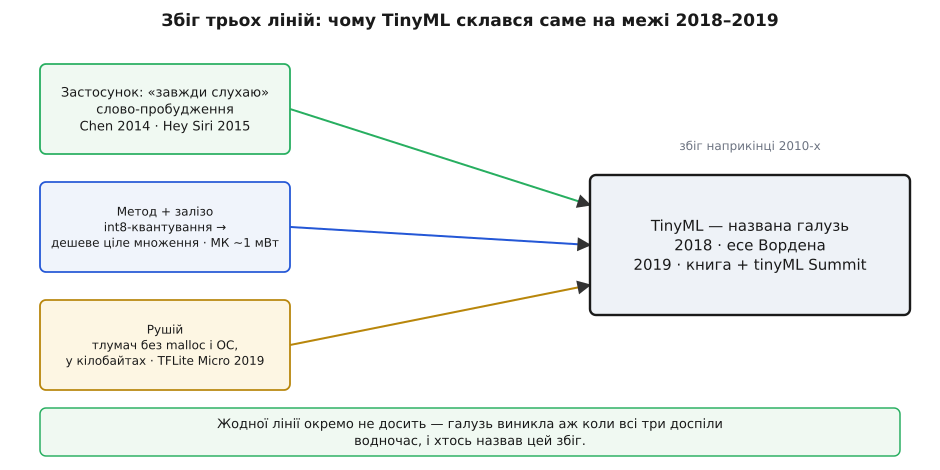

# 📜 Як TinyML став названою галуззю: збіг трьох ліній (2018–2019)

Квантування старше за комп'ютери, дешеві мікроконтролери й машинне навчання роками існували поряд — а окрема названа галузь «TinyML» викристалізувалася аж наприкінці 2010-х. Чому саме тоді, а не десятиліттям раніше? Бо галузь не робить жодна складова окремо: потрібен був **збіг** — коли водночас доспіли попит, метод із залізом і рушій, а хтось назвав цей збіг. Ця вставка — про те, як зійшлися три лінії й хто дав напрямку ім'я.

Одразу проведу межу, щоб не сплутати дві різні історії. Історія самого **квантування** — округлення неперервної величини до лічених рівнів — тягнеться від телефонії 1930-х і давніша за будь-який комп'ютер. Тут ідеться не про метод, а про **галузь**: про мить, коли розрізнені шматки склалися в дисципліну з власною назвою, підручником і спільнотою.

### Попит: слово, яке слухає вічно

Перша лінія — застосунок, що поставив жорстку умову. Ще до всякого «TinyML» пристрої вже намагалися ловити **слово-пробудження**: коротку команду («Ok Google», «Hey Siri»), яку апарат слухає безперервно, щоб прокинутися. 2014 року троє дослідників — Ґуоґуо Чень, Кароліна Парада й Ґеорґ Гайґольд (Guoguo Chen, Carolina Parada, Georg Heigold) — у роботі Google з розпізнавання ключового слова показали компактну **глибоку нейромережу для цього завдання** (стаття «Small-Footprint Keyword Spotting using Deep Neural Networks», ICASSP 2014): маленька мережа, яку можна тримати ввімкненою просто на пристрої й ловити команду без хмари.

Наступного року та сама ідея дісталася кишень мільйонів. 2015-го Apple зробила «Hey Siri» **справді завжди-увімкненим**: до iPhone 6s фраза працювала лише при підключеному живленні, а в 6s окремий малопотужний «завжди-увімкнений процесор» (Always On Processor) дістав доступ до мікрофона й крутив крихітну модель безперервно, будячи головний процесор лише на підозрі (устрій Apple описала 2017 року).

Саме цей застосунок породив головну умову всієї майбутньої галузі. Якщо пристрій має слухати **вічно**, живлячись від батарейки, то середня потужність мусить упасти до **мікроватів**. Не «швидше» й не «менше» саме собою — а рівно ця межа далі й формувала все.

### Метод і залізо: коли ціле множення подешевшало

Друга лінія — те, чим цей попит стало **можливо** задовольнити. Тут дозріли одразу дві речі, і працюють вони лише в парі. По-перше, [заміна 32-бітних дробових ваг на 8-бітні цілі](book:algorithms/model-quantization) — коли число клацають у найближчий із 256 рівнів — з дослідницького трюку перетворилася на надійний інженерний прийом: виявилося, що навчена мережа переживає таке згрубіння майже без утрати якості, а на виході — вчетверо менші ваги й, головне, **цілочисельна арифметика**. По-друге, самі мікроконтролери за ~1 мВт часто **взагалі не мають** апаратного блоку дробових чисел: на цілих числах вони рахують швидко, а кожне дробове множення мусять емулювати десятками інструкцій. Ось чому квантування й таке залізо — пара: воно робить нейромережу такою, що дешевий чип її **потягне**, а без нього не потягнув би.

### Есе, що дало напрямку ім'я: Ворден, 11 червня 2018

Третьою іскрою був не винахід, а **формулювання**. 11 червня 2018 року інженер Google Пітер Ворден (Pete Warden), тодішній технічний провідник TensorFlow на мобільних і вбудованих пристроях, опублікував замітку «Why the Future of Machine Learning is Tiny» — «Чому майбутнє машинного навчання крихітне».

Її сила була в одному несподіваному підрахунку. Усі гадали, що на мікроконтролері дорогі **обчислення**; Ворден показав, що дорогим є **радіо**:

```
ввімкнений стільниковий передавач ≈ 800 мВт
Bluetooth                         ≈ 100 мВт
сам мікроконтролер                ≈ 1 мВт   (і менше)

вивід MobileNetV2 (найдрібніша конфігурація):
   22 000 000 операцій × ~5 пДж ≈ 110 мкДж на кадр
   при 1 кадрі за секунду        ≈ 110 мкВт

→ порахувати на місці на ПОРЯДКИ дешевше, ніж передати дані радіо
```

Висновок бив у ціль: тримати думку там, де народилися дані, дешевше не на відсотки, а **на порядки** — бо батарею береже не швидке множення, а **радіо, якого ти не ввімкнув**. Есе не винайшло жодної технології. Воно назвало **навіщо** всі вони раптом склалися докупи: коли обчислення дешеве, а зв'язок дорогий, розумно перетравлювати дані на місці й відсилати хіба короткий висновок — або й не відсилати нічого.

### Рушій: TensorFlow Lite for Microcontrollers (2019)

Аби напрямок став практикою, бракувало інструмента — рушія, що проганяв би модель прямо на чипі, де нема ні операційної системи, ні динамічного виділення пам'яті. Він з'явився 2019 року: на TensorFlow Dev Summit (березень 2019) Google оголосила **TensorFlow Lite for Microcontrollers** (TFLite Micro) — рушій-тлумач, що вкладається в **кілька кілобайтів**, працює **без `malloc` і без ОС** і розкладає всі тензори в один наперед відведений буфер. Він навмисно не прив'язаний до жодного середовища: це переносний C++ без залежностей від платформи, який збирається однаково під Arduino, під ESP-IDF (порт Espressif), під STM32 та інші Cortex-M (де ядра рахунку прискорює CMSIS-NN від Arm) і під Zephyr. Устрій згодом описали в статті «TensorFlow Lite Micro: Embedded Machine Learning on TinyML Systems» (Роберт Девід, Пітер Ворден зі співавторами, 2020), де прямо сказано: така система мусить обходитися «кількома кілобайтами пам'яті» й без звичних для великих машин динамічної пам'яті та віртуальної адресації. Тепер модель, яку метод дозволяв стиснути, а застосунок вимагав, стало **на чому** запустити.

### Галузь дістає ім'я: книга й перший саміт

Останнє, що робить із теми **галузь**, — спільна назва, підручник і люди, що збираються довкола. Усе це прийшло того ж 2019-го. У грудні 2019 року видавництво O'Reilly випустило книжку «TinyML: Machine Learning with TensorFlow Lite on Arduino and Ultra-Low-Power Microcontrollers» Пітера Вордена й Деніела Сітунаяке (Pete Warden, Daniel Situnayake) — першу книжку, що винесла слово в заголовок і зібрала прийоми докупи. Arduino в назві — це вибір **однієї** плати для вправ (Nano 33 BLE Sense: мікрофон і давачі руху вже на платі), а не межа галузі: у самій книжці ті самі приклади проганяють і на SparkFun Edge, і на ESP32, бо вимога до чипа тут загальна — Cortex-M чи будь-яке ядро з сотнею кілобайтів пам'яті й швидкою цілочисельною арифметикою. Того ж року навколо теми зросла спільнота: пройшов перший **tinyML Summit** і оформилася **tinyML Foundation**. Відтоді «TinyML» — уже не опис одного трюку, а назва дисципліни, довкола якої є що читати й з ким говорити.

### Чому саме тоді

Тепер видно відповідь на початкове питання. Жодна з трьох ліній сама галузі не творить. Квантування без застосунку — цікавий трюк без попиту. Застосунок без дешевого квантованого заліза — мрія, що не влазить у чип. Метод із застосунком, але без рушія — нема на чому запустити. TinyML склався саме на межі 2018–2019 тому, що всі три доспіли **водночас**: попит «завжди слухаю», метод «int8 на дешевому чипі» й рушій «кілобайти без ОС» — а есе Вордена дало цьому збігові ім'я й напрямок, книжка та перший саміт закріпили назву.


*Три повільні лінії доспівають нарізно — попит на слово-пробудження (Chen 2014, «Hey Siri» 2015), метод int8-квантування на дешевому мікроконтролері та рушій-тлумач у кілобайтах (TFLite Micro, 2019). Сходяться вони на межі 2018–2019: есе Вордена дає збігові ім'я, а книжка Warden & Situnayake й перший tinyML Summit закріплюють назву галузі.*

У цьому й наука історії TinyML: галузі рідко народжуються з одного винаходу — частіше з перетину кількох повільних ліній в одній точці, яку хтось нарешті називає. Тут такою точкою став кінець 2010-х, а назвою — коротке слово, винесене в заголовок замітки й книжки.
