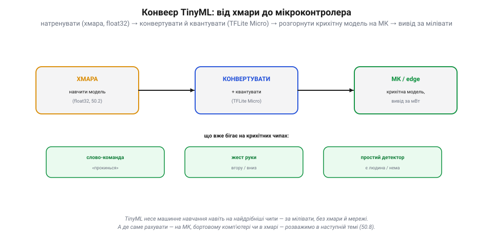

# Запуск моделі на пристрої: TinyML і квантування

Є [навчена й перевірена модель](book:algorithms/what-is-ml). Та між нею й бортовим чипом апарата — **прірва**. Сучасна нейромережа — це мільйони ваг і мільйони множень на кадр; а мікроконтролер має кілобайти пам'яті й мілівати потужності, тож [рахувати важку модель на ньому неможливо](book:algorithms/compute-cost). Щоб машинне навчання поїхало **на борту**, модель треба **стиснути**. Цим і займається **TinyML** — машинне навчання на крихітних пристроях, — а його головний прийом зветься **квантування**.

### Прірва: велика модель, крихітний пристрій

Спершу — масштаб біди. З одного боку — навчена модель: мільйони параметрів, десятки мегабайтів ваг, важкий вивід. З іншого — мікроконтролер: кілобайти RAM, мегагерци, мілівати, та ще й часто без апаратної підтримки дробових обчислень.

*Рис. Прірва. Ліворуч — **навчена модель**: мільйони параметрів, десятки МБ (ваги у форматі float32), важкий вивід. Праворуч — **мікроконтролер**: кілобайти RAM, мегагерци, мілівати, часто без апаратної підтримки дробових чисел. Між ними — прірва у тисячі разів. Модель просто **не влізе**, тож її треба **стиснути**. Це й робить TinyML.*

Прірва — у **тисячі разів**. Просто взяти й залити модель на чип не вийде: не вистачить ні пам'яті, ні швидкості, ні енергії. Та виявляється, цю прірву можна перекрити — бо модель майже завжди **надлишкова**, і її реально вщент ужати, майже не втративши якості.

### Квантування: 32-бітні ваги → 8-бітні

Найдієвіший і найпростіший прийом — **квантування**. Ваги модель зазвичай зберігає як **32-бітні** дробові числа (float32, по 4 байти кожне). Та така точність **не потрібна**: округлимо кожну вагу до одного з **256 рівнів** і збережемо її **8 бітами** (1 байт).

*Рис. Квантування. Точне 32-бітне число (0.31428…, 4 байти) **округлюють** до найближчого з 256 рівнів і зберігають **8 бітами** (1 байт). Діапазон ваг ділять на 256 поділок, і кожну вагу «клацають» у найближчу. Виграш: **вчетверо менше** пам'яті, **швидше** (цілочисельна арифметика, яку МК любить, а підтримки float у залізі часто нема), а точність падає **ледь-ледь**. Та сама ідея, що в квантуванні JPEG.*

Виграш величезний: **вчетверо менше** пам'яті (8 біт замість 32), і ще й **швидше** — бо цілочисельна арифметика дешевша за дробову, а простенький мікроконтролер часто **взагалі не має** апаратної підтримки float-чисел. А коштує це сущі дрібниці точності: округлення ваг до 256 рівнів модель майже не помічає. Упізнаєш ідею? Це достоту те, що робить [квантування в JPEG](book:algorithms/jpeg-intra): **згрубити** дрібниці, яких усе одно не видно, заради грубезного виграшу в розмірі. Квантування — найдешевший спосіб ужати модель у рази.

### Скриня прийомів стиснення

Квантування — не єдиний прийом; зазвичай їх **складають** разом.

*Рис. Скриня прийомів. **Квантування** — 32→8 біт, ×4 менше. **Менша архітектура** — мережі на кшталт MobileNet, навмисно складені з небагатьох дешевих шарів. **Прорідження** (pruning) — викинути ваги, близькі до нуля (а їх багато), зробивши мережу рідшою й меншою. **Дистиляція** — натренувати малого «учня» **копіювати** великого «вчителя», діставши майже ту саму точність у дрібці розміру. Прийоми складають разом.*

Окрім квантування є ще три. **Менша архітектура**: можна від початку взяти мережу, навмисне зроблену компактною (як **MobileNet**) — з небагатьох дешевих шарів. **Прорідження** (*pruning*): у навченій мережі багато ваг майже **нульові** — їх викидають, роблячи мережу рідшою й меншою, майже без втрат. **Дистиляція** (*knowledge distillation*): велику точну мережу-**вчителя** використовують, щоб навчити маленьку мережу-**учня** копіювати її відповіді — і учень виходить майже такий розумний, як учитель, але в рази менший. Складені разом — квантована, проріджена MobileNet — вони вжимають велику модель до розмірів, що влазять навіть у мікроконтролер.

### Конвеєр TinyML: від хмари до мікроконтролера

Як це робиться на практиці? [Тренують **звичайно**](book:algorithms/train-vs-inference) (у хмарі, повна точність), а тоді модель **конвертують** і **квантують** під пристрій спеціальним інструментом, і вже стиснуту розгортають на чип.

*Рис. Конвеєр TinyML. **Хмара**: навчити модель як завжди (float32). **Конвертувати + квантувати**: спеціальний інструмент (як-от TFLite Micro чи ONNX) перетворює й стискає її під пристрій. **МК / edge**: крихітну модель розгортають на чип, де вона робить вивід за **мілівати**. Уже сьогодні так на найдрібніших чипах бігають розпізнавання слова-команди («прокинься»), жестів і прості детектори — без хмари й мережі.*

Інструмент (наприклад, **TFLite Micro** чи **ONNX**) бере натреновану модель, квантує її й пакує у формат, що влізе на чип. На виході — крихітна модель, що робить вивід прямо на мікроконтролері за **мілівати**, без жодної хмари й мережі. Так уже сьогодні на найдрібніших чипах працюють розпізнавання слова-команди (те саме «прокинься» в навушниках, що слухає **завжди**, бо їсть копійки енергії), розпізнавання жестів, прості детектори «є людина / нема». Машинне навчання дісталося навіть туди, де лише кілобайти й батарейка-таблетка.

> 📜 **Квантувати — означає округлити до рівнів: Алек Рівз і PCM (1937).** Ідея квантування — замінити точне неперервне число кількома **дискретними рівнями** — старша за комп'ютери, і народилася вона в телефонії. 1937 року британський інженер **Алек Рівз**, працюючи в паризькій лабораторії ITT, придумав **імпульсно-кодову модуляцію** (PCM): щоб передати звук **цифрою**, він пропонував замірювати його гучність багато разів за секунду й кожен замір **округлювати** до найближчого з обмеженого набору рівнів, записуючи номер рівня двійковим числом. Це і є **квантування** в чистому вигляді — рівно те, що роблять із вагами, округлюючи їх до 256 рівнів. Та Рівз настільки випередив час, що мусив свій винахід **закинути**: лампова техніка 1930-х просто не тягла такого, і PCM довелося чекати на транзистор. Дочекавшись, вона стала основою **всього** цифрового звуку — телефонії, компакт-дисків, а вперше засяяла у Другу світову, у секретній системі зв'язку SIGSALY. Тож коли твій бортовий чип «клацає» ваги по рівнях, щоб улізти в пам'ять, він повторює думку, яку Рівз накидав за вісімдесят років до того, цифруючи людський голос. І знову, як із нейромережами, гарна ідея просто **чекала** на залізо, що її потягне.

> 🔧 **Навіщо це.** Щоб модель поїхала на борт ([мало енергії, мало ваги](book:algorithms/compute-cost)), її треба **стиснути**, і перший прийом — **квантування** (8 біт): майже задарма дає ×4 за розміром і помітно за швидкістю, та ще й дружить із цілочисельними МК. Бери **компактну архітектуру** (MobileNet), за потреби **прорідь** і **дистилюй**. Робочий порядок такий: натренуй повноточну модель **у хмарі**, тоді **сконвертуй і квантуй** інструментом (TFLite Micro тощо) і розгорни вже стиснуту. Готуйся віддати **дрібку точності** за великий виграш у розмірі, швидкості й споживанні — і **зміряй це на самому пристрої** (кадри/с, пам'ять, ват), а не на папері. TinyML дає змогу запустити просте розпізнавання навіть на чипі за копійки — але важке бачення все одно проситиме [потужнішого заліза](book:algorithms/where-to-compute).

### Підсумок теми

Навчена модель завелика для крихітного чипа, тож **TinyML** її стискає, щоб вона працювала на мікроконтролерах за мілівати. Головний прийом — **квантування**: ваги з 32-бітних дробів роблять **8-бітними** цілими (256 рівнів) — вчетверо менше, швидше, дружньо до МК, а точність падає ледь-ледь (та сама ідея, що в [квантуванні JPEG](book:algorithms/jpeg-intra)). До нього додають **меншу архітектуру** (MobileNet), **прорідження** (викинути ваги ≈0) і **дистиляцію** (малий учень копіює великого вчителя). Конвеєр простий: натренувати повноточно в хмарі → сконвертувати й квантувати інструментом (TFLite Micro) → розгорнути крихітну модель на пристрої. А саме квантування — це думка Алека Рівза з 1937-го (PCM: округлити неперервне до дискретних рівнів), що теж колись чекала на залізо. Навіть стиснута модель не завжди влазить у найдрібніший чип, тож окреме питання — [**де саме** її рахувати](book:algorithms/where-to-compute): на МК, бортовому комп'ютері чи в хмарі.
