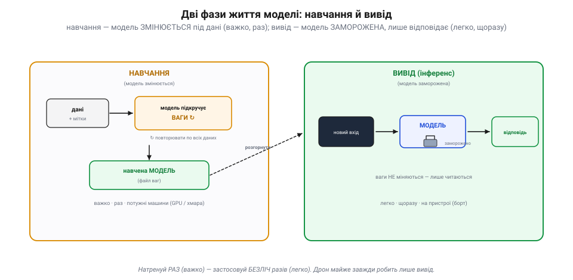
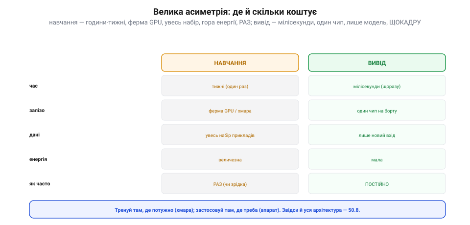
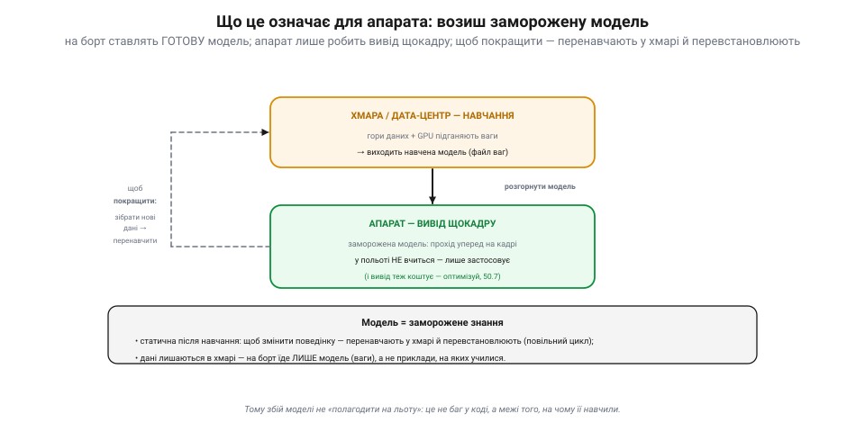

# Навчання vs вивід (inference): дві фази

Кожна модель проживає **два** геть різні життя. Спершу — довге, важке, одноразове: **навчання**, коли вона вчиться на даних. Потім — коротке, легке, повторюване безліч разів: **вивід** (інференс), коли вже навчену модель **застосовують** до нового входу. Цей поділ майорить уже там, де зображення обробляють [нейромережеві детектори](book:algorithms/nn-detectors), а тут він — головна вісь: саме на ньому стоїть уся практика машинного навчання **на апараті**.

### Дві фази життя моделі

Найперше — у чому різниця. Під час **навчання** модель **змінюється**: їй дають дані з відповідями, і вона підкручує свої внутрішні **ваги**, щоб менше помилятися. Під час **виводу** модель **заморожена**: ваги вже не міняються, вона лише **читає** вхід і видає відповідь.

*Рис. Дві фази. **Навчання**: моделі дають дані з мітками, і вона **підкручує ваги** (↻ багато разів), доки не навчиться; виходить навчена модель (файл ваг). Важко, **раз**, на потужних машинах (GPU/хмара). **Вивід**: цю **заморожену** модель запускають на новому вході — вона лише застосовує вивчене й видає відповідь. Легко, **щоразу**, на пристрої. Натренуй раз — застосовуй безліч разів.*

Це і є ключ: **навчена раз — застосовується безліч разів**. Модель, яку тижнями тренували в дата-центрі, потім роками працює на дешевому чипі, відповідаючи за мілісекунди. Тому навчання й вивід **розділяють у часі й просторі**: тренують там, де потужно (хмара), а застосовують там, де треба (борт апарата). І майже завжди апарат робить **лише вивід** — він возить **готову** модель, навчену кимось іншим.

### Що тече в кожній фазі: вперед — і назад

Чому ж навчання таке важче за вивід? Бо в ньому вдвічі більше роботи. **Вивід** — це лише прохід **уперед**: вхід тече крізь шари мережі до відповіді. **Навчання** додає до цього прохід **назад**.

*Рис. Що тече. **Вивід** — прохід лише **вперед**: вхід → шари → відповідь, ваги не міняються. **Навчання** — спершу так само вперед (дістати передбачення), тоді **порівняти** його з правильною міткою (це **похибка**), і пройти **назад**, підправивши ваги так, щоб похибка зменшилась; і повторити по всіх прикладах багато разів («епохи»). Вивід — це лише половина навчання (прохід уперед); саме [прохід назад](book:algorithms/gradient-descent) і є «вчитися».*

Послідовність навчання така: прогнати вхід **уперед** → отримати передбачення → **порівняти** з правильною відповіддю (виходить **похибка**) → пройти **назад** і підправити ваги, щоб наступного разу помилитися менше → і так **багато разів** по всьому набору (кожен повний прохід даних звуть **епохою**). Прохід назад — це і є власне «вчитися»; його механізм — це [градієнтний спуск](book:algorithms/gradient-descent). А вивід — це лише **прохід уперед**, половина роботи; **тому він і дешевший** за навчання.

### Велика асиметрія: де й скільки коштує

Через цю різницю фази **кардинально** різняться за ціною — і це визначає, де кожну запускати.

*Рис. Асиметрія. **Навчання**: тижні часу, ферма GPU чи хмара, увесь набір даних, величезна енергія — та робиться **раз** (чи зрідка). **Вивід**: мілісекунди, один чип на борту, лише новий вхід, мала енергія — зате **постійно**, щокадру. Висновок: тренуй там, де потужно (хмара); застосовуй там, де треба (апарат). Звідси й уся архітектура [«де рахувати»](book:algorithms/where-to-compute).*

Дивись на контраст. **Навчання**: тижні роботи, ферма відеокарт, увесь набір даних у пам'яті, гори енергії — але **один раз**. **Вивід**: мілісекунди на кадр, один скромний чип, лише поточний вхід, мало енергії — зате **безперервно**. Це й диктує архітектуру: ресурсомістке навчання віддають **хмарі**, а легкий (відносно) вивід ставлять на **апарат** (детальніше — у темі про те, [де рахувати](book:algorithms/where-to-compute)). Тренувати на борту дрона майже ніколи не мають сенсу — бракне ні даних, ні потужності, ні часу.

### Що це означає для апарата

Звідси — кілька твердих практичних наслідків для того, хто ставить ML на дрон.

*Рис. На апараті. Модель **навчають у хмарі** (гори даних + GPU), а на борт **розгортають** уже готову, **заморожену**. Апарат лише робить **вивід** (прохід уперед на кадрі) і **в польоті не вчиться**. Щоб покращити поведінку, треба зібрати нові дані, **перенавчити в хмарі** й **перевстановити** модель — повільний зовнішній цикл. Модель = заморожене знання; на борт їде лише вона (ваги), а не приклади.*

По-перше, апарат **возить готову, заморожену** модель і **в польоті не вчиться** — він лише застосовує те, що вже вивчено. По-друге, щоб **змінити** поведінку моделі, її не «підправляють на борту»: треба зібрати нові дані, **перенавчити** в хмарі й **перевстановити** новий файл ваг (повільний зовнішній цикл). По-третє, на борт їде **лише модель** (ваги), а не дані, на яких вона вчилася, — вони лишаються в хмарі. І по-четверте, хоч вивід і легший за навчання, він **усе одно коштує** (мільйони множень на кадр), тож його оптимізують під чип ([квантування, малі моделі](book:algorithms/tinyml)). Важливий висновок: коли модель на дроні **хибить**, це часто не «баг у коді», а **межі того, на чому її навчили** — і ліки тут не правка коду, а кращі дані й перенавчання.

> 📜 **Місяці тренування — і хід, якого не зробила б людина: AlphaGo (2016).** Найкраще цей поділ на дві фази видно на найгучнішій перемозі ШІ над людиною. У березні 2016-го програма **AlphaGo** від DeepMind у Сеулі обіграла одного з найсильніших гравців світу в **ґо**, Лі Седоля, з рахунком **4:1**. Але перемогу здобули **задовго** до матчу — у фазі **навчання**: AlphaGo спершу вивчили на партіях сильних людей, а тоді вона зіграла **десятки мільйонів** партій **сама проти себе** (привіт [Семюеловим шашкам](book:algorithms/what-is-ml), лише в незрівнянно більшому масштабі), поступово вдосконалюючи свої нейромережі. До матчу ця наука вже **застигла**: за столом мережі були **заморожені**, і AlphaGo не «довчалася» по ходу — вона лише **застосовувала** накопичене, обираючи ходи. І ось у другій партії стався славетний **хід №37**: AlphaGo поставила камінь так, що коментатори спершу вирішили — помилка (її ж власна оцінка казала, що людина зробила б цей хід із імовірністю ~1 до 10 000). Та хід виявився блискучим. Він не «придумався на ходу» — він **виринув** із місяців тренування, спресованих у заморожену модель. Дві фази в чистому вигляді: довге, важке навчання — і миттєве, холоднокровне застосування.

> 🔧 **Навіщо це.** Чітко розділяй фази. На апарат став **готову, наперед навчену** (заморожену) модель — і не намагайся вчити її в польоті. Тренуй (чи дотреновуй) у **хмарі** на потужному залізі, тоді **експортуй** і розгортай. Пам'ятай, що модель **статична**: щоб змінити поведінку — **перенавчи й перевстанови**, а не «підкрути на борту». Вивід усе одно **коштує** (прохід уперед — це мільйони множень), тож оптимізуй його під чип ([квантуванням і малими моделями](book:algorithms/tinyml)). І не плутай: **дані для навчання** лишаються в хмарі, а на борт їде лише **модель**. Якщо детектор систематично хибить — шукай провину не в коді на дроні, а в **даних і навчанні**.

### Підсумок теми

Модель живе у двох фазах. **Навчання**: дані з мітками → прохід уперед → похибка проти мітки → прохід **назад**, що підправляє ваги, і так багато разів (епохи) — важко, раз, у хмарі, модель **змінюється**. **Вивід**: новий вхід → прохід лише **вперед** → відповідь — легко, щоразу, на пристрої, модель **заморожена**. Вивід — це половина навчання, тому й дешевший; а різка **асиметрія** ціни й диктує: тренуй у хмарі, застосовуй на апараті, який лише робить вивід і в польоті не вчиться. Щоб його покращити — перенавчають і перевстановлюють. AlphaGo показала це велично: місяці самонавчання, спресовані в заморожену модель, що за мить вибрала хід №37. А з чого ця модель складена всередині — [нейрон і шар, ваги й активація](book:algorithms/neuron-layer) — це вже окрема історія.
