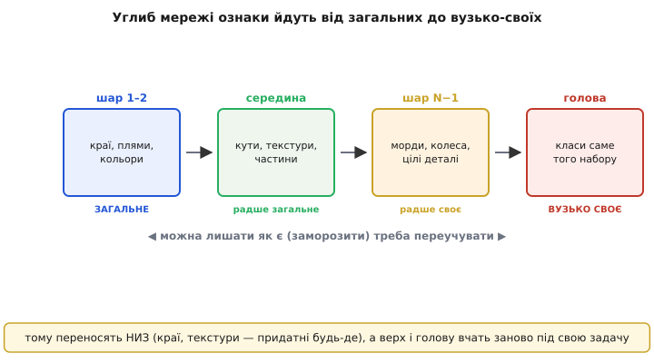
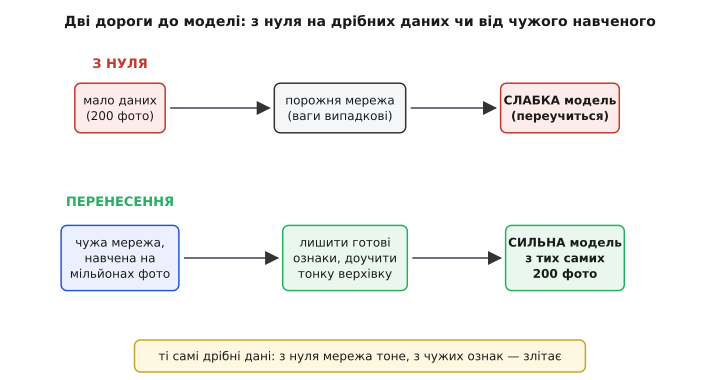
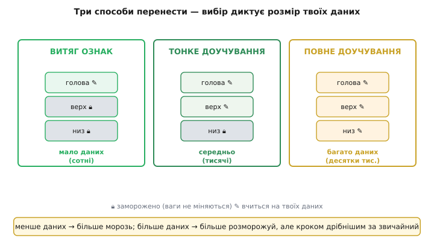
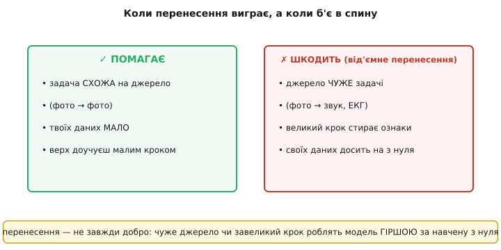

# Transfer learning: перенесення навчання

Хочеш навчити мережу відрізняти справний зварний шов від тріщини — а маєш лиш дві сотні знімків. [Навчати мережу з нуля](book:algorithms/train-vs-inference) на такій жменьці даних безнадійно: параметрів мільйони, прикладів двісті, тож вона просто **завчить** ці двісті напам'ять і [осоромиться на новому кадрі](book:algorithms/overfitting). Здавалося б, глухий кут. Та є вихід, і він до смішного природний: **не вчити з нуля**. Узяти чужу мережу, яку вже виснажливо натренували на мільйонах геть інших картинок, і **позичити** те, що вона встигла зрозуміти про зображення взагалі. Це і є **перенесення навчання** (англ. *transfer learning* — перенесення навченого) — коли знання, здобуте на одній задачі, працює на іншій.

Ідея копіює людину. Той, хто вміє грати в шахи, сяде за го не з чистого аркуша: відчуття центру, розрахунок на кілька ходів, дисципліна уваги — усе це переноситься, і новачок-із-шахів обжене справжнього новачка. Мережа може так само — якщо ми знайдемо в ній те, що не прив'язане до старої задачі.

### Чому це взагалі можливо: ознаки бувають спільні

Щоб позичати, потрібно, аби було що позичати — знання, придатне **не лише** старій задачі. І в зорових мережах воно є. Коли [згорткову мережу](book:algorithms/cnn) навчають розрізняти тисячу класів на величезному наборі, її перші шари самі собою приходять до того, що [малюють руками у фільтрах](book:algorithms/convolution-filters): детектори **країв**, кольорових плям, простих текстур. І це не випадок — край є край, байдуже, чи то контур кота, чи межа зварного шва. А от найглибші шари й [голова](book:algorithms/neuron-layer) вже вузько заточені під **свій** набір: «це радше вівчарка, ніж такса».


*Углиб мережі ознаки міняють природу. Перші шари ловлять **краї, плями, кольори** — вони придатні будь-де. Середина складає з них кути, текстури, частини. Верхні шари й голова стають **вузько своїми** — розпізнають саме класи того набору, на якому вчилися. Тому низ можна лишати як є, а верх і голову переучувати під нову задачу.*

Цей перехід «від загального до особливого» — не здогад, його **виміряли**: 2014 року в експерименті показали, що перші шари глибокої мережі дають майже однакові фільтри (краї, кольорові плями) незалежно від набору, а специфіка наростає що глибше [(докладніше в історії теми)](book:algorithms/transfer-learning/hist-transferable-features.md). Ось воно, що позичати: **низ** мережі — це, по суті, готовий, дорого вироблений [екстрактор ознак зображення](book:algorithms/cnn), і він майже той самий для будь-якої зорової задачі.

> 🔧 **Навіщо це.** На борту апарата тобі рідко дадуть мільйон розмічених кадрів саме твоєї задачі — «знайди цю деталь», «відрізни цю ваду». Перенесення перетворює задачу «зібрати мільйон прикладів» на «зібрати кілька сотень», бо мільйон уже витрачено кимось на загальні ознаки. Це часто **єдиний** спосіб отримати робочу модель у реальному проєкті з обмеженими даними.

### Як переносять: одна мережа, дві частини

Механіка проста, коли бачиш мережу як **дві частини**: тіло (усі згорткові шари — екстрактор ознак) і голову (останні шари, що з ознак роблять відповідь). Береш чужу **наперед навчену** (*pretrained*) мережу, викидаєш її голову (вона знала старі класи, тобі непотрібні), приставляєш **свіжу** голову під свою задачу — і вчиш.


*Дві дороги до моделі на однаковій жменьці даних. Згори — з нуля: порожня мережа на двохстах фото приречена переучитися й вийти слабкою. Знизу — перенесення: беремо чужу мережу, навчену на мільйонах фото, лишаємо її готові ознаки, доучуємо лише тонку верхівку — і з тих самих двохсот фото виходить сильна модель.*

Питання одне: **скільки** чужого лишити недоторканим, а скільки переучити під себе. Тут вибір диктує **розмір твоїх даних**, і стратегій три.

**Витяг ознак** (*feature extraction*): **заморозити** все тіло — його ваги взагалі не міняються — і навчити **лише нову голову**. Тіло працює як застиглий перетворювач «картинка → вектор ознак», а вчиться тонесенький верх. Пасує, коли даних **мало** (сотні): мало параметрів учиться, тож нема на чому переучуватися.

**Тонке доучування** (*fine-tuning*): розморозити **верхні** шари тіла разом із головою й **обережно** їх підправити під свою задачу. Логіка пряма зі згаданого градієнта — низ (краї, текстури) годиться як є, а верх варто підігнати ближче до твоїх об'єктів. Пасує, коли даних **середньо** (тисячі).

**Повне доучування**: розморозити **все** й учити цілу мережу — але **дуже дрібним кроком**, щоб не знищити готові ознаки. Має сенс, лише коли даних **багато** (десятки тисяч) і твоя задача помітно відрізняється від джерела.


*Три способи перенести, і вибір диктує розмір твоїх даних. Ліворуч — витяг ознак: заморозити все тіло (🔒), навчити лише нову голову (✎); для сотень прикладів. Посередині — тонке доучування: розморозити верх і голову, малий крок; для тисяч. Праворуч — повне доучування: розморозити все, крок ще дрібніший, пильнуй перенавчання; для десятків тисяч. Правило: менше даних — більше морозь.*

Наскрізне правило одне: **що менше своїх даних — то більше морозь чуже**. І хоч би скільки ти розморозив, крок навчання [(швидкість спуску)](book:algorithms/gradient-descent) бери **менший за звичайний** — інакше зітреш надбане.

### Малий крок — щоб не стерти надбане

Чому не гатити повним кроком, як при навчанні з нуля? Бо ваги вже не випадкові — вони несуть **вибудуване** знання. Великий крок градієнтного спуску за перші ж ітерації **розхитає** тонко налаштовані фільтри й зітре саме те, заради чого ти позичав мережу. Тому доучують **обережно**: крок у десятки разів менший, щоб лише **підправити** ознаки під нову задачу, а не переписати їх наново.

**Приклад: розкладка кроку на дві частини.** У прошивці-тренажері часто дають голові більший крок (вона з нуля, їй є куди рухатися), а розмороженому тілу — мізерний (його лиш ледь підправляють):

:::tabs
```cpp
// два темпи навчання: голова вчиться швидко, тіло — ледь-ледь
const float lr_head = 1e-3f;   // нова голова — звичайний крок
const float lr_body = 1e-5f;   // доучуване тіло — у 100 разів менше

void update_weights(Layer *l, float grad) {
    float lr = l->is_head ? lr_head : lr_body;   // тілу — крихітний крок
    l->w -= lr * grad;                           // спуск проти градієнта
}
```
```python
# два темпи навчання: голова вчиться швидко, тіло — ледь-ледь
LR_HEAD = 1e-3   # нова голова — звичайний крок
LR_BODY = 1e-5   # доучуване тіло — у 100 разів менше

def update_weights(layer, grad):
    lr = LR_HEAD if layer.is_head else LR_BODY   # тілу — крихітний крок
    layer.w -= lr * grad                          # спуск проти градієнта
```
:::

Тіло зсувається на крихту, голова наздоганяє задачу — і надбані ознаки лишаються цілими. Це і є суть акуратного доучування: рух є, але тіло ним майже не чіпаєш.

### Коли воно б'є в спину: від'ємне перенесення

Перенесення — не безкоштовне добро. Буває, що позичена мережа робить результат **гіршим**, ніж навчання з нуля. Це називають **від'ємним перенесенням** (*negative transfer*), і причин дві.

Перша — **джерело чуже задачі**. Ознаки з фотографій котів і машин чудово лягають на нову **зорову** задачу, бо краї й текстури спільні. Але тягти ту саму зорову мережу на розпізнавання **звуку** чи ритму ЕКГ — марно: там немає ні країв, ні текстур у зоровому сенсі, спільного знання просто нема, і застиглі фільтри лише заважають. Друга — **завеликий крок**: навіть на схожій задачі, якщо гатити повним темпом, спуск за кілька кроків **зруйнує** готові ознаки швидше, ніж мережа встигне навчитися нового, і ти опинишся гірше, ніж якби вчив з чистого аркуша.


*Перенесення — не завжди добро. Ліворуч воно **помагає**: задача схожа на джерело (фото → фото), своїх даних мало, верх доучуєш малим кроком. Праворуч **шкодить** (від'ємне перенесення): джерело чуже задачі (фото → звук чи ЕКГ), завеликий крок стирає готові ознаки, а своїх даних і так досить, щоб навчити з нуля.*

Звідси практичне чуття: перенось із **близького** (зорову — на зорове, мовну — на мовне), тримай **малий крок** і **зміряй** результат проти чесної відправної точки. Якщо позичена мережа не б'є навчену з нуля — джерело тобі не рідня, і перенесення тут зайве.

### Де це живе поруч

Перенесення давно перестало бути прийомом «на біду з даними» — воно стало **типовим стартом**. Майже ніхто не тренує велику зорову мережу з нуля: беруть наперед навчену на великому наборі й доучують під своє. Той самий хід стоїть під сучасними мовними моделями: величезну модель навчають «взагалі», а тоді доучують під вузьку задачу. Перенесення природно дружить із [запуском на слабкому залізі](book:algorithms/tinyml): зазвичай позичають **компактну** наперед навчену мережу (як-от MobileNet) і доучують її верх — так стиснута модель дістає силу великого набору, не важчаючи. І воно чудово ходить у парі з [аугментацією даних](book:algorithms/data-augmentation): коли своїх прикладів обмаль, їх штучно розмножують, а мережу беруть позичену — два ліки від малих даних разом.

Не плутай перенесення з [дистиляцією знань](book:algorithms/knowledge-distillation): дистиляція теж «передає знання», але **між моделями** на **тій самій** задачі (велика вчить малу), а перенесення несе знання **між задачами** (стара навчає нову). Різні осі, хоч слова схожі.

### Підсумок

Коли даних на свою задачу мало, [навчати мережу з нуля](book:algorithms/train-vs-inference) марно — вона [переучиться](book:algorithms/overfitting). Рятунок — **перенесення навчання**: позичити чужу наперед навчену мережу й доучити її під себе. Це працює, бо **низ** зорової мережі — краї, текстури, кольори — майже однаковий для будь-якої зорової задачі (це виміряли), тож його можна взяти готовим, а вузько-свою специфіку тримають верхні шари й [голова](book:algorithms/neuron-layer). Стратегій три, і вибір диктує розмір даних: **витяг ознак** (заморозити тіло, вчити лише голову — для сотень), **тонке доучування** (розморозити верх — для тисяч), **повне** (розморозити все дрібним кроком — для десятків тисяч); наскрізне правило — менше даних, більше морозь, і крок завжди менший за звичайний, щоб не стерти надбане. Але перенесення не всесильне: на **чужому** джерелі або із **завеликим кроком** воно дає **від'ємне перенесення** — модель гіршу за навчену з нуля. Тож перенось із близького, тримай малий крок і завжди зміряй виграш.
