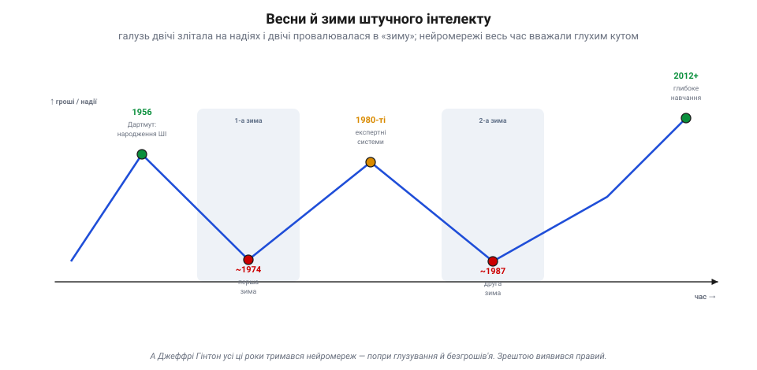
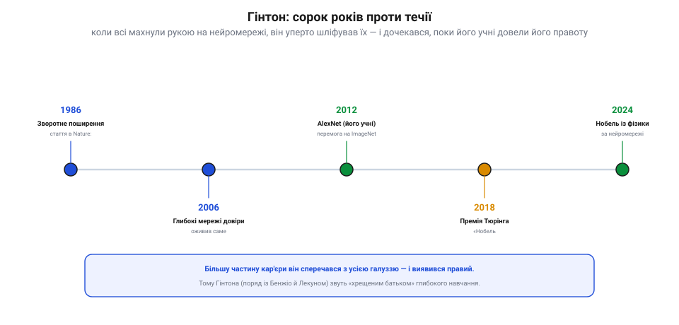
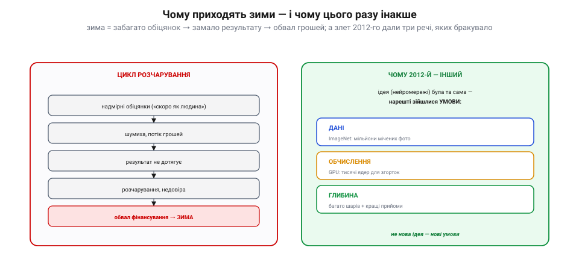
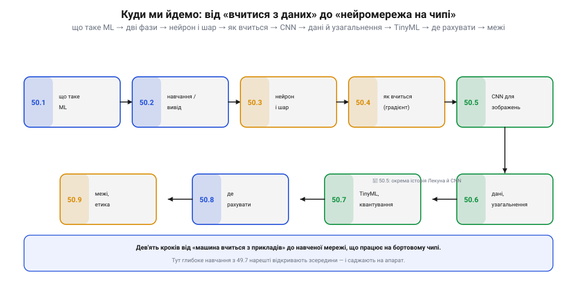

# Історія: Джеффрі Гінтон і зворотне поширення — упертість крізь «зими ШІ»

Найпотужніший комп'ютерний зір спирається на **навчені** мережі — і за цією технологією стоїть історія не так про алгоритм, як про **впертість**. Бо ідея, що машина може **вчитися** з прикладів, два рази здавалася мертвою — і два рази галузь її ховала. А один чоловік вірив у неї всупереч усім — і дочекався, поки час доведе його правоту. Це історія Джеффрі Гінтона і «зим штучного інтелекту».

## Дві зими, коли ШІ замерзав

Штучний інтелект як науку «охрестили» 1956 року на семінарі в Дартмуті, і почалося з **запаморочливих** обіцянок: ось-ось машини заговорять, перекладуть, побачать, замінять людину. Та результати відставали від галасу — і прийшла **перша зима** (приблизно 1974–1980): уряди врізали фінансування, ентузіазм згас. У 1980-х була нова весна — **експертні системи** (програми з купою правил «якщо… то…») — і знову бум, гроші, надії. А тоді й вони не виправдали сподівань, ринок спеціалізованих машин завалився, і вдарила **друга зима** (приблизно 1987–1993).

*Весни й зими ШІ. Галузь двічі злітала на надіях (Дартмут 1956; експертні системи 1980-х) і двічі провалювалась у «зиму» (≈1974 і ≈1987) — періоди безгрошів'я й зневіри. І весь цей час **нейромережі** вважали особливо безнадійним глухим кутом. Аж 2012-го прийшла відлига, що триває досі.*

«Зима» — це не просто менше грошей. Це коли ціла галузь **списує** напрям як глухий кут. І найбезнадійнішим із усіх вважали саме **нейромережі**: мовляв, вони повільні, погано масштабуються й програють простішим методам на кожному показовому завданні. Хто й далі ними займався — ризикував кар'єрою.

## Гінтон, що сорок років ішов проти течії

Саме таким упертюхом і був **Джеффрі Гінтон** — британсько-канадський когнітивіст і інформатик. Більшу частину кар'єри він **сперечався з консенсусом** усієї галузі: коли всі казали, що нейромережі мертві, він уперто шліфував їхню математику, архітектуру — і виховував аспірантів, яким судилося довести його правоту.

*Гінтон проти течії. 1986 — стаття про **зворотне поширення** (у Nature, з Румельгартом і Вільямсом) повертає до життя багатошарові мережі. 2006 — «глибокі мережі довіри» оживляють сам термін «глибоке навчання». 2012 — його учні роблять **AlexNet** і виграють ImageNet — світовий злам, після якого [нейромережеві детектори](topic:algorithms/nn-detectors) витіснили старі методи. 2018 — **премія Тюрінга** («Нобель інформатики»). 2024 — **Нобелівська премія з фізики** за нейромережі.*

Його віхи — це й віхи всієї галузі. **1986**: гучна стаття про **зворотне поширення помилки** — спосіб навчати багатошарові [нейромережеві детектори](topic:algorithms/nn-detectors) — повертає нейромережам життя. **2006**: Гінтон зі співавторами показує, як навчати по-справжньому **глибокі** мережі, й оживляє саму назву «глибоке навчання». **2012**: його аспіранти Алекс Крижевський та Ілля Суцкевер будують **AlexNet** і трощать усіх на ImageNet — починається теперішня ера. А далі — визнання: **2018** року Гінтон разом із Йошуа Бенжіо та Яном Лекуном дістає **премію Тюрінга**, а **2024-го** — **Нобелівську премію з фізики** (спільно з Джоном Гопфілдом) за основи машинного навчання на нейромережах.

## Анатомія зими — і чому 2012-й її розтопив

Чому ж напрям, який двічі ховали, раптом переміг? Спершу — звідки взагалі беруться зими. Схема щоразу однакова: **надмірні обіцянки** → шумиха й потік грошей → результат **не дотягує** до обіцяного → розчарування → **обвал** фінансування. Хайп сам себе й нищить.

*Анатомія зими. Ліворуч — цикл, що веде в зиму: завеликі обіцянки, шумиха, недотягнутий результат, розчарування, обвал грошей. Праворуч — чому 2012-й вирвався з цього циклу: **ідея** (нейромережі) була та сама ще з 1980-х, та нарешті зійшлися три **умови** — гори **даних** (ImageNet), дешеві **обчислення** (GPU) і **глибина** мереж із кращими прийомами навчання. Не нова ідея — нові умови.*

А 2012-го цикл нарешті **зламався** — і не тому, що з'явилася нова ідея. Ідея (нейромережі зі зворотним поширенням) була та сама, що й у Гінтона в 1980-х. Просто нарешті зійшлися три **умови**, яких бракувало: гори **даних** (ImageNet), дешеві паралельні **обчислення** (GPU) і вміння будувати по-справжньому **глибокі** мережі. Те, що раніше було «надто повільним і слабким», стало найкращим у світі. Гінтонова віра виявилася не помилкою, а **завчасністю** — їй просто треба було дочекатися заліза й даних.

## Від переможної ідеї до чипа

Саме ця переможна ідея — **машина, що вчиться з прикладів** — і стоїть за кожним запуском [навченої моделі](topic:algorithms/what-is-ml) на крихітному бортовому чипі. Щоб справді її приручити, треба розібрати її на частини: що таке навчання й вивід, із чого складається нейрон, як мережа підкручує ваги, чому згорткові мережі такі добрі для зображень, як уникнути перенавчання — і як усе це втиснути в пам'ять мікроконтролера.

*Складники машинного навчання на пристрої. Те «глибоке навчання», що з боку детекторів зображень виглядає «чорною скринею», розкладається на зрозумілі частини: що таке ML, навчання й вивід, нейрон і шар, як мережа вчиться (градієнтний спуск), згорткові мережі, дані й узагальнення, TinyML і квантування, де рахувати, межі й етика. Кожну з них можна відкрити **зсередини** — і посадити на апарат.*

## Що з цього в нашому апараті

Здавалося б, до чого тут дрон? А до того, що **кожна** навчена модель на твоєму апараті — детектор облич, класифікатор перешкод, розпізнавач жестів — це прямий нащадок тієї впертості Гінтона. Без його сорока років «проти течії» не було б ні AlexNet, ні легких мереж, що сьогодні крутяться на Raspberry Pi чи навіть на мікроконтролері ([TinyML](topic:algorithms/tinyml)).

І ще урок, ширший за техніку: **гарна ідея може випередити свій час — і це не привід її ховати**. Двічі галузь оголошувала нейромережі тупиком; двічі помилялася. Тож коли наступного разу почуєш упевнене «це не працює», згадай дві зими ШІ й одного впертого вченого: іноді бракує не ідеї, а лише її **умов**. Саме ця історія дала машинному навчанню кредит довіри, на якому стоїть кожна навчена модель сьогодні.
