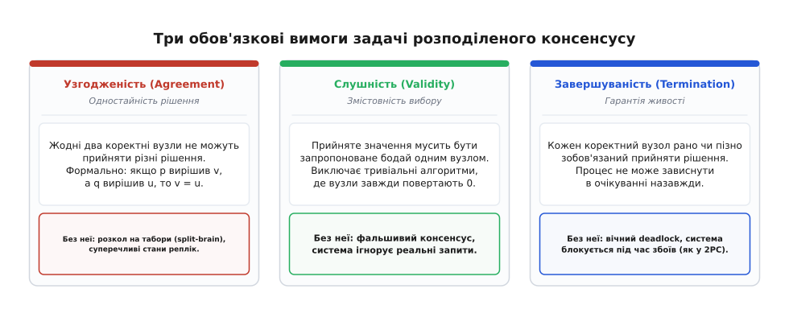
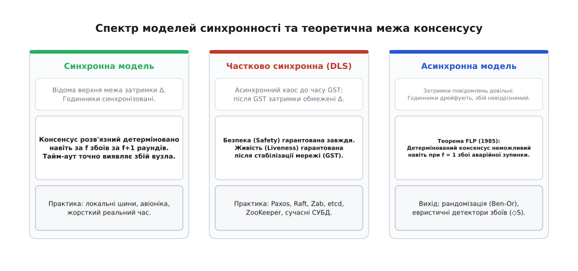
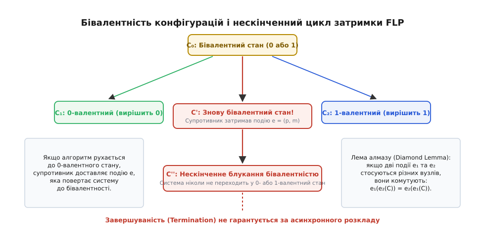
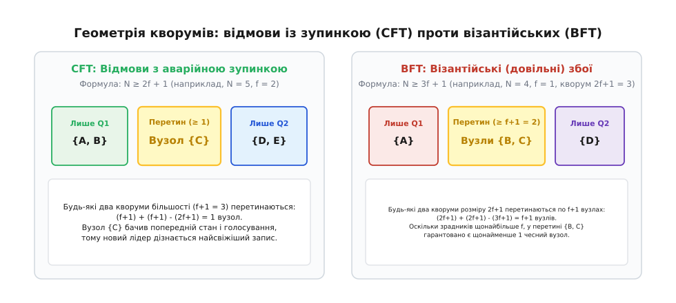

# Задача розподіленого консенсусу, теорема FLP та компроміси

<preknowlist>
- [Годинники Лампорта](topic:algorithms/lamport-clocks) — логічний порядок подій «сталося раніше» через монотонні лічильники в умовах відсутності єдиного фізичного часу.
- [Векторні годинники](topic:algorithms/vector-clocks) — точне відстеження причинно-наслідкових зв'язків та виявлення паралельних оновлень між вузлами.
- [Безконфліктні типи даних (CRDT)](topic:algorithms/crdt) — алгебраїчні структури, що сходяться без централізованої координації завдяки комутативності операцій.
- [Двофазний коміт](topic:algorithms/two-phase-commit) — атомарне підтвердження розподілених транзакцій та блокування системи при падінні координатора.
</preknowlist>

Три сервери баз даних тримають реплікований журнал фінансових транзакцій. На рахунку клієнта залишається 100 гривень. Одночасно надходять два запити на списання: один на 80 гривень у Києві, інший на 70 гривень у Львові. Якщо обидва запити виконаються, баланс стане від'ємним, тому сервери мають обрати рівно одну операцію, а другу відхилити. Сервер 1 пропонує виконати київську транзакцію, Сервер 2 — львівську. Вони починають обмін пакетами, але зв'язок із Сервером 3 раптово зникає. Сервер 3 не відповідає на запити.

У цей момент два працюючі сервери опиняються перед глухим кутом нерозрізненості. Чи Сервер 3 зазнав аварійної зупинки й більше ніколи не повернеться? Чи він працює абсолютно нормально, а пакет просто затримався в перевантаженому оптоволоконному маршрутизаторі на кілька сотень мілісекунд? Якщо Сервер 1 і Сервер 2 вирішать чекати на відповідь Сервера 3, уся банківська система зависне на невизначений термін. Якщо ж вони вирішать проголосувати вдвох і зафіксують списання, то в разі звичайного розриву мережі Сервер 3 разом із львівським клієнтом міг сформувати власну думку — і система розпадеться на два суперечливі світи з подвійним списанням грошей.

Ця дилема не є вадою конкретної програми чи мережевої карти. Вона становить суть фундаментальної проблеми комп'ютерних наук — **задачі розподіленого консенсусу** (лат. *consensus* — згода, одностайність).

## Що таке консенсус: чотири обов'язкові вимоги

У формальній постановці система складається з `N` незалежних процесів (вузлів). Кожен процес `p` стартує з деяким початковим значенням `v_p` (пропозицією, proposal). Процеси взаємодіють винятково шляхом передачі повідомлень і мають виконати спеціальну дію — зафіксувати спільне рішення (decide `v`).

Щоб консенсус вважався коректним і змістовним, протокол зобов'язаний задовольняти чотири властивості:

1. **Узгодженість (Agreement / Одностайність):** Жодні два коректні (працюючі) процеси не можуть зафіксувати різні значення. Якщо процес `p` вирішив `v`, а процес `q` вирішив `u`, то обов'язково `v = u`. Це гарантує, що репліки ніколи не розійдуться в станах.
2. **Слушність / Валідність (Validity):** Зафіксоване рішення `v` мусить бути запропоноване бодай одним із процесів системи. Якщо всі процеси стартували з пропозицією `0`, рішенням зобов'язаний бути `0`. Ця вимога унеможливлює тривіальні «фальшиві» алгоритми, де всі вузли зашиті в коді завжди повертати константу, ігноруючи реальність.
3. **Завершуваність (Termination / Живучість):** Кожен коректний процес рано чи пізно зобов'язаний зафіксувати остаточне рішення. Система не має права застрягти у вічному очікуванні або нескінченному циклі узгодження.
4. **Цілісність (Integrity):** Кожен процес приймає рішення щонайбільше один раз. Зафіксоване рішення є остаточним і не може бути змінене чи скасоване пізніше.



*Три стовпи розподіленого консенсусу: відкидання будь-якої властивості перетворює алгоритм на марний або небезпечний.*

Усі властивості розподілених алгоритмів поділяються на дві фундаментальні категорії: **безпеку** (Safety) та **живучість** (Liveness). Безпека стверджує, що «нічого поганого ніколи не станеться» (Agreement, Validity, Integrity): система не прийме взаємовиключних рішень і не зіпсує дані. Живучість стверджує, що «щось хороше зрештою станеться» (Termination): запит клієнта буде оброблено, а не зависне назавжди.

Легко помітити, чому не можна просто «послабити» одну з вимог. Якщо відкинути узгодженість, ми отримаємо розкол мозку (англ. *split-brain*), де різні репліки записують протилежні транзакції. Якщо відкинути валідність, система зможе повертати заздалегідь визначене фіктивне значення, втративши будь-який зв'язок із вхідними даними. А якщо відкинути завершуваність, ми отримаємо систему, яка під час найменшого мережевого збою просто припиняє відповідати клієнтам — саме це відбувається в класичному [двофазному коміті](topic:algorithms/two-phase-commit), коли координатор падає в середині фази голосування.

## Моделі середовища: синхронність, асинхронність та збої

Можливість досягнення консенсусу фундаментально залежить від двох факторів: природи можливих збоїв вузлів та припущень щодо часу доставки повідомлень.

### Моделі збоїв вузлів

1. **Аварійна зупинка (Crash-Stop / Fail-Stop):** Вузол працює абсолютно коректно за алгоритмом, але в довільний момент може раптово й назавжди припинити виконання операцій. Вузол не надсилає спотворених повідомлень і не бреше.
2. **Аварійна зупинка з відновленням (Crash-Recovery):** Вузол може впасти, втратити оперативну пам'ять, але згодом перезавантажитися, відновити стан із енергонезалежного диска (WAL) і повернутися до участі в протоколі.
3. **Візантійські збої (Byzantine / Arbitrary Failures):** Вузол може поводитися абсолютно довільно — внаслідок апаратного збою, пошкодження пам'яті або зловмисного злому. Він може надсилати суперечливі повідомлення різним сусідам, ігнорувати протокол або координувати атаку разом з іншими скомпрометованими вузлами.

### Моделі синхронності мережі

* **Синхронна модель:** Існує відома фіксована верхня межа затримки передачі повідомлення мережею `Δ`, а також відомі межі швидкості процесорів. Якщо після надсилання повідомлення минуло `2Δ` часу, а відповіді немає, можна **зі стовідсотковою впевненістю стверджувати, що віддалений вузол зазнав збою**. У синхронній моделі консенсус завжди розв'язний: за наявності `f` crash-збоїв алгоритм гарантовано доходить рішення за `f + 1` раундів обміну повідомленнями.
* **Асинхронна модель (грец. *a-* — без + *sýnchronos* — одночасний):** Затримка повідомлень є скінченною, але **не має жодної верхньої межі**. Повідомлення може долетіти за 1 мілісекунду, а може за 10 годин. Локальні годинники вузлів не синхронізовані й дрейфують з довільною швидкістю. В асинхронній моделі жоден тайм-аут не дозволяє відрізнити впалий вузол від дуже повільного вузла або тимчасово затриманого пакета.
* **Частково синхронна модель (Partial Synchrony):** Система поводиться асинхронно протягом невизначеного часу (перевантаження, аварії, втрати зв'язку), проте існує деякий невідомий момент часу — час глобальної стабілізації (англ. *Global Stabilization Time*, GST), після якого мережа починає поводитися синхронно, і затримки повідомлень не перевищують деякої межі `Δ`.



*Спектр моделей синхронності: від детермінізму синхронних шин до теоретичної заборони асинхронного консенсусу.*

Реальні глобальні мережі (Internet, між дата-центрами) є строго асинхронними за своєю фізичною природою: сплески навантаження, перемаршрутизація BGP-пакетів та зупинки процесорів на збирання сміття (GC pauses) роблять будь-яку фіксовану межу часу недійсною.

І саме в цьому реалістичному асинхронному середовищі виникає фундаментальний теоретичний бар'єр.

## Теорема неможливості FLP

У 1985 році дослідники Майкл Фішер, Ненсі Лінч та Майкл Патерсон опублікували теорему, яка назавжди змінила погляд на розподілені алгоритми.

> **Теорема FLP (Fischer, Lynch, Paterson, 1985):**
> У повністю асинхронній системі з надійними каналами передачі даних жоден детермінований алгоритм не здатний гарантувати консенсус навіть за умови, що лише один-єдиний процес може зазнати звичайної аварійної зупинки (`f = 1`).

Повний історичний шлях від перших спроб побудови транзакцій до формулювання теореми описано в історичній довідці — [як народжувалася теорія консенсусу від двох генералів до теореми FLP](topic:algorithms/consensus-problem/hist-flp.md).

Зверніть увагу на жорсткість умов теореми: мережа вважається ідеальною (пакети не губляться й не спотворюються, кожен надісланий пакет колись дійде), збої не є візантійськими (вузли чесні), а кількість збоїв зведена до абсолютного мінімуму — впасти може всього один вузол. І навіть за таких надзвичайно м'яких припущень консенсус **детерміновано неможливий**.

### Інтуїція доведення: конфігурації та бівалентність

Щоб зрозуміти, чому так відбувається, простежимо за простором станів системи.

Стан усієї розподіленої системи в конкретний момент часу називається **конфігурацією** `C`. Вона включає локальні стани всіх вузлів та мультимножину повідомлень, які вже відправлені в мережу, але ще не доставлені одержувачам.

З будь-якої конфігурації `C` шляхом послідовної доставки повідомлень система може еволюціонувати до деякого термінального рішення (`0` або `1`). Позначимо через `V(C)` множину всіх рішень, які в принципі можуть бути прийняті з конфігурації `C`:
* Якщо `V(C) = {0}`, конфігурація є **0-валентною**. Що б не відбувалося далі, результат уже вирішений наперед — система обов'язково вирішить `0`.
* Якщо `V(C) = {1}`, конфігурація є **1-валентною**. Результат обов'язково буде `1`.
* Якщо `V(C) = {0, 1}`, конфігурація є **бівалентною** (лат. *bi-* — два + *valere* — мати значення). З цього стану існують шляхи виконання, які приводять до `0`, і шляхи, які приводять до `1`.

У бівалентному стані система ще не зробила вибір. Доки конфігурація бівалентна, жоден вузол не має права винести остаточний вердикт, адже якщо вузол `p` вирішить `0`, а мережа доставить повідомлення іншим шляхом і приведе решту вузлів до `1`, буде порушено базову вимогу одностайності (Agreement).



*Дерево конфігурацій FLP: бівалентний стан і нескінченна затримка переходу до унівалентності планувальником-супротивником.*

Доведення теореми FLP складається з двох фундаментальних лем:

1. **Існування початкової бівалентності:** Завжди існує така початкова розстановка входів (наприклад, коли частина вузлів має `0`, а частина `1`), яка є бівалентною. Якби всі початкові конфігурації були визначеними наперед (унівалентними), то через нерозрізненість вхідного значення одного вузла іншими вузлами за його раптової зупинки система порушила б або Agreement, або Validity.
2. **Неможливість гарантованого виходу з бівалентності:** З будь-якої бівалентної конфігурації `C` для будь-якого повідомлення `m` існує такий порядок доставки інших пакетів, після якого доставка `m` знову залишає систему в **бівалентному стані**.

Оскільки порядок доставки повідомлень в асинхронній мережі не контролюється алгоритмом, абстрактний планувальник мережі (якого в теорії моделюють як «супротивника», adversary) завжди може підібрати такий темп доставки пакетів, за якого система нескінченно блукатиме між бівалентними конфігураціями. Кожен окремий пакет зрештою доставляється (виконання справедливе), жоден вузол не порушує інструкцій, але остаточне рішення не буде зафіксоване ніколи.

Математично строге доведення з усіма викладками, лемою про алмаз (комутативність незалежних подій) та індуктивним переходом наведено в окремому документі — [формальне математичне доведення теореми FLP крок за кроком](topic:algorithms/consensus-problem/math-flp-proof.md).

## Практичні компроміси: як інженерія обходить FLP

Теорема FLP — це не інженерний глухий кут, а чітко окреслений закон природи. Якщо неможливо отримати детермінований консенсус у чисто асинхронній системі зі 100% гарантією завершення, ми зобов'язані **змінити правила гри** — послабити хоча б одне з теоретичних обмежень.

Сучасні розподілені системи застосовують чотири практичні стратегії обходу FLP.

### 1. Модель часткової синхронності (Paxos, Raft, Zab)

Це найпоширеніший підхід у виробничих базах даних та координаторах конфігурацій (ZooKeeper, etcd, Consul).

Інженери розділяють вимоги до системи:
* **Безпека (Safety / Agreement):** Гарантується **завжди**, за будь-яких умов. Навіть якщо мережа повністю розірвана, повідомлення затримуються на години, а пакети дублюються, алгоритм **ніколи** не дозволить вузлам прийняти суперечливі рішення чи пошкодити дані.
* **Живучість (Liveness / Termination):** Гарантується **лише під час періодів синхронності** (після досягнення GST). Коли мережа стабілізується й повідомлення починають доходити швидше за обрані тайм-аути серцебиття (heartbeat timeouts), алгоритм обирає стабільного лідера й миттєво доходить консенсусу.

Алгоритми на кшталт Paxos (Леслі Лампорт) та Raft (Дієго Онгаро, Джон Оустерхаут) у моменти асинхронного шторму можуть тимчасово призупиняти обробку нових записів (жертвуючи доступністю заради узгодженості), але гарантують абсолютну цілісність.

### 2. Кворумні системи більшості

Усі практичні протоколи консенсусу спираються на поняття **кворуму** (лат. *quorum* — яких [достатньо]) — підмножини вузлів, згода якої необхідна для підтвердження будь-якої операції.

Головний принцип кворумів — **гарантоване перетинання**: будь-які два кворуми зобов'язані мати хоча б один спільний вузол.



*Геометрія кворумів: перетин за правилом простої більшості (CFT) та посилений перетин за візантійської ненадійності (BFT).*

Вимоги до розміру кластера та кворумів залежать від моделі відмов:

#### Модель аварійних зупинок (CFT — Crash Fault Tolerance)
Вузли не брешуть, а лише падають.
* Загальна кількість вузлів: `N ≥ 2f + 1` (де `f` — максимальна кількість збоїв).
* Розмір кворуму: проста більшість `Q = f + 1` (або `⌊N / 2⌋ + 1`).
* Перетин двох будь-яких кворумів `Q₁` та `Q₂`:

```
|Q₁ ∩ Q₂|
= |Q₁| + |Q₂| - N
= (f + 1) + (f + 1) - (2f + 1)
= 2f + 2 - 2f - 1
= 1      [щонайменше один спільний вузол]
```

Оскільки в перетині є щонайменше один вузол, новий лідер під час виборів гарантовано зв'яжеться хоча б з одним вузлом, який брав участь у попередньому успішному голосуванні, і дізнається найновіший стан системи.

#### Візантійська модель відмов (BFT — Byzantine Fault Tolerance)
Вузли можуть діяти зловмисно, підробляти повідомлення та голосувати двічі за різні пропозиції (PBFT, Tendermint).
* Загальна кількість вузлів: `N ≥ 3f + 1`.
* Розмір кворуму: дві третини голосів `Q = 2f + 1`.
* Перетин двох будь-яких кворумів `Q₁` та `Q₂`:

```
|Q₁ ∩ Q₂|
= |Q₁| + |Q₂| - N
= (2f + 1) + (2f + 1) - (3f + 1)
= 4f + 2 - 3f - 1
= f + 1      [перетин розміром щонайменше f + 1 вузлів]
```

Оскільки загальна кількість візантійських зрадників у системі не перевищує `f`, серед `f + 1` вузлів перетину гарантовано знайдеться **щонайменше один чесний вузол**, який скаже правду про попередні рішення.

### 3. Детектори збоїв (Failure Detectors)

У 1996 році Тушар Чандра та Сем Туег запропонували елегантну теоретичну концепцію: замість того, щоб накладати часові обмеження на всю мережу, ми додаємо до кожного вузла локальний модуль — **детектор збоїв** (оракул), який підозрює інші вузли в аварійній зупинці.

Детектори класифікуються за двома властивостями:
* **Повнота (Completeness):** Кожен вузол, що зазнав збою, зрештою потрапляє під підозру всіх коректних процесів.
* **Точність (Accuracy):** Працюючий вузол не потрапляє під хибну підозру.

Чандра і Туег довели визначну теорему: для детермінованого розв'язання консенсусу за `f < N / 2` crash-відмов не потрібен ідеальний детектор. Достатньо так званого **зрештою слабкого детектора збоїв** (`◇W`, або еквівалентного йому зрештою сильного `◇S`). Такий детектор може необмежено помилятися на початку (підозрювати живі вузли через мережеві затримки), але вимагає лише одного: щоб зрештою знайшовся хоча б один працюючий вузол, якого **всі інші працюючі вузли перестануть хибно підозрювати**.

### 4. Рандомізація (Randomized Consensus)

Теорема FLP забороняє саме *детерміновані* алгоритми, де наступний крок строго визначений поточним станом та отриманим повідомленням. Якщо дозволити процесам підкидати монетку (генерувати випадкові біти), детермінізм руйнується.

У рандомізованому протоколі консенсусу Бена-Ора (Ben-Or, 1983) вузли обмінюються пропозиціями, і якщо не вдається зібрати кваліфіковану більшість голосів за одне значення, кожен вузол обирає наступну пропозицію шляхом підкидання монети (`0` або `1` з імовірністю 50%).

Планувальник-супротивник більше не може детерміновано затримувати рішення: на кожному раунді з імовірністю щонайменше `(1/2)^N` усі вузли випадково викинуть однакове значення, після чого система невідворотно зафіксує результат. Ймовірність незавершення після `k` раундів спадає експоненційно до нуля:

```
P(незавершення після k раундів) ≤ (1 - (1/2)^N)^k ─[k → ∞]→ 0
```

Повний працюючий код симулятора асинхронної мережі та алгоритму Бена-Ора мовами C та C++ доступний у проектній вставці — [симуляція асинхронного розкладу та рандомізованого протоколу Бена-Ора](topic:algorithms/consensus-problem/proj-consensus-sim.md).

## Від консенсусу одного значення до реплікації автоматів станів (SMR)

Базовий алгоритм консенсусу (Single-Decree Paxos, одноразовий консенсус) вирішує долю лише **одного біта чи одного значення**. Проте реальним базам даних потрібна домовленість щодо нескінченної послідовності операцій: запис 1, запис 2, оновлення 3...

Цей перехід здійснюється за допомогою концепції **реплікації автоматів станів** (англ. *State Machine Replication*, SMR), яку сформулював Фред Шнайдер (Fred Schneider) на основі ідей Леслі Лампорта.

Детермінований автомат станів — це програма, яка стартує з однакового початкового стану `S₀` і послідовно застосовує потік команд `c₁, c₂, c₃...`. Якщо всі репліки виконають абсолютно однаковий потік команд в абсолютно однаковому порядку:

```
S_k = apply(S_{k-1}, c_k)
```

то внутрішні стани всіх реплік залишатимуться математично ідентичними.

Щоб реалізувати SMR, система розглядає розподілений журнал команд як масив комірок консенсусу:
* Комірка журналу 1: `Consensus(c₁)`
* Комірка журналу 2: `Consensus(c₂)`
* Комірка журналу `k`: `Consensus(c_k)`

У таких алгоритмах, як Multi-Paxos та [Raft](topic:algorithms/raft), фаза обрання лідера виконується один раз, після чого стабільний лідер безперервно пропонує нові записи журналу за спрощеною двофазною схемою (AppendEntries), досягаючи максимальної швидкості реплікації.

### Еквівалентність консенсусу та атомарного широкомовлення

У теорії розподілених систем існує важливий фундаментальний зв'язок: **задача розподіленого консенсусу строго еквівалентна задачі атомарного широкомовлення** (Atomic Broadcast, або Total Order Broadcast).

Звичайне надійне широкомовлення (Reliable Broadcast) гарантує лише те, що якщо повідомлення доставлено одному коректному вузлу, воно буде доставлено й усім іншим. Проте воно дозволяє різним вузлам отримувати пакети в різному порядку (наприклад, вузол A бачить спочатку операцію `X`, потім `Y`, а вузол B — спочатку `Y`, потім `X`). Таке розходження не вимагає консенсусу й легко розв'язується в асинхронній мережі.

Атомарне ж широкомовлення додає залізну вимогу **тотального порядку (Total Order)**: усі вузли зобов'язані доставляти всі повідомлення в абсолютно однаковій послідовності.
* Якщо у вас є атомарне широкомовлення, консенсус тривіальний: кожен вузол транслює свою пропозицію, а спільним рішенням стає перше доставлене повідомлення в тотальному порядку.
* Якщо у вас є алгоритм консенсусу, атомарне широкомовлення тривіальне: кожне наступне повідомлення в черзі узгоджується через окремий екземпляр консенсусу `Consensus(k)`.

Отже, теорема FLP поширюється на будь-яку спробу побудувати гарантоване впорядкування подій у розподіленій системі.

## Анатомія поведінки під час розриву мережі (Partition Walkthrough)

Щоб наочно побачити роботу кворумного захисту в дії, простежимо за сценарієм розриву мережі на прикладі кластера з `N = 5` вузлів `{A, B, C, D, E}` з кворумом більшості `Q = 3`.

Нехай вузол `A` є обраним лідером кластера в епосі `term = 1`. Раптово екскаватор перебиває оптоволоконний кабель між дата-центрами, розколюючи мережу на дві ізольовані частини:
* **Мажоритарна група:** `{A, B, C}` (3 вузли).
* **Міноритарна група:** `{D, E}` (2 вузли).

Подивимося, що відбувається з обох боків барикади:

1. **Клієнт надсилає запит на запис у міноритарну групу (до вузла D):**
   - Вузол `D` не бачить лідера `A` за тайм-аутом серцебиття й починає вибори нового лідера в епосі `term = 2`.
   - Вузол `D` надсилає запити на голосування до `E`, `A`, `B`, `C`.
   - Вузол `E` голосує за `D`, але вузли `A`, `B`, `C` недосяжні. Вузол `D` набирає лише 2 голоси з 5.
   - Оскільки 2 < 3 (кворум не зібрано), вузол `D` **не може стати лідером**.
   - Будь-який запис, надісланий у міноритарну групу, або відхиляється з помилкою, або зависає в черзі до відновлення зв'язку. Міноритарна група захищена від генерації фальшивого стану.

2. **Клієнт надсилає запит на запис у мажоритарну групу (до лідера A):**
   - Лідер `A` отримує транзакцію й розсилає запити реплікації до всіх вузлів.
   - Вузли `D` та `E` не відповідають.
   - Проте вузли `B` та `C` успішно отримують пакет, записують його до свого локального журналу (WAL) і надсилають підтвердження лідеру `A`.
   - Лідер `A` налічує 3 підтвердження (від `A`, `B`, `C`). Кворум зібрано (`3 ≥ 3`).
   - Лідер фіксує транзакцію (commit), застосовує її до своєї бази даних і повертає клієнту статус «Успіх».

3. **Мережевий кабель відновлено (Heal):**
   - Вузли `D` та `E` знову бачать пакети від лідера `A`.
   - Лідер `A` виявляє, що журнали `D` та `E` відстають, і надсилає їм пропущені записи.
   - Вузли `D` та `E` наздоганяють мажоритарний журнал, і кластер повертається до повної синхронності.

Завдяки нерівності `N ≥ 2f + 1` система продовжувала обслуговувати клієнтів у мажоритарній половині, повністю унеможлививши розкол даних у міноритарній.

## Проблема «зомбі-лідера» та захисні токени (Fencing Tokens)

Один із найнебезпечніших крайових випадків у системах консенсусу виникає через нерівномірні затримки всередині самої операційної системи.

Уявімо, що лідер `A` надіслав клієнту підтвердження блокування ресурсу в розподіленому сховищі. Раптом віртуальна машина лідера `A` потрапляє в тривалу паузу збирача сміття (Stop-the-World GC pause) або зависає на операціях дискового вводу-виводу на 15 секунд.

Поки лідер `A` «спить»:
1. Решта вузлів `{B, C, D}` фіксують відсутність серцебиття від `A`.
2. Вони ініціюють нові вибори для наступної епохи (номеру терму `term = 2`) і обирають нового лідера `B`.
3. Новий лідер `B` видає замок іншому клієнту й починає вносити зміни.

Через 15 секунд лідер `A` раптово «прокидається». Його внутрішня пам'ять усе ще містить переконання, що він — чинний лідер (`term = 1`). Він намагається надіслати команду запису до зовнішнього сховища файлів чи бази даних. Якби зовнішнє сховище просто прийняло запис від старого лідера `A`, це призвело б до затирання щойно оновлених даних від нового лідера `B`.

Цю проблему вирішують за допомогою **монотонних захисних токенів (Fencing Tokens / Epochs / Generation numbers)**:
* Кожного разу, коли обирається новий лідер або відкривається нова комірка консенсусу, номер епохи строго зростає: `epoch_new = epoch_old + 1`.
* Кожен запит на запис до сховища містить поточний токен епохи лідера.
* Зовнішнє сховище запам'ятовує найвищий номер токена, який воно коли-небудь бачило. Якщо надходить запит із токеном `1`, а сховище вже бачило токен `2`, запит від старого лідера **миттєво відхиляється**:

```
if request.epoch < storage.max_epoch:
    reject("Stale leader token")
```

Цей простий інваріант гарантує, що жоден «зомбі-лідер», затриманий асинхронністю середовища, не зможе пошкодити стан системи після втрати лідерства.

## Коли консенсус потрібен, а коли він невиправдано дорогий

Консенсус — це найпотужніша, але водночас найдорожча абстракція в розподілених системах. Впровадження консенсусу накладає відчутну ціну на продуктивність:

1. **Мережева затримка (Latency):** Кожен запис вимагає щонайменше двох послідовних мережевих раундів (Round-Trip Times, RTT) між вузлами кластера: фаза підготовки/пропозиції та фаза фіксації/підтвердження. Якщо вузли рознесені по різних континентах, мінімальна затримка однієї транзакції складатиме 100–200 мс через швидкість світла в оптоволокні.
2. **Вузьке горлечко лідера (Throughput Bottleneck):** У протоколах із виділеним лідером (Raft, Multi-Paxos) усі операції запису зобов'язані проходити через один вузол-лідер, що обмежує масштабованість пропускної здатності продуктивністю одного сервера.
3. **Втрата доступності під час ізоляції (CAP/Availability Loss):** Якщо дата-центр виявляється відрізаним від мережі й містить меншість вузлів (наприклад, 2 сервери з 5), він **повністю втрачає здатність приймати записи**, оскільки не може зібрати кворум більшості (3 вузли).

### Коли консенсус ЖИТТЄВО НЕОБХІДНИЙ

Консенсус є незамінним скрізь, де помилка узгодженості призводить до непоправного пошкодження бізнес-логіки:

* **Розподілені замки та лідери (Leader Election, Distributed Locks):** Обрання єдиного майстра в кластері (Chubby, ZooKeeper, etcd). Два одночасні лідери призведуть до катастрофи.
* **Управління метаданими та схемою даних:** Реєстрація таблиць, шардинг, зміна топології вузлів у кластері Kubernetes, Spanner чи CockroachDB.
* **Фінансові транзакції та запобігання подвійним витратам (Double Spending):** Списання з банківського рахунку, біржові торги, де сума на балансі не може піти в мінус.
* **Строга лінеаризовність (Linearizability):** Читання й записи, що створюють для клієнта ілюзію роботи з одним неподільним потокобезпечним комп'ютером.

### Коли консенсус НАДЛИШКОВИЙ і його слід уникати

Якщо характер задачі дозволяє послабити вимоги до узгодженості, від консенсусу відмовляються на користь набагато швидших і масштабованих архітектур:

* **Комутативні операції та спільне редагування:** Замість важкого консенсусу застосовують [безконфліктні типи даних (CRDT)](topic:algorithms/crdt). Оскільки операції комутують, будь-які дві репліки зливаються автоматично без блокувань і лідерів.
* **Лічильники переглядів, метрики, часові ряди:** Втрата або затримка окремого виміру температури чи перегляду сторінки не є критичною. Тут використовують кінцеву узгодженість (Eventual Consistency) з локальним накопиченням даних.
* **Ідемпотентні оновлення та кешування:** Оновлення фотографії профілю або кешування сторінки каталогу чудово працює на мультилідерній реплікації без важких кворумних бар'єрів.

> 🔧 **Навіщо це.** У реальній системній архітектурі розробник ніколи не будує всю систему на консенсусі. Консенсус (Raft / etcd / ZooKeeper) використовують як «вузьку основу» винятково для зберігання кореневих метаданих, блокувань та конфігурації кластера. Самі ж масиви даних (терабайти файлів, відеопотоки, сесії користувачів) зберігають у сховищах із кінцевою узгодженістю чи шардованих репліках, досягаючи поєднання абсолютної надійності керування з колосальною продуктивністю обробки даних.
