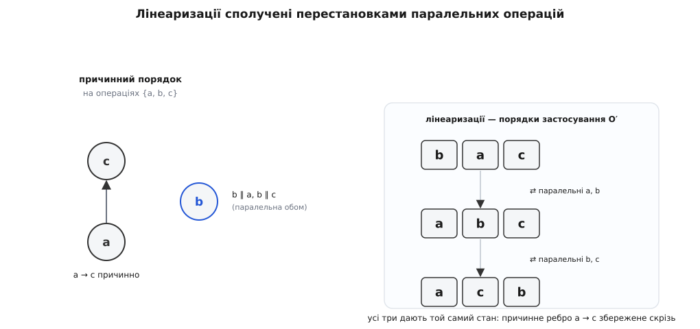

# 🧮 Чому напіврешітка змушує репліки збігтися

Сильна кінцева узгодженість — це обіцянка, що будь-які дві репліки, які прийняли однакову множину оновлень, опиняються в тотожному стані, і жодного арбітра для цього не потрібно. Нижче вона доведена з самої алгебри злиття: спершу — що «комутативність + асоціативність + ідемпотентність» це рівно об'єднання (join) у напіврешітці, а тоді — що звідси випливає збіжність станового CRDT, а з комутування паралельних операцій — операційного.

## Що саме доводимо

Розкладемо обіцянку на перевірні умови. Реплікований об'єкт називають **сильно кінцево узгодженим** (strong eventual consistency, SEC), якщо він, по-перше, [кінцево узгоджений](topic:programming/eventual-consistency) — кожне оновлення, доставлене хоч одній коректній репліці, зрештою доходить до всіх (eventual delivery), і кожен виклик методу завершується (termination), — а по-друге, задовольняє **сильну збіжність** (strong convergence): дві коректні репліки, що доставили **однакову множину оновлень, мають рівний стан**.

Друга умова й відрізняє SEC від звичайної кінцевої узгодженості. Звичайна дозволяє розв'язувати конфлікт постфактум — відкотити правку, обрати переможця, спитати консенсус. Сильна цього не дозволяє: однаковий набір оновлень **зобов'язаний** дати однаковий стан детерміновано, без жодної домовленості між вузлами. Формально це поняття вибудували 2011 року Marc Shapiro, Nuno Preguiça, Carlos Baquero та Marek Zawirski — це усталене, канонічне означення галузі.

Eventual delivery й termination — властивості транспорту та реалізації, не алгебри: перше забезпечує мережа (хоч колись доправить пакет), друге — скінченність методів. Уся математична вага лежить на **сильній збіжності**. Тому доводити будемо одне-єдине твердження — *однакова множина доставлених оновлень ⟹ рівний стан* — окремо для кожної з двох сімей.

## Алгебра ⟺ порядок: три закони і є об'єднання

Напіврешітку означують двома різними способами, і саме їхній збіг перетворює інженерний чек-лист «комутативність, асоціативність, ідемпотентність» на геометрію порядку.

**Алгебраїчно** напіврешітка — це множина S з бінарною операцією ⊔, що задовольняє три закони:

```
комутативність:    a ⊔ b = b ⊔ a
асоціативність:   (a ⊔ b) ⊔ c = a ⊔ (b ⊔ c)
ідемпотентність:   a ⊔ a = a
```

**Порядково** ж це структура, знана в теорії порядку як [напіврешітка](topic:math/semilattice) — частковий порядок (S, ⊑), у якому кожна пара {a, b} має найменшу верхню межу (супремум, join): найменший елемент, що ⊒ обох.

Твердження: це той самий об'єкт. Маючи алгебраїчну ⊔, означимо відношення

```
a ⊑ b   :⟺   a ⊔ b = b
```

Інтуїція проста — «b уже вбирає a, тож долити a нічого не змінює». Перевірмо, що ⊑ справді частковий порядок і що ⊔ дає його супремум; кожен крок спирається рівно на один із трьох законів.

**Це частковий порядок.**

```
рефлексивність:   a ⊑ a
   бо a ⊔ a = a                       — ідемпотентність

антисиметрія:     a ⊑ b і b ⊑ a  ⟹  a = b
   маємо a ⊔ b = b  та  b ⊔ a = a
   але   a ⊔ b = b ⊔ a                — комутативність
   тож   b = a

транзитивність:   a ⊑ b і b ⊑ c  ⟹  a ⊑ c
   дано  a ⊔ b = b,  b ⊔ c = c
   a ⊔ c = a ⊔ (b ⊔ c)               — бо c = b ⊔ c
         = (a ⊔ b) ⊔ c               — асоціативність
         = b ⊔ c                     — бо a ⊔ b = b
         = c
   отже a ⊔ c = c, тобто a ⊑ c
```

**⊔ — це супремум.** Спершу вона верхня межа обох аргументів:

```
a ⊑ a ⊔ b ?   a ⊔ (a ⊔ b) = (a ⊔ a) ⊔ b = a ⊔ b   ✓   (асоц. + ідемп.)
b ⊑ a ⊔ b ?   b ⊔ (a ⊔ b) = a ⊔ (b ⊔ b) = a ⊔ b   ✓   (комут. + ідемп.)
```

І вона **найменша** з-поміж усіх верхніх меж: якщо u — будь-яка спільна верхня межа (a ⊑ u і b ⊑ u), то

```
дано  a ⊔ u = u,  b ⊔ u = u
(a ⊔ b) ⊔ u = a ⊔ (b ⊔ u) = a ⊔ u = u
тож   a ⊔ b ⊑ u
```

Отже a ⊔ b не більша за жодну спільну верхню межу — тобто вона найменша. Зворотний бік (у порядковій напіврешітці операція «взяти супремум пари» автоматично комутативна, асоціативна й ідемпотентна) випливає з єдиності супремума: sup не залежить від порядку пари, sup від sup — це sup трійки, а sup{a, a} = a.

Висновок, який далі працює мовчки: щойно інженер вимагає від злиття три закони, він тим самим оголошує стани частково впорядкованими, а злиття — операцією «взяти найменший стан, що вбирає обидва». Вибору тут уже немає: супремум єдиний.


*Алгебра й геометрія порядку — той самий об'єкт: три закони ⊔ рівносильні тому, що стани утворюють частковий порядок, а злиття бере супремум пари.*

## Становий CRDT: монотонна напіврешітка ⟹ збіжність

Візьмімо першу сім'ю — станові (state-based, CvRDT) — і зведімо її збіжність до щойно доведеної алгебри.

**Модель.** Стани утворюють об'єднання-напіврешітку (S, ⊑, ⊔) з найменшим елементом ⊥ (порожній початковий стан). Репліка змінює стан двома способами:

```
локальне оновлення  u:   s ↦ u(s),   причому  s ⊑ u(s)     (інфляційність)
злиття з прийнятим m:    s ↦ s ⊔ m                          (join)
```

Інфляційність (монотонність) каже: оновлення лише **піднімає** стан порядком, ніколи не опускає. Це природно — лічильник-що-росте лише збільшує комірки, множина-що-росте лише додає елементи.

Спершу — маленька, але засаднича лема, без якої подальше було б некоректним.

**Лема (join множини визначений однозначно).** Для скінченної множини елементів X ⊆ S величина ⨆X (об'єднання всіх елементів X) не залежить ні від порядку, ні від групування, ні від повторів доданків. Це прямий наслідок трьох законів: комутативність прибирає порядок, асоціативність — дужки, ідемпотентність — повтори. Тому запис ⨆X однозначний.

Тепер прив'яжемо стан до того, що він «увібрав». Дамо кожній події-оновленню окрему тотожність і позначмо через c(s) ⊆ U множину оновлень, **вбудованих** у стан s. Кожна подія-оновлення u вносить у решітку фіксований елемент σ(u) ∈ S — свою «дельту», — а нове оновлення доливається як join: s ⊔ σ(u). (Для лічильника-що-росте σ(u) — це вектор, у якого комірка репліки-автора дорівнює порядковому номеру цього оновлення в неї, а решта нулі; поелементний максимум таких векторів і дає лічильник.) Правила накопичення c природні:

```
c(⊥)      = ∅
c(u(s))   = c(s) ∪ { u }        — локальне оновлення додає свою подію
c(s ⊔ m)  = c(s) ∪ c(m)         — злиття об'єднує історії
```

**Ключовий інваріант.** У будь-який момент виконання стан репліки — це join внесків усіх оновлень, які він увібрав:

```
s = ⨆ { σ(u) : u ∈ c(s) }
```

Доведення — індукцією за кроками виконання. Три випадки покривають усе, що репліка вміє робити зі станом:

```
база.   s = ⊥ = ⨆∅ = ⨆{ σ(u) : u ∈ ∅ }                          ✓

крок-оновлення.  було  s = ⨆_{u∈c(s)} σ(u);   стало  s' = s ⊔ σ(u₀)
   s' = ( ⨆_{u∈c(s)} σ(u) ) ⊔ σ(u₀) = ⨆_{u ∈ c(s)∪{u₀}} σ(u)       ✓

крок-злиття.  s' = s ⊔ m,  де за припущенням індукції
   s = ⨆_{u∈c(s)} σ(u),    m = ⨆_{u∈c(m)} σ(u)
   s' = ( ⨆_{c(s)} σ ) ⊔ ( ⨆_{c(m)} σ ) = ⨆_{c(s) ∪ c(m)} σ         ✓
```

В останньому рядку спільні оновлення з c(s) ∩ c(m) з'являються у сумі двічі — але ідемпотентність їх склеює; саме тому лему про однозначність ⨆ довелося довести першою.

**Сильна збіжність — тепер один рядок.** Нехай дві репліки доставили однакову множину оновлень, c(sᵢ) = c(sⱼ). Тоді

```
sᵢ = ⨆_{u ∈ c(sᵢ)} σ(u) = ⨆_{u ∈ c(sⱼ)} σ(u) = sⱼ
```

— стани рівні. Це і є SEC для станової сім'ї. ∎

Тепер видно, **чому** канал може знущатися з пакетів. Переставляння доставки гаситься комутативністю й асоціативністю (порядок і групування join'ів байдужі); дублювання — ідемпотентністю (той самий стан, долитий удруге, нічого не змінює: s ⊔ s = s); а втрата не страшна, доки оновлення **колись** дійде — тоді множини c зрівняються. Три закони — це рівно імунітет до трьох речей, які робить мережа.

> 🔧 **Навіщо це.** Три рядки алгебри — не формальність: кожен закон знімає з мережі одну вимогу. Є ідемпотентність — можна не боятися дублів і слати той самий стан скільки завгодно разів (основа пліток і анти-ентропії); є комутативність з асоціативністю — можна зливати в будь-якому порядку й будь-якими групами. Тому становий CRDT працює поверх найдешевшого, ненадійного каналу: доведення саме й показало, що дешевизна каналу оплачена законами ⊔.

## Операційний CRDT: причинність + комутування паралельних ⟹ збіжність

Друга сім'я — операційні (op-based, CmRDT) — платить за збіжність інакше: шле не стан, а саму операцію, і покладається на суворіший канал. Доведення теж інше, але кінець той самий.

**Модель.** Операції з множини O змінюють стан переходом s · o («застосувати o до s»). Канал — **надійне причинне мовлення** (reliable causal broadcast): кожну операцію доставляють кожній репліці **рівно один раз** і з дотриманням [причинного порядку](topic:algorithms/vector-clocks) → (happened-before) — якщо o₁ → o₂ (одна причинно передує другій), то скрізь o₁ застосують раніше за o₂. Причинність тут визначають векторними годинниками, а не настінним часом. Від типу вимагається одне: **паралельні операції комутують**.

```
o₁ ∥ o₂   (непорівнянні за →, тобто причинно незалежні)
          ⟹   (s · o₁) · o₂ = (s · o₂) · o₁    для всіх досяжних s
```

Множина доставлених операцій O′ несе на собі частковий порядок → (звужений на O′). Причинна доставка означає: порядок, у якому репліка застосувала O′, — це **лінеаризація** (лінійне продовження) цього часткового порядку, тобто повний порядок, що не суперечить жодному ребру →. Різні репліки можуть застосувати ту саму O′ у різних лінеаризаціях — і треба, щоб стан вийшов однаковий.

Уся збіжність тримається на одній комбінаторній лемі.

**Лема (лінеаризації сполучені перестановками паралельних).** Будь-які два лінійні продовження скінченного часткового порядку (P, →) можна перевести одне в одне скінченним ланцюжком **сусідніх перестановок непорівнянних елементів**.

```
Доведення (індукція за |P|).
Нехай L, L′ — два лінійні продовження. Візьмімо x — ПЕРШИЙ елемент L.
  • x мінімальний у P: перший елемент лінеаризації завжди мінімальний,
    бо перед ним нічого не стоїть, тож ніщо йому й не передує за →.
  • У L′ усе, що стоїть ЛІВІШЕ за x, непорівнянне з x: нічого не може
    бути → -меншим за мінімальний x, а →-більше не поставили б перед ним.
Пересуваємо x уліво в L′ сусідніми перестановками: кожна міняє x
з безпосереднім лівим сусідом, а той непорівнянний із x — отже, обмін
законний і дає знову лінійне продовження. За скінченне число кроків
x стає першим і в L′. Тепер відкидаємо x і повторюємо для P∖{x}
з хвостами L та L′ (обидва — лінеаризації P∖{x}).
Склеївши всі перестановки з усіх рівнів рекурсії, дістаємо шуканий
ланцюжок, що переводить L у L′.                                      ∎
```

Тепер висновок майже очевидний. Репліка i застосувала O′ у порядку Lᵢ, репліка j — у порядку Lⱼ; обидва — лінеаризації одного (O′, →). З'єднаємо їх ланцюжком сусідніх перестановок непорівнянних елементів. Але непорівнянні за → — це якраз **паралельні** операції, а вони комутують: отже, кожна перестановка не міняє підсумкового стану. Пройшовши весь ланцюжок,

```
sᵢ = s₀ вздовж Lᵢ  =  s₀ вздовж Lⱼ  =  sⱼ
```

— стани рівні. Сильна збіжність для операційної сім'ї доведена. ∎



*Причинна доставка робить порядок застосування лінеаризацією причинного порядку; сусідні лінеаризації різняться перестановкою пари паралельних (комутуючих) операцій — тож підсумковий стан один.*

І тут видно, **чому** канал мусить бути саме таким. Причинно впорядковані операції (o₁ → o₂) у жодній лінеаризації не міняються місцями — тож від них комутування й **не** вимагають; досить, щоб канал зберіг їхній порядок, ось навіщо причинність. Комутувати мусять лише паралельні. Вимога «рівно один раз» теж не випадкова: операція не ідемпотентна (застосувати «додай 1» двічі — не те саме, що раз), тож дубль канал мусить відсіяти сам. Порівняйте зі становою сім'єю, де дублі гасить ідемпотентність ⊔ — тут її ролі немає, і борг за неї платить транспорт.

## Одна симетрія, побачена двічі

Обидва доведення — та сама симетрія з двох боків. У становій сім'ї безлад мережі (переставляння, перегрупування, дублі) гаситься тим, що ⊔ комутативна, асоціативна й ідемпотентна: підсумок залежить лише від **множини** увібраних оновлень, не від розкладу доставки. В операційній сім'ї переставляння паралельних операцій гаситься їхнім комутуванням: сусідні перестановки непорівнянних елементів породжують усі лінеаризації, а комутування робить кожну таку перестановку порожнім ходом — і підсумок залежить лише від **причинного порядку**, не від розкладу.

Спільне ядро — комутативність з асоціативністю. Уся різниця — в ідемпотентності: станова сім'я має її задарма в алгебрі ⊔ і тому терпить дублі каналу; операційна її не має й тому купує «рівно один раз» у транспорту. Тому «безконфліктність» строго означає одне: **кінцеве значення є функція множини (для станів) або причинного порядку (для операцій), а не порядку доставки** — і саме коректність цієї функції ми щойно й довели, спершу як єдиність супремума, потім як незалежність композиції від перестановок паралельних.
