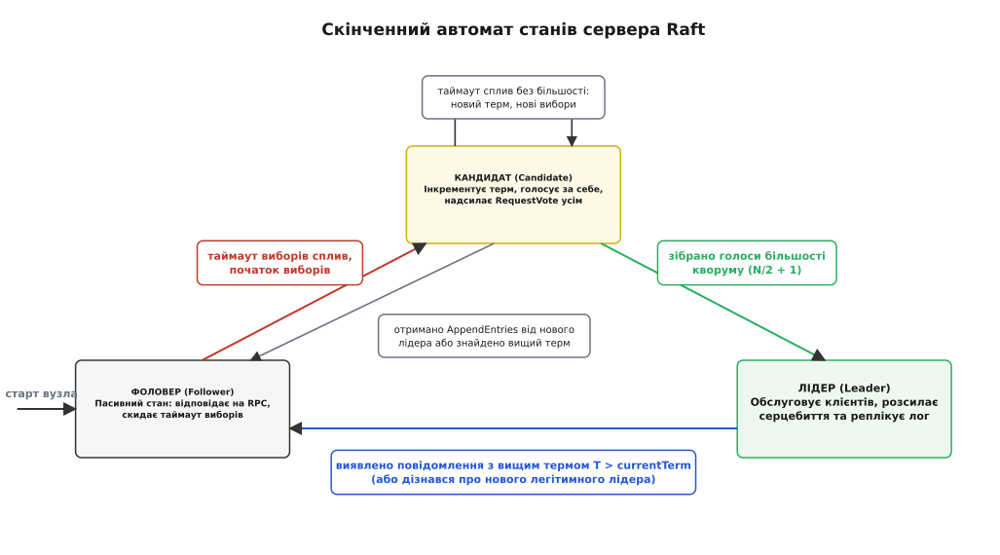
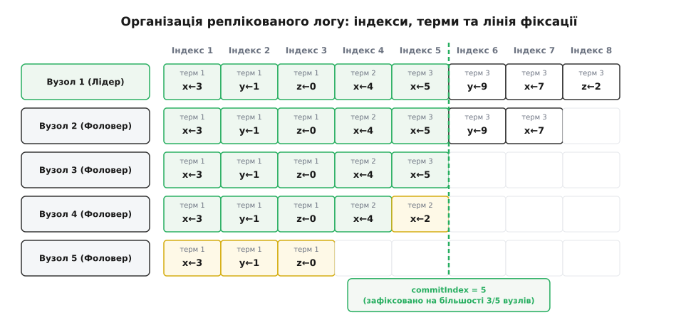
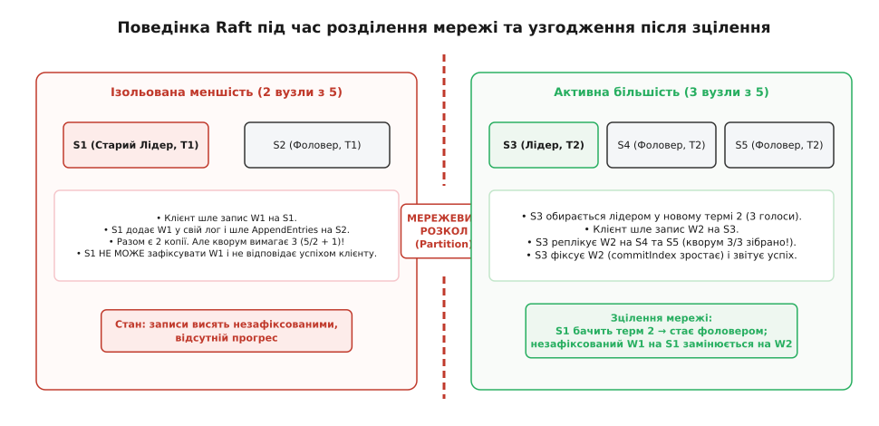

# Алгоритм консенсусу Raft: лідерство, реплікація логів та безпека

<preknowlist>
- [Задача консенсусу](book:algorithms/consensus-problem) — неможливість детермінованого консенсусу в асинхронній мережі з відмовами (теорема FLP) та концепція кворумної більшості.
- [Реплікація лідер-фоловер](book:programming/replication-leader-follower) — тиражування журналу змін від виділеного координатора до реплік.
- [Спектр консистентності](book:programming/consistency-models) — лінеаризовність як видимість операцій у точці їх виконання в реальному часі.
- [Failover і розщеплення мозку](book:programming/split-brain) — ризик виникнення двох некоординованих лідерів під час мережевого розділення.
</preknowlist>

Кластер із п'яти серверів керує балансами банківських рахунків або конфігурацією хмарної інфраструктури. Мережевий комутатор дає збій, розрізаючи дата-центр на дві ізольовані частини: два сервери в одній стійці та три в іншій. Клієнти одночасно надсилають запити на переказ коштів до обох половин. Якщо обидві частини приймуть запис незалежно, стан балансів непоправно розійдеться, породжуючи подвійні витрати. Якщо ж обидві частини заблокують роботу через страх помилки, вся система зупиниться, перекреслюючи доступність. Як групі ненадійних машин узгодити єдину, монотонну й незмінну послідовність операцій, гарантувати збереження підтверджених даних навіть у разі раптового падіння вузлів і водночас продовжувати роботу, поки жива хоча б проста більшість серверів?

Відповіддю на цей виклик є **консенсус** (лат. *consensus* — згода, одностайність) — фундаментальний механізм розподілених систем, що забезпечує узгодження стану між незалежними вузлами в умовах ненадійної мережі та асинхронних збоїв. Алгоритм **Raft**, розроблений у 2013–2014 роках Дієго Онгаро та Джоном Аустерхаутом у Стенфордському університеті, розв'язує задачу побудови реплікованого скінченного автомата (State Machine Replication), ставлячи в центр архітектури принцип декомпозиції та максимальної концептуальної зрозумілості. Про те, як складна криза розуміння класичного протоколу Paxos породила нову парадигму консенсусу, детально розповідає [історія створення алгоритму](book:algorithms/raft/hist-ongaro-ousterhout.md).

## Декомпозиція консенсусу: три незалежні підзадачі

Головна архітектурна знахідка Raft полягає в розділенні монолітної проблеми консенсусу на три автономні підзадачі, кожна з яких має замкнену логіку та власні інваріанти безпеки:

1. **Вибори лідера (Leader Election):** у системі завжди підтримується модель сильного лідера (Strong Leader). Усі зміни стану проходять виключно через виділений вузол. Коли чинний лідер виходить із ладу або втрачає зв'язок, кластер зобов'язаний обрати нового лідера швидко, однозначно й без ризику розколу влади.
2. **Реплікація логу (Log Replication):** лідер приймає команди від клієнтів, оформлює їх у вигляді послідовного журналу записів (Write-Ahead Log, WAL), тиражує на фоловерів через мережу й керує моментом остаточної фіксації (коміту). Потік даних строго односпрямований: фоловери ніколи не надсилають записи лідеру, вони лише підлаштовують свій лог під його стан.
3. **Безпека (Safety):** система підтримує суворий набір математичних обмежень, які гарантують, що якщо будь-який сервер застосував конкретний запис логу до свого скінченного автомата, жоден інший сервер ні за яких обставин не застосує інший запис на тій самій позиції.

> 🔧 **Навіщо це.** Завдяки моделі сильного лідера розробники розподілених сховищ позбавляються потреби розв'язувати конфлікти паралельних правок на кожній репліці. Застосунок взаємодіє з кластером так само просто, як із єдиним сервером: надсилає запит лідеру, чекає підтвердження більшості й отримує лінеаризовний результат.

---

## Ролі вузлів та шкала логічного часу: терми

У будь-який момент часу кожен сервер кластера перебуває в одній із трьох чітко визначених ролей:

- **Фоловер (Follower / Послідовник):** пасивний стан. Вузол не ініціює самостійних мережевих запитів, а лише відповідає на вхідні виклики від кандидатів та лідерів. Якщо фоловер тривалий час не отримує повідомлень від лідера, він вважає, що зв'язок втрачено, і переходить до стану кандидата.
- **Кандидат (Candidate):** активний стан виборів. Вузол інкрементує лічильник епохи, голосує за себе та запитує голоси в інших серверів кластера, намагаючись зібрати кворум більшості.
- **Лідер (Leader):** керівний координатор кластера. Обслуговує всі запити клієнтів, розсилає записи логу фоловерам і періодично надсилає порожні керуючі пакети — серцебиття (англ. *heartbeats*), щоб підтримувати свій авторитет і придушувати нові вибори.



*Скінченний автомат станів сервера Raft: переходи між ролями регулюються таймерами та номерами термів.*

### Логічний час: терми (Terms)

Фізичні настінні годинники на комп'ютерах схильні до дрейфу, стрибків і фазових розсинхронізацій через корекції NTP. Покладатися на фізичний час для впорядкування операцій у розподіленому консенсусі неприпустимо. Raft вводить дискретний логічний час, розділений на монотонно зростаючі епохи — **терми** (англ. *terms*, від лат. *terminus* — межа, термін), що позначаються цілими додатними числами `1, 2, 3...`.

Терми діють як логічні годинники Лампорта, виконуючи фундаментальну функцію виявлення застарілої інформації:
- Кожен терм починається з раунду виборів. Вибори завершуються або успішним обранням одного лідера (який керує кластером до кінця цього терму), або розколом голосів, після чого негайно розпочинається наступний терм із новими виборами.
- Кожне повідомлення в протоколі (запит або відповідь RPC) обов'язково містить номер терму відправника.
- Якщо сервер отримує повідомлення з термом `T > currentTerm`, він негайно оновлює свій локальний терм до `T` і скидає свій стан до ролі Фоловера (навіть якщо до цього був Лідером або Кандидатом).
- Якщо сервер отримує повідомлення з застарілим термом `T < currentTerm`, він відкидає такий запит або повертає відмову, змушуючи застарілий вузол підтягнути свій стан.

Повний перелік змінних стану сервера та формати викликів наведено у [специфікації інтерфейсу RPC](book:algorithms/raft/api-raft-rpc.md).

---

## Вибори лідера: рандомізовані таймери та кворумна більшість

Кластер стартує з усіма серверами в ролі фоловерів. Фоловер очікує регулярних повідомлень `AppendEntries` від чинного лідера. Якщо повідомлення не надходять упродовж інтервалу, що зветься **таймаутом виборів** (англ. *election timeout*), фоловер робить висновок, що лідер недоступний, і розпочинає вибори.

Процес виборів складається з таких послідовних кроків:
1. Вузол збільшує локальний номер терму: `currentTerm = currentTerm + 1`.
2. Змінює роль на Кандидата (`role = Candidate`).
3. Віддає власний голос за себе: `votedFor = selfId`.
4. Скидає таймаут виборів і розсилає повідомлення `RequestVote` усім іншим серверам кластера.

Кандидат залишається в цьому стані, поки не відбудеться одна з трьох подій:
- **Перемога на виборах:** кандидат отримує голоси від простої більшості серверів кластера (кворум `Q = ⌊N / 2⌋ + 1`, де `N` — загальна кількість вузлів). Отримавши більшість, кандидат негайно стає Лідером і розсилає порожні повідомлення `AppendEntries` усім вузлам, щоб позначити своє лідерство й запобігти новим виборам на інших серверах.
- **Поразка (поява іншого лідера):** під час очікування відповідей кандидат отримує `AppendEntries` від іншого сервера. Якщо терм у запиті `T ≥ currentTerm`, кандидат визнає легітимність нового лідера й повертається до стану фоловера. Якщо ж `T < currentTerm`, запис відкидається, і кандидат продовжує вибори.
- **Розкол голосів (Split Vote):** якщо кілька фоловерів одночасно стали кандидатами, голоси кластера можуть розділитися так, що жоден кандидат не набере більшості (наприклад, у кластері з 4 вузлів двоє кандидатів набрали по 2 голоси). У такому разі таймаут виборів спливає без переможця. Кандидат починає новий раунд: знову інкрементує терм і повторює розсилку `RequestVote`.

### Запобігання розколу голосів: рандомізовані таймаути

Якби всі сервери мали однаковий таймаут виборів, вони одночасно переходили б у стан кандидатів і ділили голоси нескінченно. Raft елегантно розв'язує проблему розколу голосів за допомогою **рандомізації таймаутів**:
- Таймаут виборів кожного вузла обирається псевдовипадково з наперед визначеного діапазону, зазвичай від 150 до 300 мілісекунд (або 10–20 інтервалів серцебиття `T_heartbeat`).
- Це гарантує, що в абсолютній більшості випадків таймаут спливе спершу в **одного** конкретного сервера. Цей сервер встигне ініціювати вибори, розіслати `RequestVote` і зібрати голоси більшості до того, як його сусіди встигнуть прокинутися.

### Оптимізація Pre-Vote: захист від деструктивних кандидатів

У розподілених мережах поширеною є ситуація, коли вузол тимчасово втрачає зв'язок із рештою кластера через локальний збій мережевого інтерфейсу. Будучи ізольованим, цей вузол не отримує серцебиття, постійно запускає вибори й штучно накручує свій `currentTerm` до великих значень (наприклад, від терму 5 до терму 25). Коли зв'язок відновлюється, цей вузол надсилає `RequestVote` із завищеним термом 25, змушуючи чинного легітимного лідера терму 5 негайно скласти повноваження й перейти в роль фоловера, що спричиняє непотрібну паузу в обслуговуванні клієнтів.

Для захисту від таких деструктивних виборів у промислових реалізаціях Raft застосовують фазу **Pre-Vote**:
- Перед тим як інкрементувати свій справжній `currentTerm`, кандидат розсилає попередній запит `PreVote` із гіпотетичним термом `currentTerm + 1`.
- Інші вузли погоджуються надати попередній голос лише за двох умов: лог кандидата достатньо свіжий, і вузол-виборець сам **не отримував** серцебиття від чинного лідера впродовж останнього таймауту виборів.
- Якщо кандидат збирає кворум попередніх голосів, він переконується, що лідер дійсно недоступний більшості, і лише тоді інкрементує реальний `currentTerm` та розпочинає повноцінні вибори.

---

## Реплікація логу: механізм досягнення узгодженості

Після обрання лідер бере на себе монопольне право керування журналом операцій. Журнал (лог) складається з послідовності комірок, кожна з яких має монотонний числовий індекс `1, 2, 3...` та зберігає номер терму, під час якого запис було створено, разом із тілом команди для скінченного автомата.



*Організація реплікованого логу: записи складаються з номерів термів та команд; commitIndex просувається за правилом більшості.*

Життєвий цикл клієнтської операції розгортається за чітким сценарієм:
1. Клієнт надсилає команду лідеру (якщо клієнт звертається до фоловера, той або перенаправляє запит на лідера, або повертає його мережеву адресу).
2. Лідер записує команду в кінець свого локального журналу як новий елемент.
3. Лідер паралельно розсилає повідомлення `AppendEntries` усім фоловерам.
4. Фоловери додають отриманий запис у свої локальні журнали й надсилають лідеру підтвердження успіху (`success = true`).
5. Коли лідер отримує підтвердження від більшості серверів кластера (наприклад, від 3 з 5 вузлів), запис вважається **зафіксованим** (англ. *committed*).
6. Лідер застосовує зафіксовану команду до свого локального скінченного автомата (State Machine) і повертає результат клієнту.
7. Про новий рівень фіксації (`leaderCommit`) лідер повідомляє фоловерів у наступних повідомленнях `AppendEntries`. Дізнавшись про коміт, фоловери застосовують відповідні команди до своїх локальних автоматів.

### Інваріант відповідності логів (Log Matching Property)

Механізм реплікації Raft спирається на інваріант, що гарантує цілісність розподіленої історії:

> **Властивість Log Matching:**
> 1. Якщо два записи в різних журналах мають однаковий індекс та однаковий терм, то вони містять ідентичну команду.
> 2. Якщо два записи в різних журналах мають однаковий індекс та однаковий терм, то ці журнали є абсолютно ідентичними на всіх попередніх позиціях від `1` до `index - 1`.

Перша частина властивості випливає з того, що лідер створює щонайбільше один запис із певним індексом у межах свого терму, а записи лідера ніколи не модифікуються.

Друга частина гарантується простою індуктивною перевіркою узгодженості в RPC `AppendEntries`. Щоразу, коли лідер надсилає нові записи, він обов'язково вказує індекс і терм запису, що *безпосередньо передує* новим елементам (`prevLogIndex`, `prevLogTerm`). Якщо фоловер не знаходить у власному лозі запису з індексом `prevLogIndex` та термом `prevLogTerm`, він категорично відхиляє запит (`success = false`).

### Узгодження розбіжних логів

Під час аварій лідерів або затяжних мережевих розривів журнали фоловерів можуть містити застарілі, незафіксовані або зайві записи, що суперечать логу нового лідера. У Raft лідер ніколи не запитує чужих логів і не підлаштовується під підлеглих. Натомість лідер примусово змушує фоловерів дублювати його власний журнал:

- Для кожного фоловера лідер підтримує покажчик `nextIndex` (індекс наступного запису, який треба надіслати цьому вузлу).
- Після обрання лідер ініціалізує `nextIndex` значенням `leader.lastLogIndex + 1`.
- Якщо фоловер відхиляє `AppendEntries` через невідповідність `prevLogIndex` / `prevLogTerm`, лідер декрементує `nextIndex` і повторює виклик.
- Рано чи пізно `nextIndex` дійде до точки, де логи лідера й фоловера збігаються. Щойно фоловер поверне `success = true`, усі наступні конфліктні записи в лозі фоловера перезаписуються записами лідера.

Детальніше про покрокову реалізацію цієї логіки та оптимізацію швидкого пошуку спільних точок читайте у [практичній вставці з кодом C та C++](book:algorithms/raft/proj-raft-node.md).

---

## Головний замок безпеки: обмеження на виборах

Чому новий лідер гарантовано містить усі раніше зафіксовані записи? У багатьох алгоритмах консенсусу (зокрема класичному Viewstamped Replication) новообраний координатор змушений підтягувати зафіксовані записи від інших реплік під час спеціальної фази відновлення. Raft обирає значно простіший шлях: **вузол не може стати лідером, якщо його лог не містить усіх зафіксованих записів**.

Це досягається завдяки правилу **обмеження виборів (Election Restriction)**:
Коли кандидат надсилає `RequestVote`, він вказує характеристики свого останнього запису: `lastLogIndex` та `lastLogTerm`. Сервер-виборець відхиляє голос, якщо лог кандидата є *менш актуальним*, ніж його власний лог:

```
Лог кандидата актуальніший або рівний логу виборця тоді й лише тоді, коли:
1. lastLogTerm(кандидат) > lastLogTerm(виборець), АБО
2. lastLogTerm(кандидат) == lastLogTerm(виборець) І lastLogIndex(кандидат) ≥ lastLogIndex(виборець).
```

Математична гарантія бездоганна:
1. Щоб запис став зафіксованим, його має зберегти більшість вузлів кластера (`Q_commit`).
2. Щоб стати лідером, кандидат повинен отримати голоси більшості вузлів кластера (`Q_vote`).
3. За принципом перетину кворумів:
   ```
   |Q_commit ∩ Q_vote| ≥ 1
   ```
4. У будь-якому кворумі виборців обов'язково є щонайменше один сервер `v`, який належав до кворуму фіксації `Q_commit`.
5. Оскільки сервер `v` містить зафіксований запис, його лог за термом або довжиною буде не менш свіжим за будь-якого кандидата, який цього запису не має.
6. Отже, сервер `v` відмовиться голосувати за кандидата без зафіксованого запису. Кандидат із діркою в лозі не зможе зібрати більшість і ніколи не стане лідером!

Формальне індуктивне доведення цієї теореми та супутніх інваріантів винесено в [математичний розділ безпеки](book:algorithms/raft/math-safety-proof.md).

---

## Аномалія фіксації записів минулих термів (Рис. 8 Онгаро)

Під час проєктування Raft було виявлено надзвичайно тонку й небезпечну пастку, яку автори висвітлили як «Figure 8» у своїй канонічній праці. Вона стосується того, як лідер повинен фіксувати записи, створені *попередніми* лідерами.

Уявімо сценарій, зображений на діаграмі:


*Аномалія Онгаро (Рис. 8): запис попереднього терму не можна вважати зафіксованим лише за підрахунком копій; він фіксується непрямо разом із записом поточного терму лідера.*

**Сценарій розгортання аномалії:**
1. У термі 2 сервер S1 є лідером і записує команду на позицію індексу 2, встигаючи розіслати її на S2. Потім S1 падає.
2. Сервер S5 обирається лідером у термі 3 за голосами S3, S4 та власного (S5). Він записує іншу команду на індекс 2 у термі 3, після чого негайно падає.
3. Сервер S1 прокидається й обирається лідером у термі 4 за голосами S1, S2, S3. Він продовжує реплікацію свого старого запису з термом 2 на сервер S3. Тепер запис із термом 2 присутній на більшості серверів (S1, S2, S3)!
4. **Критичний момент:** якщо S1 наївно вважатиме цей запис зафіксованим лише тому, що він лежить на більшості машин, система опиниться на межі катастрофи:
   - S1 знову падає.
   - Сервер S5 прокидається й балотується в термі 5. Він отримує голоси від S2, S3, S4 та S5 (оскільки його останній запис має терм 3, що вище за терм 2 на вузлах S2 і S3).
   - Ставши лідером, S5 розсилає свій запис терму 3 і **безповоротно перетирає** «зафіксований» запис терму 2 на всіх вузлах!

### Залізне правило фіксації Raft (§5.4.2)

Щоб унеможливити цю катастрофу, Онгаро та Аустерхаут сформулювали суворе правило:

> **Правило фіксації (§5.4.2):**
> Лідер ніколи не фіксує запис логу з **попереднього терму** напряму шляхом підрахунку кількості реплік. Лідер просуває `commitIndex` лише для записів **свого поточного терму**.

Щойно лідер терму 4 запише в лог хоча б один новий елемент свого власного терму (`term = 4`) і реплікує його на більшість вузлів, цей новий запис фіксується. І тоді, згідно з інваріантом Log Matching, **усі попередні записи (зокрема старий запис терму 2) автоматично й непрямо фіксуються разом із ним**. Після цього вузол S5 уже не зможе перемогти на виборах, бо сервери з більшості бачитимуть терм 4, який перевершує його терм 3.

---

## Мережеві розділення та динаміка кластера

Розглянемо, як Raft поводиться в умовах розриву мережі (Network Partition), коли кластер із 5 серверів розпадається на дві підгрупи: меншість із 2 вузлів `{S1, S2}` та більшість із 3 вузлів `{S3, S4, S5}`.



*Поведінка кластера під час розділення мережі: більшість зберігає доступність і коректність, а після зцілення застарілі гілки автоматично перезаписуються.*

1. **Ізольована меншість:** Сервер S1 залишається старим лідером у термі 1 для підгрупи `{S1, S2}`. Клієнт шле йому команду `W1`. S1 додає `W1` у лог і шле `AppendEntries` на S2. Але кворум вимагає `⌊5/2⌋ + 1 = 3` підтвердження. S1 має лише 2 копії. Він не може зафіксувати `W1` і тримає клієнта в очікуванні (або повертає помилку таймауту).
2. **Активна більшість:** Вузли `{S3, S4, S5}` фіксують відсутність серцебиття від S1. Вузол S3 першим виходить за таймаутом, переходить у терм 2 і збирає 3 голоси з 3 доступних. S3 стає легітимним лідером терму 2. Клієнт надсилає запис `W2`. S3 успішно реплікує його на S4 та S5, набирає кворум 3/3, фіксує `W2` і повертає клієнту успішну відповідь.
3. **Зцілення мережі (Heal):** Зв'язок між стійками відновлюється. S3 надсилає `AppendEntries` із термом 2 на сервер S1. Побачивши `term = 2 > 1`, старий лідер S1 негайно капітулює, переходить у роль фоловера й оновлює свій терм до 2. Потім S3 виявляє невідповідність незафіксованого запису `W1` у лозі S1, змушує S1 відкотити його й замінити на зафіксований запис `W2`.

Система відновила єдиний узгоджений стан без втрати підтверджених даних.

---

## Зміна конфігурації кластера (Cluster Membership Changes)

У процесі експлуатації виникає потреба додавати нові сервери або виводити з ладу старі. Наївна зміна конфігурації шляхом одномоментного оновлення конфігураційного файлу на всіх вузлах є фатальною помилкою: оскільки оновлення доходить до різних машин у різний час, кластер неминуче розділиться на дві незалежні більшості (наприклад, 3 вузли за старою конфігурацією з 5 машин і 2 вузли за новою конфігурацією з 3 машин), обравши двох одночасних лідерів.

Raft розв'язує цю задачу двома способами:

### 1. Спільний консенсус (Joint Consensus)
Конфігурація оформлюється як спеціальний запис у журналі. Перехід відбувається у два етапи через проміжну спільну конфігурацію `C_{old,new}`:
1. Лідер записує в лог і реплікує конфігурацію `C_{old,new}`.
2. У стані `C_{old,new}` будь-яке рішення (вибори лідера або фіксація запису) вимагає **двох незалежних більшостей одночасно**: більшості від старої конфігурації `C_old` та більшості від нової конфігурації `C_new`.
3. Коли запис `C_{old,new}` зафіксовано на обох більшостях, лідер створює й фіксує остаточний запис нової конфігурації `C_new`.

### 2. Одновузлова зміна (Single-Server Changes)
Спрощений підхід, доведений Онгаро у 2015 році: якщо додавати або видаляти рівно **по одному серверу за раз** (`C_n → C_{n+1}` або `C_n → C_{n-1}`), старий і новий кворуми математично завжди перетинаються щонайменше на одному сервері. Тому одночасне формування двох незалежних більшостей є неможливим, і проміжний спільний консенсус не потрібен.

---

## Практичні механізми: знімки стану та лінеаризовне читання

Для роботи в реальних виробничих умовах базовий алгоритм доповнюється двома інженерними механізмами.

### 1. Стиснення логу через знімки стану (Log Compaction / Snapshots)
У довгоживучих системах лог не може рости нескінченно, інакше він вичерпає дисковий простір, а відновлення після перезапуску триватиме годинами. 

Raft використовує концепцію незалежних знімків стану (Snapshots):
- Кожен вузол періодично зберігає поточний стан свого скінченного автомата на диск (наприклад, стан бази даних у форматі ключ-значення) до певного індексу `lastIncludedIndex` та терму `lastIncludedTerm`.
- Усі записи логу до `lastIncludedIndex` безпечно видаляються з пам'яті та диска.
- Якщо якийсь фоловер сильно відстав від лідера (наприклад, був вимкнений упродовж тижня), лідер не зможе передати йому видалені записи через звичайний `AppendEntries`. У такому разі лідер надсилає спеціальний виклик `InstallSnapshot`, передаючи готовий файл знімка частинами, після чого фоловер миттєво підтягує свій автомат до актуального стану.

### 2. Лінеаризовне читання без запису в лог (Linearizable Reads)
Якщо операції запису зобов'язані проходити повний консенсус через журнал, то для операцій читання (Read-Only) запис у лог є зайвим оверхедом. Проте просте локальне читання з лідера небезпечне: під час розриву мережі старий лідер у меншості може не знати про обрання нового лідера й віддати застарілі дані (Stale Read).

Raft пропонує два методи безпечного лінеаризовного читання без модифікації логу:
1. **ReadIndex Protocol:** Лідер зберігає свій поточний `commitIndex` як `readIndex`. Потім він розсилає порожнє серцебиття фоловерам. Якщо більшість підтвердила серцебиття, лідер переконується, що він досі є чинним лідером. Він дочікується, поки його скінченний автомат застосує всі записи до `readIndex`, і безпечно віддає результат клієнту.
2. **Lease Reads (Оренда лідерства):** Лідер отримує від фоловерів часову лізу (англ. *lease*), упродовж якої фоловери гарантують, що не розпочинатимуть нові вибори. Поки ліза діє, лідер відповідає на читання локально без жодних мережевих раундів, забезпечуючи мінімальну затримку (латентність).

### 3. Сесії клієнтів та захист від дублювання (Idempotency)
Якщо лідер успішно зафіксував команду в лозі, застосував її до автомата, але впав до відправки відповіді клієнту, клієнт надішле повторну спробу (retry) новому лідеру. Щоб уникнути повторного виконання недеструктивних команд (наприклад, подвійного списання коштів):
- Клієнт реєструє унікальний ідентифікатор сесії (`clientId`) через Raft-лог;
- Кожен запит містить монотонний номер послідовності (`sequenceNumber`);
- Скінченний автомат зберігає таблицю останніх відповідей для кожного клієнта: якщо номер послідовності вже виконувався, автомат повертає збережений результат без повторного виконання команди.

---

## Висновок: чому Raft переміг

Raft довів, що складність не є обов'язковим супутником надійності. Розбивши важку задачу консенсусу на зрозумілі складові — вибори через рандомізовані таймери, строгу односпрямовану реплікацію журналу та кворумні інваріанти безпеки — автори створили алгоритм, який легко верифікувати, тестувати та втілювати в коді. Завдяки цій ясності Raft став фундаментом сучасної хмарної інфраструктури, керуючи координацією в Kubernetes (etcd), сховищах метаданих (Consul), масштабованих базах даних (CockroachDB, TiKV) та брокерах повідомлень нового покоління (Kafka KRaft).
