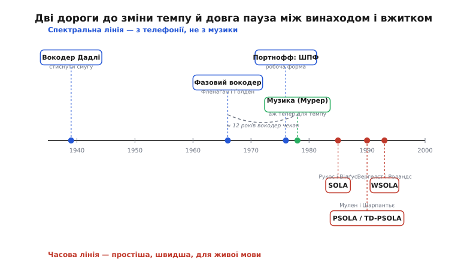

# 📜 Від телефонного стиснення до розтягнутого звуку

Історія зміни темпу звуку — це історія непорозуміння, що виявилося щасливим. Найпотужніший інструмент для цього завдання, **фазовий вокодер**, придумали за десятиліття до того, як хтось узагалі захотів розтягувати звук. Придумали не музиканти й не кінематографісти, а телефонні інженери, яким ішлося про річ геть приземлену: **як заштовхати людський голос у вужчий дріт**. Те, що ця сама машина вміє непомітно сповільнювати мову й гнути час, з'ясувалося пізніше, майже випадково. А ще пізніше стало ясно, що для живої мови в реальному часі вона надто дорога — і її потіснили методи простіші, грубіші й у сто разів швидші. Розберімо цю дугу від початку: що бентежило, хто це розплутував і чому переможцем вийшов не найрозумніший метод, а найдешевший.

*Дві дороги до однієї мети й довга пауза посередині. Угорі — спектральна лінія: вокодер народжено в телефонії 1930-х, фазовий вокодер — 1966-го, але для музики й темпу його оживили аж наприкінці 1970-х. Унизу — часова лінія, що прийшла пізніше (1985–1993) і перемогла простотою там, де важать швидкість і жива мова.*

## Смуга, якої завжди бракувало

Щоб зрозуміти, звідки взявся вокодер, треба відчути справжній головний біль телефонії середини XX століття — **брак смуги пропускання**. Один голосовий канал забирає близько 3 кілогерців частотної смуги. Коли треба протягти сотні розмов одним трансатлантичним кабелем чи одним радіоканалом, ці кілогерци складаються в дефіцитний, дорогий ресурс. Кожен зекономлений герц — це або ще одна розмова в тому самому кабелі, або дешевша лінія. Тож питання «чи можна передати той самий голос, витративши менше смуги?» коштувало цілком реальних грошей і не сходило зі столу інженерів.

Ключове прозріння, з якого все почалося, належить **Гомерові Дадлі** (Homer Dudley, американець) з Bell Telephone Laboratories. Наприкінці 1920-х він поставив запитання, що звучить майже філософськи: **що саме в голосі несе зміст, а що — надлишок?** Його відповідь виявилася напрочуд глибокою. Голос породжується так: зв'язки (або шум видиху) дають сире «джерело» звуку — гудіння певної висоти або шипіння, — а рот, язик і горло, наче керована труба, надають цьому джерелу форми, вирізаючи в його спектрі западини й горби. Мова — це не сам звук зв'язок, а **швидкі зміни форми цієї труби**. І змінюється ця форма повільно, куди повільніше за саму звукову хвилю: губи й язик рухаються з частотою десятків разів на секунду, а не тисяч.

Звідси випливав зухвалий висновок. Якщо форма голосового тракту міняється повільно, то **описати** її можна кількома повільними сигналами — по одному на кожну смугу частот, що каже лише «скільки зараз енергії в цій смузі». А сам звук на приймальному кінці можна не передавати зовсім — його **наново збудувати** з простого генератора гудіння чи шипіння, «профільтрувавши» його за цими повільними описами. Передаємо не голос, а **інструкцію, як його відтворити**. Оскільки інструкція міняється повільно, вона займає в рази вужчу смугу, ніж сам голос. Цю машину Дадлі й назвав **вокодером** (*vocoder*, від *voice coder* — «кодувальник голосу»): аналізатор розкладав вхідний голос на кілька повільних сигналів рівня енергії по смугах, а синтезатор складав із них голос назад.

> 🔧 **Навіщо це.** Тут закладено ідею, що житиме в кожному нащадку вокодера, аж до фазового: **звук можна розібрати на «що є в спектрі» й «складати назад із частин»**. Зміна темпу без зміни тону — пряме дитя цієї ідеї: якщо голос уже розкладено на повільні описи по смугах, то ці описи можна **прокручувати повільніше або швидше**, лишаючи самі частоти на місці. Дадлі про темп не думав — його цікавила лише смуга, — але саме він дав інструмент, яким через півстоліття гнутимуть час.

Дадлі не спинився на теорії. 1939 року на Всесвітній виставці в Нью-Йорку Bell Labs показали **Водер** (*Voder*, Voice Operation Demonstrator) — синтезатор, споріднений із вокодером, на якому навчена операторка, рухаючи клавіші й педаль, змушувала машину **говорити** живою (хоч і моторошною) мовою. Патенти Дадлі — на «Систему передавання сигналів» (US 2151091, березень 1939) і на «Систему штучного породження голосу» (US 2121142, 1938) — усталено закріплюють авторство. А в роки війни його вокодер став серцем системи шифрованого зв'язку **SIGSALY** (1943), якою Черчилль і Рузвельт вели захищені розмови: голос розкладали на повільні описи, ті шифрували, — і навіть перехопивши сигнал, ворог чув лише шум. Мотив від початку й до кінця той самий — **скупість смуги та безпека каналу**, ні слова про музику чи темп.

## Фаза, яку викинули дарма

Класичний вокодер Дадлі мав ваду, і саме вона привела до фазового вокодера. Аналізатор Дадлі міряв у кожній смузі лише **скільки** там енергії — гучність, обвідну. А про **фазу** коливання в смузі — на якому саме куті свого циклу перебуває хвиля цієї частоти — забував начисто; синтезатор запускав свій генератор із випадковою фазою. Для розбірливості мови цього вистачало, та звук виходив характерно «роботизований», механічний. Причина — саме у викинутій фазі: коли складові частоти складають назад із неправильними фазовими зсувами, форма хвилі відновлюється не та, і вухо чує підробку.

Тут на сцену виходять **Джеймс Фленаґан** (James L. Flanagan, 1925–2015, американець) і **Роджер Ґолден** (R. M. Golden) з тих-таки Bell Labs. Фленаґан на той час очолював дослідження мови й акустики в Bell — постать першого ряду в цифровому опрацюванні звуку (згодом лауреат премії Марконі 1992 року й Національної медалі науки США). Ґолден був фахівцем із цифрових фільтрів — саме те знання, якого бракувало, щоб узятися за фазу строго. 1966 року вони опублікували працю, чия назва стала назвою цілого класу методів: **«Phase Vocoder»** (*Bell System Technical Journal*, том 45, с. 1493–1509, листопад 1966). Це усталений факт за первинною публікацією; авторство суто американське, жодних приводів для інших обрамлень.

Їхня думка проста й потужна: **не викидаймо фазу — стежмо за нею**. У кожній вузькій смузі частот вони описували сигнал двома повільними величинами: обвідною (як і Дадлі) **та** швидкістю зміни фази — тобто миттєвою частотою всередині смуги. Маючи і те, і те, синтезатор міг відновити не лише «скільки й де» енергії, а й **правильну форму хвилі**, бо знав, як фаза кожної складової рухалася в часі. Голос виходив куди природніший за роботизований звук старого вокодера.

Але — і це головне для нашої історії — **мета в них лишалася телефонною**. Стаття прямо каже: цей спосіб кодування дає **економію смуги передавання**, а заразом — **засіб стискати й розтягувати мову в часі**. Отже, здатність гнути час автори бачили! Вона випливала з їхньої математики майже задарма: якщо ти вже описав звук повільними обвідними й фазовими траєкторіями по смугах, то, **зчитуючи ці описи в іншому темпі**, дістаєш ту саму мову коротшою чи довшою, а частоти лишаєш на місці — тон не зрушиться. Та в контексті 1966 року це була лише цікава побічна властивість системи стиснення, а не інструмент для музикантів. Обчислювати таке в реальному часі тоді не було на чому: усе моделювали на великому цифровому комп'ютері, повільно, у лабораторії. Ідея гнути час лежала в статті, як зерно, і чекала ґрунту.

> 🔧 **Навіщо це.** Ось точка, де народилася сама можливість зміни темпу без зміни тону — і народилася **не як ціль, а як наслідок**. Фленаґан і Ґолден не будували інструмент розтягування звуку; вони будували економний телефон і **помітили**, що їхня математика вміє й це. Урок на майбутнє: найпотужніші прийоми часто приходять збоку, з чужої задачі, — і треба лише впізнати, що вони вміють більше, ніж від них хотіли.

## Дванадцять років у шухляді

Далі стається найцікавіше — **нічого**. Фазовий вокодер описано 1966-го, а перетворювати ним звук для музики й темпу починають аж наприкінці 1970-х. Чому пауза? Бо між гарною ідеєю та робочим інструментом лежала прірва обчислень, яку не було чим перекрити.

Оригінальний фазовий вокодер рахував енергію й фазу в кожній смузі через **банк смугових фільтрів** — по фільтру на смугу, десятки фільтрів. У цифровому вигляді 1960-х це коштувало страшенно дорого: кожен фільтр — це купа множень на кожен відлік, а відліків тисячі на секунду. Робити таке для музичного твору, ще й у прийнятний час, не було практичної змоги.

Двері відчинив не новий погляд на звук, а **новий спосіб рахувати** — швидке перетворення Фур'є.

> 🔧 **Навіщо це.** [ШПФ](topic:algorithms/fft) — швидкий алгоритм, що за раз розкладає шматок сигналу на всі його складові частоти (з якою силою й фазою присутня кожна). Він робить за один економний прохід те, на що банк окремих фільтрів витрачав десятки множень на кожну смугу. Саме дешевизна ШПФ і перетворила фазовий вокодер із лабораторної цікавинки на робочий інструмент: один прохід ШПФ дає одразу і обвідні, і фази всіх смуг.

1976 року **Майкл Портнофф** (Michael R. Portnoff) показав, як переписати фазовий вокодер на мову короткочасного перетворення Фур'є й рахувати його **швидким перетворенням Фур'є**. Це усталений факт (його праця про реалізацію цифрового фазового вокодера через ШПФ — канонічне посилання в галузі). Раптом те саме, що ледь повзло на банку фільтрів, стало обчислюваним: ріж сигнал на кадри, кинь на кожен ШПФ, дістань обвідні й фази всіх частот одним махом. Портнофф не змінив ідею Фленаґана й Ґолдена — він **зробив її дешевою**, а дешевизна — це те, що перетворює теорему на техніку.

Аж коли рахувати стало можливо, фазовий вокодер вийшов зі своєї телефонної шухляди й потрапив до рук людей, яким ішлося про звук заради звуку. Наприкінці 1970-х **Джеймс Мурер** (James A. Moorer) у Стенфорді застосував його до **комп'ютерної музики**: його праця «The Use of the Phase Vocoder in Computer Music Applications» (Journal of the Audio Engineering Society, 1978) відкрила для музикантів дві операції, що й досі є серцем справи — **зміну тривалості без зміни висоти й зсув висоти без зміни тривалості**. Згодом **Марк Долсон** (Mark Dolson) своїми оглядами й підручниками зробив метод широко зрозумілим. Отут, і лише отут — через **дванадцять із гаком років** після статті 1966-го — фазовий вокодер нарешті став тим, чим ми його сьогодні знаємо: інструментом гнути час і тон. Ідея з телефонії дочекалася свого ґрунту.

## Часова контрреволюція: коли простіше означає краще

Здавалося б, історія завершена: маємо потужний спектральний метод, він гне час прекрасно, — питання закрито. Але тут відкривається другий фронт, і саме на ньому вирішується доля практичних систем. Фазовий вокодер, при всій красі, **дорогий і примхливий**. На кожен кадр він робить перетворення туди й назад, а між ними — найтонше — мусить **дбайливо лагодити фазу** кожної частоти, щоб чисті тони не «розмазалися» в характерний примарний, «підводний» призвук. Це багато обчислень і багато мороки. А ще спектральний метод погано терпить **різкі удари** — клацання, атаку барабана, вибухові приголосні: розмазуючи їх по кадру, він притупляє різкість.

І тут постає інша спільнота — інженери **опрацювання мови**, — з іншими потребами. Їм не треба студійної досконалості на музиці; їм треба **швидко, дешево, у реальному часі й на живій мові**: пришвидшити начитку, підігнати темп, залатати діру від загубленого пакета. Для них важить не спектральна витонченість, а те, чи влізе алгоритм у скромний процесор і чи впорається він потоково. І вони пішли зовсім іншою дорогою — **прямо по формі хвилі, взагалі не заходячи в спектр**.

Першу ластівку цієї дороги запустили 1985 року **Сулейман Рукос** (Salim Roucos) і **Александер Вілґус** (Alexander M. Wilgus) працею «High Quality Time-Scale Modification for Speech» (Proceedings of ICASSP 1985, с. 493–496). Їхній метод — **SOLA** (*Synchronized Overlap-Add*, синхронізоване перекриття-додавання). Думка проста до зухвалості: не розкладай нічого на частоти. Ріж сигнал на перекривні шматки, укладай їх у вихід із іншим кроком (щоб вийшло довше чи коротше), а місце склейки щоразу **підсовуй туди, де сусідні шматки найкраще збігаються за формою хвилі**. Збіг шукали за взаємною кореляцією — простим підрахунком суми добутків. Жодних перетворень Фур'є, жодного лагодження фази — самі додавання й множення прямо по відліках. Дешево настільки, що це рахував будь-який тодішній сигнальний процесор, і якість на мові виходила напрочуд добра.

Далі дорогу поглибили французи. 1990 року **Ерік Мулен** (Éric Moulines) і **Франсіс Шарпантьє** (Francis Charpentier) з CNET (дослідного центру французького телекому, Ланніон) опублікували «Pitch-synchronous waveform processing techniques for text-to-speech synthesis using diphones» (Speech Communication, том 9, с. 453–467). Їхній метод — **PSOLA** (*Pitch-Synchronous Overlap-Add*), із часовим варіантом **TD-PSOLA**. Ключова їхня ідея — **прив'язати нарізку до самого голосу**: різати не де попало, а **синхронно з періодом основного тону**, ставлячи по одному зерну на кожен цикл голосових зв'язок. Тоді, додаючи або прибираючи цілі періоди-зерна, можна не лише гнути час, а й **керувати висотою та інтонацією** — а це рівно те, чого потребує синтез мови з «цеглинок»-дифонів, щоб склеєні шматки звучали як жива, інтонована фраза. PSOLA стала на роки робочою кобилою мовних синтезаторів. (Авторство французьке, факти усталені за первинною публікацією.)

І нарешті 1993 року бельгійці **Вернер Вергелст** (Werner Verhelst) і **Марк Роландс** (Marc Roelands) з Vrije Universiteit Brussel замкнули цю лінію методом **WSOLA** (*Waveform Similarity Overlap-Add*, перекриття-додавання за подібністю форми хвилі), у праці «An Overlap-Add Technique Based on Waveform Similarity (WSOLA) for High Quality Time-Scale Modification of Speech» (Proceedings of ICASSP 1993, с. 554–557). WSOLA взяла найкраще від попередників і зробила метод **надійним для потокової роботи з довільним, навіть плавно змінним, коефіцієнтом темпу**: беруть уже викладений хвіст виходу за шаблон і в невеликому вікні пошуку навколо ідеальної точки знаходять на вході той шматок, що найкраще **продовжує** цей хвіст без зламу фази. Стик виходить непомітним не тому, що фазу полагодили обчисленнями, а тому, що місце склейки **навмисне** поставили туди, де хвиля продовжується сама собою. Ця робота стала стандартним посиланням для зміни темпу мови, і саме WSOLA сьогодні стоїть у програвачах змінної швидкості й у системах зв'язку реального часу. (Авторство бельгійське, факти усталені.)

## Чому переміг не найрозумніший, а найдешевший

Тепер видно всю дугу, і в ній — головний урок. Фазовий вокодер **розумніший**: він працює з самою фізикою спектра, дає найкращу якість на музиці й тягучих звуках, уміє незалежно гнути й час, і тон, і навіть тембр. Часові методи — SOLA, PSOLA, WSOLA — **грубіші**: вони взагалі не питають, з яких частот складено звук, а просто спритно переставляють і зшивають шматки хвилі. І все ж там, де йдеться про **швидкість і живу мову**, перемогли саме грубі. Чому?

Причина — ланцюжок цілком інженерний. **По-перше, ціна обчислень.** Вокодер робить два перетворення Фур'є на кожен кадр плюс морочливе лагодження фази; часовий метод — лише пошук найкращого зсуву за кореляцією, самі додавання й множення. На скромному процесорі, у навушнику чи в дешевому пристрої зв'язку, ця різниця — між «працює легко» і «не влазить». **По-друге, затримка.** Жива розмова не терпить очікування: не можна набрати великий буфер звуку наперед, бо кожна зайва десята частка секунди затримки псує діалог. Часові методи працюють майже миттєво, дивлячись лише на щойно почуте; спектральні природно тягнуть за собою більшу затримку через свої кадри й перетворення. **По-третє, різкі звуки.** У мові повно вибухових приголосних і різких переходів, і саме на них спектральний метод розмазує та притуплює, а часовий, що переставляє шматки хвилі як є, зберігає різкість краще.

Складіть це разом — і висновок неминучий: для **музичної студії**, де є час, є потужний комп'ютер і цінується кожен нюанс спектра, кращий фазовий вокодер; для **живої мови в реальному часі**, де мало обчислень, нуль терпіння до затримки й повно різких звуків, кращі прості часові методи. Це не «один переміг усіх», а **дві ніші, у кожній свій володар**. Але оскільки практичних систем із живою мовою — телефонія, голос через мережу, диктофони, приховування втрат пакетів — незрівнянно більше, ніж студійних, то й на слуху в інженера сьогодні саме часові методи, передусім WSOLA.

І в цьому — тиха іронія всієї історії. Задача народилася в телефонії: Дадлі стискав голос для дроту, Фленаґан і Ґолден додали фазу заради того самого дроту. Півстоліття потому інструмент, вирощений телефонією, повернувся **назад у телефонію** — гнути час у голосі, що біжить через мережу, латати діри від загублених пакетів, — але вже не через розумний спектральний вокодер, а через прості й швидкі часові методи, які прийшли пізніше й виявилися рівно тим, що треба скромному процесору на кінці лінії. Найпотужніша ідея дала початок, а виграла — найдешевша. Так у техніці буває частіше, ніж хочеться визнавати: перемагає не той метод, що найкраще розв'язує задачу в ідеалі, а той, що **найдешевше розв'язує її там, де вона справді стоїть**.
