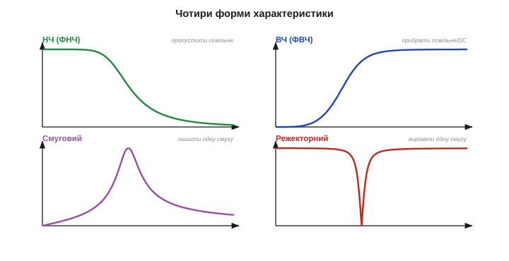
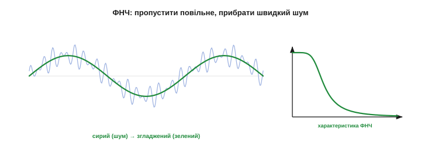
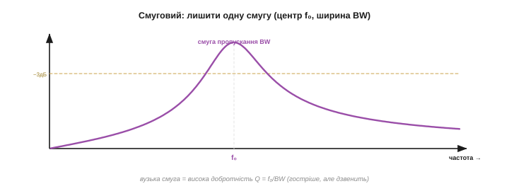
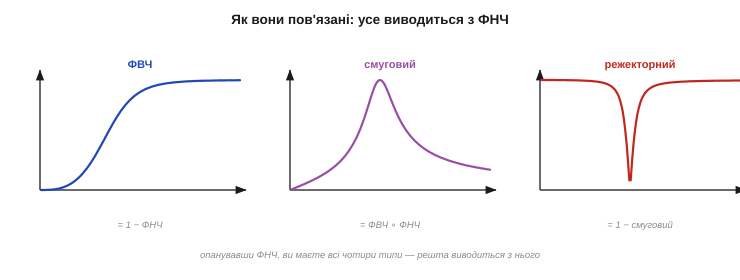

# Смугові фільтри: НЧ, ВЧ, смуговий

Низькочастотну форму фільтра легко уявити, але [частотна характеристика](book:algorithms/filter-as-spectrum-shaper) може мати **будь-яку** форму, і всі їх реалізує той самий апарат — [КІХ](book:algorithms/fir-filter) чи [БІХ](book:algorithms/iir-filter), різниця лише в коефіцієнтах. На практиці потрібні **чотири** канонічні форми, і знати, котра під яку задачу, — це половина вміння фільтрувати. Ця тема — про них: **низькочастотний** (НЧ), **високочастотний** (ВЧ), **смуговий** і **режекторний** фільтри; що кожен робить, навіщо він і як усі вони пов'язані між собою.

### Чотири форми характеристики

Усі чотири типи описуються тією самою [мовою смуг](book:algorithms/filter-as-spectrum-shaper) — різниться лише **де** в них пропускання, а де затримання:


*Рис. Чотири канонічні форми. **НЧ** (ФНЧ): пропускає низькі частоти, гасить високі. **ВЧ** (ФВЧ): навпаки — гасить низькі, пропускає високі. **Смуговий**: пропускає лише вузьку смугу посередині, решту гасить. **Режекторний** (notch): дзеркало смугового — гасить вузьку смугу, решту пропускає. Усі — той самий апарат, лише з різними коефіцієнтами.*

- **Низькочастотний** (ФНЧ, *low-pass*): пропускає **повільне**, гасить швидке.
- **Високочастотний** (ФВЧ, *high-pass*): пропускає **швидке**, гасить повільне й постійне.
- **Смуговий** (*band-pass*): пропускає лише одну **смугу** частот посередині.
- **Режекторний** (*band-stop / notch*): гасить лише одну вузьку смугу, решту пропускає.

Пройдімося ними по черзі — і одразу побачимо, яку роботу кожен робить найкраще.

Зверніть увагу: тип фільтра — це просто **де сидить смуга пропускання** на осі частот. Зсуньте її вліво — дістанете ФНЧ, вправо — ФВЧ, затисніть у вузьке вікно посередині — смуговий, виверніть навиворіт — режекторний. Жодного нового апарату для цього не треба: усі чотири рахуються тими самими зваженими сумами (КІХ) чи рекурсіями (БІХ), лише з іншими коефіцієнтами. Тому, вибравши тип, ви не міняєте **спосіб** обчислення — тільки числа, що визначають форму.

### НЧ (ФНЧ): пропустити повільне

Низькочастотний фільтр **згладжує**: пропускає повільний корисний сигнал і прибирає швидкий шум. Це **робочий кінь** усієї фільтрації й найчастіший вибір за замовчуванням.


*Рис. Низькочастотний у дії. Сирий сигнал (блідий) тремтить від швидкого шуму; після ФНЧ (зелений) лишається лише плавна повільна основа. Характеристика праворуч: пропускання на низьких частотах, спад до нуля на високих. Це згладжування, [антиаліасинг](book:communications/nyquist-aliasing) і прибирання високочастотного шуму — найходовіша задача фільтра.*

Окрім згладжування, ФНЧ виконує критичну роль **антиаліасингового** фільтра: зрізає частоти [вище Найквіста](book:communications/nyquist-aliasing) **до** оцифрування, щоб вони не «прикинулися» низькими. Тож ФНЧ — це і щоденний згладжувач, і обов'язковий вартовий на вході АЦП.

Головне рішення для ФНЧ — **де поставити зріз**. Він має лягти **між** найвищою корисною частотою сигналу й найнижчою частотою шуму: усе корисне лишити в смузі пропускання, увесь шум — у затриманні. Якщо вони далеко одне від одного — фільтр легкий і пологий; якщо близько — потрібен гострий (а отже, [дорожчий чи запізніліший](book:algorithms/iir-filter)). І не забувайте про [компроміс згладжування проти запізнення](book:algorithms/smoothing-vs-lag): нижчий зріз сильніше згладжує, але й більше запізнює. Зріз ФНЧ — це завжди торг між чистотою й свіжістю.

Антиаліасинговий ФНЧ заслуговує окремого слова, бо його часто плутають. Його ставлять **аналоговим**, **до** АЦП (простим RC чи активним), а не цифровим після, — бо [аліас, що вже потрапив у відліки](book:communications/nyquist-aliasing), цифрою не прибрати. Цифровий же ФНЧ працює **після** оцифрування й чистить уже коректно зняті дані. Тож у тракті часто аж два ФНЧ: аналоговий-вартовий перед АЦП і цифровий-згладжувач після. Плутати їхні ролі — поширена помилка новачка.

Зріз — не єдиний параметр ФНЧ; важить і **глибина затримання**: наскільки сильно фільтр давить те, що за зрізом. −20 дБ (удесятеро) досить для грубого згладжування, а −60 дБ (у тисячу разів) потрібно, коли завада сильна, а корисне слабке. Глибше затримання — знову вищий порядок, той самий торг. Тому повна специфікація ФНЧ — це не одне число «зріз», а пара: **де** зрізати й **наскільки глибоко** давити за зрізом.

### ВЧ (ФВЧ): прибрати постійне й дрейф

Високочастотний — **дзеркало** низькочастотного: він пропускає **швидкі** зміни й гасить **повільні**, аж до нульової частоти (постійної складової). Його головна робота — прибирати **дрейф нуля**, **постійне зміщення** (DC) і повільне «сповзання основи».


*Рис. Високочастотний у дії. Сигнал їде на повільно зростаючій основі-дрейфі (помаранчевий); ФВЧ прибирає цей повільний хід і повертає сигнал на нуль (синій), лишивши швидкі коливання. Характеристика праворуч: гасіння на низьких частотах (нуль на 0 Гц), пропускання на високих. Так знімають дрейф давача й постійне зміщення.*

[Дрейф](book:algorithms/signal-noise) — це не шум, і ФНЧ його не бере. А от ФВЧ — бере: він гасить усе повільне, зокрема й повзучу основу. Тому ФВЧ — це інструмент проти **дрейфу** й **DC-зміщення**: він лишає тільки змінну частину сигналу. (Те саме в аналоговій техніці роблять «розв'язувальним конденсатором» — *AC-coupling*.)

Та у ФВЧ є важлива розплата: прибравши постійну складову, він **викидає й абсолютний рівень** сигналу. Після ФВЧ ви бачите лише **зміни**, а не саме значення: не «температура 23°», а «температура коливнулась». Це чудово, коли потрібна саме змінна частина (вібрація, звук, пульсація), і згубно, коли потрібен абсолютний показ (та сама температура). Тому ФВЧ ставлять свідомо — лише там, де постійна складова справді **завада** (дрейф, зміщення), а не корисна інформація.

### Смуговий: лишити одну смугу

Смуговий фільтр пропускає лише **одну смугу** частот, гасячи все і нижче, і вище. Його робота — **виокремити** частоту чи діапазон, що нас цікавить, відкинувши решту: витягти конкретний тон, виділити радіоканал, лишити лише потрібну гармоніку.


*Рис. Смуговий фільтр. Пропускає лише смугу навколо центральної частоти f₀, гасячи все поза нею. Ширину смуги (BW) на рівні −3 дБ задає **добротність** Q = f₀/BW: висока Q — вузька, гостра смуга (хірургічно виділяє тон, але «дзвенить»); низька Q — широка, м'яка. Так ізолюють тон у DTMF, виділяють діагностичну смугу ЕКГ, ловлять радіоканал.*

Смуговий — це, по суті, ФВЧ і ФНЧ, поставлені один за одним: ФВЧ відрізає все нижче смуги, ФНЧ — усе вище. Його гострота описується новим параметром — **добротністю** `Q = f₀/BW`, де `f₀` — центральна частота, `BW` — ширина смуги пропускання. Велике `Q` — вузька, гостра смуга (виділяє одну частоту майже хірургічно); мале `Q` — широка, м'яка.

Прикладів смугового — безліч. Телефонний [приймач DTMF](book:math/why-frequency-domain) — це **вісім** вузьких смугових фільтрів, по одному на кожну частоту кнопки. В обробці ЕКГ смуговий лишає діапазон ~10–40 Гц, де живе серцевий комплекс QRS, відкидаючи і дрейф унизу, і м'язовий шум угорі. Радіоприймач смуговим виділяє один канал з усього ефіру. А наукові прилади «лок-ін» вузьким смуговим витягують сигнал на точно відомій частоті з-під товстого шуму. Скрізь ідея одна: **лишити свою смугу, відкинути все інше**.

### Режекторний (notch): вирізати одну смугу

Режекторний — **дзеркало** смугового: він **гасить** одну вузьку смугу, пропускаючи все інше. Його класичне застосування одне й безцінне: **прицільно вбити мережевий гул** 50 (чи 60) Гц, не зачепивши решту сигналу.


*Рис. Режекторний (notch) фільтр. Сигнал із мережевим гулом 50 Гц (блідий) → після notch (зелений) гул зник, корисне ціле. Характеристика праворуч: вузький **провал** точно на 50 Гц, решта частот проходить незмінно. Це найточніший спосіб прибрати відому вузьку заваду, не торкнувшись сусідніх частот.*

Саме notch — найчистіший спосіб прибрати **відому вузьку** заваду. Широкий ФНЧ чи ФВЧ зачепив би й корисні частоти поряд із гулом; а вузький провал notch вирізає **рівно** 50 Гц, лишивши і 45, і 55 Гц недоторканими. Як і в смугового, гострота провалу задається добротністю `Q`: висока `Q` — вузький, хірургічний провал.

Дві практичні замітки про мережевий гул. По-перше, частота його **різна за регіонами**: 50 Гц у Європі (і в нас), 60 Гц у США — і фільтр треба ставити саме на свою. По-друге, notch — не єдиний спосіб: можна [усереднювати рівно по **одному періоду** мережі](book:algorithms/filter-as-spectrum-shaper) — нуль ковзного середнього сяде на 50 Гц задарма, — або взяти адаптивний фільтр, що сам підлаштовується під плавання мережевої частоти. Та класичний notch-біквад лишається найпростішим і найгострішим рішенням для фіксованих 50/60 Гц.

Зведімо параметри докупи. ФНЧ і ФВЧ задаються **однією** частотою — зрізом `fc` (де закінчується пропускання). Смуговий і режекторний — **трьома**: центром `f₀`, шириною `BW` і похідною від них добротністю `Q = f₀/BW`. Плюс для будь-якого типу — **порядок** (гострота) і **сімейство** (КІХ чи БІХ). Назвавши ці кілька чисел, ви повністю задаєте фільтр; решту — коефіцієнти — порахує інструмент проєктування.

Ще тонкість про мережевий гул: він рідко буває чистою синусоїдою на 50 Гц — часто тягне за собою [**гармоніки** на 100, 150, 250 Гц](book:math/spectrum). Один notch на 50 Гц прибере основну, але не їх. Тому в чутливих приладах (та сама ЕКГ) ставлять **гребінку** notch-фільтрів — по одному на кожну сильну гармоніку. Перевіряйте спектр виходу: якщо після notch лишилися піки на кратних частотах, гул ще не переможено остаточно.

### Як вони пов'язані

Найприємніше, що всі чотири типи — **родичі**, виведені з одного. Опанувавши низькочастотний, ви фактично маєте їх усі:


*Рис. Усе з ФНЧ. **ФВЧ = 1 − ФНЧ** (що ФНЧ пропустив, ФВЧ гасить, і навпаки). **Смуговий = ФВЧ, тоді ФНЧ** (відрізати знизу й зверху). **Режекторний = 1 − смуговий** (дзеркало смугового). Тож фундаментальна форма одна — низькочастотна, — а решта три виводяться з неї простими операціями.*

Ця спорідненість і практична, і красива. **ФВЧ** дістають, віднявши вихід ФНЧ від сигналу (що згладжувач прибрав — те й є «швидка» частина). **Смуговий** — це ФВЧ і ФНЧ поспіль. **Режекторний** — сигнал мінус смуговий. Тому, по суті, треба зрозуміти лише **один** фільтр — низькочастотний, — а решта три виростають із нього. І кожен із чотирьох можна зробити як КІХ, так і БІХ — тип характеристики живе в **коефіцієнтах**, а сімейство (КІХ/БІХ) — це вже спосіб їх порахувати.

Саме тому в усій теорії фільтрів **низькочастотний прототип** вважають фундаментальним: інструменти проєктування внутрішньо рахують ФНЧ, а тоді **перетворюють** його на потрібний тип частотним зсувом чи інверсією. Для вас це означає приємну річ: зрозумівши один тип по-справжньому, ви розумієте **всі**. Чотири форми — не чотири різні предмети, а один, показаний з чотирьох боків, — і це робить опанування фільтрів напрочуд економним: вивчив одне, маєш усі чотири.

І ще спільне для всіх типів: **гострота** будь-якого з них коштує того самого. Різкіший зріз ФНЧ, крутіші краї смугового, вужчий провал notch — усе це вимагає вищого **порядку** фільтра (більше коефіцієнтів [КІХ](book:algorithms/fir-filter) чи біквадів [БІХ](book:algorithms/iir-filter)), а отже, більше обчислень і затримки. Той самий торг гострота-проти-ресурсів діє однаково для кожної з чотирьох форм. Тому надмірної гостроти уникають скрізь, не лише у ФНЧ.

Цими чотирма список не вичерпується — є ще, наприклад, **поличкові** фільтри (підняти чи опустити цілу смугу, як регулятор тембру) і **всепропускні** (міняють лише фазу, не чіпаючи амплітуд). Та для очищення сигналів давачів саме ці чотири — НЧ, ВЧ, смуговий, режекторний — і є робочі конячки, що покривають чи не все. Решту згадаєте тоді, коли справді знадобляться, — а в дев'яти випадках із десяти вистачить котрогось із цих чотирьох.

> 🔧 **Навіщо це.** Добирайте **тип** під задачу, перш ніж думати про коефіцієнти: швидкий шум на повільному сигналі — **ФНЧ**; дрейф нуля чи постійне зміщення — **ФВЧ**; виділити конкретний тон — **смуговий**; прибити відому вузьку заваду (50 Гц) — **режекторний**. Назвіть, **що** пропустити й **що** зрізати на осі частот, — і тип визначиться сам. Це перше й найважливіше рішення; усе інше (КІХ/БІХ, порядок) — деталі.

> 🔧 **Навіщо це.** Для смугового й режекторного **добротність Q** — головна ручка: `Q = f₀/BW`. Висока Q дає вузький, гострий фільтр (хірургічно бере чи ріже одну частоту), та платить **дзвоном** і довгим встановленням (як [гострий БІХ](book:algorithms/iir-filter)). Для прибирання гулу 50 Гц беріть Q високу (вузький провал, щоб не чіпати сусіднє); для виділення ширшої смуги — нижчу. Не женіться за надвузькістю без потреби: занадто гострий notch довго «дзвенить» після кожного збурення.

**Приклад (notch на 50 Гц).** Спроєктуймо параметри режекторного фільтра проти мережевого гулу за `fs = 1000` Гц:

```
ціль:         прибрати гул 50 Гц, лишити решту
центр:        f₀ = 50 Гц    (у частках Найквіста: 50/500 = 0.1)
ширина:       BW = 4 Гц     (вузько — щоб не зачепити корисне поряд)
добротність:  Q = f₀/BW = 50/4 ≈ 12.5   (висока → гострий провал)
тип/сімейство: режекторний, найкраще БІХ-біквад — гостро за 5 коеф.
```

Кілька чисел — і готова специфікація, яку інструмент проєктування перетворить на коефіцієнти біквада. Помітьте, як усе сходиться: тип (notch) обрали за задачею, гостроту (Q) — за вимогою не чіпати сусіднє, сімейство (БІХ) — за потребою [гостроти при малих ресурсах](book:algorithms/iir-filter).

> 🔧 **Навіщо це.** Найчастіша пара на практиці — **ФНЧ проти шуму + ФВЧ/notch проти дрейфу й гулу**. Дуже типовий тракт давача: спершу режекторний на 50 Гц (вбити мережу), тоді ФНЧ (згладити решту шуму), а як є дрейф — ще й ФВЧ (зняти повзучу основу). Кожен фільтр б'є по **своїй** заваді за її місцем на осі частот — і разом вони чистять сигнал куди краще, ніж один «універсальний» згладжувач.

**Приклад тракту.** Скажімо, давач деформації ([тензоміст](book:electronics/load-cell)) для зважування: сигнал слабкий, на ньому мережевий гул, дрейф нуля від температури й дрібний шум. Чесний цифровий тракт виходить такий: спершу **notch 50 Гц** (вбити мережу), тоді **ФНЧ** (згладити шум до плавного показу). А ось повільний температурний дрейф нуля фільтром тут не знімеш: сама вага — теж «нульова частота», тож ФВЧ викинув би її разом із дрейфом (та сама пастка, про яку йшлося вище). Проти дрейфу працює **тарування** — періодичне переобнулення за порожньою шалькою — і [температурна компенсація](book:electronics/calibration). Два фільтри плюс тарування, кожен проти своєї біди, — і слабкий сигнал стає придатним для точного зважування.

Отже, повний набір форм — НЧ, ВЧ, смуговий, режекторний — і розуміння, що всі вони виводяться з низькочастотного й робляться як КІХ, так і БІХ. Звідси видно, **який** фільтр і **якої** форми брати під задачу: назвавши, що пропустити й що зрізати на осі частот, ви обираєте тип, а кілька чисел (зріз або центр і Q, порядок, сімейство) завершують специфікацію. Лишається ще приземлене, але критичне для мікроконтролера питання — як [порахувати фільтр **швидко й надійно** на цілій арифметиці](book:algorithms/fixed-point-implementation), на залізі без плаваючої коми: навіть бездоганно спроєктований фільтр зіпсується, якщо невдало порахувати його цілими числами на дешевому чипі.

---
