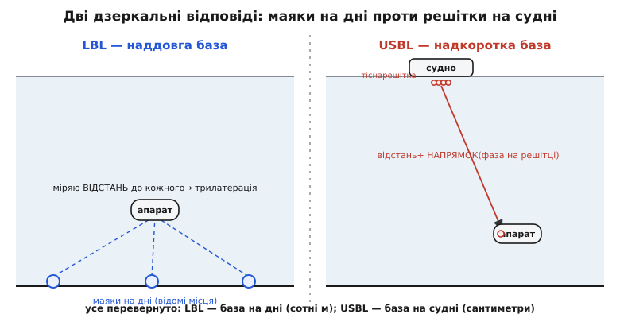

# 📜 Від сонара до бази маяків: як звук навчився казати, де ти під водою

Море непрозоре. Не в тому побутовому сенсі, що вода каламутна, — а в глибшому, фізичному: майже все, чим людина звикла бачити на відстані, вода з'їдає за метри. Світло гасне; радіо гасне ще швидше. Лишається одне-єдине вікно, крізь яке далеко «видно» під водою, — **звук**. І вся історія, яку тут розказано, — це історія про те, як людство, притиснуте до цього єдиного вікна, поступово навчило звук робити дві різні речі: спершу — **намацати чуже** в темряві, а вже потім, і зовсім не одразу, — **сказати тобі, де ти сам**.

Ці дві задачі здаються однією, і саме тому їх постійно плутають. Але вони різні аж до протилежності, і плутанина коштувала десятиліть. Намацати чуже — це послати звук і послухати, чи щось відіб'ється: так народилася гідролокація, сонар. Знати, де ти сам, — це вже навігація: тут звук має не намацати ворога, а прив'язати твою власну machine до відомих точок так, щоб числа сходилися до метра. Перше виросло з війни, з полювання на підводні човни. Друге — з мирної, але не менш відчайдушної потреби: знайти на дні те, що впало, і роздивитися дно, яке ніхто не бачив. Простежмо обидві нитки — і побачимо, у якій саме точці друга відділилася від першої.

## Айсберг, який усе почав: ехо як ідея

Поштовхом, як не дивно, була катастрофа, що не мала до підводних човнів жодного стосунку. У ніч на 15 квітня 1912 року «Титанік» напоровся на айсберг і затонув. Світ здригнувся й почав гарячково думати, як помітити крижану гору в темряві раніше, ніж об неї розіб'єшся.

Уже за кілька тижнів після загибелі лайнера англійський метеоролог і фізик **Льюїс Річардсон** (*Lewis Fry Richardson*) подав патент на ідею шукати перешкоду відлунням — послати короткий імпульс і за часом повернення луни виміряти відстань до того, від чого вона відбилася. Патент був на ідею; робочого приладу за ним Річардсон не побудував. Але сама думка вже витала в повітрі, і майже водночас за неї взявся той, хто вмів будувати.

Канадський інженер **Реджиналд Фессенден** (*Reginald Fessenden*) — той самий, що першим передав людський голос по радіо, — сконструював **електромагнітний випромінювач** (він називав його осцилятором): пристрій, що вганяв у воду потужний звуковий імпульс і ловив відлуння. У 1914 році, з борту американського кутера «Маямі» (*USRC Miami*) над Ньюфаундлендською банкою, прилад Фессендена засік айсберг приблизно за 3 кілометри — і водночас, відбивши звук від дна й вимірявши час повернення, виміряв **глибину**.

> 🔧 **Навіщо це.** Ось тут народилася перша практична річ, яку звук робить під водою досі, — **ехолот** (англ. *echo sounder*, вимірювач глибини луною). Формула, за якою він живе, до банального проста, і вона ж лежить в основі всього подальшого:
>
> ```
> глибина = (швидкість звуку × час до луни) / 2
>          = (≈1500 м/с × t) / 2
> ```
>
> Ділимо на два, бо звук пройшов туди **і назад**. Ця сама «поділити час ходу навпіл» повторюватиметься в кожній підводній системі позиціювання — тільки замість дна під собою вимірюватимуть відстань до маяка збоку.

Зверніть увагу на межу, яку Фессенден намацав, але не переступив. Його прилад чудово казав, **як далеко** щось є (дно під тобою, айсберг попереду). Але він не казав, **де ти сам** на карті океану, і не казав напрямку на ціль інакше, ніж «десь туди, куди повернутий корпус». Це ще не навігація. Це — вміння міряти відстань відлунням. І перше, у що це вміння виросло, була не карта, а зброя.

## Кварц у солоній воді: сонар народжується з полювання

Коли 1914 року почалася Перша світова, з'явився ворог, якого гостро треба було саме **намацати в темряві**, — німецький підводний човен. Він топив кораблі, лишаючись невидимим, і союзники платили за цю невидимість тоннами й життями. Проти невидимого під водою в людства був лише звук.

Перший серйозний крок зробив інженер, чиє ім'я історія довго писала недбало. **Костянтин Шиловський** (*Constantin Chilowsky*; у різних джерелах — Chilowski, Chilowsky) — інженер родом із Російської імперії, який на той час жив і працював у Швейцарії й Франції. У лютому 1915 року він подав французькому урядові (через міністра **Поля Пенлеве**, *Paul Painlevé*) проєкт: випромінювати у воду **ультразвук** — звук вищий за поріг людського чуття — і ловити його відлуння від підводного човна. Ідея була його; але Шиловському бракувало фізичної й лабораторної сили, щоб довести її до діла.

> Статус доказовості. Що ідею активної ультразвукової локації першим офіційно запропонував саме Шиловський у лютому 1915 року — **усталений факт** (є подання французькому урядові й спільний патент). А от його етнічне походження джерела передають розмито: більшість пише просто «російський інженер» / «російський емігрант», не уточнюючи. Прізвище й біографія (Російська імперія, потім Швейцарія, Франція, згодом США) лишають простір для точнішої ідентичності, але **надійного підтвердження бракує** — тож чесно сказати: інженер із Російської імперії, докладніше походження непевне.

Силу дав **Поль Ланжевен** (*Paul Langevin*) — один з найкращих фізиків Франції, учень П'єра Кюрі. Він приєднався до Шиловського в середині 1915 року, і саме він зробив крок, який усе змінив: замінив кволе джерело звуку на **п'єзоелектричний кварц**.

П'єзоефект — властивість деяких кристалів (кварцу серед них) стискатися чи розтягуватися під напругою й, навпаки, народжувати напругу під стиском — відкрили ще 1880 року брати **П'єр і Жак Кюрі** (*Pierre et Jacques Curie*). Ланжевен побачив у цьому кристалі ідеальний **перетворювач** в обидва боки: подай на кварц швидкозмінну напругу — він задрижить і вжене у воду потужний ультразвук; хай на нього впаде відлуння — він народить слабку напругу, яку можна підсилити й почути. Одна пластина кварцу — і випромінювач, і мікрофон.

До 1918 року апарат Ланжевена вже впевнено ловив відлуння від підводного човна на відстані до **1500 метрів**. Війна скінчилася раніше, ніж це стало масовою зброєю, але принцип був доведений і назавжди лишився з людством. Так народився **активний сонар** (англ. *SONAR*, від *SOund Navigation And Ranging* — «звукові навігація й далекомірство»; сама абревіатура — американська, з часів Другої світової).

> 🔧 **Навіщо це.** Кварцовий перетворювач Ланжевена — прямий предок кожного **гідрофона** й кожного акустичного маяка в сучасних підводних системах. Коли USBL-решітка на судні ловить фазу приходу сигналу, а маяк LBL на дні відповідає на «оклик» — усередині них працює той самий п'єзокристал, що дрижить від напруги й народжує напругу від тиску. Ланжевен не просто виграв епізод війни; він дав фізичну деталь, на якій стоїть уся акустична навігація.

## Британці, кварц і брехлива абревіатура

Паралельно з французами над тією самою задачею гарували британці — і саме через їхню роботу в мову увійшло слово, за яким тягнеться повчальна історія про те, як народжуються міфи.

Британську програму боротьби з підводними човнами очолював орган на чолі з новозеландцем **Ернестом Резерфордом** (*Ernest Rutherford*) — тим самим, що відкрив ядро атома. Британці теж дійшли до кварцу й будували свої прилади. Щоб приховати суть роботи від чужих очей, у документах уникали слів «ультразвук» і «кварц»: саму тему стали позначати трьома літерами **ASD**, а речовину (кварц) — «асдивітом». Три літери ASD — це просто скорочення від **Anti-Submarine Division**, підрозділу британського адміралтейства. Додали «-ics», як у «physics», — і вийшло **ASDIC**.

А тепер повчальна частина. Десятиліттями — і донині в багатьох книжках — можна прочитати, що ASDIC означає «Allied Submarine Detection Investigation Committee» (Союзний комітет з дослідження виявлення підводних човнів). Це **вигадка**. У 1939 році, коли Оксфордський словник запитав адміралтейство про походження слова, там, не бажаючи розкривати правду, просто **склали** гарну розшифровку заднім числом. Комітету з такою назвою в архівах адміралтейства так і не знайшли.

> Статус доказовості. Те, що «Allied Submarine Detection Investigation Committee» — пізніша вигадка 1939 року, а справжнє коріння абревіатури — «Anti-Submarine Division» + «-ics», сьогодні вважають **усталеною** версією (Оксфордський словник виправив свою етимологію, історики адміралтейства підтверджують відсутність такого комітету). Це добрий приклад того, як зручна легенда десятиліттями заступає простий факт — саме тому кожну «красиву» розшифровку варто перевіряти в першоджерелі.

Отже, до кінця Першої світової людство вміло **намацувати чуже** під водою звуком: активний сонар ловив відлуння від корпусу, пасивні **гідрофони** просто слухали шум гвинтів. Обидва казали «там щось є, приблизно в тому напрямку, приблизно на тій відстані». Але жоден із них не казав підводному апаратові, **де він сам** на карті. Для цього бракувало іншої ідеї — і півстоліття.

## Чому сонар — це ще не навігація

Зупинімося на цьому розломі, бо він — серце всієї історії.

Сонар відповідає на питання «**де ворог відносно мене?**». Я — початок координат, я світю звуком навколо, і те, що відбилося, я малюю відносно себе. Мені при цьому байдуже, де я сам у світі: я полюю, а не орієнтуюся.

Навігація ставить дзеркально протилежне питання: «**де я сам відносно світу?**». І тут початок координат — уже не я, а щось **зовні** з відомими координатами. Мені потрібні точки, чиє місце я знаю напевно, і спосіб виміряти, як я стою відносно них.

На суходолі й у повітрі ці зовнішні точки безкоштовно роздає небо — супутники GPS. Але радіо, як ми бачили ще з айсберга, у воду не проходить. Пірнувши, апарат утрачає всі відомі точки згори. Щоб мати навігацію під водою, точки з відомими координатами доводиться **самому покласти** — на дно чи на судно — і прив'язуватися до них звуком. Ось де активне позиціювання відділяється від сонара: не «послухати, чи є луна від чужого», а «поставити власні маяки й вимірювати відстані до них так, щоб вийшли мої координати».

Ця думка проста заднім числом, але щоб людство до неї серйозно взялося, знадобилася катастрофа.

## «Трешер»: катастрофа, що зробила глибину державною справою

10 квітня 1963 року американський атомний підводний човен **USS Thresher** («Трешер») під час випробувального занурення в Атлантиці загинув з усіма 129 людьми на борту. Він лежав на глибині близько **2500 метрів** — там, куди доти жодна людина не заглядала прицільно, і звідки треба було не просто дістати уламки, а зрозуміти, **що** сталося, щоб таке не повторилося.

І тут флот наштовхнувся на приголомшливу річ: знайти щось конкретне на дні глибиною два з половиною кілометри виявилося майже неможливо. Океанографічне судно **USNS Mizar** водило над районом батискаф **«Трієст»** (*Trieste*), намагаючись навести його на уламки. Використали ранню акустичну систему — маяки на дні й вимірювання часу приходу сигналів. Результат був відрізвлюючим: з десяти пошукових занурень «Трієст» побачив уламки **лише раз**.

Саме цей провал — а не якийсь тріумф — прийнято вважати відправною точкою сучасної підводної акустичної навігації. Флот побачив чорним по білому: **вміти намацувати ще не означає вміти повернутися в ту саму точку**. Без здатності знати, де ти на дні, з точністю до метрів, глибина лишалася непрохідною. І в це вклали гроші, мізки й терміновість.

Через три роки, 1966-го, ту саму задачу — знайти дещо мале на великій глибині — розв'язували вже для водневої бомби, загубленої після зіткнення літаків у морі біля іспанського Паломареса. Акустичне позиціювання застосували знову, і цього разу воно спрацювало. Між цими двома подіями — «Трешером» і Паломаресом — техніка знаходити себе під водою зробила рішучий крок уперед. І зробили його не військові в лоба, а вчені, яким та сама здатність була потрібна для зовсім іншого — щоб **побачити дно**.

## Спайсс і мережа маяків: народження наддовгої бази (LBL)

У ті самі роки в Каліфорнії, у Морській фізичній лабораторії Інституту океанографії Скріппса (*Scripps Institution of Oceanography*), океанограф **Фред Спайсс** (*Fred N. Spiess*) бився над задачею, дзеркальною до військової. Він хотів **картографувати** морське дно — детально, зблизька. Для цього збудували апарат **Deep Tow** («глибоке буксирування») — сани з приладами, які судно тягло за собою в лічених десятках метрів над дном.

І тут постала точнісінько та сама стіна, що й у флоту: щоб карта мала сенс, треба знати, **де саме** був апарат у кожну мить зйомки — з точністю до метрів, на кілометровій глибині. Інакше виходить чудова фотографія дна, приліплена невідомо куди.

Спайсс із інженерами лабораторії дали розв'язок, який став **наддовгою базою** (LBL, англ. *Long BaseLine* — «довга база»). Ідея, врешті, гарна своєю простотою. На дно наперед розкидають кілька **маяків-відповідачів** (англ. *transponder*, «відповідач») — приладів, що на почутий «оклик» відповідають власним звуковим імпульсом. Спершу судно з поверхні акуратно з'ясовує, де кожен маяк лежить (прив'язавши їх до відомих координат зверху). А далі апарат унизу «окликає» маяки, чекає відповідей і за часом ходу звуку туди-назад рахує **відстань до кожного**. Три відстані до трьох відомих точок — і апарат **трилатерацією** (визначенням місця за відстанями) знаходить себе.


*Наддовга база (ліворуч): маяки з відомими місцями на дні, апарат по часу ходу міряє відстань до кожного й знаходить себе трилатерацією. Надкоротка база (праворуч): усе перевернуто — тісна решітка гідрофонів на судні по часу ходу бере відстань до маяка на апараті, а по різниці фаз приходу на елементи решітки — напрямок.*

Чому «довга» база? Бо **базою** тут зветься відстань між опорними точками, від яких вимірюєш, — а маяки лежать на дні за сотні метрів один від одного. Ця широка розстановка й дає LBL її головну чесноту: точність (нерідко краще за метр) **не залежить від глибини**, бо трикутники між апаратом і маяками — «товсті», добре обумовлені. Ціна — праця: маяки треба спершу розсіяти й прив'язати, а по роботі зібрати.

Акустична система маяків Скріппса запрацювала наприкінці 1964 року, а 1966-го Спайсс представив її світові доповіддю «Акустична система відповідачів» (*An Acoustic Transponder System*). Це й був момент, коли навігація за донними маяками стала інженерним фактом, а не мрією.

> Статус доказовості. Що першу дієву систему донних акустичних маяків для глибокої води збудували Спайсс і Морська фізична лабораторія Скріппса, а вона працює з кінця 1964 року, — **добре задокументований факт** (є доповідь 1966 року й пізніші згадки самої лабораторії). Як завжди з винаходами, це радше «першими довели до робочого діла», ніж «першими подумали»: ідею вимірювати відстань відлунням заклав ще Фессенден, а прив'язку до кількох точок — сама геометрія трилатерації, відома здавна. Заслуга Скріппса — **робоча система**, а не гола ідея.

Паралельно ту саму навігацію за донними маяками розвивали й на іншому узбережжі — в Океанографічному інституті Вудс-Гол (*Woods Hole Oceanographic Institution*) для дослідницького підводного апарата **«Елвін»** (*Alvin*), що почав занурення 1965 року. Їхню систему так і назвали — ALNAV (від *Alvin navigation*); згодом, коли з'явилися коротші бази, її стали звати «наддовгою», щоб відрізнити. Отже, LBL народилася не в одній голові, а майже водночас у двох океанографічних центрах, бо обидва вперлися в одну потребу: щоб дослідник унизу знав, де він, з точністю до метрів.

## Перевернути задачу: надкоротка база (USBL)

LBL чудова, але примхлива: розсіювати по дну маяки, ретельно прив'язувати кожен, потім збирати — це морока, надто коли працюєш то там, то там, або з рухомого судна над рухомим апаратом. Тож інженери поставили природне питання: а що, як **прибрати маяки з дна** й лишити на дні (чи на апараті) лише один, а всю «базу» стягнути в **одну коробку на судні**?

Так з'явилася **надкоротка база** (USBL, англ. *Ultra-Short BaseLine* — «надкоротка база»). Ідея дзеркальна до LBL. Тепер опорні точки — не маяки за сотні метрів на дні, а кілька крихітних гідрофонів, зведених у **тісну решітку** за сантиметри один від одного, у єдиному приладі на корпусі судна. На апараті ставлять один маяк. Судно окликає його, маяк відповідає, і решітка робить дві речі водночас: за **часом ходу** сигналу туди-назад бере **відстань** до апарата, а за **різницею фаз** приходу того самого сигналу на різні елементи решітки — **напрямок** на нього.

Ось у цій «різниці фаз» — уся суть, і варто відчути її фізику. Звукова хвиля, приходячи скоса, накриває ближчий гідрофон трохи раніше за дальший. Ця крихітна різниця часу (чи, що те саме, зсув фази) прямо каже кут приходу:

```
різниця ходу між двома гідрофонами:  Δd = D · sin θ
через фазу:                           Δφ = 2π · Δd / λ
                                          = 2π · (D · sin θ) / λ
```

де `D` — відстань між гідрофонами (розмір решітки), `λ` — довжина звукової хвилі, `θ` — кут приходу. Виміряв `Δφ` — дістав `θ`. Відстань плюс два таких кути (по двох осях решітки) — і маєш повне тривимірне місце апарата **відносно судна**. А оскільки місце самого судна на поверхні дає GPS, апарат зрештою прив'язується й до світу.

Ось чому базу назвали «надкороткою»: опорні точки тепер за **сантиметри**, а не за сотні метрів. І звідси ж — головний компроміс. USBL неймовірно зручний: жодних маяків на дні, увесь прилад — одна штанга під судном, розгорнув і працюй. Але тісна база означає, що напрямок він бере з невеликої різниці фаз, а невелика річ вимірюється з відносною похибкою гірше: **кутова похибка з відстанню обертається в дедалі більший промах**. На сотні метрів це сантиметри, на кілометри — вже метри. LBL з її широкою базою тут точніша; USBL бере зручністю.

USBL визріла пізніше за LBL — по-справжньому в 1980-х, коли електроніка навчилася швидко й точно міряти фазу. Штовхнула її вже не наука й не пошук затонулого, а **гроші нафти**. У 1970-х видобуток посунув на глибоку воду, і офшорній індустрії конче знадобилося точно ставити на дно бурові колони, стежити за апаратами-роботами (ROV), заводити конструкції в потрібну точку. Саме цей попит виніс USBL з лабораторій у серійні прилади: перші комерційні USBL-системи з'явилися наприкінці 1980-х — на початку 1990-х (тут помітну роль зіграла британська компанія Sonardyne серед інших), стиснувши всю акустичну базу до розміру, меншого за долоню.

> 🔧 **Навіщо це.** LBL і USBL — не «стара й нова», а **дві відповіді на різні потреби**, і вибір між ними досі роблять щодня. Треба максимальна точність на місці, де довго й прицільно працюєш (розкладка кабелю, точна зйомка, розкопки на дні)? Варто помучитися з донними маяками — це LBL. Треба швидко, з рухомого судна, «наскочив і поїхав», супроводжуючи робота на помірній дистанції? Одна штанга USBL під кілем — і готово, змирившись, що точність трохи попливе з відстанню. Розуміння цього компромісу — пряме продовження історії: кожна система народилася під свою задачу, і задача, а не мода, диктує вибір.

## Одна нитка крізь століття

Складімо шлях докупи. Море лишило людині єдине далеке вікно — звук, — і людина протиснула крізь нього спершу вміння **міряти відстань** (ехолот Фессендена, 1914), тоді вміння **намацувати чуже** (сонар Шиловського й Ланжевена на кварці, 1915–1918), і вже значно пізніше — вміння **знаходити себе** (донні маяки Спайсса й Скріппса, з 1964; надкоротка база офшорної індустрії, 1980-ті).

Дві останні речі — сонар і навігацію — легко сплутати, бо обидві світять звуком і слухають відповідь. Але між ними — розлом у самій постановці: сонар питає «де чуже відносно мене», навігація — «де я відносно відомого світу». Поки не поставили **власні** точки з відомими координатами — на дно для LBL, на судно для USBL, — під водою можна було полювати, але не орієнтуватися. Катастрофа «Трешера» показала ціну цієї різниці, наука Скріппса й Вудс-Гола дала перший розв'язок, нафта відшліфувала другий.

І в самому осерді кожної з цих систем — далеко в глибині, під шаром електроніки й математики — досі дрижить п'єзоелектричний кристал, той самий, що його властивість відкрили брати Кюрі 1880 року, а Ланжевен уперше вкинув у солону воду сто років тому. Уся акустична навігація виросла з двох простих фізичних фактів: звук у воді біжить далеко, а кварц уміє перекладати напругу в звук і звук у напругу. Решта — людська винахідливість, підстьобнута то війною, то катастрофою, то грішми, що поступово навчила ці два факти казати підводному апаратові найпотрібніше слово: **де ти**.
