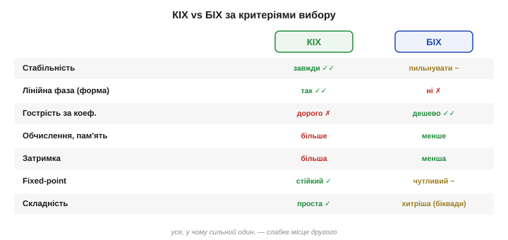
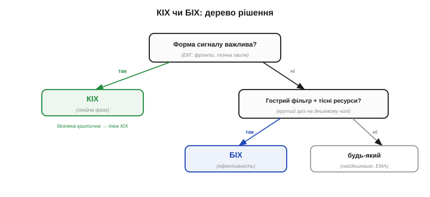
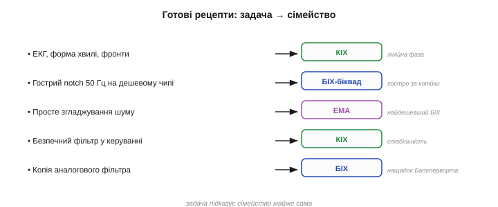
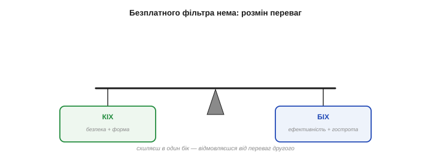

# КІХ vs БІХ: коли що

Є два сімейства фільтрів — [КІХ](book:algorithms/fir-filter) і [БІХ](book:algorithms/iir-filter), — обидва вміють будь-яку [форму характеристики](book:algorithms/band-filters) й обидва [реалізовні на МК](book:algorithms/fixed-point-implementation). Лишилося найпрактичніше питання, що постає в кожному реальному проєкті: **який із двох узяти**? Ця тема — короткий, але чіткий путівник вибору. Він зведеться до двох вирішальних питань, а решта — це готові рецепти. Опанувавши цю розвилку, ви добиратимете фільтр упевнено, а не навмання.

### Двобій критеріями

Зведімо обидва сімейства в одну таблицю — за критеріями, що справді важать на практиці:


*Рис. КІХ vs БІХ. **КІХ**: завжди стійкий, може мати лінійну фазу (не псує форму), простий і передбачуваний, стійкий у fixed-point — але дорогий для гострих фільтрів (багато відводів, більша затримка). **БІХ**: гострий за кілька коефіцієнтів, дешевий за обчисленнями, пам'яттю й затримкою, копіює аналогові фільтри — але може бути нестабільним, спотворює форму (нелінійна фаза), вимагає обережності (біквади, fixed-point). Кожен сильний там, де другий слабкий.*

Бачите дзеркальність? Усе, у чому сильний КІХ, — слабке місце БІХ, і навпаки. Це не випадковість, а наслідок їхньої природи: відсутність зворотного зв'язку дає КІХ безпеку й лінійну фазу ціною ефективності; наявність його дає БІХ ефективність ціною безпеки й чистоти фази. Тому вибір — це завжди розмін **однієї пари переваг на іншу**.

Це й є головний урок: **безплатного фільтра не буває**. Не можна мати водночас і граничну ефективність, і лінійну фазу, і безумовну стабільність — ці чесноти розкидані між двома сімействами, і взявши одне, ви відмовляєтесь від переваг другого. Тому правильне питання не «який фільтр кращий» (кращого нема), а «**чим я готовий пожертвувати** заради того, що мені потрібніше». Відповівши на нього, ви й оберете сімейство.

Варто й підкреслити, що обидва — **лінійні** фільтри й говорять однією [мовою частотної характеристики](book:algorithms/filter-as-spectrum-shaper): будь-яку форму — НЧ, ВЧ, смугову, notch — можна зробити і так, і так. Тобто вибір між КІХ і БІХ — це не вибір, **що** фільтр уміє (уміють однакове), а вибір, **як** він це робить: чесною скінченною сумою чи хитрою рекурсією. Тому й критерії порівняння — не про можливості, а про ціну й побічні ефекти реалізації.

І ще: КІХ та БІХ — **не взаємовиключні** в одному тракті. Цілком звична практика — поєднувати їх: скажімо, гострий БІХ-notch на 50 Гц, тоді лінійно-фазовий КІХ для згладжування, а перед ними — нелінійна медіана проти викидів. Вибір «КІХ чи БІХ» постає **для кожної ланки окремо**, а не для всього тракту разом. Тому не шукайте «один фільтр на все» — будуйте ланцюжок, де кожна ланка найкраща саме для своєї ролі.

### Сила й слабкість КІХ

Підсумуймо КІХ. Його **сильні** боки: **безумовна стійкість** (не вибухне за жодних коефіцієнтів), здатність до **лінійної фази** (не спотворює форму сигналу), **простота й передбачуваність** (коефіцієнти = імпульсна характеристика, жодної прихованої динаміки) і **стійкість у цілій арифметиці** (без петлі похибки не накопичуються). Його **слабке** місце одне, але вагоме: для **гострого** зрізу потрібні десятки-сотні відводів — а отже, більше обчислень, пам'яті й **затримки** (`M/2`).

Тобто КІХ — це вибір на користь **надійності й чистоти** ціною ресурсів. Беруть його там, де форма сигналу свята, де стабільність критична або де гострота не потрібна, а простота й передбачуваність цінніші за економію тактів.

Є й тонша перевага КІХ — **гнучкість проєктування**. Оскільки його коефіцієнти прямо задають імпульсну (а отже, і частотну) характеристику, КІХ можна спроєктувати під **будь-яку**, навіть найхимернішу бажану форму, якої аналоговий прототип і не має. Там, де потрібна нестандартна чи ідеально рівна характеристика, КІХ дає свободу, недосяжну для БІХ із його обмеженим набором полюсів. Це ще одна причина любити КІХ там, де ресурси не тиснуть.

### Сила й слабкість БІХ

БІХ — дзеркало. Його **сильні** боки: **ефективність** (гострий фільтр за кілька коефіцієнтів), а з неї — **низькі** обчислення, пам'ять і затримка, плюс прямий **зв'язок з аналоговими** прототипами (Баттерворт тощо). Його **слабкі** боки: **ризик нестабільності** (зворотний зв'язок може розігнатися), **нелінійна фаза** (спотворює форму сигналу) і загальна **вибагливість** (треба каскад біквадів, обережність із fixed-point, перевірка стабільності).

Тобто БІХ — це вибір на користь **ефективності й гостроти** ціною надійності й чистоти. Беруть його там, де треба крутий фільтр у **тісних** ресурсах, де форма сигналу байдужа (важить лише частотний вміст), або де відтворюють відому аналогову схему.

Окрема ніша БІХ — **завжди ввімкнені** потокові фільтри, де кожен такт на рахунку: висока частота відліків, живлення від батареї, десятки каналів одночасно. Там навіть невелика перевага БІХ у обчисленнях на відлік, помножена на мільйони відліків, обертається відчутною економією енергії й тепла. Тому в масових, енергоощадних виробах (носимі давачі, аудіокодеки) БІХ часто стає вибором за замовчуванням — рівно з протилежних міркувань, ніж КІХ у безпеко-критичних системах.

### Головна розвилка: форма чи ресурси

Уся ця таблиця зводиться до **двох** питань, які й вирішують вибір у 90 % випадків:


*Рис. Два питання вирішують усе. **1) Чи важлива форма сигналу (фаза)?** Так (ЕКГ, фронти, точна хвиля) → **КІХ** (лінійна фаза). **2) Чи потрібен гострий фільтр за тісних ресурсів?** Так (крутий зріз на дешевому чипі) → **БІХ** (ефективність). Якщо критична безпека/стабільність — теж КІХ. Якщо ж задача проста — згодиться будь-хто (найдешевше EMA).*

- **Чи важлива форма сигналу?** Якщо так (ЕКГ, вимірювання фронтів, точне відтворення хвилі) — **КІХ** із його лінійною фазою. Спотворення форми від БІХ тут неприйнятне.
- **Чи потрібен гострий фільтр за тісних ресурсів?** Якщо так (крутий зріз на копійчаному чипі) — **БІХ** із його ефективністю. Сотні відводів КІХ туди просто не влізуть.
- **Чи критична стабільність/безпека?** Якщо так — знову **КІХ**: він не вибухне за визначенням, тоді як БІХ треба ще довести стабільним.

Іноді додається й третє питання — про **затримку**. Лінійно-фазовий КІХ затримує сигнал на `M/2` відліків, і для гострого фільтра ця затримка чимала; у швидкому контурі керування вона здатна [підірвати стійкість](book:algorithms/smoothing-vs-lag). Тоді парадоксально виграє БІХ: низький порядок дає **меншу** затримку, хай і ціною нелінійної фази. Тобто в дуже швидких петлях керування вибір може схилитися до БІХ саме через його меншу затримку — ще одна грань тієї самої розвилки.

Якщо ж жодне з питань не «гостре» — задача проста, ресурсів удосталь, форма байдужа, — підійде **будь-який**, і тоді беруть найдешевше й найпростіше.

> 🔧 **Навіщо це.** Звузіть вибір до двох питань. **Форма важлива?** → КІХ (лінійна фаза не спотворює хвилю). **Потрібен гострий фільтр, а ресурсів обмаль?** → БІХ (крутість за кілька коефіцієнтів). Перше питання головніше: якщо форму псувати не можна, БІХ відпадає одразу, хоч би яким він був дешевим. А якщо обидва питання «ні» — не мудруйте, беріть найпростіше (часто EMA).

### Готові рецепти

Перекладемо розвилку на типові задачі давачів:


*Рис. Рецепти вибору. **ЕКГ, форма хвилі, фронти** → КІХ (лінійна фаза). **Гострий notch 50 Гц на дешевому чипі** → БІХ-біквад (гостро за копійки). **Просте згладжування шуму** → EMA (це БІХ, найдешевший). **Безпечний фільтр у контурі керування** → КІХ (гарантована стабільність). **Копія аналогового фільтра** → БІХ (Баттерворт). Задача підказує сімейство майже сама.*

- **ЕКГ, форма сигналу, виміри фронтів** → **КІХ** (бережемо форму).
- **Гострий notch 50 Гц на дешевому чипі** → **БІХ-біквад** (гострота за копійки).
- **Просте згладжування шуму** → **EMA** (це найдешевший БІХ; або ковзне середнє — найпростіший КІХ).
- **Фільтр у контурі керування, де важлива безпека** → **КІХ** (гарантована стабільність) або легкий БІХ із перевіреною стійкістю.
- **Відтворити відомий аналоговий фільтр** → **БІХ** (прямий нащадок Баттерворта тощо).

Два рецепти варті окремого слова. **ЕКГ**: тут КІХ майже безальтернативний, бо діагноз ставлять за **формою** комплексу QRS, а БІХ її спотворив би — лікар побачив би хибну картину. **Контур керування**: тут зазвичай беруть **легкий** фільтр (мала затримка важливіша за гостроту), і часто це низькопорядковий БІХ або зовсім проста EMA — аби не вбити стійкість зайвим запізненням. Той самий тип задачі — фільтрація — а сімейства протилежні, бо протилежні пріоритети.

### Найпростіші представники обох

Найприємніше: обидва сімейства мають украй прості представники, якими користуються навіть не знаючи цих назв. [Ковзне середнє](book:algorithms/moving-average) — це найпростіший **КІХ** (рівні відводи, скінченна пам'ять, лінійна фаза), а [EMA](book:algorithms/ema) — найпростіший **БІХ** (зворотний зв'язок, нескінченна пам'ять, один коефіцієнт).


*Рис. Старі знайомі. **Ковзне середнє** — це КІХ у найпростішому вигляді: скінченна пам'ять, рівні відводи, лінійна фаза, завжди стійкий. **EMA** — це БІХ у найпростішому вигляді: зворотний зв'язок, нескінченний хвіст, один коефіцієнт α, гранична ефективність. Прості часові фільтри, зроблені на інтуїції, — окремі випадки двох великих сімейств.*

Це не випадковий збіг, а підтвердження, що теорія лягає на практику: вибір між ковзним середнім і EMA — це насправді те саме питання «КІХ чи БІХ» — простота й передбачуваність проти ефективності й малої пам'яті. Тільки тепер цей вибір роблять **свідомо** й для будь-якої форми, а не лише для згладжування.

Одне уточнення про межі цього вибору. І КІХ, і БІХ — **лінійні** фільтри; а [медіанний фільтр](book:algorithms/median-filter) — **не** належить до жодного сімейства, бо він нелінійний (сортує, а не зважено сумує). Тому проти викидів він і працює там, де лінійні безсилі. Тримайте це в голові: «КІХ чи БІХ» — питання для **лінійної** фільтрації, а проти спайків діє окремий, нелінійний інструмент. Часто їх і поєднують: медіана проти викидів, тоді лінійний фільтр проти шуму.

> 🔧 **Навіщо це.** Найдешевший вибір за замовчуванням для **простого згладжування** — **EMA**: один коефіцієнт, одна змінна, мінімум обчислень. Якщо ж згладжування має не псувати форму чи бути гарантовано стійким — берете **ковзне середнє** (чи довший КІХ). Тобто навіть на рівні Розділу 5.4 ви маєте обидва сімейства під рукою: EMA, коли важить дешевизна, ковзне середнє, коли важить чесність форми.

### Стандарт за замовчуванням

І остання порада на випадок справжнього сумніву. Якщо задача не диктує вибору однозначно, а ресурси дозволяють, — **схиляйтеся до КІХ**. Його безумовна стабільність і лінійна фаза означають, що він **рідко** буває поганим рішенням: у найгіршому разі ви заплатите трохи більше тактів, але не отримаєте ні розгону, ні спотвореної форми, ні годин налагодження нестабільності. БІХ беріть тоді, коли його ефективність справді **потрібна** — коли гострий фільтр інакше не влазить.

Це правило не примха, а **галузева** практика: у відповідальних системах (медтехніка, авіоніка, промислове керування) КІХ часто стандарт саме через гарантовану стабільність і чесну форму — там зайвий процесор дешевший за ризик розгону. БІХ натомість панує в масовій споживчій електроніці, де тиснуть ціна й енергія. Тобто вибір сімейства нерідко диктує не лише конкретна задача, а й **галузь** із її пріоритетами — безпека чи ощадливість.


*Рис. Терези вибору. На одній шальці — КІХ: безумовна стабільність і лінійна фаза (не псує форму), та дорожчий для гострих фільтрів. На другій — БІХ: ефективність і гострота за копійки, та з ризиком нестабільності й спотворенням фази. Безплатного фільтра нема: схиляючи терези в один бік, ви відмовляєтесь від переваг другого. Питання лише, що вам потрібніше.*

**Приклад (виберіть сімейство).** Три сценарії, три рішення:

```
1) монітор серцебиття (ЕКГ): форма QRS свята  → КІХ (лінійна фаза)
2) гострий зріз 50 Гц на 8-біт AVR, форма байдужа → БІХ-біквад (ефективність)
3) згладити шум кнопки-потенціометра, не критично → EMA (найдешевше)
```

У кожному рішення випливає з тих самих двох питань: важить форма → КІХ; тисне ресурс за гострого фільтра → БІХ; нічого не критично → найпростіше. Жодного гадання — лише послідовна логіка.

Зверніть увагу: у жодному зі сценаріїв ми не питали «який фільтр модніший» чи «який я краще знаю» — лише «що диктує **задача**». Саме так і має народжуватися вибір: від вимог до сигналу, а не від звички. Сформулюйте, що важить — форма, ресурси, безпека, затримка, — і сімейство визначиться майже само.

> 🔧 **Навіщо це.** Коли сумніваєтесь і можете собі дозволити — **беріть КІХ**. Він безпечний (не вибухне), чесний до форми (лінійна фаза) і передбачуваний; найгірше, чим ви ризикуєте, — зайві такти. БІХ свідомо обирайте лише тоді, коли його гострота-за-копійки справді необхідна, бо за неї доводиться платити пильністю до стабільності й спотворенням фази. «КІХ за замовчуванням, БІХ за потребою» — добре робоче правило.

Отже, вибір зведено до двох питань — про форму й про ресурси, — і на них тепер є чітка відповідь. На цьому **тема вибору фільтра закрита, і закрита цілісно**: є прості часові фільтри, є частотний погляд, що пояснює **чому** вони працюють, і є повноцінний інструментарій проєктування — два сімейства, чотири форми, реалізація на залізі. Цього арсеналу досить, щоб очистити **будь-який** сигнал давача.


*Рис. Завершений інструментарій. **Прості часові фільтри** — ковзне середнє, медіана, EMA. **Частотний погляд** — пояснює їхню дію. **Повноцінне проєктування** — два сімейства (КІХ, БІХ), чотири форми (НЧ, ВЧ, смуговий, notch), реалізація на залізі. Разом — усе, щоб очистити будь-який сигнал давача свідомо й під специфікацію.*

Окинемо оком увесь шлях фільтрації. Спершу — приборкання шуму трьома простими часовими прийомами на самій інтуїції; далі — **мова частот**, що пояснює їхню дію; нарешті — повний інженерний інструментарій, що дає змогу спроєктувати фільтр будь-якої форми обома способами й порахувати його на залізі. Від «згладити на око» до «спроєктувати під специфікацію» — це і є шлях від аматора до інженера в обробці сигналів.

Цей арсенал — не самоціль, а робочий інструмент. Особливо він потрібен [інерціальним давачам](book:electronics/mems) (акселерометр, гіроскоп), чиї сигнали зашумлені й примхливі, а тому без фільтрації й розумного поєднання непридатні. Там фільтри звідси працюють на повну: [комплементарний фільтр](book:algorithms/complementary-filter) виявляється буквально низько- й високочастотним фільтрами, поставленими разом, — гіроскоп пропускають крізь ФВЧ, акселерометр крізь ФНЧ і складають у чесну оцінку кута. Так ФНЧ і ФВЧ, компроміс затримки й частотне розділення сигналів сходяться в одному елегантному прийомі поєднання.
