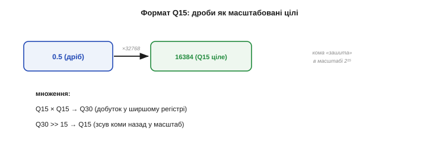
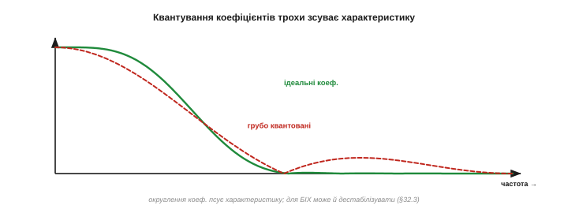

# Реалізація на МК: fixed-point і швидкодія

Фільтр, бездоганний на папері, ще треба **порахувати на залізі** — часто дешевому, без апаратної підтримки дробових чисел і з лічильником тактів на вагу золота. Між «характеристикою на графіку» й «фільтром, що встигає в реальному часі» лежить ціла інженерна тема: **ціла арифметика з фіксованою комою** (*fixed-point*), переповнення, насичення й бюджет тактів. Знехтуєш нею — і чудовий фільтр або повзтиме, або раптом видасть дикий стрибок. Розберімо, як рахувати фільтр **швидко й надійно** на мікроконтролері.

Це місток між красивою теорією й суворою практикою. Проєкт фільтра задає, **що** рахувати — які коефіцієнти на що множити; реалізація вирішує, **як** це лягає в реальний процесор із його скінченними бітами й тактами. Саме тут гине багато «правильних» фільтрів: на папері все добре, а на чипі — або повзе, або зривається в сміття. Тож ці прийоми — не дрібні оптимізації, а різниця між фільтром, що працює, і фільтром, що лише виглядає правильним.

### Чому ціла арифметика

Багато недорогих мікроконтролерів **не мають апаратного блока дробових чисел** (FPU). На таких чипах кожна операція з комою (*float*) не виконується нативно, а **емулюється** довгою підпрограмою — десятки, а то й сотні тактів на одне множення. Ціле ж множення процесор робить **за такт-два**. Тож на фільтрі, де множень тисячі за секунду, різниця колосальна.

Це не екзотика, а буденність нижнього сегмента. Класичний Arduino Uno на 8-бітному AVR не має FPU зовсім; багато дешевих 32-бітних чипів (Cortex-M0/M0+) — теж. На таких float не заборонений, але кожна операція з ним коштує в десятки разів дорожче за цілу, і фільтр на float легко з'їсть увесь процесорний час. Тому fixed-point — стандартний прийом саме там, де чип найдешевший, а ресурсів найменше.


*Рис. Чому цілі числа. На чипі без FPU одна операція з комою (float) емулюється програмно — десятки тактів; ціла операція виконується нативно за такт-два. Для фільтра з тисячами множень на секунду це різниця між «встигає» і «захлинається». Звідси й прийом: рахувати дробові коефіцієнти **цілими** числами.*

Вихід — **представити дроби цілими числами**, домовившись про спільний масштаб. Це і є арифметика з **фіксованою комою**: кома не «плаває», а стоїть на заздалегідь узгодженому місці, а всі числа зберігаються як звичайні цілі.

### Формат із фіксованою комою (Q-формат)

Найпоширеніша домовленість — **Q-формат**. Ідея проста: множимо дробове число на сталий масштаб (степінь двійки) і зберігаємо результат як ціле. У форматі **Q15** масштаб — `2¹⁵ = 32768`, тож дріб із діапазону [−1, 1) кодують 16-бітним цілим:

```
дріб 0.5   →  Q15:  round(0.5 · 32768)  = 16384
дріб 0.25  →  Q15:  round(0.25 · 32768) =  8192
```


*Рис. Формат Q15. Дріб множать на 2¹⁵ і зберігають як ціле (0.5 → 16384). При множенні двох Q15-чисел масштаб подвоюється — виходить Q30, тож результат **зсувають праворуч на 15** назад у Q15. Кома «зашита» в масштабі: ви рахуєте цілими, а домовленість про множник 2¹⁵ робить їх дробами.*

Тонкість — у множенні. Перемноживши два Q15-числа, ви дістаєте **подвійний** масштаб — формат **Q30**; щоб повернутись у Q15, результат **зсувають праворуч на 15** біт (`>> 15`). Цей зсув — і є «повернення коми на місце». Бібліотеки DSP (CMSIS-DSP) працюють саме у Q15 і Q31, і всі їхні фільтри побудовані на цьому прийомі.

Який Q брати — це торг між **діапазоном** і **точністю**. Що більше біт віддано під дробову частину (як у Q15 — усі 15), то точніший дріб, але вужчий діапазон цілих. Q15 ідеально лягає в 16-бітні відліки давачів (діапазон [−1, 1)), а Q31 — у 32-бітні, де треба більше точності (гострі БІХ). Головне — **узгодити** масштаб у всьому тракті: переплутаєш Q15 і Q7 десь у формулі — і коефіцієнти «поїдуть» у сотні разів (2⁸ = 256).

Дрібниця, що теж важить: повертаючи Q30 у Q15 зсувом, можна або просто **відкинути** молодші біти (швидше), або **округлити** (точніше — додавши половину молодшого розряду перед зсувом). Для більшості фільтрів різниця мізерна, та в довгих БІХ систематичне відкидання накопичує невелике зміщення — тоді округлення доречне.

До слова, від'ємні коефіцієнти й відліки в Q-форматі обробляються самі собою — звичайним цілим зі знаком (доповняльний код): жодних окремих дій для мінусів не треба, арифметика та сама. Це робить fixed-point фільтри короткими в коді, хоча й вимогливими до уважності з розрядністю.

### Ширший акумулятор

Перша пастка цілої арифметики — **переповнення суми**. Фільтр [складає багато добутків](book:algorithms/fir-filter), і ця сума росте: навіть якщо кожен доданок уміщається в 16 біт, їхня сума з десятків відводів — ні. Тому **акумулятор** (змінну, де копиться сума) беруть **значно ширшим** за відліки.


*Рис. Запас розрядності. Відлік 16 біт, помножений на коефіцієнт 16 біт, дає вже 32-бітний добуток; а їхня сума з багатьох відводів потребує ще більше — 32 або й 64 біт. Тому проміжну суму коплять у **широкому** акумуляторі, а в 16 біт повертають лише наприкінці. Вузький акумулятор тихо переповниться на середині суми — і фільтр видасть сміття.*

Правило: проміжну суму тримають у **32- або 64-бітному** акумуляторі, а назад у вузький тип (16 біт) повертають **лише наприкінці**, після зсуву. Якщо ж копити суму в тій самій вузькій змінній, що й відліки, вона переповниться десь посередині — і фільтр тихо видасть сміття.

Прикинемо запас на числах. 16-бітний відлік, помножений на 16-бітний коефіцієнт, дає до 32 біт; а сума, скажімо, 64 таких добутків додає ще ~6 біт — разом близько 38. Тому 32-бітного акумулятора для довгого фільтра вже **замало**, а 64-бітного — з головою. Саме тому DSP-функції коплять суму у 64-бітному регістрі, навіть працюючи з 16-бітними даними: зайвий запас тут безпечніший за ощадливість.

### Переповнення й насичення

А що **робити**, коли результат усе ж не влазить у діапазон? Наївна ціла арифметика просто **«загортає»** число: трохи більше за максимум — і воно стрибає до мінімуму (бо старші біти відкидаються). Для сигналу це **катастрофа**: на місці легкого перевищення вискакує дикий стрибок з краю в край.


*Рис. Загортання vs насичення. Коли значення виходить за межу, наївне **загортання** (червоне) перекидає його з +макс на −макс — жахливий стрибок посеред сигналу. Правильна поведінка — **насичення** (зелене): значення впирається в межу й лишається там. Завжди затискайте (*saturate*), а не дозволяйте тихо «загорнутися».*

Правильна поведінка — **насичення** (*saturation*): якщо результат перевищив межу, його **затискають** на максимумі (чи мінімумі), а не загортають. Гірше мати трохи «зрізану» вершину, ніж дикий викид. Багато DSP-інструкцій уміють насичувати апаратно; де ні — додають явну перевірку меж. Ніколи не лишайте суму на ласку тихого загортання.

Переповнення чигає не лише на виході. Найнебезпечніше воно у [зворотному зв'язку БІХ](book:algorithms/iir-filter): там вихід вертається у вхід, тож одне «загорнуте» значення підживлює наступне — і фільтр може зірватися в стійке паразитне коливання. Тому в БІХ насичують **проміжні** результати кожного біквада, а не лише фінальний. КІХ у цьому сенсі знову спокійніший: без петлі переповнення лишається локальним і не накопичується.

### Квантування коефіцієнтів

Друга пастка тонша. Округлюючи коефіцієнти фільтра до цілих (квантуючи їх), ви трохи **міняєте сам фільтр**: характеристика зсувається від ідеальної. Для м'яких фільтрів це дрібниця, а от для гострих — помітно.


*Рис. Похибка коефіцієнтів. Ідеальна характеристика (зелена) і та сама після грубого округлення коефіцієнтів (червона): затримання «спливло» вгору, перехід поплив. Для КІХ це лише трохи гірше гасіння; а для БІХ округлення зсуває полюси й може **штовхнути ледь стабільний фільтр за межу** в розгін — тому БІХ і рахують каскадом біквадів.*

Для **КІХ** наслідок м'який — трохи гірше затримання. А от для **БІХ** квантування коефіцієнтів зсуває полюси й може **дестабілізувати** [ледь стабільний фільтр](book:algorithms/iir-filter) — саме тому БІХ рахують **каскадом біквадів**: у коротких ланках полюси менш чутливі до округлення. Звідси й практичне правило: давайте коефіцієнтам **достатньо біт** (Q15 зазвичай досить, для гострих БІХ — Q31) і **перевіряйте** фільтр уже з квантованими коефіцієнтами, а не лише ідеальними.

Є й підступніший ефект квантування в БІХ — **граничні цикли** (*limit cycles*): через округлення в петлі зворотного зв'язку вихід може застрягти в крихітному незгасному коливанні навіть на нульовому вході, наче фільтр тихенько «бринить». Це не нестабільність-вибух, а дрібний паразитний шум, та для точних вимірювань і він зайвий. Лікують його достатньою розрядністю й обережним округленням — ще один доказ, що БІХ у fixed-point вимагає більшої уваги, ніж КІХ.

> 🔧 **Навіщо це.** Дві захисні звички рятують від 90 % бід цілої арифметики. По-перше, **широкий акумулятор**: копіть суму у 32/64-бітній змінній, у вузьку повертайте лише наприкінці. По-друге, **насичення замість загортання**: на виході й у проміжках затискайте значення на межі, а не дозволяйте їм «перекидатися». Обидві дрібниці коштують кількох рядків, а рятують від раптових диких стрибків, які потім годинами шукаєш.

### Бюджет реального часу

Третій вимір — **час**. Фільтр мусить порахуватися **до приходу наступного відліку**: усі його множення-додавання плюс решта роботи мають укластися в **період відліку** `T = 1/fs`. Перевищив — і фільтр «захлинається», губить відліки.


*Рис. Бюджет на відлік. За кожен період T = 1/fs процесор має встигнути всі MAC-и фільтра (зелене) **плюс** усю іншу роботу. Якщо фільтр з'їдає більшу частину T — запасу на решту нема, і система на межі. Не влазить — знижуйте fs, беріть легший фільтр (менше відводів/нижчий порядок) чи апаратний MAC/SIMD (CMSIS-DSP).*

Тому вартість фільтра прикидають **наперед** у тактах: число MAC-ів на відлік × частота відліків. Якщо тісно — є три виходи: знизити `fs` (якщо [дозволяє Найквіст](book:math/dft)), узяти **легший** фільтр (менше відводів КІХ або [нижчий порядок БІХ](book:algorithms/iir-filter) — БІХ тут і виграє), або задіяти **апаратне** прискорення: інструкцію MAC, SIMD, готові оптимізовані функції CMSIS-DSP, що рахують фільтр у рази швидше за наївний цикл.

І не вгадуйте вартість на око — **зміряйте** її. У більшості МК є лічильник тактів (cycle counter), яким можна обгорнути виклик фільтра й побачити реальну ціну в тактах. Пам'ятайте також, що фільтр — **не єдиний** їдець процесорного часу: поряд працюють АЦП, зв'язок, контур керування. Тому закладайте фільтру лише **частину** періоду відліку, лишаючи запас на решту, — інакше система працюватиме на самій межі й зірветься від найменшого додаткового навантаження.

А що буде, як фільтр **не вкладеться** в період? Нічого доброго: процесор не встигне обробити відлік до приходу наступного, відліки почнуть **губитися** чи опрацьовуватися нерівномірно, і в сигнал прокрадеться тремтіння (*jitter*), а то й аліасинг від пропусків. Тому бюджет тактів — не формальність: перевищення тихо руйнує саму якість фільтрації, заради якої все й затівалося. Краще одразу взяти легший фільтр, ніж потім ловити плаваючі збої.

**Приклад (Q15-множення на пальцях).** Один крок MAC: відлік `0.5`, коефіцієнт `0.25`:

```
відлік x = 0.5  → Q15: 16384
коеф.  b = 0.25 → Q15:  8192
добуток (у 32-біт акумуляторі): 16384 · 8192 = 134 217 728   (це Q30)
повертаємо в Q15:  134 217 728 >> 15 = 4096
перевірка: 4096 / 32768 = 0.125 = 0.5 · 0.25  ✓
```

Жодного дробового числа — самі цілі множення й зсув, які процесор робить миттєво. Помножене на десятки відводів, це і є весь фільтр у fixed-point.

Помітьте ще, що коефіцієнти фільтра теж треба заздалегідь перевести в Q-формат — **раз**, при ініціалізації, — і зберігати вже цілими. Тоді в гарячому циклі лишаються самі цілі множення й зсуви, без жодного дробу. Саме так влаштовані бібліотечні fixed-point фільтри: таблиця цілих коефіцієнтів плюс короткий MAC-цикл зі зсувом наприкінці.

Звідси й типовий робочий процес: фільтр **проєктують і перевіряють** на ПК у звичайних дробових числах (там зручно й точно), а тоді **переносять** на чип, конвертувавши коефіцієнти у Q-формат і додавши широкий акумулятор та насичення. На потужному чипі другий крок не потрібен — `float` лишається як є; на дешевому без нього не обійтися. Так чи так, спершу домагаються правильної характеристики, а вже потім приганяють її під арифметику конкретного заліза.

### Коли можна просто float

І нарешті — хороша новина. Усі ці клопоти з Q-форматом потрібні **лише** на чипах **без** FPU. Сучасні потужніші мікроконтролери (ARM Cortex-M4F, M7, ESP32 та інші) **мають** апаратний float — і на них найрозумніше просто **писати фільтр у звичайних дробових числах**: код простіший, переповнення майже не загрожує, а швидкості й так вистачає. Fixed-point лишають для **найдешевших** чипів (8-бітні AVR, прості Cortex-M0), де float емулюється й тому неприйнятно повільний.

Тенденція, до речі, на боці простоти: FPU дешевшає й трапляється в дедалі скромніших чипах, тож потреба в ручному fixed-point поволі відступає. Та вона не зникне зовсім, поки існують найдешевші 8- і 16-бітні контролери в масових виробах. Тому вміти і просте `float`, і ціле Q15 корисно: перше — для комфорту на потужному залізі, друге — для виживання на копійчаному.

> 🔧 **Навіщо це.** Перше питання реалізації: **чи має ваш чип FPU?** Якщо так (Cortex-M4F/M7, ESP32) — пишіть фільтр у `float`, не ускладнюйте собі життя fixed-point: на залізі з FPU це і просто, і безпечно, і швидко. Якщо ні (AVR, M0) — переходьте на ціле Q15/Q31, але тоді пильнуйте акумулятор і насичення. Не оптимізуйте передчасно: fixed-point ускладнює код, тож беріться за нього лише там, де float справді не тягне.

> 🔧 **Навіщо це.** Не пишіть DSP-цикли самі — беріть **CMSIS-DSP** (чи аналог для вашого чипа). Її функції (`arm_fir_q15`, `arm_biquad_cascade_df1_q15`, їхні `_f32`-версії) уже мають і правильний широкий акумулятор, і насичення, і використання апаратного MAC/SIMD — тобто роблять усе з цієї теми правильно й швидко. Ваша робота — підготувати коефіцієнти й буфер та викликати готову функцію, а не воювати з розрядністю вручну.

Отже, від характеристики на графіку до фільтра, що крутиться в реальному часі, лежить шлях через цілу арифметику, ширший акумулятор, насичення й бюджет тактів — або, на щасливому чипі з FPU, через просте `float` і готову бібліотеку. Підсумок простий: спершу домагаються правильної характеристики у зручних дробових числах, а тоді приганяють її під арифметику конкретного заліза — конвертують коефіцієнти в Q-формат, ставлять широкий акумулятор і насичення там, де FPU немає, і лишають `float` там, де він є. Дотримаєш цих двох-трьох захисних звичок — і навіть на копійчаному 8-бітному чипі фільтр рахуватиметься швидко й без раптових диких стрибків.

---
