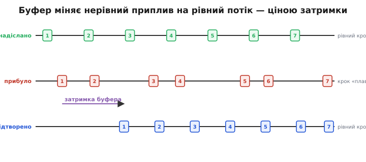
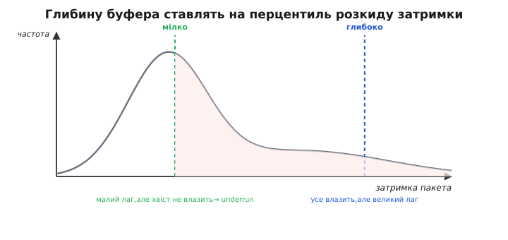
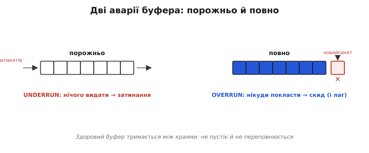

# Буфер джитера

Уяви, що хтось диктує тобі речення рівно по складу на секунду, а кур'єр доносить ці склади з різною затримкою: то два прибіжать разом, то наступного доведеться чекати півтори секунди. Слухати таку мову неможливо — вона смикається. А тепер головне: склади диктували **рівно**, рівність зіпсувала **дорога**. Саме це й коїться з пакетами в мережі. Відправник шле їх рівним потоком, а приходять вони з нерівним інтервалом — це й називають **джитером** (від англійського *jitter* — нервове тремтіння, посмикування; слово 1920-х про дрож рук). І щоб слухач (динамік, екран, керування) знову отримав рівний потік, між мережею й споживачем ставлять **буфер джитера**: невелику чергу, що приймає пакети як прийдуть, а віддає — рівно.

### Чому приплив нерівний

Спершу — звідки взагалі береться джитер, бо без цього буфер виглядає зайвим. Пакет у дорозі не летить вільно: на кожному вузлі він стає в **чергу** за іншими. Коли мережа вільна — черга коротка, пакет проскакує швидко; коли завантажена — стоїть довше. Маршрут між двома сусідніми пакетами може навіть відрізнятися. Тому, хоч відправник випускає пакети чітко по такту, **час у дорозі в кожного свій**, і на тому кінці інтервали між прибуттями стрибають. Це не поодинокий збій, а постійна властивість мережі з розділенням каналу.

Якщо віддавати пакети споживачеві **щойно прийшли**, нерівність піде далі: звук захрипить паузами й здвоєннями, відео сіпатиметься, потік телеметрії то завмре, то хлине. Споживачеві ж потрібен **рівний** темп — динамік грає звук із сталою частотою, екран оновлюється кадрами. Невідповідність між нерівним припливом і рівною потребою хтось мусить погасити. Це й робить буфер.

### Як буфер вирівнює потік

Ідея проста до краси. Буфер **притримує** перші пакети, накопичивши невеликий запас, а тоді починає віддавати їх споживачеві **рівним кроком** — по одному за такт. Доки в черзі є запас, нерівність прибуття вже не страшна: спізнився наступний пакет — споживач бере з запасу й нічого не помічає; прибігли два разом — обидва лягають у чергу й чекають свого такту. Нерівність всотується в буфер, а назовні тече рівний потік.


*Буфер міняє нерівний приплив на рівний потік. Угорі пакети надіслали рівним кроком; посередині вони прибули з джитером — інтервали стрибають; унизу буфер віддав їх знову рівно. Плата за це — зсув управо: перший пакет навмисне притримали, щоб устигли «відстаючі». Цей зсув і є затримка буфера.*

Та задарма нічого не буває, і ось ціна: щоб дочекатися відстаючих, буфер мусить **притримати** і перші пакети теж. Він навмисне відкладає видачу — і весь потік виходить **пізніше**, ніж міг би. Чим більший запас тримаємо, тим певніше переживемо великі затримки, але тим **довша** загальна затримка. Буфер не прибирає джитер безкоштовно — він **обмінює його на сталий лаг**. У цьому й уся суть теми: вибір буфера — це вибір точки на терезах «плавність проти затримки».

### Скільки тримати: глибина буфера

Головне рішення — **глибина** буфера: на скільки притримувати потік. Тут і ховається компроміс. Поставиш мілко — лаг малий, але щойно пакет спізниться сильніше за твій запас, віддавати **нічого**: буфер спорожнів, потік перервався. Поставиш глибоко — переживеш майже будь-яку затримку, зате весь потік повзе з відчутним лагом, хоч мережа здебільшого й була швидка.

Як обрати золоту середину? Дивляться не на одне число, а на **розкид** затримки — на те, як часто трапляється яка затримка в дорозі. Більшість пакетів долітає швидко, та є **довгий хвіст** рідкісних, що спізнюються сильно. Накрити буфером геть усі — означає підлаштуватися під найгірший випадок і нести цей лаг **завжди**. Тому глибину ставлять на **перцентиль** розкиду (від латинського *centum* — сто; яка затримка не перевищується в заданій частці пакетів). Скажімо, на 95-й перцентиль: запасу вистачить на 95 пакетів зі ста, а решта п'ять, найповільніших, спізняться й будуть втрачені. Це свідома жертва: трохи плавності в обмін на помітно менший лаг.


*Глибину ставлять на перцентиль розкиду затримки. Крива — як часто трапляється яка затримка: більшість пакетів швидкі, але хвіст довгий. Мілкий буфер (зелена лінія) дає малий лаг, та залишає хвіст за бортом — ці пакети спізняться (underrun, рожева зона). Глибокий (синя) накриває майже все, але стоїть далеко справа — лаг великий завжди. Перцентиль — це вибір, де провести лінію.*

> 🔧 **Навіщо це.** Глибину буфера не підбирають «на око» — її **рахують із виміряного розкиду** затримки на твоєму каналі. Заміряй гістограму часу в дорозі, візьми, скажімо, 95-й чи 99-й перцентиль — і це твоя глибина. Поставиш буфер «про всяк випадок з запасом» — отримаєш зайвий лаг там, де його можна було не мати; поставиш упритул до медіани — половина пакетів спізнюватиметься. У керуванні дроном цей лаг прямо їсть [бюджет затримки в петлі](book:algorithms/latency-sync), тож кожна зайва мілісекунда буфера — це гірша керованість.

### Дві аварії: underrun і overrun

Коли глибина не вгадана, буфер ламається двома протилежними способами, і їх варто розрізняти на ім'я.

**Underrun** (від англійського *under run* — недобір, «вибіг з-під») — буфер **спорожнів**. Споживачеві час брати наступний пакет, а черга порожня: пакет ще в дорозі або вже не встигне. Віддавати нічого — потік **перервався**. У звуку це чутно як клацання чи провал тиші, у відео — як завмирання кадру, у керуванні — як пропуск виміру. Underrun каже: буфер **замілкий** для цього джитеру.

**Overrun** (від англійського *over run* — перебір, «перебіг через край») — буфер **переповнився**. Пакети приходять швидше, ніж споживач їх забирає (мережа наздогнала відставання й хлинула), черга заповнилась ущерть — і новому пакету **нікуди лягти**. Його доводиться **скинути**. Гірше того: якщо буфер натомість роздувається, щоб усіх умістити, він **накопичує лаг** — затримка повзе вгору й уже не вертається. Overrun каже: буфер **заглибокий** або погано керує своїм наповненням.


*Дві аварії буфера. Зліва черга спорожніла: пакети не встигли, видавати нічого — underrun, потік затинається. Справа черга заповнена вщерть: новий пакет нікуди покласти, його скидають — overrun, та ще й лаг росте. Здоровий буфер тримається між цими краями: не пустіє й не переповнюється.*

Здоровий буфер живе **між** цими краями: завжди має кілька пакетів у запасі (не пустіє), але й не забитий ущерть (не переповнюється). Уся наука про буфери джитера — як утримати його в цьому вузькому здоровому коридорі попри мінливу мережу.

### Фіксований проти адаптивного

Звідси й два підходи до глибини. **Фіксований** буфер тримає глибину **сталою**: налаштували раз — і не чіпаємо. Він простий і передбачуваний, та має слабину — мережа ж не стала. Поставиш глибину під найгірші хвилини — у спокійні нестимеш зайвий лаг; поставиш під спокій — у бурю посиплеться underrun. Один розмір не вгодить усім станам мережі.

Тому частіше беруть **адаптивний** буфер: він **сам підлаштовує** глибину під свіжі умови. Прийом такий: буфер увесь час стежить за затримкою останніх пакетів і **оцінює** її розкид — типову затримку плюс запас на її коливання. Коли мережа розхитується, він **поглиблюється** наперед, щоб устигати за хвостом; коли заспокоюється — обережно **мілішає**, повертаючи лаг. На практиці затримку й її коливання тримають не як гору сирих чисел, а як ковзні оцінки — згладжене середнє і згладжений розкид, що дешево оновлюються з кожним пакетом (та сама ідея, що в [експоненційному згладжуванні](book:algorithms/ema)). Так буфер веде глибину за мережею, тримаючись якомога мілкішим без зайвих провалів. Класичний живий приклад — буфер NetEQ у WebRTC, що так тягне затримку голосу за станом каналу в реальному часі.

> 🔧 **Навіщо це.** Адаптивний буфер не дармовий: міняти глибину на ходу теж непросто. Поглибитися легко — просто притримай більше; а от **змілішати**, не пробивши потоку паузою, треба обережно, бо викинути зайве — це або пропустити пакети, або тонко «підрізати» темп відтворення. Тому в живих системах глибину міняють **повільно й несиметрично**: швидко вгору при загрозі, поволі вниз при затишші. Зрозумієш цю несиметрію — зрозумієш, чому затримка дзвінка стрибає вгору миттєво, а спадає назад поволі.

### Worked-приклад: обрати глибину за перцентилем

Покажемо вибір глибини на числах. Нехай ми зміряли час у дорозі останніх пакетів і знаємо: типова (медіанна) затримка — 20 мс, а її розкид (наскільки розгойдується хвіст) — характеризуємо величиною σ ≈ 8 мс. Споживач забирає пакети кроком 10 мс (100 разів на секунду). Питання: на скільки притримувати потік, щоб переживати хвіст «з імовірністю близько 99 %», і скількох пакетів запасу це варте.

:::tabs
```cpp
// усе в мілісекундах
const float delay_med  = 20.0f;   // типова (медіанна) затримка в дорозі
const float jitter_sd  =  8.0f;   // розкид затримки (σ)
const float frame_ms   = 10.0f;   // крок видачі споживачеві (100 Гц)

// 1) цільова глибина = типова затримка + запас на хвіст.
//    запас ~3·σ накриває близько 99 % розкиду (правило трьох сигм)
float target_depth = delay_med + 3.0f * jitter_sd;   // = 20 + 24 = 44 мс

// 2) скільки це пакетів у черзі (округлюємо вгору — недобір гірший за надлишок)
int   depth_pkts   = (int)ceilf(target_depth / frame_ms);  // ceil(44/10) = 5
```
```py
import math

# усе в мілісекундах
delay_med = 20.0   # типова (медіанна) затримка в дорозі
jitter_sd =  8.0   # розкид затримки (σ)
frame_ms  = 10.0   # крок видачі споживачеві (100 Гц)

# 1) цільова глибина = типова затримка + запас на хвіст.
#    запас ~3·σ накриває близько 99 % розкиду (правило трьох сигм)
target_depth = delay_med + 3.0 * jitter_sd   # = 20 + 24 = 44 мс

# 2) скільки це пакетів у черзі (округлюємо вгору — недобір гірший за надлишок)
depth_pkts = math.ceil(target_depth / frame_ms)   # ceil(44/10) = 5
```
:::

Порахуємо запас крок за кроком:

```
глибина (час) = 20 + 3·8 = 20 + 24 = 44 мс
глибина (пакети) = ceil(44 / 10) = ceil(4.4) = 5 пакетів
```

Отже, тримаємо в черзі **5 пакетів** (≈ 44 мс лагу). Що це дає й чим коштує:

- **Плавність.** Запасу вистачить, поки чергова затримка не перескочить 44 мс. За правилом трьох сигм такі викиди трапляються приблизно в 1 пакета зі 100 — решта 99 проходять без провалу.
- **Underrun.** Той рідкісний 1 пакет зі 100, що спізниться понад 44 мс, прийде, коли запас вичерпано: буфер на мить **спорожніє**, споживач почує мікропровал. Хочемо менше — беремо більший запас (4σ замість 3σ), але платимо ще лагом.
- **Overrun.** Якщо мережа надолужить відставання й хлине пачкою, 6-й пакет понад наші 5 комірок **нікуди покласти** — його скинемо (або, в адаптивному варіанті, дозволимо черзі тимчасово підрости, прийнявши трохи зайвого лагу).
- **Лаг.** За все це платимо **44 мс** сталої затримки. Поставили б запас 2σ — лаг упав би до 36 мс, та провали почастішали б; 4σ — плавніше, але вже 52 мс.

Цифри умовні, але видно головне: глибину **виводять із виміряного розкиду**, а не вгадують, і кожен крок убік — це свідомий обмін плавності на лаг.

### Де це працює і де ні

Буфери джитера стоять усюди, де нерівний приплив треба обернути на рівний потік. Класика — **голос через мережу** (телефонія поверх IP): без буфера розмова хрипить і рветься. Так само **відео** в реальному часі: приймальний бік накопичує кадри, щоб картинка не сіпалась, — і цей самий буфер є помітною ланкою в [загальній затримці відео](book:programming/video-latency). Так само потоки **телеметрії** з апарата: щоб ряд показів ішов рівним темпом, а не пачками. І скрізь буфер свідомо торгує лагом — як споріднена з ним [втрата пакетів на каналі](book:communications/bandwidth-loss) торгує цілістю даних.

Та є **межа**, де цей обмін стає неприйнятним: **керування реального часу**. Коли контур стабілізації мусить реагувати негайно, навмисний лаг буфера — отрута: краще взяти найсвіжіший пакет і змиритися з нерівністю, ніж рівно, але **запізно**. Тут діє те саме правило, що й у [поєднанні давачів](book:algorithms/latency-sync): затримка у зворотному зв'язку — головний ворог стійкості, тож плавність ради лагу віддають радо лише там, де **лаг терпимий** (вухо, око), і неохоче там, де від свіжості залежить, чи апарат утримає рівновагу.

### Що з цього лишається

Пакети приходять із нерівним інтервалом — це **джитер**, спадок черг і змінних маршрутів у мережі. Буфер джитера приймає їх як прийдуть, а віддає **рівним кроком**, усотавши нерівність у невелику чергу, — але платить за це **сталим лагом**: він обмінює джитер на затримку, не прибирає задарма. Головне рішення — **глибина**: мілко означає малий лаг ціною провалів (**underrun**, буфер спорожнів), глибоко — плавність ціною лагу (а при переповненні — **overrun**, скид пакетів). Тому глибину ставлять на **перцентиль** виміряного розкиду затримки, а ще краще — роблять буфер **адаптивним**, щоб вів глибину за мережею: швидко поглиблювався в бурю, поволі мілішав у затишок. Працює це там, де лаг терпимий, — голос, відео, телеметрія, — і відступає там, де свіжість важливіша за плавність: у **керуванні реального часу**, де навіть малий навмисний лаг коштує стійкості.
