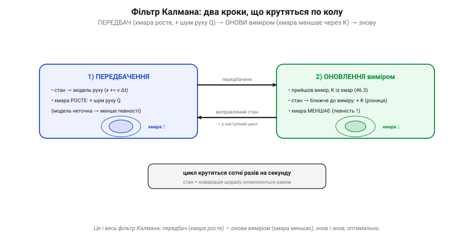

# Фільтр Калмана / EKF концептуально

Уся логіка фьюжну зводиться до двох рухів: [передбачення](book:algorithms/motion-model) штовхає оцінку вперед моделлю руху, а [зважування за довірою](book:algorithms/predict-vs-measure) підтягує її до виміру. **Фільтр Калмана** — це їхній строгий, математичний шлюб: той самий цикл «передбач → виправ», але з акуратним обліком тієї «хмари» невпевненості, яку доти описували на пальцях. Саме він уже понад півстоліття є серцем майже кожного оцінювача стану — від «Аполлона» до твого дрона. Розберімо його концептуально, без важких матриць, але чесно.

### Стан і його хмара: коваріація

Перша ключова річ: фільтр веде **дві** речі воднораз. Не лише **оцінку стану** (найкращу здогадку — де апарат, як швидко, як нахилений), а й її **коваріацію** — ту саму «хмару» невпевненості, тільки записану числами.

*Рис. Оцінка — це точка плюс хмара. Поряд із найкращою здогадкою (точкою) фільтр веде **коваріацію** — формальний розмір і форму хмари невпевненості. Мала хмара (зелена) — оцінці можна вірити; велика (бурштинова) — вона розмита. Хмара не додаток, а рівноправна половина оцінки: фільтр завжди знає не лише «де я», а й «наскільки я певен».*

Коваріація — це формальний розмір і форма хмари: наскільки фільтр **певний** у кожній складовій стану. Мала хмара — оцінці можна вірити; велика — вона розмита. Це не якийсь додаток, а **рівноправна половина** оцінки: фільтр Калмана завжди знає не лише «де я», а й «наскільки я в цьому певен». І саме хмара керує всім — бо з неї рахується підсилення, і саме вона росте в передбаченні й меншає в корекції.

### Два кроки, одне коло

Тепер — увесь фільтр, як він крутиться. Це той самий двокроковий цикл «[передбач і виправ](book:algorithms/predict-vs-measure)», тільки тепер ми стежимо й за хмарою.

*Рис. Увесь фільтр одним колом. **Крок 1, передбачення**: стан іде крізь модель руху, а хмара роздувається — додаємо «шум руху» Q (модель неточна → менше певності). **Крок 2, оновлення**: приходить вимір, із співвідношення хмар рахується підсилення K, стан підтягується до виміру, а хмара стискається (певність зросла). Виправлений стан із меншою хмарою йде в наступний цикл — і так сотні разів на секунду.*

**Крок 1 — передбачення.** Беремо стан, проганяємо крізь модель руху (x += v·Δt), а хмару **роздуваємо**: модель неточна, тож додаємо до неї «шум руху» (його позначають Q) — мовляв, за цей крок ми трохи менше певні. **Крок 2 — оновлення.** Прийшов вимір; із співвідношення хмар (наскільки певні передбачення проти виміру) фільтр рахує **підсилення K**; підтягує стан до виміру на K×(вимір − передбачення); а хмару **стискає** — після злиття певності побільшало. Тоді виправлений стан із меншою хмарою йде в наступне передбачення, і все повторюється сотні разів на секунду. Передбач — хмара росте; онови — хмара меншає (коли вимір **незалежний і добре змодельований**; хибний чи скорельований краще відкинути «брамою», ніж ним «оновлюватись»). Уся премудрість.

### Чому це оптимально, а не просто розумно

Тут варто спинитися на слові, яке робить фільтр Калмана особливим: **оптимальний**. Калман довів, що **за певних умов** (рух і виміри **лінійні**, шуми — гаусові «дзвоники», а коваріації **правильно задані**) його фільтр дає **найкращу можливу** оцінку — оптимальну в строгому сенсі. Це не вдалий трюк і не одна з евристик: це **математично доведений** найкращий лінійний спосіб поєднати передбачення з вимірами. (Поза цими умовами — для нелінійних чи негаусових задач — оптимальність уже не гарантована, і в діло йдуть його нащадки: EKF, UKF, фільтри частинок, згладжувачі.) Саме тому Калманів фільтр і став основою всієї галузі.

### Магія коваріації: одне виправляє пов'язане

А тепер найкрасивіше, заради чого варто було морочитися з хмарою-матрицею, а не просто числом. Коваріація зберігає не лише **розмір** невпевненості кожної змінної, а й **зв'язки** між ними.

*Рис. Чому хмара — матриця, а не число. Якщо положення й швидкість пов'язані (був далі — мабуть, і рухався швидше), цей зв'язок записаний як **нахил** хмари. І тоді вимір самого лише **положення** (зелена лінія) зсуває оцінку вздовж нахилу — підправляючи **й швидкість**, якої ніхто не міряв. Один вимір цілющий для всіх пов'язаних змінних.*

Уяви, що оцінюєш **положення** і **швидкість**. Вони пов'язані: якщо ти насправді був трохи далі, то, певно, і рухався трохи швидше. Цей зв'язок записаний у коваріації як **нахил** хмари. І ось чудо: коли приходить вимір самого лише **положення**, фільтр, користуючись цим нахилом, підправляє **й швидкість** — хоч її ніхто не міряв! Один вимір цілющий для всіх пов'язаних із ним змінних. Саме тому на дроні відлік GPS (позиція) покращує й оцінку швидкості, а часом і вирівнювання гіроскопа: коваріація розносить користь від одного виміру по всьому стану. Оце і є те, чого не дасть жоден простий усереднювач.

> 📜 Сам фільтр народився 1960 року, коли угорсько-американський інженер **Рудольф Калман** (*Rudolf Kálmán*) опублікував статтю «Новий підхід до лінійної фільтрації та передбачення». Спершу її зустріли з **недовірою**: математикам вона здавалася підозріло простою, а авторові навіть довелося проштовхувати публікацію. Та інженери побачили золото: Стенлі Шмідт із NASA, ледь розібравшись у статті, упізнав у ній відповідь для навігації «Аполлона» — і фільтр полетів до Місяця. Відтоді він тихо оселився чи не в кожному GPS-приймачі, телефоні, супутнику й дроні. А 2009 року президент Обама вручив Калманові Національну медаль науки — найвищу наукову відзнаку США. Невелика формула, що зважує здогад проти виміру, виявилася однією з найкорисніших в історії техніки.

### EKF: коли світ нелінійний

Лишилася одна заковика. Класичний фільтр Калмана вимагає, щоб усе було **лінійним** — прямі залежності. А реальний апарат **нелінійний**: оберти, тригонометрія курсу, перехід від кутів до координат — усе це криві, а не прямі. Як бути?

*Рис. Розширений фільтр (EKF) і лінеаризація. Справжня залежність крива (синя), а класичний Калман любить прямі. EKF бере **дотичну** до кривої в точці теперішньої оцінки (бурштинова) й удає, що поблизу все лінійне. Працює, поки оцінка близька до правди — далеко від точки дотична вже бреше. Саме так — **розширивши** фільтр Калмана лінеаризацією (EKF) — Стенлі Шмідт пристосував його до нелінійної навігації «Аполлона»; в ArduPilot оцінювач — теж EKF.*

Відповідь — **розширений фільтр Калмана** (*Extended Kalman Filter, EKF*). Ідея проста й зухвала: якщо світ кривий, а фільтр любить прямі — то на кожному кроці **випрямляй криву** в одній точці. EKF бере **дотичну** до нелінійної моделі в точці теперішньої оцінки й удає, що поблизу все лінійне, — і застосовує звичайний Калман. Це працює, **поки оцінка близька до правди** (дотична добре наближає криву лише поряд); якщо ж оцінка сильно схибить, наближення збреше й фільтр може «розійтися». Саме так Стенлі Шмідт **розвинув розширений фільтр** (EKF; його варіант звуть ще *фільтром Шмідта–Калмана*), пристосувавши Калманову теорію до нелінійної навігації «Аполлона» та її обчислювальних обмежень. А в ArduPilot оцінювач стану — це теж EKF (відомий як EKF2/EKF3): він і зводить докупи IMU, GNSS, баро й магнітометр у єдину оцінку, що нею живе весь політ.

> 🔧 **Навіщо це.** Тепер параметри фьюжну в наземній станції читаються змістовно: «шум» кожного давача — це його хмара (скільки йому довіряти), а «шум процесу» — як швидко роздувати хмару в передбаченні. А ще: EKF може **розійтися**, якщо стартова оцінка кепська (тому апарат перед зльотом стоїть і «вирівнюється») або якщо давач раптом збрехав сильно. Здоров'я EKF видно в логах — за «несподіванками» (innovations) і розміром хмари; різкий стрибок — сигнал, що оцінка перестала довіряти собі.

### Підсумок теми

Фільтр Калмана — це строге втілення циклу «передбач → виправ», де поряд зі станом ведеться його **коваріація** — формальна «хмара» певності. У передбаченні хмара росте (додаємо шум руху Q), у корекції — меншає (вимір зважується підсиленням K, що саме рахується з хмар). Для лінійно-гаусових систем це **доведено-оптимальна** оцінка, а її коваріація ще й розносить користь одного виміру на всі пов'язані змінні (вимір положення підправляє швидкість). Реальний нелінійний апарат обслуговує **EKF**, що щокроку випрямляє криву дотичною в точці оцінки, — саме він стоїть в ArduPilot. Цей механізм оживає, коли на дроні в одну оцінку [зливаються IMU, баро, GNSS і магнітометр](book:algorithms/sensor-fusion-2).

---
