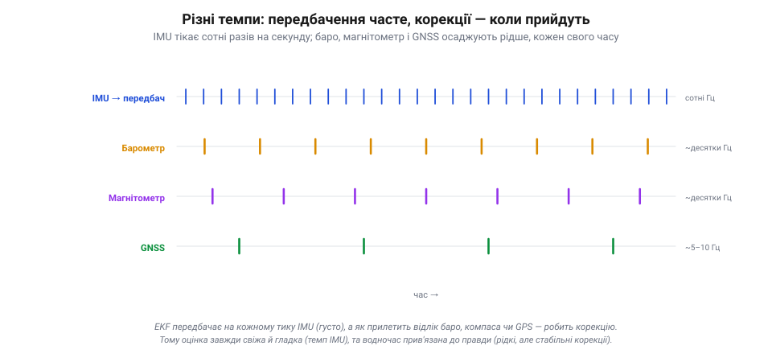
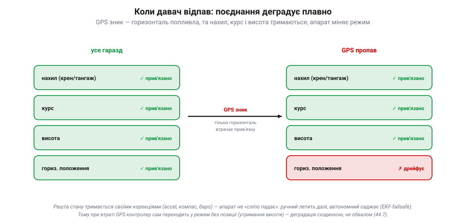

# ⚙️ Поєднання давачів у польоті

Завдання просте на словах і підступне на ділі: тримати на дроні одну несуперечливу оцінку стану — де він, як швидко рухається, як нахилений, куди дивиться — маючи **чотири** дуже різні давачі. Гіроскоп з акселерометром (разом — IMU), барометр, GNSS і магнітометр кожен бачать свій клапоть правди, по-своєму бреше і йде у своєму темпі. [Фільтр Калмана](book:algorithms/kalman-ekf) з його циклом «передбач → виправ» — це механізм, що зводить їх докупи. Подивімося на нього **в роботі**: хто з давачів що робить, чому всі вони потрібні і де тут пастки, на яких ламаються реальні апарати.

### Розподіл праці: хто веде, хто осаджує

Перше, що треба вкласти в голову: давачі **не рівноправні** у поєднанні. Один із них — **IMU** — особливий: він веде [передбачення](book:algorithms/motion-model). Гіроскоп і акселерометр швидкі (сотні разів на секунду), тож саме вони щомиті штовхають оцінку вперед — це кістяк, основа. Решта давачів — баро, GNSS, магнітометр — приходять рідше й роблять [корекцію](book:algorithms/predict-vs-measure): кожен осаджує дрейф IMU у **своїй** частині стану.


*Поділ праці в поєднанні. IMU (гіро + акселерометр) швидкий, тож веде **передбачення** всього стану — це кістяк. Повільніші магнітометр, барометр і GNSS роблять **корекцію**, кожен осаджуючи дрейф IMU у своїй частині: компас — курс, баро — висоту, GNSS — положення і швидкість. Швидка дрейфлива основа плюс рідкі стабільні «якорі».*

Чому так? Бо IMU **самодостатній і швидкий**, але дрейфливий; а кожен із інших **повільний, зате стабільний** у своєму. Тож природний поділ: IMU несе оцінку між корекціями, а зовнішні давачі раз у раз «прив'язують» її до правди. Це те саме [поєднання «швидке + стабільне»](book:algorithms/sensor-insufficiency), тільки тепер розписане по конкретних приладах.

### Хто що утримує

Тепер найважливіше для розуміння — **яку частину стану утримує який давач**. Кожну величину хтось **передбачає** (завжди IMU) і хтось **прив'язує** (свій коректор).


*Хто яку величину утримує. Кожну штовхає вперед IMU (передбачення), а прив'язує до правди свій коректор: нахил — акселерометр (гравітація), курс — магнітометр, висоту — барометр (+GNSS), горизонтальне положення — GNSS. Два вузькі місця: курс тримає **лише** компас, позицію — **лише** GPS; відпаде — замінити нема ким.*

- **Крен і тангаж** (нахил): гіроскоп передбачає, **акселерометр** прив'язує — бо в спокої він [«бачить» вектор гравітації](root:embedded/imu-barometer), тобто де низ. Так оцінка нахилу не дрейфує.
- **Курс** (yaw, поворот навколо вертикалі): гіроскоп передбачає, а прив'язує найчастіше **магнітометр** (він бачить, де північ). Та він не єдиний: сучасний ArduPilot уміє брати курс і з **двоантенного GPS** (*moving baseline*), із зовнішньої навігації (*ExternalNav*), ба навіть оцінювати його з рухів за GPS (фільтр **GSF**) — тож компас тут хоч і головний, але **замінний**.
- **Висота**: акселерометр передбачає (подвійний інтеграл), **барометр** прив'язує (швидкий вертикальний орієнтир), а GNSS додає грубу абсолютну прив'язку.
- **Горизонтальне положення й швидкість**: акселерометр передбачає, а прив'язує зазвичай **GNSS** — найдоступніше джерело абсолютних координат. (Але не єдине: у приміщенні чи без супутників позицію дають **оптичний потік**, зовнішня навігація (*ExternalNav*, камери типу T265), радіомаяки чи системи на кшталт Vicon.)

Зверни увагу на два типові **вузькі місця**: у звичайному наборі (IMU + GNSS + баро + компас) курс тримає **компас**, а горизонтальну позицію — **GPS**. Інші джерела (GPS-курс, оптичний потік, зовнішня навігація, маяки) існують, та коли їх нема — саме ці дві прив'язки стають найслабшою ланкою, бо замінити їх нема ким.

> 🔧 **Навіщо це.** Звідси читаються типові негаразди. «Поплив» курс, апарат повертає кудись не туди в авто-режимах — підозрюй **магнітометр** (близько мотор, струм, залізо), бо курс більше нема кому виправити. «Попливла» позиція, дрон дрейфує в режимі утримання — це **GPS** (погане небо). А хитається нахил у спокої — дивись **акселерометр** і вібрації. Знаючи, хто що прив'язує, ти зразу знаєш, де копати.

### Різні темпи, один потік

Усі ці давачі ще й **різношвидкісні**, і фільтр спокійно це переварює.


*Різні темпи, один потік. IMU тікає сотні разів на секунду — і на кожному тику фільтр передбачає. Барометр і магнітометр корегують десятки разів на секунду, GNSS — лише кілька (5–10 Гц). Корекцію вставляють тоді, коли прилетів відлік. Тому оцінка свіжа й гладка (темп IMU) і водночас прив'язана до правди (рідкі стабільні корекції).*

IMU тікає сотні разів на секунду — і на **кожному** його тику фільтр робить передбачення. А корекції прилітають **коли прийдуть**: барометр і магнітометр — десятки разів на секунду, GNSS — лише кілька (5–10 Гц). Щойно прилетів відлік будь-якого давача, фільтр вставляє корекцію саме за ним, для його частини стану. Тому оцінка завжди **свіжа й гладка** (у темпі IMU) і водночас **прив'язана до правди** (рідкими, зате стабільними корекціями). Жодної потреби, щоб давачі йшли в ногу: кожен зважується тоді, коли має що сказати.

### Коли давач відпав: плавна деградація і EKF-failsafe

І ось де поділ праці показує всю свою красу — у відмові. Що буде, якщо один давач замовкне?


*Плавна деградація. Поки все працює, кожна частина стану прив'язана (ліворуч, зелене). Зник GPS — і лише **горизонтальне положення** втрачає прив'язку й дрейфує на IMU (праворуч, червоне); нахил, курс і висота тримаються своїми корекціями. Апарат не «сліпо падає», а **керовано реагує** (у ручному режимі летить далі; у GPS-залежних автономних — EKF-failsafe зазвичай саджає) — деградація сходинкою, не обвалом.*

Уяви, що **GPS пропав** (заїхали під міст, погане небо, глушилка). Що станеться? Горизонтальне положення втратить єдину свою прив'язку й почне **дрейфувати** на самому IMU — його хмара поповзе ширшати. Але **нахил, курс і висота — цілі**: їх тримають акселерометр, компас і баро, яким до GPS байдуже. Що буде далі — залежить від режиму. У **ручному** режимі (де позиція й не потрібна) апарат летить собі далі, лише втративши утримання точки. А от у **автономних, GPS-залежних** режимах (Loiter, Auto, RTL…) контролер це помічає (хмара тієї частини стану росте) і вмикає **EKF-failsafe** — типово **переходить на посадку** (саме щоб погана оцінка не спричинила «втечу»/flyaway). Тобто апарат не «сліпо падає», а **керовано реагує**. Це й є [деградація сходинкою](book:programming/redundancy), а не обвалом: відмова однієї прив'язки забирає одну здатність, а не весь політ.

Так само з рештою: збився компас — попливе курс, а позиція й висота тримаються; завадив баро потік від гвинтів — засмикається висота, а решта ціла. У доброму разі фільтр втрачає приблизно стільки, скільки забрав відмовлений давач, — бо кожну частину стану стереже свій коректор.

### Пастки: давач, що бреше правдоподібно

Плавна деградація — не гарантія, а лише добрий типовий випадок. Найгірша відмова — не та, коли давач замовкає (це фільтр помічає одразу: відліки зникли, хмара тієї частини стану росте), а коли він **бреше правдоподібно**. Повільний відхід компаса від магнітних завад, «глітч» GPS на кілька метрів, барометр, що ловить хвилю тиску від гвинтів, — усі вони видають значення, схожі на правду, тож фільтр якийсь час чесно ними «оновлюється» й тягне за собою оцінку в хибний бік.

Захист тут двошаровий. Перший — **брама невідповідності** (*innovation gate*): фільтр щоразу дивиться, наскільки вимір розійшовся з передбаченням; якщо «несподіванка» завелика як на очікувану хмару, відлік відкидають, а не приймають. Це ловить різкі викиди. Та повільний відхід брама пропускає — він-бо щоразу в межах. Тому є другий шар: **окремий моніторинг здоров'я** оцінювача (в ArduPilot — ті самі innovations і коефіцієнти варіації у логах), і вже він вмикає EKF-failsafe, коли довіра до оцінки падає системно.

Звідси дві практичні засади. Перша: **позиціюй і захищай вузькі давачі** — компас геть від силових проводів і феромагнетика, GPS-антену на чисте небо, барометр під піну від поривів гвинтів. Друга: **не сприймай мовчання логів як справність** — здоров'я EKF моніторять окремо саме тому, що найнебезпечніша брехня не схожа на відмову. І наскрізне застереження, що знецінює всю злагоду, якщо його знехтувати: кожен відлік мусить приходити **вчасно й коректно позначений у часі** — [затримки й неузгодженість у часі](book:algorithms/latency-sync) здатні непомітно зіпсувати навіть бездоганний за рештою фільтр, бо корекцію тоді приклеюють не до того передбачення.

### Той самий поділ — у коді контролера

Зведімо все докупи так, як це справді крутить польотний контролер. Є одна функція, яку кличуть **на кожному тику IMU**: вона завжди починає з передбачення (IMU веде увесь стан), а тоді роздає корекції — кожну лише тоді, коли для неї надійшов **свіжий відлік**. Уся «таблиця, хто що утримує» стискається тут у кілька викликів.

```c
#include <stdint.h>
#include <stdbool.h>

typedef struct { float gx, gy, gz;              // гіроскоп, рад/с  → веде передбачення
                 float ax, ay, az; } ImuSample; // акселерометр, м/с² → тримає нахил
typedef struct { float mx, my, mz; } MagSample;         // магнітометр → курс
typedef struct { float alt, var;   } BaroSample;        // висота (м) та шум виміру (м²)
typedef struct { float n, e, vn, ve, var; } GnssSample; // положення й швидкість

// Стан оцінювача поділено на зрізи — кожен прив'язує свій коректор.
typedef struct {
    float roll, pitch;          // нахил       <- акселерометр
    float yaw;                  // курс        <- магнітометр
    float alt,  P_alt;          // висота      <- барометр (і хмара висоти)
    float pos_n, pos_e;         // горизонталь <- GNSS
    float vel_n, vel_e;         // швидкість
    // повну коваріацію P тут опущено — на видноті сама диспетчеризація
} State;

// Шина давачів: прапор fresh піднятий лише в того, для кого цей такт — новий відлік.
typedef struct {
    ImuSample imu;                                 // є ЗАВЖДИ (веде передбачення)
    struct { bool fresh; MagSample  s; } mag;
    struct { bool fresh; BaroSample s; } baro;
    struct { bool fresh; GnssSample s; } gnss;
} SensorBus;

// Один такт оцінювача. Викликають на кожен тик IMU (сотні разів на секунду).
void ekf_step(State *x, const SensorBus *bus, uint32_t now_us)
{
    // 1. ПЕРЕДБАЧЕННЯ — завжди. Гіроскоп жене увесь стан і роздуває хмару (додає Q).
    ekf_predict(x, &bus->imu);

    // 2. КОРЕКЦІЯ — кожен коректор осаджує СВІЙ зріз стану.
    correct_tilt(x, &bus->imu, now_us);            // акселерометр того ж IMU -> нахил
    if (bus->mag.fresh)  correct_heading (x, &bus->mag.s,  now_us);   // -> курс
    if (bus->baro.fresh) correct_altitude(x, &bus->baro.s, now_us);   // -> висота
    if (bus->gnss.fresh) correct_position(x, &bus->gnss.s, now_us);   // -> горизонталь
}
```

Передбачення одне й безумовне; повільні корекції сховані за `if`-ами про свіжість. Ось звідки заразом і **гладкість** (стан оновлюється щотакту), і **прив'язка** (кожен зріз раз у раз підтягує свій давач), і **байдужість до темпів** (нема свіжого відліку — нема й виклику цього такту).

Усередині корекції ховаються ще два механізми — брама невідповідності й відмітка здоров'я. Ось висотна корекція цілком (решта коректорів збудовані за тим самим зразком, кожен у свій зріз):

```c
typedef struct { uint32_t last_us; bool healthy; } SensorHealth;
static SensorHealth baro_health;

// Корекція висоти барометром — осаджує ЛИШЕ вертикальний зріз стану.
static void correct_altitude(State *x, const BaroSample *baro, uint32_t now_us)
{
    float innov = baro->alt - x->alt;      // інновація: вимір - передбачення
    float S     = x->P_alt + baro->var;    // дисперсія інновації = хмара + шум давача

    if (innov * innov > 25.0f * S)         // брама: викид далі 5 сигм (5^2 = 25) — відкинути
        return;                            // «глітч» до стану не потрапляє

    float K  = x->P_alt / S;               // підсилення: хмара проти шуму барометра
    x->alt  += K * innov;                  // висоту підтягуємо до виміру
    x->P_alt = (1.0f - K) * x->P_alt;      // хмара висоти стискається

    baro_health.last_us = now_us;          // відлік прийнято — давач живий
    baro_health.healthy = true;
}
```

Корекція чіпає **тільки** `x->alt` і його хмару — жодного іншого зрізу; тому й відмова барометра забирає саму висоту, а не курс чи положення. Це і є плавна деградація, записана в коді. Брама `innov² > 25·S` відкидає викид далі п'яти сигм, не пускаючи «глітч» у стан. А поле `last_us` — місток до failsafe: за ним стежить окремий сторож.

```c
static SensorHealth gnss_health;   // correct_position штампує його так само, як барометр

// Сторож здоров'я: давач, що замовк, більше не прив'язує свій зріз —
// хмара цього зрізу росте на самому IMU. Це й вмикає EKF-failsafe в авто-режимах.
void ekf_health_check(uint32_t now_us)
{
    if (now_us - gnss_health.last_us > 500000u)  // 0.5 с без свіжого GPS
        gnss_health.healthy = false;             // горизонталь тепер дрейфує на IMU
    // решті давачів — свої таймаути, кожному за його темпом
}
```

Отак увесь поділ праці стає трьома перевірками: свіжість (`fresh`) розводить давачі різного темпу, брама (`innov² > 25·S`) ловить різкий викид, таймаут (`now − last_us`) ловить мовчання. Єдине, чого ці перевірки не спіймають, — давач, що бреше правдоподібно й повільно (кожен відлік у межах брами, відліки надходять): його стереже вже не ця петля, а окремий моніторинг довіри до оцінки.

> 📜 Що апарат можна вести, **довіряючи самим приладам**, людство вперше довело 1929 року. 24 вересня лейтенант **Джиммі Дуліттл** (*Jimmy Doolittle*) піднявся в небо над аеродромом Мітчел-Філд із **накритою ковпаком** кабіною — нічого не бачачи назовні — і виконав перший в історії повністю «сліпий» зліт, політ і посадку лише за приладами. Серцем були щойно винайдені **гіроскопічний авіагоризонт** і **курсовий гіроскоп** Сперрі (плюс точний висотомір Кольсмана): авіагоризонт показував крен і тангаж, курсовий гіроскоп — напрям. Це той самий набір величин — нахил, курс, висота, — що його сьогодні зводить EKF дрона з копійчаних MEMS. Дуліттл довів принцип; фільтр Калмана через тридцять років зробив його дешевим, точним і автоматичним.

Поєднання в польоті — це поділ праці між давачами. **IMU** (швидкий, та дрейфливий) веде передбачення всього стану, а повільні, зате стабільні **коректори** осаджують його дрейф, кожен у своїй частині: акселерометр тримає **нахил**, магнітометр — **курс**, барометр — **висоту**, GNSS — **горизонтальне положення**. Фільтр передбачає на кожному тику IMU й вставляє корекцію щоразу, коли прилітає відлік будь-якого давача, хоч які різні їхні темпи. А коли давач відпадає, поєднання **деградує плавно**: губиться лише та частина стану, яку він прив'язував, — звідси й автоматична зміна режиму при втраті GPS. Лишається стерегтися давача, що бреше правдоподібно, і годувати фільтр коректно позначеними в часі відліками — і тоді з чотирьох недосконалих приладів виходить одна оцінка, що нею живе весь політ.
