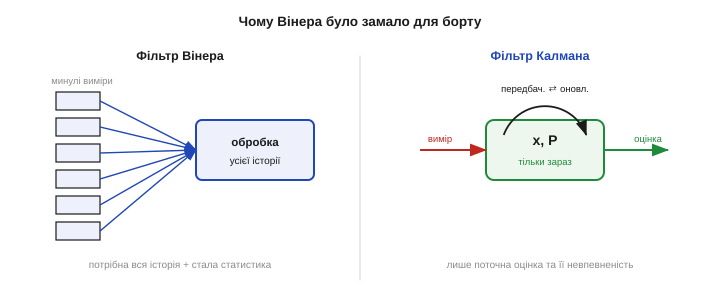
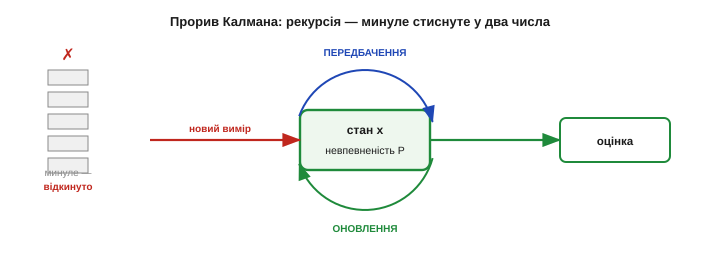
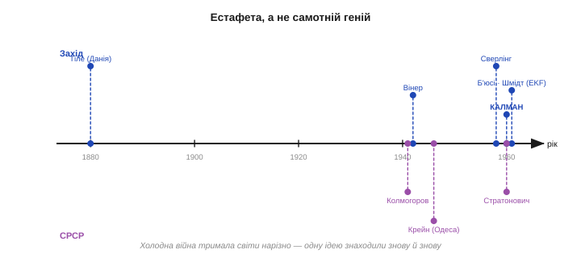
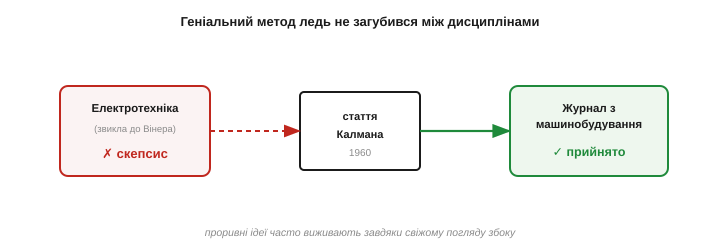
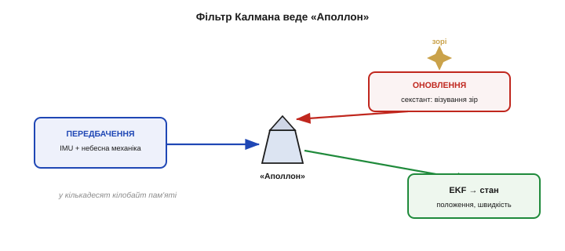
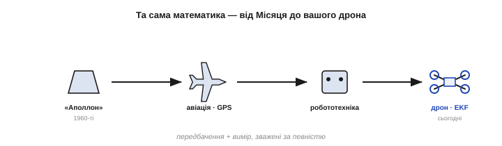

# 📜 Фільтр Калмана й «Аполлон»: математика, що довела людину до Місяця

> Це історична вставка до [ідеї фільтра Калмана](book:algorithms/kalman-filter) — як поєднувати передбачення й вимір, зважуючи кожне за його певністю. Ця ідея має приголомшливу біографію. Її майже одночасно й **незалежно** знайшли по різні боки залізної завіси; її автор спершу натрапив на стіну скепсису й мусив друкуватися в журналі «не за фахом»; а тоді один інженер у NASA побачив у ній те, чого не побачили інші, — і та сама абстрактна математика за кілька років опинилася в бортовому комп'ютері, що віз людей до Місяця. Це історія про те, як винаходи майже ніколи не належать одному — і як теорія стає тріумфом лише тоді, коли зустрічає свою задачу.

Уявіть бортовий комп'ютер «Аполлона»: пам'яті — кілька десятків кілобайт, швидкодії менше, ніж у дешевому калькуляторі сьогодні. І на цій крихті крутиться математика, що з шумних, уривчастих вимірів безперервно вгадує, **де** корабель і **куди** він летить, точно настільки, щоб поцілити у Місяць і повернутися. Серце тієї математики — фільтр Калмана. Простежмо, звідки він узявся.

---

## Стара як навігація задача: вгадати правду з брехливих чисел

Задача, яку розв'язує фільтр Калмана, — древня: **як із багатьох неточних вимірів дістати найкращу оцінку правди?** Нею мучилися ще астрономи. На зламі XVIII–XIX століть **Карл Фрідріх Ґаус** (*Carl Friedrich Gauss*) і француз **Адрієн-Марі Лежандр** (*Adrien-Marie Legendre*) винайшли **метод найменших квадратів**, щоб із розкиданих спостережень вирахувати орбіту астероїда. Це був перший великий крок: правду можна **оцінити**, усереднивши помилки розумним чином.

Та класичний метод вимагав зібрати **всі** виміри й обробити їх гуртом. Для астронома, що рахує орбіту раз на сезон, це годилося; для машини, що мусить оновлювати оцінку **щомиті**, — ні. У 1880 році данський астроном і математик **Торвальд Тіле** (*Thorvald N. Thiele*) уже намацував рекурсивний підхід, але по-справжньому задачу для техніки поставила лише **Друга світова війна**.

Війні потрібно було **передбачати**: куди летітиме ворожий літак, щоб навести зенітку. Над цим у США працював великий математик **Норберт Вінер** (*Norbert Wiener*) — той самий, що дав ім'я кібернетиці. Його **фільтр Вінера** (1940-ві) умів із зашумленого сигналу видобути корисне й передбачити його хід. Майже водночас і **незалежно** ту саму теорію збудував у СРСР **Андрій Колмогоров** (*Andrey Kolmogorov*), а вагомий внесок зробив і математик **Марк Крейн** (*Mark Krein*) з Одеси — звідси назва «теорія Вінера–Колмогорова».

*Рис. Чому Вінера було замало для борту. Фільтр Вінера працює в частотній області й по суті потребує **всієї історії** сигналу та припущення, що статистика стала. Це чудово для розрахунку на землі, але непідйомно для бортового комп'ютера, що мусить оновлювати оцінку щомиті й не має пам'яті зберігати все минуле. Бракувало іншої форми — рекурсивної.*

Фільтр Вінера був могутній, але незручний: він мислив у частотах, вимагав, щоб статистика сигналу не мінялася, і фактично потребував усієї історії вимірів. Для наземних розрахунків — добре; для машини, що має вести корабель **у реальному часі**, — заважко. Бракувало іншого погляду на ту саму задачу.

Варто оцінити, наскільки воєнною була ця математика. Вінерів звіт із наведення зеніток був такий складний і так туго читався, що колеги прозвали його «жовтою напастю» (*the yellow peril*) — за колір обкладинки й нещадність формул. Та попри всю міць, для нової доби — реактивних апаратів і бортових обчислень — цей апарат виявився заважким і надто «академічним». Світ чекав не вдосконалення фільтра Вінера, а **іншого способу думати** про оцінювання — придатного для машини, що мусить рахувати на льоту, крок за кроком.

---

## Калман перевертає задачу: рекурсія замість пам'яті

Цей інший погляд дав **Рудольф Калман** (*Rudolf E. Kálmán*, 1930–2016) — угорсько-американський інженер і математик. Народжений у Будапешті, він емігрував із родиною до США під час війни, навчався в Массачусетському технологічному інституті (MIT) і 1960 року опублікував статтю, що змінила інженерію: «**Новий підхід до задач лінійної фільтрації й передбачення**» (*A New Approach to Linear Filtering and Prediction Problems*).

Геній Калмана був не в новій формулі, а в **новому формулюванні**. Замість частот і всієї історії сигналу він описав систему в **просторі станів**: є прихований «стан» (скажімо, положення й швидкість), що еволюціонує за відомою моделлю, і є шумні виміри цього стану. І тоді оцінку можна вести **рекурсивно** — крок за кроком: тримати лише **поточну** оцінку стану та її невпевненість, на кожному кроці передбачати їх уперед і виправляти свіжим виміром. Жодної потреби зберігати минуле.

*Рис. Прорив Калмана — рекурсія. Фільтр тримає лише два «згортки» минулого: поточну оцінку стану x та її невпевненість P. Щокроку він їх передбачає вперед і виправляє новим виміром — і **відкидає** сам вимір, увібравши з нього все потрібне. Уся історія стиснута у два числа (для кута) чи дві матриці — тому фільтр вміщується навіть у кількадесят кілобайт бортового комп'ютера.*

Це й зробило фільтр придатним для **бортових** обчислень. Уся нескінченна історія вимірів стискалася у дві величини — оцінку та її невпевненість, — які машина оновлювала однаковими дешевими кроками. Те, що фільтр Вінера робив «оптом» і на землі, фільтр Калмана робив «уроздріб» і на борту. Для епохи, коли комп'ютер важив тонни, а пам'ять рахували байтами, це була не косметична, а **вирішальна** відмінність.

Принагідно зауважмо, що простором станів Калман збагатив не лише фільтрацію. Той самий апарат він поклав в основу всієї **сучасної теорії керування**, увівши поняття **керованості** й **спостережуваності** — чи можна взагалі привести систему в потрібний стан і чи можна відновити цей стан із доступних вимірів. Тож фільтр Калмана — лише найвідоміший плід ширшої революції: переходу від частот і передавальних функцій до опису систем через їхній внутрішній **стан**. Цей перехід багато в чому й визначив інженерію другої половини XX століття.

> 🔧 **Навіщо це.** Та сама причина, з якої фільтр Калмана злетів 1960 року, робить його ідеальним і для **вашого** мікроконтролера сьогодні. Рекурсивність означає сталу, крихітну пам'ять і однакову роботу на кожному кроці — рівно те, що любить МК. Коли ви бачите в польотному контролері «EKF», знайте: ви запускаєте прямого нащадка алгоритму, який обирали саме за те, що він вліз у комп'ютер «Аполлона». Дешевизна рекурсії — не випадковість, а вроджена риса.

---

## Холодна війна й паралельні відкриття: чесний підпис

А тепер — найважливіше для чесної історії. Калман **не був одинаком**, і фільтр, що носить його ім'я, насправді — плід **паралельних, незалежних** відкриттів, розділених залізною завісою. Тут варто бути точним і не піддаватися ні західному міфу «геніальний Калман придумав усе сам», ні дзеркальному «насправді все зробили в СРСР».

З американського боку ще **1958 року**, за два роки до Калмана, інженер **Пітер Сверлінг** (*Peter Swerling*) із корпорації RAND опублікував по суті дуже близький рекурсивний оцінювач — його внесок довго недооцінювали, і дехто справедливо називає метод «фільтром Сверлінга–Калмана».

З радянського боку незалежно й **глибше** працював математик **Руслан Стратонович** (*Ruslan L. Stratonovich*). Ще 1958-го він доповів перші результати про умовні марковські процеси й пов'язану з ними **нелінійну** задачу фільтрації, а до літа 1960-го в його працях уже фігурували рівняння, що містять лінійний фільтр як **окремий випадок** значно загальнішої теорії. Калман і Стратонович навіть зустрілися 1960 року на конференції в Москві. Саме тому фільтр часом і звуть **фільтром Стратоновича–Калмана–Б'юсі**.

*Рис. Естафета, а не самотній геній. Тіле (1880, Данія) → Вінер (США) і Колмогоров із Крейном (СРСР) у 1940-х → Сверлінг (1958, США) → Стратонович (1959–60, СРСР, загальніша нелінійна теорія) → Калман (1960) і Калман–Б'юсі (1961). Холодна війна тримала ці світи нарізно, тож одну ідею знаходили знову й знову. «Фільтр Калмана» — підпис не одного автора, а цілого ланцюга.*

Який же тут чесний підсумок? Він подвійний. **По-перше**, заслуга Калмана **справжня**: саме його формулювання в просторі станів, у зручній рекурсивній, інженерній формі — те, що підхопили й побудували; недарма ім'я закріпилося за ним. **По-друге**, так само справжній і внесок інших: Стратонович незалежно отримав загальнішу теорію (лінійний фільтр — її окремий випадок), Сверлінг випередив у часі, а ґрунт готували Вінер, Колмогоров, Крейн і ще раніше Тіле. Це не «крадіжка» й не «пріоритетна війна» — це типова для науки **паралельна еволюція**, де Холодна війна просто змусила два світи винаходити те саме окремо. Винаходи майже ніколи не належать одному — і фільтр Калмана тут хрестоматійний приклад.

Додамо й технічний штрих до цієї спільної праці: вже наступного, 1961 року Калман разом з американцем **Річардом Б'юсі** (*Richard Bucy*) вивів **неперервну** в часі версію — звідси й «фільтр Калмана–Б'юсі». А ширший урок такий: коли дві наукові спільноти роз'єднані — кордоном, мовою чи, як тут, залізною завісою, — вони раз по раз винаходять те саме незалежно. Історія фільтра Калмана — не про змагання, хто «перший», а про те, що зріла ідея сама проростає в кількох головах водночас, щойно для неї настає час.

---

## Опір і журнал з механіки: як ідею мало не проґавили

Хоч якою потужною була ідея, інженерна спільнота зустріла її **холодно**. Усталена школа мислила фільтр Вінера й частоти; рекурсивний погляд Калмана здавався то надто абстрактним, то підозрілим. За переказами, Калманові було так важко пробити статтю в електротехнічних рецензентів, що свою працю він зрештою віддав у журнал **з машинобудування** (*Journal of Basic Engineering*) — не зовсім «за фахом», зате там її прийняли. Геніальний метод ледь не загубився між дисциплінами.

*Рис. Опір новому. Електротехнічна спільнота, звикла до фільтра Вінера, поставилася до рекурсивної ідеї Калмана скептично — тож основоположну статтю 1960 року він опублікував у журналі **з машинобудування**. Класичний урок: проривна ідея часто спершу натрапляє на стіну з боку усталеної школи й виживає завдяки тому, хто погляне на неї свіжими очима.*

І такий свіжий погляд знайшовся — але не серед теоретиків, а серед **практиків**, яким край потрібно було розв'язати конкретну, відчайдушну задачу.

---

## Шмідт у NASA Ames: іскра, що повела фільтр до Місяця

Тим практиком став **Стенлі Шмідт** (*Stanley F. Schmidt*, 1926–2015) — американський аерокосмічний інженер із Дослідного центру NASA в Еймсі (*NASA Ames*). Коли Калман відвідав Еймс і розповів про свій метод, Шмідт одразу **впізнав** у ньому ключ до задачі, що саме постала перед NASA: як кораблю «Аполлон» вираховувати свою траєкторію до Місяця з бортових вимірів.

Була, щоправда, перешкода: фільтр Калмана **лінійний**, а навігація в космосі — суттєво **нелінійна** (гравітація, орбіти, кути). Шмідт це подолав, придумавши, як застосувати фільтр до нелінійної задачі — лінеаризуючи її на кожному кроці. Так народився **розширений фільтр Калмана** (*Extended Kalman Filter, EKF*), що його в NASA попервах звали й **фільтром Калмана–Шмідта**. Саме EKF, а не «чистий» фільтр, став робочою конячкою реальної техніки — і саме його ви сьогодні знаходите у своєму дроні.

Без перебільшення, та коротка зустріч в Еймсі змінила долю методу. Якби Шмідт не побачив у формулах Калмана відповідь на навігаційну задачу «Аполлона» й не приборкав їхню нелінійність, фільтр цілком міг би ще довго лишатися цікавинкою для теоретиків. Натомість EKF із того дня й донині — чи не найуживаніший оцінювач в усій техніці: від космічних апаратів до автомобілів і смартфонів. Доля абстрактної теореми вирішилася в розмові двох інженерів над конкретною, відчайдушною задачею.

> 🔧 **Навіщо це.** Запам'ятайте цей момент як урок про те, **як ідеї стають технологіями**. Калман дав теорію, але без Шмідта вона могла б ще роки пролежати в журналі з машинобудування. Прорив стався на стику: теоретик, що створив метод, і практик, що мав **гостру задачу** й побачив, як метод її розв'язує. Коли наступного разу ви читатимете «суху» статтю, згадайте: можливо, ви — той Шмідт, якому бракувало саме цього інструмента.

---

## На борту «Аполлона»: секстант, гіроскопи й трохи пам'яті

У польоті фільтр працював точно за логікою [«передбачення + вимір»](book:algorithms/kalman-filter). **Передбачення** йшло від інерціального блока (гіроскопи й акселерометри на гіростабілізованій платформі) та від законів небесної механіки: знаючи, де корабель був і як рухався, комп'ютер вираховував, де він має бути тепер. **Вимір** давав астронавт — **візуючи зорі** оптичним приладом (секстантом) відносно Землі чи Місяця. Фільтр поєднував одне з одним, виправляючи накопичену похибку інерціального числення свіжими «зоряними» поправками.

*Рис. Фільтр Калмана веде «Аполлон». **Передбачення:** інерціальний блок (гіроскопи, акселерометри) і небесна механіка кажуть, де має бути корабель. **Оновлення:** астронавт секстантом візує зорі — точний, але рідкий вимір. EKF поєднує їх, тримаючи оцінку положення й швидкості точною — і роблячи це в кількадесят кілобайт пам'яті бортового комп'ютера.*

Бортовий комп'ютер «Аполлона» (*Apollo Guidance Computer*) збудувала Інструментальна лабораторія MIT під орудою **Чарлза Старка Дрейпера** (*Charles Stark Draper*); навігаційне програмне забезпечення вів **Річард Беттін** (*Richard Battin*). Памʼять машини була мізерна, а математику доводилося втискати в неї до останнього байта — тут і знадобилася сама **рекурсивність** фільтра, що тримав лише поточну оцінку, а не гори даних. Те, що Калман обрав заради ощадності ще на папері, виявилося рятівним на борту.

Варто уявити ту пам'ять буквально. Програми «Аполлона» зашивали в **канатну пам'ять** (*core rope*): нулі та одиниці вручну вплітали мідним дротом крізь крихітні магнітні кільця на заводі — тож код у прямому сенсі **ткали**. Саме тому кожен байт був на вагу золота, і рекурсивний фільтр, що не зберігав історії, пасував ідеально. А керувала всім бортовим софтом в Інструментальній лабораторії MIT **Маргарет Гамільтон** (*Margaret Hamilton*) — інженерка, якій часто приписують і сам термін «програмна інженерія» (вона його невтомно популяризувала, хоч точне авторство слова — річ сперечана). Астронавт же періодично «брав марку» — точно наводив візир на обрану зорю, — і фільтр діставав свіжу поправку до свого передбачення.

> 🔧 **Навіщо це.** Зверніть увагу на красиву відповідність: **обмеження заліза підказало вибір алгоритму**. Мізерна пам'ять «Аполлона» зробила рекурсивний фільтр не просто зручним, а єдино можливим. Той самий принцип діє й у вас: коли ресурси мікроконтролера тиснуть, обирайте алгоритми зі **сталою пам'яттю й однаковою роботою на крок** (як фільтр Калмана), а не ті, що нагромаджують історію вимірів. Добрий інженер підбирає метод під залізо, а не бореться із залізом заради методу.

Результат відомий: апарати «Аполлона» долітали до Місяця й поверталися, а їхня здатність **знати, де вони**, спиралася на [фільтр Калмана](book:algorithms/kalman-filter), що ще десятиліття тому здавався надто абстрактним, щоб його надрукувати.

---

## Від Місяця — у ваш дрон

Після «Аполлона» фільтр Калмана переможно розійшовся світом. Сьогодні він — усюди, де щось рухається й має знати, **де** воно: у GPS-приймачах, авіаавтопілотах, системах допомоги водієві, морській навігації, у відстеженні цілей радарами, у крокомірі вашого телефона. NASA навіть має про це гасло: «математика, винайдена для висадки на Місяць, допомагає вашому літаку прилітати вчасно».

І це не красне слівце. Той самий клас фільтрів стежить за літаком у небі, тримає позицію безпілотника, поєднує камери й радари в автомобілі з автопілотуванням, рахує ваші кроки у смартфоні й веде комбайн по полю за GPS. Усюди, де є **модель руху** й **шумний давач**, працює нащадок ідеї 1960 року. Мало яка абстрактна теорема пройшла такий шлях — від нерозуміння рецензентів через політ на Місяць до кожної кишені.

*Рис. Той самий фільтр — від Місяця до вашого ящика з деталями. Навігація «Аполлона» (1960-ті) → авіація й GPS → робототехніка → EKF у польотному контролері навчального дрона сьогодні. Об'єкти різні, ідея одна: передбачення плюс вимір, зважені за певністю. Ви запускаєте пряму спадкоємицю математики, що возила людей на Місяць.*

І ось коло замкнулося на вашому столі. Коли ваш навчальний дрон тримає рівень, його орієнтацію оцінює **розширений фільтр Калмана** — прямий нащадок того, що Шмідт зібрав із ідеї Калмана для «Аполлона». Та сама логіка [«передбачити гіроскопом, виправити акселерометром, зважити за певністю»](book:algorithms/kalman-filter) веде і місячний корабель, і копійчаний квадрокоптер. Знаючи **звідки** вона взялася — крізь паралельні відкриття, спротив рецензентів і політ до Місяця, — ви куди глибше розумієте, **що** саме крутиться всередині вашого апарата.
