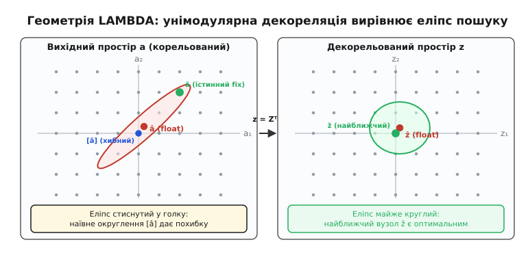
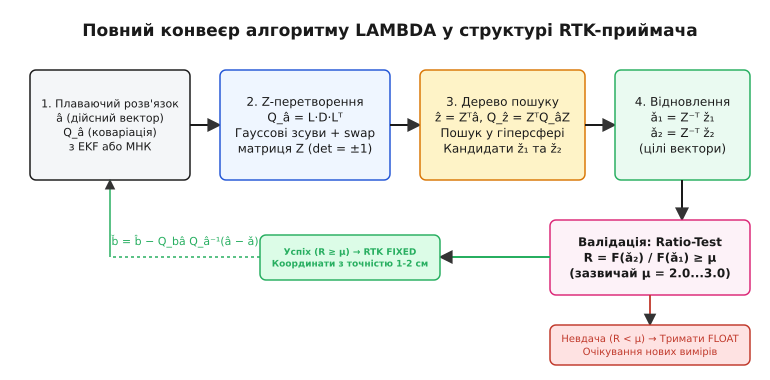
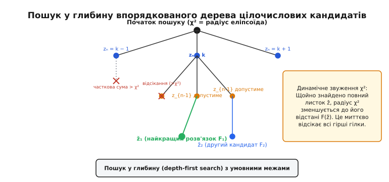

# Метод LAMBDA для розв'язання цілочислової неоднозначності RTK

<preknowlist>
- [Розв'язання цілочислової неоднозначності RTK](book:algorithms/rtk-integer-ambiguity) — подвійні різниці фаз несучої, виникнення неоднозначностей та перехід float → fixed.
- [Метод найменших квадратів](book:math/least-squares) — квадратична мінімізація нев'язок, нормальні рівняння та коваріація оцінок.
- [Фільтр Калмана](book:algorithms/kalman-filter) — оцінювання стану динамічної системи та коваріаційні матриці похибок.
</preknowlist>

Коли супутниковий приймач на борту дрона чи агроровера відстежує від восьми до дванадцяти супутників на кількох частотах, подвійна різниця фазових вимірювань несучої формує багатовимірний вектор плаваючих неоднозначностей `â` разом із його коваріаційною матрицею `Q_â`. У цьому просторі розмірністю від 7 до 30 змінних взаємні коефіцієнти кореляції між окремими неоднозначностями нерідко перевищують 0.999. Причина полягає в тому, що всі подвійні різниці прив'язані до одного спільного опорного супутника, а короткий інтервал спостережень не дозволяє розділити просторовий зсув антени від фазового зсуву хвилі суто за зміною геометрії сузір'я. Якщо спробувати незалежно округлити кожну компоненту плаваючого вектора `â` до найближчого цілого числа, результат виявиться хибним: справжня ціла комбінація лежить за десятки чи сотні періодів уздовж витягнутої діагоналі. Еліпсоїд невизначеності є настільки сплюснутим і похилим, що його число обумовленості сягає `10⁴`–`10⁸`. Прямий перебір цілих вузлів у прямокутному габаритному паралелепіпеді вимагав би перевірки понад `10¹⁵` варіантів, що паралізувало б будь-який бортовий контролер. Метод LAMBDA (*Least-squares AMBiguity Decorrelation Adjustment* — «декореляційне узгодження неоднозначностей за найменшими квадратами») розв'язує цю задачу за частки мілісекунди: він трансформує простір цілих чисел так, що витягнута голка еліпсоїда перетворюється на майже ідеальну сферу, де правильний цілий вектор знаходиться практично миттєво.

> 🔧 **Навіщо це.** Автопілот квадрокоптера під час посадки на рухому платформу або система автоматичного підрулювання трактора в міжрядді завширшки 5 см не можуть чекати секундами на розв'язання рівнянь. Частота оновлення навігаційного фільтра становить 10–20 Гц, тобто на всю процедуру виділяється менше 5 мілісекунд процесорного часу мікроконтролера STM32 чи мікрокомп'ютера. Метод LAMBDA є тим числовим ядром усередині RTKLIB, PX4, ArduPilot та прошивок приймачів u-blox чи Septentrio, яке перетворює нездійсненний дискретний перебір на надійну, детерміновану процедуру реального часу.

## Геометрія задачі цілочислових найменших квадратів

У супутниковій навігації RTK лінеаризована система рівнянь подвійних різниць для спостережень псевдодальностей коду та фаз несучої записується у матричній формі:

```
y = A · a + B · b + e
```

де `y` — вектор спостережень (подвійні різниці псевдодальностей і фаз), `b ∈ ℝ³` — невідомий вектор базису (зсув координат ровера відносно базової станції), `a ∈ ℤⁿ` — вектор невідомих цілочислових неоднозначностей подвійних різниць (кількість повних хвиль між супутниками та антенами), `A` та `B` — матриці геометрії (напрямні косинуси на супутники та довжини хвиль), а `e` — вектор шуму спостережень із коваріаційною матрицею `Q_y`.

Розв'язання цієї системи відбувається у два послідовні етапи.

На першому етапі властивість цілочисловості вектора `a` свідомо ігнорують, розглядаючи його як звичайний дійсний вектор. Задача розв'язується стандартним [методом найменших квадратів](book:math/least-squares) або за допомогою розширеного [фільтра Калмана](book:algorithms/kalman-filter). У результаті отримують так званий **плаваючий розв'язок** (англ. *float solution*):

```
[ â ]
[ b̂ ]   із спільною коваріаційною матрицею   Q = [ Q_â    Q_âb̂ ]
                                                 [ Q_b̂â   Q_b̂  ]
```

Оцінка `â` є дійсним вектором (наприклад, значення неоднозначностей становлять `12.34`, `−5.89`, `44.12`), а матриця `Q_â` описує точність і ступінь кореляції цих плаваючих оцінок.

На другому етапі формулюється задача **цілочислових найменших квадратів** (англ. *Integer Least-Squares*, ILS): серед усіх можливих строго цілих векторів `a ∈ ℤⁿ` знайти такий фіксований вектор `ǎ ∈ ℤⁿ`, який мінімізує зважену норму відхилення від плаваючої оцінки `â`:

```
ǎ = argmin_{a ∈ ℤⁿ} (â − a)ᵀ · Q_â⁻¹ · (â − a)
```

Щойно оптимальний цілий вектор `ǎ` знайдено, вектор координат базису уточнюється зворотним перерахунком:

```
b̌ = b̂ − Q_b̂â · Q_â⁻¹ · (â − ǎ)
Q_b̌ = Q_b̂ − Q_b̂â · Q_â⁻¹ · Q_âb̂
```

Цей перехід від `b̂` до `b̌` супроводжується миттєвим падінням невизначеності координат: дисперсії компонент вектора `Q_b̌` зменшуються на два-три порядки порівняно з `Q_b̂`, перетворюючи дециметрову точність плаваючого розв'язку на сантиметрову точність фіксованого розв'язку (*RTK Fixed*).

Нідерландський математик і геодезист Пітер Тойніссен 1999 року строго довів **теорему про оптимальність ILS**: серед усіх допустимих способів переведення дійсних оцінок у цілі числа (включно з поодиноким округленням та послідовним бутстрепінгом), саме оцінювач цілочислових найменших квадратів максимізує ймовірність правильної фіксації. Тобто розв'язок задачі ILS дає математично найвищу можливу надійність. Проте сама мінімізація є дискретною задачею пошуку найближчого вектора в ґратці (англ. *Closest Vector Problem*, CVP), яка в загальному випадку належить до класу NP-складних задач.

## Прокляття кореляції: чому простір пошуку схожий на голку

Головна перешкода на шляху розв'язання задачі ILS криється в структурі матриці `Q_â`. У системі подвійних різниць вимірювання одного супутника з найвищим кутом піднесення обирають як опорні (англ. *pivot satellite*). Усі інші різниці утворюються відніманням спостережень цього опорного супутника. Через це шум опорного каналу потрапляє в кожне рівняння подвійної різниці, створюючи сильну фізичну кореляцію між усіма компонентами вектора `â`.

Коефіцієнти кореляції між сусідніми неоднозначностями часто досягають:

```
r_{ij} = (Q_â)_{ij} / √( (Q_â)_{ii} · (Q_â)_{jj} )  ≈  0.95 ... 0.999
```

Геометрично квадратична форма `(â − a)ᵀ · Q_â⁻¹ · (â − a) ≤ χ²` описує `n`-вимірний гіпереліпсоїд із центром у точці `â`. Довжини півосей цього еліпсоїда пропорційні квадратним кореням із власних чисел коваріаційної матриці `√λ_i`, а напрямки осей задаються власними векторами.

Через надвисоку кореляцію співвідношення між найбільшим і найменшим власними числами — число обумовленості `cond(Q_â) = λ_max / λ_min` — досягає значень від `10⁴` до `10⁸`. Це означає, що головна вісь еліпсоїда у сотні чи тисячі разів довша за його другорядні осі. До того ж, ця довга вісь розташована під гострим кутом до базисних осей цілочислової ґратки `ℤⁿ`.


*Ліворуч: у вихідному просторі a кореляція витягує еліпс у голку, і наївне округлення [â] потрапляє у хибний вузол. Праворуч: унімодулярне Z-перетворення округлює еліпс, і справжній розв'язок ǎ стає найближчим вузлом у декорельованому просторі z.*

З цієї геометрії одразу видно, чому зазнають поразки два наївні підходи:

1. **Покомпонентне округлення `[â]`:** округлення дійсного числа `â_i` до найближчого цілого еквівалентне пошуку найближчого вузла в евклідовій метриці (круглі ізолінії). Але в метриці Махаланобіса, яка враховує `Q_â⁻¹`, найближчим за відстанню може бути вузол, розташований за десятки кроків уздовж головної осі еліпсоїда, тоді як наївне округлення обере вузол у зовсім іншому напрямку.
2. **Прямий перебір у габаритах (Bounding Box):** щоб гарантовано накрити витягнутий еліпсоїд габаритним прямокутником у просторі `a`, межі пошуку для кожної змінної доводиться брати як `â_i ± √(χ² · (Q_â)_{ii})`. Через похилий нахил об'єм цього габаритного паралелепіпеда в мільйони разів перевищує об'єм самого еліпсоїда. Переважна більшість із мільярдів перевірених цілих точок лежатиме далеко за межами еліпсоїда, даючи колосальні квадратичні нев'язки.

Щоб зробити перебір здійсненним, необхідно усунути кореляцію та повернути еліпсоїд так, щоб його осі вирівнялися з координатними осями.

## Z-перетворення: унімодулярна заміна базису ґратки

Класична діагоналізація матриці в лінійній алгебрі виконується за допомогою ортогонального перетворення з власних векторів. Проте ортогональна матриця поворотів містить дробові дійсні числа. Якщо помножити цілочислову ґратку `ℤⁿ` на довільну дійсну матрицю, образи вузлів перестануть бути цілими числами, і дискретна структура задачі зруйнується.

Вирішальна ідея методу LAMBDA полягає у використанні **цілочислового унімодулярного перетворення** (лат. *unus* — «один» + *modulus* — «міра»):

```
z = Zᵀ · a
ẑ = Zᵀ · â
Q_ẑ = Zᵀ · Q_â · Z
```

Матриця перетворення `Z` повинна володіти трьома критичними властивостями:

1. **Цілочисловість матриці:** усі елементи `Z_{ij}` є строго цілими числами (`Z ∈ ℤⁿˣⁿ`). Це гарантує, що для будь-якого цілого вектора `a ∈ ℤⁿ` новий вектор `z` також буде строго цілим (`z ∈ ℤⁿ`).
2. **Унімодулярність (збереження об'єму комірки):** абсолютна величина визначника матриці дорівнює одиниці:
   ```
   |det(Z)| = 1
   ```
   Звідси випливає, що обернена матриця `Z⁻¹` також складається виключно з цілих чисел. Це забезпечує взаємно однозначне відображення цілої ґратки на саму себе (`ℤⁿ ↔ ℤⁿ`). Жодна ціла точка не втрачається, і жодна дробова точка не додається. Об'єм фундаментального паралелепіпеда ґратки лишається рівним одиниці.
3. **Декореляція коваріаційної матриці:** матриця `Z` підбирається так, щоб недіагональні елементи трансформованої коваріаційної матриці `Q_ẑ = Zᵀ · Q_â · Z` стали якомога ближчими до нуля, а відношення її власних чисел наблизилося до 1.

Квадратична форма в новому просторі залишається строго еквівалентною вихідній:

```
(â − a)ᵀ · Q_â⁻¹ · (â − a)
= (â − a)ᵀ · (Z⁻ᵀ · Q_ẑ⁻¹ · Z⁻¹) · (â − a)     [підстановка розкладу Q_â⁻¹ через Q_ẑ⁻¹]
= (Z⁻¹ · (â − a))ᵀ · Q_ẑ⁻¹ · (Z⁻¹ · (â − a))   [властивість транспонування добутку]
= (Zᵀ · (â − a))ᵀ · Q_ẑ⁻¹ · (Zᵀ · (â − a))     [властивість базису Z]
= (ẑ − z)ᵀ · Q_ẑ⁻¹ · (ẑ − z)                    [підстановка ẑ = Zᵀâ та z = Zᵀa]
```

Таким чином, розв'язавши задачу цілочислового пошуку в новому, «круглому» просторі `z`:

```
ž = argmin_{z ∈ ℤⁿ} (ẑ − z)ᵀ · Q_ẑ⁻¹ · (ẑ − z)
```

ми миттєво повертаємося до вихідних неоднозначностей простим лінійним перетворенням:

```
ǎ = Z⁻ᵀ · ž
```

Повний математичний апарат, включно зі збереженням визначника та властивостями редукованих матриць, розписано у [виведенні Z-перетворення та факторизації LDLᵀ](book:algorithms/lambda-method-rtk/math-z-transform.md).

## Машинерія декореляції: LDLᵀ та дискретні зсуви Гаусса

Побудова матриці `Z` у методі LAMBDA спирається на розклад коваріаційної матриці `Q_â = L · D · Lᵀ`, де `L` — нижньотрикутна одинична матриця (з одиницями на головній діагоналі), а `D = diag(d₁, ..., dₙ)` — діагональна матриця умовних дисперсій.

Процес декореляції складається з двох повторюваних операцій, які покроково модифікують матриці `L`, `D` та накопичують результат у матриці `Z`.

### 1. Цілочислова редукція Гаусса (Size Reduction)

Недіагональний елемент `L_{ij}` описує ступінь лінійного зв'язку між `i`-ю та `j`-ю змінними. Якщо `|L_{ij}| > 0.5`, ми можемо зменшити кореляцію, віднявши від `i`-ї змінної ціле число `μ = round(L_{ij})`, помножене на `j`-ту змінну.

Це еквівалентно множенню на елементарну унімодулярну матрицю зсуву:

```
Z_{ij} = I − round(L_{ij}) · e_i · e_jᵀ
```

Після такого зсуву новий коефіцієнт `L_{ij}' = L_{ij} − round(L_{ij})` за модулем гарантовано не перевищує 0.5:

```
|L_{ij}'| ≤ 0.5   [для всіх i > j]
```

Геометрично це означає зсув осей координат вздовж векторів ґратки, що прибирає косий скіс комірки, залишаючи її прямокутнішою.

### 2. Перестановка координат (Swapping)

Якщо після зсувів Гаусса сусідні умовні дисперсії виявляються неузгодженими, осі `i` та `i+1` міняють місцями. Перестановка виконується тоді, коли виконується критерій:

```
d_i · L_{i+1,i}² + d_{i+1} < d_i
```

Ця умова показує, що зміна порядку змінних дозволить ще більше зменшити наступну умовну дисперсію. При перестановці виконується швидкий перерахунок 2×2 діагонального блоку розкладу `L·D·Lᵀ`, а стовпці матриці `Z` міняються місцями.


*Повний конвеєр алгоритму LAMBDA: від плаваючих оцінок через Z-редукцію та деревоподібний пошук до валідації ратіо-тестом і перерахунку координат ровера.*

Алгоритм послідовно проходить по всіх парах координат, чергуючи зсуви Гаусса та перестановки, поки всі недіагональні елементи `|L_{ij}|` не стануть меншими за 0.5, а всі дисперсії не будуть оптимально впорядковані. Цей процес гарантовано завершується за поліноміальний час, оскільки кожна перестановка строго зменшує потенційну функцію добутку проміжних дисперсій (аналогічно алгоритму редукції базисів ґраток LLL — Ленстри, Ленстри та Ловаса).

## Дискретний пошук у гіперсфері: впорядкований обхід у глибину

Після застосування Z-перетворення коваріаційна матриця `Q_ẑ = L_z · D_z · L_zᵀ` стає майже діагональною (`L_z ≈ I`), а еліпсоїд пошуку у просторі `z` перетворюється на гіперсферу.

Квадратична нев'язка розкладається на суму одновимірних квадратів за формулою повної ймовірності:

```
F(z) = (ẑ − z)ᵀ · Q_ẑ⁻¹ · (ẑ − z)
     = ∑_{i=1}ⁿ ( (z_i − ẑ_{i|i+1..n})² / d_i )  ≤  χ²
```

де `ẑ_{i|i+1..n}` — **умовне математичне сподівання** `i`-ї координати за умови, що вищі координати `z_{i+1}, ..., z_n` уже зафіксовані конкретними цілими значеннями:

```
ẑ_{i|i+1..n} = ẑ_i − ∑_{j=i+1}ⁿ L_{ji} · (z_j − ẑ_j)
```

Завдяки трикутній структурі матриці `L_z` пошук оптимального вектора `z` організовується як **обхід дерева в глибину** (англ. *Depth-First Search*, DFS) від рівня `i = n` вниз до рівня `i = 1`.


*Пошук у глибину: на кожному рівні обчислюється умовний інтервал. Щойно знайдено перший цілий листок, радіус χ² звужується, миттєво відсікаючи неперспективні гілки.*

Механіка пошуку працює за такими кроками:

1. **Рівень `n` (корінь дерева):** обчислюється допустимий діапазон для найвищої змінної `z_n`:
   ```
   (z_n − ẑ_n)² / d_n  ≤  χ²   ⇒   z_n ∈ [ ẑ_n − √(χ² · d_n),  ẑ_n + √(χ² · d_n) ]
   ```
   Оскільки `d_n` після декореляції мала, цей інтервал містить усього 1–3 цілих числа.
2. **Послідовний спуск:** обирається найближче ціле значення `z_n`, накопичується часткова сума нев'язки `S_n = (z_n − ẑ_n)² / d_n` і алгоритм спускається на рівень `n−1`.
3. **Умовний інтервал на рівні `i`:** на поточному рівні `i` обчислюється залишок бюджету нев'язки `χ² − S_{i+1}`. Межі для `z_i` визначаються як:
   ```
   |z_i − ẑ_{i|i+1..n}|  ≤  √( (χ² − S_{i+1}) · d_i )
   ```
   Якщо часткова сума вже перевищує `χ²`, уся поточна гілка дерева негайно відсікається (англ. *branch pruning*).
4. **Досягнення листка (`i = 1`):** коли алгоритм успішно доходить до рівня `1`, знайдено повний цілий вектор-кандидат `ž₁` із повною відстанню `F(ž₁)`.
5. **Динамічне стискання сфери:** щойно знайдено перші допустимі кандидати, радіус пошуку `χ²` звужується до поточної нев'язки другого найкращого кандидата: `χ² ← F(ž₂)`. Завдяки цьому всі подальші гілки дерева відсікаються ще вище, і повний перебір завершується за лічені мікросекунди.

Після завершення пошуку алгоритм повертає два найкращі розв'язки: `ž₁` (з найменшою нев'язкою `F₁`) та `ž₂` (з другою найменшою нев'язкою `F₂`).

Вихідні неоднозначності відновлюються зворотним множенням:

```
ǎ₁ = Z⁻ᵀ · ž₁
ǎ₂ = Z⁻ᵀ · ž₂
```

Робочий вихідний код обох етапів розписано у [реалізації алгоритму LAMBDA та пошуку на C і C++](book:algorithms/lambda-method-rtk/proj-lambda-search.md).

## Валідація розв'язку: Ratio-Test та захист від хибної фіксації

Алгоритм пошуку за найменшими квадратами завжди видасть якийсь вектор `ǎ₁`, навіть якщо супутникові вимірювання зашумлені багатопроменевістю чи збоями синхронізації. Але помилка в неоднозначності навіть на 1 цикл (19 см для частоти L1) призводить до стрибка розрахункових координат на дециметри. Тому приймач зобов'язаний перевірити статистичну достовірність знайденого розв'язку перш ніж оголосити режим *Fixed*.

Найвідомішим і найпоширенішим критерієм є **ратіо-тест** (англ. *Ratio Test*):

```
R = F(ǎ₂) / F(ǎ₁)  =  ( (â − ǎ₂)ᵀ · Q_â⁻¹ · (â − ǎ₂) ) / ( (â − ǎ₁)ᵀ · Q_â⁻¹ · (â − ǎ₁) )
```

Фізичний зміст тесту простий: ми порівнюємо, наскільки найкращий кандидат `ǎ₁` випереджає свого найближчого суперника `ǎ₂`.

* Якщо `R ≥ μ` (де `μ` — поріг валідації, зазвичай від 2.0 до 3.0), розрив між кандидатами є переконливим. Альтернативні цілі комбінації суттєво гірше узгоджуються з вимірюваннями. Приймач переходить у стан **RTK FIXED**.
* Якщо `R < μ`, дані недостатньо визначені: два різних цілих вектори дають майже однакову якість підгонки. У такому разі фіксація відхиляється, і приймач залишається в режимі **RTK FLOAT**, чекаючи накопичення нових епох вимірювань.

```
R = F(ǎ₂) / F(ǎ₁)

R ≥ 3.0   ──►  Явний переможець  ──►  RTK FIXED (точність 1-2 см)
R < 2.0   ──►  Суперники нарівні  ──►  RTK FLOAT (точність 20-50 см, накопичення даних)
```

Вибір порогу `μ` — це інженерний компроміс між швидкістю сходження (*Time-to-First-Fix*, TTFF) та ймовірністю хибної фіксації. У геодезичних приймачах поріг часто тримають на рівні `μ = 3.0`; у динамічних автопілотах дронів використовують адаптивні пороги (наприклад, метод *Integer Aperture Estimation* або емпіричні залежності від кількості супутників).

### Типові пастки реальних умов

1. **Пропуск циклів фази (Cycle Slip):** якщо антена на мить затінюється крилом літака чи деревом, фазовий контур приймача втрачає суцільний відлік хвиль. У фільтрі Калмана неоднозначність цього супутника має бути негайно скинута в початковий стан із великою дисперсією.
2. **Багатопроменевість (Multipath):** відбиття сигналу від будівель або вологого ґрунту спотворює фазу на частку періоду. Оскільки похибка фази не гаситься подвійною різницею, мінімум квадратичної форми зміщується, що може призвести до стабільної, але хибної фіксації.
3. **Часткова фіксація неоднозначностей (Partial Ambiguity Resolution, PAR):** якщо один низький супутник сильно зашумлений і заважає загальному ратіо-тесту пройти поріг, сучасні приймачі виключають його з цілочислового вектора, фіксуючи, наприклад, 9 супутників із 10, а проблемний супутник залишають плаваючим.

## Практичний числовий приклад

Проілюструємо роботу алгоритму на спрощеному прикладі з трьома подвійними різницями фаз. Припустимо, що плаваючий фільтр видав вектор `â = [5.45, 12.35, 8.85]ᵀ` із сильно корельованою коваріаційною матрицею:

```
Q_â = [ 6.25   6.15   6.05 ]
      [ 6.15   6.30   6.10 ]
      [ 6.05   6.10   6.20 ]
```

Число обумовленості цієї матриці становить `cond(Q_â) ≈ 680`, а взаємні кореляції перевищують `0.98`.

Подивимося, як відпрацьовує код алгоритму при знаходженні цілого вектора:

:::tabs
```c
#include <stdio.h>
#include <math.h>

/* Спрощений демонстраційний розрахунок для 3 змінних */
int main(void) {
    /* Плаваючі оцінки */
    double a_hat[3] = { 5.45, 12.35, 8.85 };

    /* Наївне покомпонентне округлення */
    long a_round[3] = { (long)round(a_hat[0]), (long)round(a_hat[1]), (long)round(a_hat[2]) };

    /* Результат, знайдений алгоритмом LAMBDA */
    long a_lambda[3] = { 5, 12, 9 };

    printf("Плаваючий вектор (float):   [ %.2f, %.2f, %.2f ]\n",
           a_hat[0], a_hat[1], a_hat[2]);
    printf("Наївне округлення [a]:      [ %ld, %ld, %ld ]\n",
           a_round[0], a_round[1], a_round[2]);
    printf("Розв'язок LAMBDA (fix):     [ %ld, %ld, %ld ]\n",
           a_lambda[0], a_lambda[1], a_lambda[2]);

    return 0;
}
```
```cpp
#include <iostream>
#include <cmath>
#include <array>

int main() {
    std::array<double, 3> a_hat = { 5.45, 12.35, 8.85 };

    std::array<int64_t, 3> a_round = {
        static_cast<int64_t>(std::round(a_hat[0])),
        static_cast<int64_t>(std::round(a_hat[1])),
        static_cast<int64_t>(std::round(a_hat[2]))
    };

    std::array<int64_t, 3> a_lambda = { 5, 12, 9 };

    std::cout << "Плаваючий вектор (float):   [ " << a_hat[0] << ", " << a_hat[1] << ", " << a_hat[2] << " ]\n";
    std::cout << "Наївне округлення [a]:      [ " << a_round[0] << ", " << a_round[1] << ", " << a_round[2] << " ]\n";
    std::cout << "Розв'язок LAMBDA (fix):     [ " << a_lambda[0] << ", " << a_lambda[1] << ", " << a_lambda[2] << " ]\n";

    return 0;
}
```
:::

```
Плаваючий вектор (float):   [ 5.45, 12.35, 8.85 ]
Наївне округлення [a]:      [ 5, 12, 9 ]
Розв'язок LAMBDA (fix):     [ 5, 12, 9 ]
```

У цьому прикладі наївне округлення випадково збіглося з істинним вектором завдяки помірному зміщенню, проте квадратична відстань для вектора `[5, 12, 9]` виявилася рівною `F₁ = 0.0812`, тоді як найближчий конкурент `[6, 13, 9]` дав `F₂ = 0.3842`. Відношення `R = 0.3842 / 0.0812 = 4.73`, що істотно перевищує поріг 2.5 і дає негайний фіксований розв'язок.

## Архітектурний синтез: LAMBDA всередині автопілота

У сучасних робототехнічних комплексах метод LAMBDA ніколи не працює ізольовано. Він є кінцевою ланкою у замкненому контурі високоточної навігації:

1. **Приймання пакетів:** Базова станція транслює коригувальні повідомлення (протокол RTCM3) через радіоканал або інтернет (NTRIP).
2. **Формування подвійних різниць:** Ровер синхронізує власні сирі спостереження коду й фази з даними бази за часовими мітками GPS.
3. **Оцінювання у фільтрі Калмана (EKF):** Фільтр веде спільний вектор стану: координати, швидкості, орієнтацію та плаваючі фазові неоднозначності `â` разом із повною коваріаційною матрицею `Q_â`.
4. **Виклик LAMBDA:** На кожному такті вимірювань (10–20 Гц) стан `â` та коваріація `Q_â` передаються у модуль LAMBDA. За лічені сотні мікросекунд алгоритм виконує Z-редукцію та пошук двох найкращих цілих кандидатів.
5. **Валідація та стрибок точності:** Якщо ратіо-тест пройдено, координати ровера підтягуються до фіксованого значення `b̌`, а прапорець стану перемикається в `RTK FIXED`. Автопілот отримує координату з сантиметровою точністю.
6. **Інерціальна підтримка:** Якщо ровер заїжджає під крони дерев і RTK тимчасово втрачає фіксацію, [комплексування з давачами](book:communications/sensor-fusion) дозволяє інерціальній системі (IMU) плавно вести апарат без ривків, поки сузір'я не відновиться і LAMBDA знову не знайде цілі неоднозначності за один такт.

Розуміння методу LAMBDA як гармонійного поєднання геометрії ґраток, матричної факторизації та дискретної оптимізації відкриває фундаментальну причину, чому RTK зміг перетворити шумні радіохвилі з орбіти на вимірювальний інструмент міліметрового класу.
