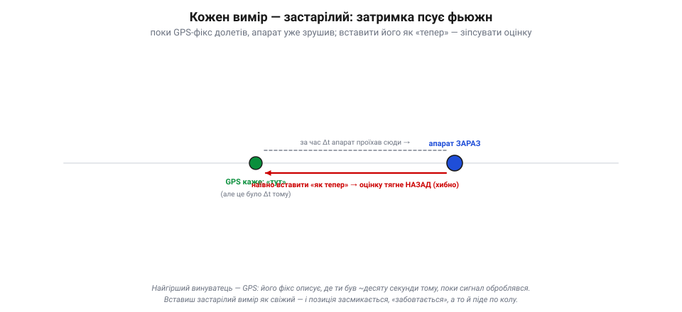
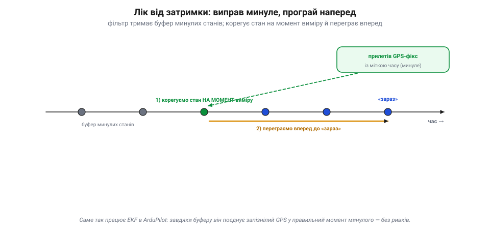

# Затримки, синхронізація, діагностика по логах

[Фільтр Калмана](book:algorithms/kalman-ekf) поєднує кілька давачів в одну довірену оцінку — красива картина. Та між теорією й живим польотом стоять дві прозаїчні, але злі перешкоди — **затримки** й **неузгодженість у часі**, — і одне рятівне вміння: **читати лог**, у якому оцінювач сам звітує про своє здоров'я.

### Кожен вимір приходить застарілим

Перша незручна правда: жоден вимір не описує **«зараз»**. Поки давач поміряв, оцифрував, передав по шині, поки фільтр його дістав — минув час. Для IMU це частки мілісекунди (дрібниця), а от для **GPS** — відчутна **десята частка секунди**: фікс описує, де апарат був, поки сигнал ще оброблявся.

*Рис. Затримка псує корекцію. Поки GPS-фікс долетів, апарат проїхав уперед (синя точка — «зараз»), а фікс описує минулу точку (зелена, Δt тому). Якщо вставити його як «тепер», корекція потягне оцінку **назад** (червона стрілка) — позиція засмикається, а в утриманні апарат може піти по колу. GPS — найзатриманіший: його фікс «старший» на десяту частку секунди.*

І ось пастка: якщо вставити цей запізнілий вимір у фільтр **як свіжий**, він почне виправляти теперішню оцінку за **минулим** положенням — і потягне її назад, туди, де апарат уже не є. Наслідок — позиція засмикається, «забовтається», а в найгіршому разі апарат у режимі утримання піде **по колу** (відоме «toilet-bowling»): фільтр женеться за власною тінню з минулого. Затримку не можна ігнорувати.

### Ліки: виправити минуле й переграти наперед

Як же поєднати старий вимір **правильно**? Хитро, але елегантно: треба прикласти його не до теперішнього стану, а до того, **яким стан був у момент виміру**. Для цього фільтр тримає **буфер** недавніх станів.

*Рис. Як поєднати старий вимір правильно. Фільтр тримає **буфер** недавніх станів. Коли прилітає запізнілий GPS (зі своєю міткою часу), фільтр поєднує його на **затриманому часовому горизонті** — у тій точці минулого, якій відповідає мітка, — а свій вихід доводить уперед до «зараз». Корекція лягає в правильну точку часу — без ривків. Саме так робить EKF в ArduPilot.*

Працює так: коли прилітає запізнілий GPS-фікс (зі своєю **міткою часу**), фільтр **поєднує** його на затриманому часовому горизонті — корегує стан у тій точці буфера, що відповідає мітці, — і доводить вихід уперед до «зараз». Так корекція лягає в правильну точку часу, без ривків. (Це зручна модель «відмотати–виправити–переграти»; на практиці NavEKF3 тримає **буфери** вимірів та IMU й поєднує кожен давач на його **затриманому** горизонті, а не псує ним поточну оцінку.) Саме це й робить EKF в ArduPilot: завдяки буферу станів він поєднує повільний, запізнілий GPS у відповідний момент **минулого**, а не псує ним теперішню оцінку. Звідси й вимога **синхронізації**: кожен вимір мусить мати чесну мітку часу на спільній шкалі, інакше фільтр приклеїть його не туди.

> 🔧 **Навіщо це.** Тому в налаштуваннях EKF є параметри **затримки** кожного давача (особливо GPS): кажеш фільтрові, на скільки запізнюється цей потік. Помилишся з затримкою — і навіть справний GPS даватиме «забовтування» позиції. А ще тому ж так важлива акуратна **проводка й шина**: давач, чию мітку часу збиває переривчастий зв'язок, отруює поєднання дужче за трохи шумніший, зате вчасний.

### Вібрація — тихий убивця оцінки

Окремо варто назвати найпідступнішого ворога поєднання на дроні — **вібрацію**. Гвинти й мотори трясуть раму, а та трясе IMU. Акселерометр чесно міряє ту трясанину — і вона **підмішується** в передбачення як фальшиве прискорення. Оскільки IMU — основа всього поєднання, забруднений вібрацією акселерометр псує **всю** оцінку: висота «спливає», позиція дрейфує, а в тяжкому разі EKF **розходиться** зовсім. Тому політний контролер [**м'яко підвішують**](book:electronics/imu-vibration-isolation) (на демпферах), а сигнал фільтрують — щоб до поєднання доходив рух апарата, а не дрож рами.

### Лог: оцінювач сам каже, де болить

І тут — головне практичне вміння розділу. Коли політ вийшов дивним, не треба гадати «що зламалося»: фільтр **сам про себе звітує** в логах. Найцінніший його показник — **несподіванка** (*innovation*): та сама [різниця «вимір − передбачення»](book:algorithms/predict-vs-measure), на якій тримається корекція фільтра.

*Рис. Несподіванка — пульс фільтра. Різниця «вимір − передбачення» в часі: поки мала й коливається коло нуля (синя) — давачі згодні з оцінкою, усе здорово. Стрибок за **«ворота»** (червоні пунктири) означає, що давач збрехав або фільтр розходиться — і такий вимір відхиляють. Це найкорисніший показник здоров'я оцінювача.*

Поки все добре, несподіванка **мала й коливається коло нуля**: давачі згодні з оцінкою, фільтр здоровий. Щойно якийсь давач збрехав чи фільтр почав розходитися — несподіванка **стрибає**. Більше того, у фільтра є **«ворота»** (поріг): якщо несподіванка вилазить за них, вимір вважають хибним і **відхиляють** — це вбудований захист від поодинокого збою давача (скажімо, разового стрибка GPS). У логах ArduPilot ці несподіванки (і «коефіцієнти тесту» за воротами) пишуться для кожного давача окремо.

*Рис. Лог сам викриває винного. Несподіванки по кожному давачу окремо: компас і баро спокійні (✓), а GNSS дав стрибок — отже, винен GPS (затінення чи багатопроменевість), решта чиста. Діагностика поєднання — це не здогади, а погляд у лог: хто стрибнув і коли.*

Тому діагностика поєднання зводиться до простого ритуалу: після підозрілого польоту витягни лог і подивись **несподіванки по кожному давачу** та **розмір хмари** (дисперсію) оцінки. Хто стрибнув — той і винен, а коли стрибнув — там і причина. Дрейфувала позиція й несподіванка GPS вилітала за ворота — винен GPS (затінення, багатопроменевість). Крутився курс, стрибала несподіванка компаса — магнітні завади. Спливала висота, шумів баро — потік від гвинтів чи вібрація. Оцінювач не мовчить про свої біди — треба лише вміти його прочитати.

> 📜 Сама ідея — **записувати все, щоб потім зрозуміти, що сталося** — теж має батька. На початку 1950-х загадково розбивалися перші реактивні лайнери «Комета», і австралійський учений **Девід Воррен** (*David Warren*) з Авіаційної дослідної лабораторії в Мельбурні запропонував зухвале: поставити в літак прилад, що безперервно пише дані польоту й голоси в кабіні, — аби після аварії «розпитати» розбитий апарат. Його **«чорну скриньку»** (задум 1954-го, прилад кінця 1950-х) спершу зустріли байдуже на батьківщині, та підхопив світ — і відтоді жоден лайнер не літає без неї. Лог твого дрона — прямий нащадок тієї ідеї: він мовчки пише все, щоб одного дня відповісти, **чому** політ пішов не так.

> 🔧 **Навіщо це.** Привчися після кожного незрозумілого польоту лізти не в здогади, а в **лог EKF**: несподіванки й дисперсії покажуть винного давача й мить збою точніше за будь-яке відчуття. Це той самий принцип «чорної скриньки», тільки в тебе вдома — дані вже записані, лишилось їх прочитати.

### Підсумок теми

Між чистою теорією поєднання й реальним польотом стоять три практичні речі. **Затримки**: кожен вимір застарілий (надто GPS), тож фільтр тримає буфер станів і поєднує запізнілий відлік у правильний момент минулого, а тоді переграє наперед — звідси й параметри затримки та потреба чесних міток часу. **Вібрація**: трясанина рами підмішується в акселерометр і псує всю оцінку, тому контролер м'яко підвішують і фільтрують. **Діагностика по логах**: оцінювач сам звітує про здоров'я через **несподіванки** (вимір−передбачення) і розмір хмари — малі означають злагоду, стрибок викриває винного давача й мить збою. Опанувавши ці три речі — затримку, вібрацію й читання логів, — отримуємо поєднання, що працює не лише на папері, а й у польоті: апарат тоді не просто має давачі — він має **довірене відчуття себе** в просторі.
