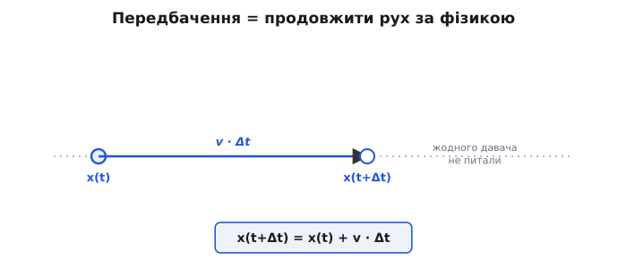
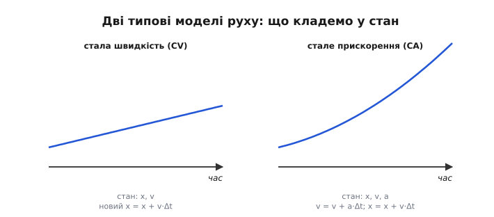
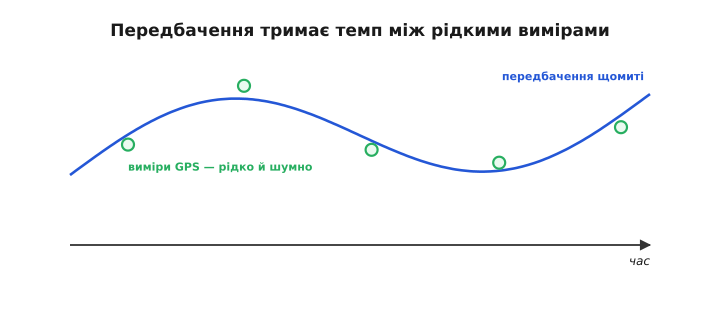
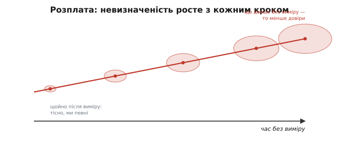
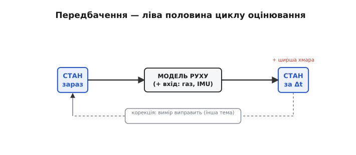

# Модель руху

Апарат живе [оцінкою стану](book:algorithms/sensor-insufficiency), зведеною з багатьох давачів. Будь-який оцінювач складається з двох дій: **передбачення** (вгадати, де апарат буде, за моделлю руху) і **корекція** (підправити цю здогадку свіжим виміром). Ця стаття — про перше. Воно здається дивним («навіщо вгадувати, коли є давачі?»), та саме воно робить оцінку гладкою, швидкою й готовою зустріти вимір.

В основі лежить **модель руху** (англ. *motion model*, від лат. *motio* «рух») — закон, за яким стан тіла продовжують уперед у часі. Передбачення бере теперішній стан, проганяє його крізь цю модель і дістає, де тіло опиниться за мить, не питаючи жодного давача.

### Передбачення = продовжити рух за фізикою

Ідея проста, як штовхнути санки. Якщо я знаю, **де** апарат і **як** він рухається — його положення й швидкість, — то можу сказати, де він буде **за мить**, навіть не дивлячись: він просто проїде за час свою швидкість, помножену на цей час.


*Передбачення — це продовження руху за фізикою. Знаючи теперішнє положення x і швидкість v, рахуємо, де апарат буде за час Δt: він проходить v·Δt, отже x(t+Δt) = x(t) + v·Δt. Жодного давача не питали — просто продовжили відомий рух. Це й є числення шляху.*

Це і є **передбачення** (лат. *prae-* «наперед» + *dicere* «казати»), або, фізичною мовою, **числення шляху** (англ. *dead reckoning*): беремо теперішній стан і **продовжуємо** його вперед за відомим законом руху. Найпростіший закон — «тіло рухається з тією ж швидкістю»: нове положення = старе + швидкість × Δt. Складніший додасть прискорення (нова швидкість = стара + прискорення × Δt), а на апараті прискорення прямо дає **акселерометр** IMU. По суті, передбачення — це [інтегрування](book:math/integral) руху, те саме, що робила інерціальна навігація Дрейпера: рахувати, куди занесло, із самого знання динаміки.

> 🔧 **Навіщо це.** Передбачення — це «безкоштовний» давач: воно не питає нічого ззовні, лише продовжує те, що вже відомо. Тому між рідкими, повільними вимірами апарат не сліпне — модель руху веде його оцінку далі. На дроні цю роль грає швидкий IMU: він кількасот разів на секунду «штовхає» оцінку вперед між нечастими відліками GPS.

### Один крок передбачення в коді

Подивімося, як цей крок виглядає в прошивці. Хай оцінювач веде положення `x` (метри) і швидкість `v` (метри за секунду) по одній осі, а такт триває `dt`. Один крок передбачення — це буквально два рядки: швидкість лишається тією ж, а положення набігає на `v·dt`.

Хай на цьому такті апарат був на **2.00 м**, летів зі швидкістю **3.0 м/с**, а такт — **0.02 с** (50 разів на секунду). Тоді:

:::tabs
```c
// Один крок передбачення моделі сталої швидкості (одна вісь).
float x  = 2.00f;   // положення зараз, м
float v  = 3.0f;    // швидкість зараз, м/с
float dt = 0.02f;   // тривалість такту, с (50 Гц)

x = x + v * dt;     // 2.00 + 3.0·0.02 = 2.06 м — передбачене положення
// v лишається 3.0 м/с: модель припускає сталу швидкість
```
```py
# Один крок передбачення моделі сталої швидкості (одна вісь).
x  = 2.00   # положення зараз, м
v  = 3.0    # швидкість зараз, м/с
dt = 0.02   # тривалість такту, с (50 Гц)

x = x + v * dt      # 2.00 + 3.0·0.02 = 2.06 м — передбачене положення
# v лишається 3.0 м/с: модель припускає сталу швидкість
```
:::

Передбачене положення — **2.06 м**, і дісталося воно без жодного давача, самим знанням руху. Якщо є й прискорення (його дає акселерометр), додають ще рядок — `v = v + a * dt;` — перед оновленням положення, і модель починає враховувати розгін. Який саме набір чисел тримати у стані (лише x і v чи ще й прискорення) — це й є вибір моделі руху; його розбирає вставка нижче.

> 🧮 Дві найходовіші моделі — **стала швидкість** (англ. *constant velocity*, у стані x і v) і **стале прискорення** (англ. *constant acceleration*, у стані ще й a) — а також **шум процесу**, яким модель чесно зізнається у власній неточності, докладно розібрано у вставці [Моделі руху: CV, CA і шум процесу](book:algorithms/motion-model/math-cv-ca-models.md).


*Дві типові моделі руху різняться тим, що кладуть у стан. Стала швидкість (CV) тримає лише положення й швидкість — траєкторія виходить прямою (нове x = x + v·Δt). Стале прискорення (CA) додає у стан прискорення — траєкторія загинається (з'являється доданок ½·a·Δt²). Беруть найпростішу модель, якої досить: CV для рівного руху, CA коли апарат системно розганяється чи гальмує.*

### Навіщо передбачати, коли є давачі

Тут законне питання: якщо все одно прийде вимір, навіщо вгадувати наперед? Аж три причини.


*Передбачення тримає темп. GPS дає лише рідкі відліки (зелені точки), та ще й шумні. Між ними модель руху веде оцінку щомиті й гладко (синя лінія) — апарат не «сліпне» в проміжках і дає керуванню рівну, високочастотну оцінку. Кожен новий вимір трохи підправляє цю лінію.*

Перша — **темп і гладкість**. Давачі повільні: GPS дає кілька відліків на секунду, та й ті стрибають. А [контуру керування](book:programming/flight-controller) потрібна оцінка **щомиті** й без ривків. Передбачення малює гладку лінію між рідкими вимірами, тримаючи високий темп. Друга — **переживання провалів**: коли давач замовк (GPS зник під дахом), модель ще певний час веде апарат «наосліп», не даючи оцінці обвалитися. Третя, найглибша, — передбачення дає **очікування**, з яким можна порівняти свіжий вимір. Без «де я гадав опинитися» вимір — просто число; а маючи передбачення, можна спитати: збігається вимір з очікуванням чи ні? — і саме на цій різниці тримається [корекція](book:algorithms/predict-vs-measure).

### Модель наближена — невизначеність росте

Та є й розплата. Модель руху — лише **наближення** дійсності: вона не знає про порив вітру, про неточність акселерометра, про сотню дрібних сил. Тому щокроку передбачення **трохи помиляється**, і ці похибки накопичуються. Що довше ведеш оцінку самим передбаченням, без свіжого виміру, то далі вона **відпливає** від правди — і то менше їй можна довіряти.

Цю розплату видно прямо в коді. Візьмімо ту саму вісь і пустімо саме передбачення, поки давач мовчить, а реальність тим часом тихо розійдеться з моделлю: апарат летів на 3.0 м/с, але вітер додав йому 0.4 м/с прискорення, якого модель сталої швидкості **не знає**.

:::tabs
```c
// Передбачення наосліп проти правди, яку модель не враховує.
float x_est = 0.0f, v_est = 3.0f;   // оцінка: модель сталої швидкості
float x_true = 0.0f, v_true = 3.0f; // правда
float a_true = 0.4f;                // вітер розганяє — модель цього не знає
float dt = 0.02f;

for (int k = 0; k < 100; k++) {     // 2 с наосліп, без виміру
    x_est  += v_est * dt;           // модель веде сталу швидкість
    v_true += a_true * dt;          // насправді тіло прискорюється
    x_true += v_true * dt;
}
// через 2 с: x_est ≈ 6.00 м, x_true ≈ 6.81 м — розрив ≈ 0.81 м і росте
```
```py
# Передбачення наосліп проти правди, яку модель не враховує.
x_est,  v_est  = 0.0, 3.0   # оцінка: модель сталої швидкості
x_true, v_true = 0.0, 3.0   # правда
a_true = 0.4                # вітер розганяє — модель цього не знає
dt = 0.02

for k in range(100):        # 2 с наосліп, без виміру
    x_est  += v_est * dt    # модель веде сталу швидкість
    v_true += a_true * dt   # насправді тіло прискорюється
    x_true += v_true * dt
# через 2 с: x_est ≈ 6.00 м, x_true ≈ 6.81 м — розрив ≈ 0.81 м і росте
```
:::

Спершу оцінка й правда збігаються, та з кожним кроком неврахований розгін розводить їх усе далі — за дві секунди наосліп набіг майже метр, і далі він лише ростиме. Це й значить «модель розходиться з реальністю»: не помилка в коді, а **принципова неповнота** моделі, яка дається взнаки тим сильніше, чим довше нема виміру.


*Розплата за передбачення — зростання невизначеності. Модель наближена (не знає вітру, шуму, дрібних сил), тож «хмара» довкола передбаченого положення розпливається ширше з кожним кроком без виміру. Щойно після виміру вона тісна (ми певні), та що довше ведемо оцінку самим передбаченням, то менше їй можна довіряти. Тому вимір конче потрібен — осадити хмару.*

Це варто уявляти не як точку, а як **хмару**: одразу після виміру вона тісна (ми певні, де апарат), а з кожним кроком чистого передбачення — розпливається ширше. Передбачення безкоштовне, але **не безкарне**: воно не додає знання, лише розтягує наявне в часі, втрачаючи певність. Ось чому одного передбачення замало й конче потрібен вимір — він **осаджує** хмару назад, повертаючи певність. Те, наскільки хмара розширюється щокроку, задають **шумом процесу** (англ. *process noise*) — числом, яким модель міряє власне відхилення від правди; у [фільтрі Калмана](book:algorithms/kalman-ekf) хмара стає конкретною величиною (коваріацією), і саме нею фільтр вирішує, кому більше вірити.

> 📜 Сила передбачення з моделі засяяла ще 1705 року. Англієць **Едмонд Галлей** (*Edmond Halley*), застосувавши свіжі закони Ньютона до каталогу спостережень комет, зробив зухвале: впізнав у кометах 1531, 1607 і 1682 років одне тіло й **передбачив** його повернення — на 1758-й, коли його самого вже не буде. Комета повернулась точно за розрахунком, на Різдво 1758 року, через шістнадцять років після смерті Галлея. Це був тріумф «передбачення за моделлю»: знаючи закон руху й теперішній стан, можна вирахувати майбутнє на десятиліття вперед — рівно те, що робить (на частки секунди) кожен оцінювач у польотному контролері.

> 🔧 **Навіщо це.** Не довіряй довгому передбаченню наосліп. Якщо GPS пропав надовго, оцінка позиції неминуче «попливе» — і апарат це знає (хмара росте), тому розважливо переходить в обережніший режим. У логах ця зростаюча невизначеність видна прямо; різке її падіння — це момент, коли прийшов добрий вимір і «осадив» оцінку.

### Передбачення — половина циклу

Передбачення — це перша з двох дій оцінювача, які повторюються щомиті по колу.


*Передбачення — ліва половина циклу. Береш стан зараз, проганяєш крізь модель руху (плюс відомий вхід — газ, IMU) і дістаєш передбачений стан за Δt, із трохи більшою невизначеністю. Далі (пунктир) вимір виправить це передбачення — і цикл «передбач → виправ» повторюється щомиті.*

Цикл такий: береш теперішній стан, проганяєш його крізь **модель руху** (плюс відомий вхід — газ, дані IMU) і дістаєш **передбачений** стан за мить уперед, із трохи більшою невизначеністю. Це — крок **передбачення**. Далі приходить вимір, і другий крок — [**корекція**](book:algorithms/predict-vs-measure) — підтягує передбачення до виміру, зважуючи обидва за довірою; певність знову зростає. Тоді все повторюється: передбач → виправ → передбач → … — сотні разів на секунду. Передбачення — ліва половина цього циклу; права, корекція, відповідає на питання, як саме зважити передбачення проти виміру.
