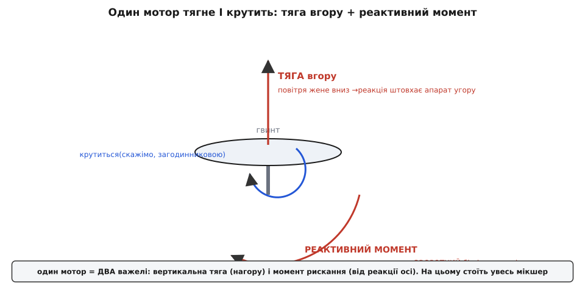
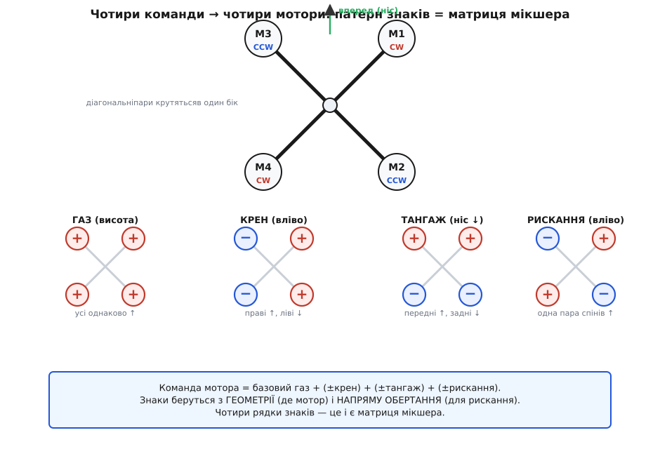
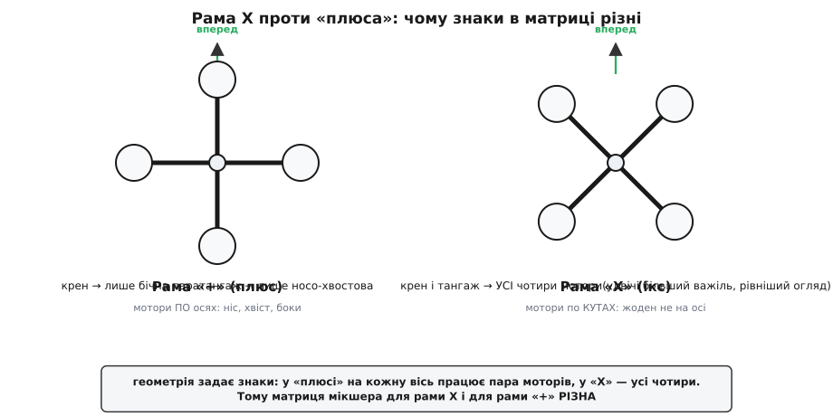
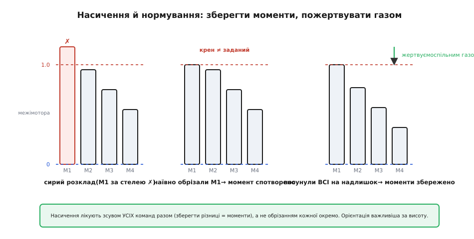

# Мікшер моторів

Уявіть мультиротор у повітрі. Десь у його «мозку» вже визріло чотири числа: «тримай оцю висоту», «нахилися трохи вліво», «опусти ніс», «доверни курс праворуч». Це **бажання** апарата, мова керування. А на дроні немає жодного органа, який вмів би «нахилятися» чи «довертати курс» — є лише чотири (чи шість, чи вісім) однакових моторів, кожен з яких уміє рівно одне: крутитися швидше або повільніше. Між цими двома світами зяє прірва, і місток через неї називається **мікшером моторів** (англ. *mixer* — «змішувач»): він розкладає кожне бажання на оберти кожного мотора.

Перш ніж розбирати сам розклад, варто зрозуміти, **звідки взагалі береться** ця четвірка бажань — газ, крен, тангаж, рискання. Її готує регулятор орієнтації: він порівнює, куди апарат дивиться, з тим, куди має дивитися, і видає потрібні **моменти** навколо трьох осей плюс спільну тягу. Як саме народжуються ці чотири команди, докладно розбирає [керування roll/pitch/yaw](topic:algorithms/roll-pitch-yaw-control); нам тут досить знати, що на вхід мікшера приходять рівно вони — газ (спільна тяга вгору) і три моменти (крен навколо поздовжньої осі, тангаж навколо поперечної, рискання навколо вертикальної). Завдання мікшера — перекласти цю четвірку на мову швидкостей моторів так, щоб апарат і справді зробив бажане.

## Чому один мотор робить дві речі одночасно

Уся хитрість мікшера тримається на одному фізичному факті, який легко проґавити: **гвинт дає не лише тягу**. Коли лопать жене повітря вниз, повітря за третім законом Ньютона штовхає лопать (а з нею весь апарат) угору — це й є тяга, очікувана річ. Але є й друга, менш очевидна реакція. Щоб крутити лопать, вісь прикладає до неї момент сили в один бік; за тим самим законом лопать прикладає **рівний і протилежний момент до осі** — а отже, до корпусу апарата. Корпус хоче провернутися навколо вертикалі **у бік, протилежний обертанню гвинта**. Це **реактивний момент**, і саме він, а не якийсь окремий «кермовий» механізм, дає мультиротору змогу довертати курс.



*Один мотор — це водночас два важелі. Вертикальна тяга піднімає апарат; реактивний момент крутить його навколо вертикальної осі у бік, зворотний обертанню гвинта. Прискорив мотор — зросли обидві; обидві враховує мікшер.*

Звідси випливає головне: **кожен мотор — це не один важіль, а два**. Прискорили мотор — зросла і його тяга, і його реактивний момент. Мікшер мусить рахувати обидва ефекти, бо інакше, виправляючи нахил зміною тяги, він мимохіть зіб'є курс.

Лишилося пояснити, звідки беруться **повороти** навколо горизонтальних осей — крен і тангаж. Тут уже жодної екзотики: мотори стоять на кінцях плечей, рознесені від центра. Якщо тяга з одного боку більша, ніж із протилежного, виникає **різниця моментів** відносно центральної осі, і апарат нахиляється. Додав газу правим моторам, зняв з лівих — апарат кренить вліво. Додав переднім, зняв із задніх — опускає ніс (тангаж). Тобто **крен і тангаж — це різниці тяг між плечима**, а рискання — **різниця реактивних моментів** між моторами, що крутяться в різні боки. Газ же — просто **спільна добавка** до всіх.

## Чотири команди, розкладені на чотири мотори

Тепер зберемо все докупи на найпоширенішій рамі — **квадрокоптері в конфігурації X**, де чотири мотори стоять по кутах квадрата, а ніс дивиться між двома передніми. Пронумеруймо їх і задаймо напрями обертання так, щоб **сусіди крутилися назустріч, а діагоналі — в один бік**. Цей шаховий порядок не примха: він робить так, що реактивні моменти чотирьох моторів у спокої **взаємно гасяться** (дві пари тягнуть курс у протилежні боки), і апарат не закручується сам собою.

Подивимось, який слід лишає в командах моторів кожне з чотирьох бажань окремо.



*Кожна команда лишає свій патерн знаків по моторах. Газ — усім «+» порівну. Крен і тангаж — «+» одному плечу, «−» протилежному. Рискання — «+» одній парі обертання, «−» другій. Накладені разом, ці чотири рядки знаків утворюють матрицю мікшера.*

- **Газ** піднімає апарат прямо вгору, тож усі чотири мотори дістають однакову добавку: `+газ` кожному. Жодних різниць — апарат лише міняє висоту, не повертаючись.
- **Крен** — нахил навколо поздовжньої (носо-хвостової) осі. Потрібна різниця тяг між лівим і правим бортом: одному борту `+крен`, протилежному `−крен`.
- **Тангаж** — нахил навколо поперечної осі (ніс вгору/вниз). Різниця між передніми й задніми моторами: переднім один знак, заднім протилежний.
- **Рискання** — доворот курсу. Тут працює вже не тяга, а **реактивний момент**, тож знак мотора визначає **напрям його обертання**: усім моторам однієї «крутильної» пари `+рискання`, усім другої `−рискання`. Прискоримо ту пару, що крутить корпус у потрібний бік, — баланс реактивних моментів зсунеться, і апарат довернеться.

А тепер ключовий крок: реальному моторові потрібне **одне число**, а не чотири окремі бажання. Тож команди просто **складаються**:

```
m1 = газ + крен + тангаж + рискання
m2 = газ + крен − тангаж − рискання
m3 = газ − крен + тангаж − рискання
m4 = газ − крен − тангаж + рискання
```

Уся «магія» мікшера — у таблиці знаків перед креном, тангажем і рисканням. Кожен рядок — один мотор; кожен стовпчик — одне бажання. Ця таблиця і є **матриця мікшера**. Для квадро-X вона саме така:

```
        газ   крен  тангаж  рискання
m1   =   +1    +1     +1      +1
m2   =   +1    +1     −1      −1
m3   =   +1    −1     +1      −1
m4   =   +1    −1     −1      +1
```

Прочитайте її по стовпчиках — і побачите ту саму фізику, тільки стисло. Стовпчик «газ»: усі `+1`, спільний підйом. Стовпчик «крен»: два `+1` і два `−1` — різниця між бортами. «Тангаж»: інша пара знаків — різниця між носом і хвостом. «Рискання»: знаки йдуть за парами обертання. Звідки беруться самі знаки? **Із геометрії рами** (де стоїть мотор відносно осей) і **з напряму обертання** (для рискання). Більше там нема нічого — мікшер квадрокоптера вкладається у шістнадцять чисел, половина з яких одиниці.

> 🔧 **Навіщо це.** Матриця мікшера — це той клаптик коду, який намертво прив'язаний до **конкретної рами**. Перепаяли мотори, поставили інший каркас, переплутали напрям обертання одного гвинта — і правильна в усьому іншому прошивка підніме апарат, що замість довороту курсу починає перекидатися. Тому в польотних стеках мікшер винесено в окрему таблицю, яку міняють під кожну геометрію, не чіпаючи самих регуляторів.

## Чому рами «X» і «+» дають різні знаки

Та сама четвірка моторів, але зсунута на 45° — конфігурація **«плюс»** (англ. *plus*), де мотори стоять не по кутах, а **по осях**: один спереду, один ззаду, по одному на боках. Здавалося б, дрібниця, але матриця мікшера тут **інша**, і причина суто геометрична.



*У «плюсі» кожна вісь має свою пару моторів: крен — це лише боки, тангаж — лише ніс і хвіст. У X кожен мотор зсунутий по обох осях, тож у крен і тангаж дають внесок усі чотири — звідси вдвічі більший важіль і інші рядки матриці.*

У «плюсі» передній і задній мотори лежать **точно на осі крену**, тож до крену вони байдужі — крутити навколо тієї осі можуть лише бічні два. І навпаки: бічні мотори сидять на осі тангажа й до нього непричетні. Виходить, у «плюсі» **кожна вісь керується лише своєю парою**, а в матриці з'являються нулі: передній і задній мотори мають `0` у стовпчику крену, бічні — `0` у стовпчику тангажа.

У X жоден мотор не стоїть на осі — кожен зсунутий і вперед-назад, і вбік. Тому **в крен і тангаж дають внесок усі чотири мотори** одразу, і нулів у матриці немає. Платою за це є вдвічі більший сумарний важіль на тих самих плечах (працюють чотири мотори замість двох), а ще — чистіший огляд уперед, бо в полі зору не стирчить передній мотор. Саме тому X на практиці витіснив «плюс» майже всюди. Але висновок для нас універсальний: **матриця мікшера — це відбиток геометрії конкретної рами**, і переносити її з однієї рами на іншу не можна. Гекса- й октокоптери, рами H, Y6 — у кожного своя таблиця, виведена за тим самим принципом «тяга × плече» й «реактивний момент × напрям».

## Коли бажань більше, ніж може мотор: насичення й нормування

Доти ми мовчки вважали, що мотор виконає будь-яке число, яке йому дадуть. Це не так. Реальний мотор має **стелю** — повний газ, понад який він уже не розкрутиться, — і **підлогу** (нуль; крутитися «назад» гвинт фіксованого кроку не вміє). А мікшер легко породжує команди поза цими межами: коли апарат уже й так висить на майже повному газі, а регулятор раптом просить ще й різкий крен, сума `газ + крен` для одного з моторів вилазить за стелю. Що робити з таким **насиченням** (англ. *saturation*)?



*Наївне обрізання лише того мотора, що вийшов за стелю, ламає різниці між моторами — а саме в різницях і закодовані моменти, тобто керованість. Правильний шлях: посунути всі команди разом на величину надлишку. Різниці (моменти) лишаються незмінні, жертвуємо лише спільним газом — а орієнтація важливіша за висоту.*

Перша спокуса — просто **обрізати** провинний мотор до стелі, а решту лишити як є. І це найгірше, що можна зробити. Адже корисний сигнал моментів захований **не в самих величинах команд, а в різницях між ними**. Обрізали один мотор — зменшили його перевагу над сусідами, тобто **спотворили заданий момент**. Апарат, якому веліли різко кренитися, кренитиметься слабше, ніж треба, і регулятор, не побачивши очікуваної реакції, проситиме ще більше — поки не зірветься в розгойдування. Найнебезпечніше це саме там, де найпотрібніше: на межі можливостей, у різкому маневрі чи на сильному вітрі.

Правильна думка приходить, щойно спитати: **що тут найважливіше зберегти?** Висоту чи орієнтацію? Відповідь — орієнтацію: апарат, що втратив висоту, лише просяде, а апарат, що втратив контроль над креном, **перекинеться**. Отже, жертвувати треба спільним газом, а різниці (моменти) берегти будь-якою ціною. Звідси й рецепт: якщо найбільша команда перевищує стелю на якусь величину, **відніми цю величину від УСІХ чотирьох моторів одразу**. Усі різниці лишаться незмінні — моменти збережено повністю, — а зменшиться лише спільний рівень, тобто газ. Симетрично чинять і знизу: якщо хтось пірнув під нуль, додають надлишок усім. Це і є **нормування** мікшера — зсув цілого «пакета» команд у дозволений коридор зі збереженням їхньої внутрішньої структури.

> 🔧 **Навіщо це.** Без грамотного нормування дрон **літає чудово, поки спокійно**, і втрачає керованість саме в критичну мить — на поривчастому вітрі або в агресивному маневрі, коли газ і так високий. Така несправність найпідступніша: її не помітити ні на столі, ні на лагідних польотах, а вистрілює вона тоді, коли ціна помилки найбільша. Тому пріоритет «момент над газом» — не оздоба, а захист.

## Реальний мікс на C

Зберемо все докупи у вигляді, придатному для прошивки. На вхід — спільний газ і три моменти від регулятора орієнтації (усі вже зведені до зручного масштабу). На виході — чотири значення в діапазоні `0…1`, які далі підуть на регулятори обертів моторів. Той перетин, де нормоване число `0…1` стає реальною тривалістю керувального імпульсу для мотора, бере на себе [регулятор обертів ESC](topic:electronics/esc) — окрема плата, що живить мотор і тримає задані оберти; мікшер лише каже їй «скільки», нічого не знаючи про самі фази й транзистори.

**Базовий мікс для квадро-X із захистом від насичення (період циклу керування):**

:::tabs
```c
// вхід: throttle 0..1 (спільна тяга), roll/pitch/yaw — моменти (можуть бути ±)
// вихід: m[0..3] у діапазоні 0..1, далі — на ESC
void mix_quad_x(float throttle, float roll, float pitch, float yaw,
                float m[4])
{
    // 1) сирий розклад за матрицею мікшера квадро-X
    m[0] = throttle + roll + pitch + yaw;   // передній правий, CW
    m[1] = throttle + roll - pitch - yaw;   // задній правий,  CCW
    m[2] = throttle - roll + pitch - yaw;   // передній лівий, CCW
    m[3] = throttle - roll - pitch + yaw;   // задній лівий,   CW

    // 2) знайти найбільше й найменше серед чотирьох
    float lo = m[0], hi = m[0];
    for (int i = 1; i < 4; i++) {
        if (m[i] < lo) lo = m[i];
        if (m[i] > hi) hi = m[i];
    }

    // 3) нормування зсувом УСІХ команд (зберігаємо різниці = моменти)
    if (hi > 1.0f) {            // хтось пробив стелю — опустити пакет
        float over = hi - 1.0f;
        for (int i = 0; i < 4; i++) m[i] -= over;
    } else if (lo < 0.0f) {     // хтось пірнув під нуль — підняти пакет
        float under = -lo;
        for (int i = 0; i < 4; i++) m[i] += under;
    }

    // 4) запобіжник на крайній випадок (моменти такі великі,
    //    що навіть після зсуву не влізають у коридор 0..1)
    for (int i = 0; i < 4; i++) {
        if (m[i] < 0.0f) m[i] = 0.0f;
        if (m[i] > 1.0f) m[i] = 1.0f;
    }
}
```
```python
def mix_quad_x(throttle, roll, pitch, yaw):
    """вхід: throttle 0..1 (спільна тяга), roll/pitch/yaw — моменти (можуть бути ±)
    вихід: список m[0..3] у діапазоні 0..1, далі — на ESC"""

    # 1) сирий розклад за матрицею мікшера квадро-X
    m = [
        throttle + roll + pitch + yaw,   # передній правий, CW
        throttle + roll - pitch - yaw,   # задній правий,  CCW
        throttle - roll + pitch - yaw,   # передній лівий, CCW
        throttle - roll - pitch + yaw,   # задній лівий,   CW
    ]

    # 2) знайти найбільше й найменше серед чотирьох
    lo, hi = min(m), max(m)

    # 3) нормування зсувом УСІХ команд (зберігаємо різниці = моменти)
    if hi > 1.0:            # хтось пробив стелю — опустити пакет
        over = hi - 1.0
        m = [x - over for x in m]
    elif lo < 0.0:          # хтось пірнув під нуль — підняти пакет
        under = -lo
        m = [x + under for x in m]

    # 4) запобіжник на крайній випадок (моменти такі великі,
    #    що навіть після зсуву не влізають у коридор 0..1)
    return [min(1.0, max(0.0, x)) for x in m]
```
:::

Тут варто завважити дві речі. По-перше, крок 3 — це і є те саме «жертвуємо газом, бережемо моменти»: ми зсуваємо весь набір, а не ріжемо окремий мотор. По-друге, крок 4 лишається **останнім запобіжником** на патологічний випадок, коли замовлені моменти настільки великі, що не вкладаються в коридор `0…1` навіть після зсуву (тоді частину моментів таки доведеться втратити — фізику не обдуриш). У зрілих стеках цей крайній випадок пом'якшують ще тонше: масштабують самі моменти, аби вони гарантовано влізли, але для розуміння суті досить наведеної логіки.

Звернімо увагу й на те, чого тут **немає**. Немає тригонометрії, немає важких обчислень — лише додавання, віднімання й кілька порівнянь. Мікшер навмисно зроблено дешевим, бо він крутиться в найгарячішому циклі польотного контролера, сотні разів на секунду, пліч-о-пліч із регулятором. Кожен зайвий такт тут — украдений час у стабілізації.

## Де це працює і що з цього випливає

Мікшер моторів стоїть на одному з найважливіших стиків усієї системи керування: **між абстрактним бажанням і фізичним залізом**. Усе, що вище нього — оцінка орієнтації, регулятори, місії, — мислить чистими поняттями «нахилися», «лети туди». Усе, що нижче — регулятори обертів, мотори, гвинти, — знає лише «крутися отак швидко». Мікшер перекладає одне на інше, і робить це з точним урахуванням фізики конкретного апарата: де стоять мотори, як вони крутяться, які в них межі.

Саме тому той самий принцип, без жодної зміни ідеї, переноситься з квадрокоптера на що завгодно з кількома виконавчими органами. Гексакоптер чи октокоптер — ширша матриця з тих самих «тяга × плече». Літак — інша «матриця», де команди йдуть не на оберти, а на відхилення елеронів, керма висоти й напрямку. Навіть наземний робот із кількома колесами розкладає «їдь уперед» і «повертай» на швидкості коліс за тією самою логікою змішування. Скрізь, де **одне бажання керування мусить розпастися на кілька незалежних приводів**, працює мікшер — і скрізь його серце те саме: матриця, що відбиває геометрію апарата, плюс грамотне нормування, що береже найважливіше, коли заліза вже бракує на всі забаганки.
