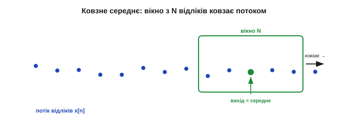
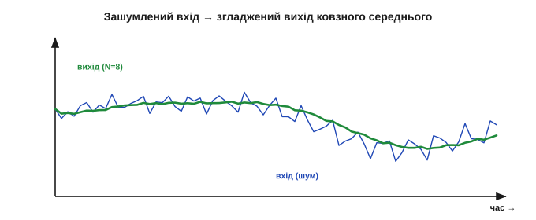
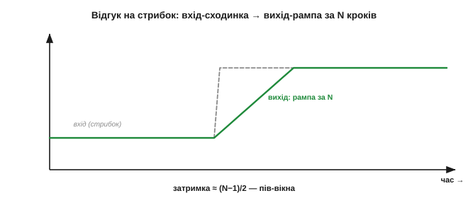
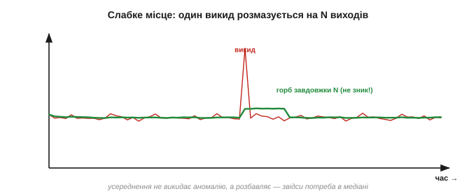

# Ковзне середнє

Найприродніший спосіб приборкати тремтіння кожен робить мимоволі: щоб не вірити одному смикливому показу, береш **кілька** останніх і дивишся на їхнє **середнє**. Саме це й робить **ковзне середнє** (*moving average*) — найпростіший і найуживаніший фільтр на світі. Воно тримає «вікно» з останніх N відліків, видає їхнє середнє, а з кожним новим відліком **зсуває** вікно на крок уперед. Простий до банальності — і водночас напрочуд дієвий проти випадкового шуму. Варто розібратися, чому воно працює, як зробити його **дешевим** на мікроконтролері й де в нього чесні межі.

### Ідея: усереднити останні N відліків

Хай із давача йде потік відліків x[0], x[1], x[2], … Ковзне середнє з вікном N видає на кожному кроці середнє останніх N значень:

```
y[n] = ( x[n] + x[n-1] + … + x[n-N+1] ) / N
```


*Вікно охоплює останні N відліків; їхнє середнє — це вихід. З кожним новим відліком вікно зсувається на один крок: новий входить, найстаріший випадає. Звідси й назва — середнє «ковзає» потоком.*

Гасить шум воно з простої причини: [випадкова добавка](topic:electronics/drift-hysteresis-noise) симетрична навколо нуля, тож у сумі N відліків її «плюси» й «мінуси» частково гасять одне одного, і середнє лежить **ближче** до істини, ніж кожен окремий відлік. Кількісно шум спадає як [**1/√N**](topic:math/averaging-gain): учетверо більше вікно — удвічі тихіше.


*Синій тремтливий вхід проходить крізь ковзне середнє й виходить набагато спокійнішим (зеленим): випадкові «плюси» й «мінуси» в кожному вікні взаємно гасяться. Що ширше вікно, то гладкіший вихід.*

**Приклад (наскільки тихіше).** Вікно N = 8. Випадковий шум спаде приблизно у:

```
√N = √8 ≈ 2.83 раза
```

Тобто розмах тремтіння зменшиться майже втричі — за рахунок усього лиш зберігання восьми чисел і одного ділення. Дешево й помітно.

Варто знати, що ковзне середнє — не просто «здоровий глузд», а **оптимальний** оцінювач у точному сенсі: якщо величина стала, а шум симетричний (гаусів), то саме середнє відліків — найкраща оцінка істинного значення, яку взагалі можна побудувати з цих даних. Тобто простота тут не від бідності: для **сталого** сигналу в гаусовому шумі кращого за усереднення не існує. Уся хитрість починається тоді, коли величина **перестає** бути сталою, — і тоді усереднення стає вже компромісом, а не ідеалом, бо в одне вікно потрапляють і старі, уже неактуальні значення.

### Як зробити дешево: ковзна сума

Наївна реалізація щокроку складає всі N відліків заново — це N додавань на кожен вихід, тобто **O(N)**. На широкому вікні чи швидкому потоці це марнотратство. Хитрість проста: тримати не суму «з нуля», а **ковзну суму**. Маємо суму вікна; прийшов новий відлік — **додай** його й **відніми** той, що випадає з вікна. Одне додавання, одне віднімання, одне ділення — **O(1)** незалежно від N. Самі N відліків зберігають у **кільцевому буфері** (буфер — від англ. *buffer*, проміжне сховище: масив, де новий запис затирає найстаріший по колу).


*Замість складати все вікно заново тримають його суму: новий відлік додають, найстаріший (що випадає) віднімають. Кільцевий буфер зберігає N значень. Так вартість кроку не залежить від ширини вікна — завжди кілька дій.*

**Приклад (ковзна сума в дії).** Вікно N = 4, у буфері [10, 12, 11, 13], сума = 46. Прийшов новий відлік 15, найстаріший 10 випадає:

```
нова сума = 46 + 15 − 10 = 51
новий вихід = 51 / 4 = 12.75
```

Жодного перерахунку всього вікна — лише плюс новий, мінус старий. Саме так ковзне середнє роблять навіть на найкволіших мікроконтролерах.

Дві практичні засторо́ги. По-перше, [**переповнення**](topic:programming/overflow-wraparound): ковзна сума зберігає суму N чисел, тож вона в N разів більша за один відлік — і на широкому вікні легко вилазить за межі малого цілого типу. Тому під суму беруть тип ширший за відлік. По-друге, **старт**: перші N кроків вікно ще не повне, і ділити на N зарано; або накопичують, поки буфер заповниться, або від початку ділять на **фактичну** кількість уже зібраних відліків. Знехтувати цим — отримати хибні перші покази саме тоді, коли давач щойно ввімкнули, а саме тоді їм найбільше вірять.

Сам кільцевий буфер вартий пояснення: це звичайний масив на N комірок плюс індекс, що по колу вказує на найстарішу комірку. Прийшов відлік — записуємо його **поверх** найстарішого, рухаємо індекс на крок (а дійшовши кінця масиву, повертаємо на початок). Так старіння відбувається само собою, без зсувів усього масиву. Пам'яті це коштує рівно N комірок — єдина, але неуникна ціна ковзного середнього: щоб усереднити N останніх відліків, їх треба **десь зберігати**, на відміну від [експоненційного згладжування](topic:algorithms/ema), якому буфер не потрібен.

> 🔧 **Навіщо це.** Завжди реалізуйте ковзне середнє **ковзною сумою**, а не повторним складанням вікна. Інакше широке вікно (скажімо, N = 100) з'їдатиме сотню додавань на кожен відлік дарма, тоді як ковзна сума обходиться трьома діями за будь-якого N. Ціна — лише пам'ять під буфер на N значень.

### Розмір вікна: та сама плата

Скільки взяти N? Тут у конкретних числах оживає головний [компроміс між згладжуванням і затримкою](topic:algorithms/signal-noise). **Більше** N — гладкіший вихід (шум ÷√N), але **довша затримка** й більше пам'яті. **Менше** N — спритніша реакція, та галасливіший вихід.


*Вибір N — це вибір на шкалі «гладкість проти швидкодії». Мале вікно (N=4) спритно стежить за зміною, лишаючи помітний шум; велике (N=16) дає гладку лінію, але доповзає до нових значень повільніше й тримає в пам'яті більше відліків. Точку добирають під динаміку задачі.*

Затримка ковзного середнього легко рахується: оскільки вихід — це середина вікна, він **відстає** приблизно на пів вікна:

```
затримка ≈ (N − 1) / 2  відліків
```

Для N = 16 це вісім відліків запізнення. Тож «удвічі тихіше» (учетверо ширше вікно) коштує «вчетверо повільніше» — рівно та [плата за гладкість](topic:algorithms/signal-noise), якої тут не обійти.

Як обрати N на практиці? Знизу його обмежує **шум**: вікно має бути досить широким, щоб згладити тремтіння до прийнятного. Зверху — **швидкодія**: затримка (N−1)/2 не повинна перевищити того, що терпить керування. Між цими межами й лежить робоче N. Окрема дрібна хитрість — брати N **степенем двійки** (8, 16, 32): тоді ділення на N перетворюється на дешевий [**зсув** бітів](topic:math/positional-systems), а не на справжнє ділення, яке на простому ядрі дороге. Тому в реальному коді ковзні середні так часто мають вікно 8 чи 16, а не 10 чи 15.

Де ковзне середнє — правильний вибір за замовчуванням? Скрізь, де шум **рівномірний** і дрібний, а величина змінюється **повільніше** за вікно: згладити показ температури чи вологості, заспокоїти тремтливу напругу з АЦП, усереднити кут нахилу перед подачею в регулятор. Воно прозоре (видно, що робить), передбачуване (відома затримка) і дешеве — тому з нього й починають, а до хитріших фільтрів переходять лише тоді, коли рампа затримки чи розмазування викидів стають на заваді. «Спершу спробуй ковзне середнє» — непогане інженерне правило.

Та й у нього є стеля. Воно давить лише **випадкову** частину похибки (як √N), а [**систематичну** — зсув, дрейф, нелінійність](topic:electronics/drift-hysteresis-noise) — не чіпає зовсім: усередни хоч тисячу відліків зміщеного давача, центр лишиться зміщеним. Тому, наростивши вікно, у якийсь момент перестаєш вигравати точність: шум уже придушено до рівня систематики, і далі більший N лише додає затримки задарма. Знати цю стелю корисно, щоб не роздувати вікно понад глузд, женучись за точністю, якої усередненням уже не дістати.

### Затримка й відгук на стрибок

Найкраще побачити цю плату на **різкій зміні**. Якщо величина миттєво стрибнула на новий рівень, ковзне середнє не стрибає за нею, а **піднімається лінійно** — поки старі (нижчі) відліки по черзі випадають із вікна, а нові (вищі) заходять. Повністю «доповзе» воно лише за N кроків.


*Вхід стрибнув миттєво (сіра сходинка), а вихід ковзного середнього піднімається **рампою** рівно за N відліків — поки вікно не заповниться новими значеннями. Чим ширше вікно, то пологіша рампа й більша затримка.*

Ця рампа — наочне обличчя затримки: фільтр не бреше про новий рівень, він просто **доходить** до нього не одразу. Для повільної величини це байдуже, для швидкої реакції — критично.

Затримка ковзного середнього має й приємну властивість: вона **однакова для всіх частот** сигналу — і повільні, і швидкі складові зсуваються в часі на ті самі ≈ N/2 відліків, не спотворюючи **форми**. Мовою фільтрів це зветься [**лінійною фазою**](topic:algorithms/fir-filter) й цінується там, де важливо не покривити сигнал, а лише трохи його затримати. Аналогова RC-ланка цим похвалитися не може: різні частоти вона затримує по-різному, тож форму трохи спотворює.

Цікаво порівняти ковзне середнє з цим аналоговим родичем глибше. Обидва усереднюють минуле, та **по-різному**: RC «пам'ятає» всі попередні значення з вагою, що плавно спадає (експонента), а ковзне середнє пам'ятає рівно N останніх **порівну** й геть забуває все, що старіше. Через це в ковзного середнього різкий «хвіст» пам'яті (відлік або у вікні, або вже ні), а в RC — м'який. Який кращий — залежить від задачі: різкий хвіст дає прицільні нулі на частотах завади, м'який — плавнішу реакцію без різких країв. Той самий вибір «різке проти плавного забування» постає й під час [вибору фільтра](root:embedded/choosing-a-filter) під конкретну задачу.

### Слабке місце: викид розмазується

А ось де ковзне середнє підводить — на **поодиноких викидах**. Один дикий відлік входить у суму з вагою 1/N і лишається в ній **усі N кроків**, поки не випаде з вікна. Тож замість зникнути, викид **розмазується**: гострий сплеск перетворюється на невеликий горб, що псує **N** наступних виходів.


*Один дикий відлік (червоний сплеск) не зникає, а розноситься вагою 1/N по всьому вікну — вихід отримує невеликий горб завдовжки в N кроків. Усереднення не **викидає** аномалію, а лише **розбавляє** її, псуючи цілий шмат сигналу.*

Тут діє проста межа: усереднення лікує **тремтіння**, а проти **викидів** воно безсиле — лише розмазує брехню (як буває з [привидами далекоміра](topic:electronics/distance-errors)). Саме звідси й народжується потреба в зовсім іншому фільтрі — [медіанному](topic:algorithms/median-filter), що викид не усереднює, а **ігнорує**.

> 🔧 **Навіщо це.** Ковзне середнє — інструмент проти **рівномірного тремтіння**, а не проти спайків. Якщо у ваших даних трапляються поодинокі дикі значення (збої зв'язку, привиди, наводки), не кидайте їх у середнє — спершу приберіть медіаною, і лише потім, за потреби, догладьте середнім. Усереднити сирий потік із викидами — отримати гладку, але зіпсовану лінію.

Масштаб шкоди легко прикинути. Хай у вікні N = 8 трапився викид удесятеро більший за норму. Він додасть до кожного з восьми виходів восьму частину свого надлишку — невеликий, але **впертий** горб, що тримається вісім відліків поспіль. Для ока це дрібниця; а для [регулятора](topic:algorithms/discrete-pid) — вісім кроків хибної команди підряд, бо керування не знає, що то був збій, і чесно відпрацьовує підроблений горб. Один спайк — і ціла серія неправильних рішень: ось чому викиди небезпечніші, ніж здаються.

### Тонкощі: рівна вага й несподіваний бонус

Дві деталі завершують портрет. По-перше, ковзне середнє зважує **всі** відліки вікна **однаково**, а тоді відлік різко **випадає** з вікна цілком — таке «прямокутне» (boxcar) зважування дає трохи різкі краї відгуку. Плавніше «забування» старого дає [експоненційне згладжування](topic:algorithms/ema).

Звідси й природна думка: а що, як зважувати відліки **не порівну** — свіжим довіряти більше, старим менше? Так виходить **зважене** ковзне середнє, плавніше за прямокутне. А якщо довести цю ідею до краю — щоб вага спадала з віком **експоненційно** й узагалі не доводилося тримати буфер, — вийде вже інший, ще дешевший фільтр, [експоненційне згладжування](topic:algorithms/ema). Тобто звичайне ковзне середнє — лише найпростіша точка цілого сімейства «усереднень із пам'яттю».

По-друге — приємний бонус, що випливає з усереднення. Якщо у сигналі є **періодична** завада (класика — гул мережі 50 Гц), а вікно зробити завдовжки **рівно в один її період**, то за одне вікно завада робить повний цикл, її «плюси» й «мінуси» точно скорочуються — і вона зникає **повністю**, а не просто слабшає. Тобто, влучно підібравши N під частоту наводки, ковзне середнє **повністю гасить** її — дрібна, але дуже корисна на практиці хитрість, яка стає очевидною в [частотному погляді](root:embedded/why-frequency-domain) на фільтр.

Насправді таких «нулів» у ковзного середнього не один, а ціла **гребінка**: воно повністю гасить не лише основну частоту завади, а й усі її гармоніки, що вкладаються у вікно цілою кількістю періодів. Тому вікно завдовжки в один період 50 Гц прибере і 50 Гц, і 100 Гц, і 150 Гц гулу заразом. Це робить просте усереднення несподівано **прицільним** інструментом проти мережевої наводки — треба лише знати частоту дискретизації.

**Приклад (вікно під 50 Гц).** Давач опитують 1000 разів на секунду (період відліку 1 мс). Один період 50 Гц триває 20 мс, отже:

```
N = період_завади / період_відліку = 20 мс / 1 мс = 20 відліків
```

Вікно N = 20 повністю погасить 50-герцовий гул і його гармоніки.

> 🔧 **Навіщо це.** Якщо вас мучить саме мережевий гул, не нарощуйте вікно наосліп — порахуйте N під **рівно один період** завади (для 50 Гц і дискретизації 1 кГц це 20). Тоді ковзне середнє вб'є гул точно, не роздуваючи затримку понад потрібне. Це рідкісний випадок, коли розмір вікна диктує не шум, а конкретна **частота ворога**.

Підсумок: ковзне середнє — простий, дешевий (із ковзною сумою — O(1)), передбачуваний фільтр проти випадкового тремтіння, із чесною затримкою ≈ N/2 і відомою платою за гладкість. Його слабкість одна, зате принципова — воно **розмазує викиди**. Тому, коли в потоці трапляються не дрібні коливання, а рідкі дикі спайки, потрібен фільтр, що їх **відкидає**, а не усереднює, — [медіанний](topic:algorithms/median-filter).

---
