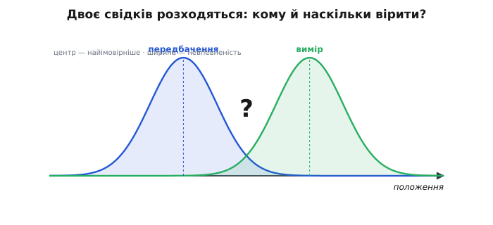
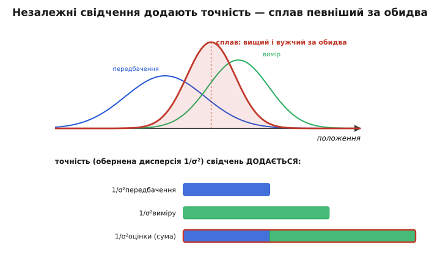
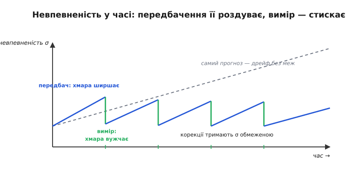
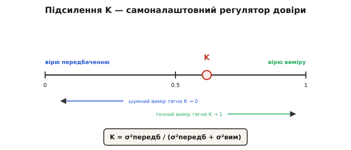

# Передбачення vs вимір

<preknowlist>
- [Модель руху](book:algorithms/motion-model) — обґрунтований здогад, де апарат буде за такт, разом із «хмарою» невпевненості, що росте з часом; це і є передбачення, яке ця стаття зважує з виміром.
- [Нормальний розподіл](book:math/normal-distribution) — дзвоноподібна крива, якою тут описано невпевненість: центр — найімовірніше значення, ширина — сумнів.
- [Середнє й дисперсія](book:math/mean-variance) — дисперсія σ² як міра розкиду; саме нею тут вимірюють довіру до передбачення й виміру.
</preknowlist>

Автономний апарат мусить щотакту знати свій стан — де він, як швидко рухається, під яким кутом нахилений. Без цього нічого не порахувати: керування штовхає мотори, спираючись на цифру «де я зараз», і хибна цифра псує все далі по ланцюгу. Проблема в тому, що ту цифру ніхто не подає напряму. До неї ведуть **два незалежні шляхи, і вони майже ніколи не сходяться в одній точці**.

Перший шлях — **передбачення** (лат. *prae-* «наперед» + *dicere* «казати»). Апарат бере свою попередню оцінку стану й прокручує її вперед на один такт через [модель руху](book:algorithms/motion-model): «я був отут, рухався з такою швидкістю — отже за 5 мілісекунд буду отам». Це обґрунтований здогад, який не потребує жодного нового давача, лиш знання фізики свого руху. Але модель недосконала: колесо трохи прослизнуло, вітер штовхнув, тяга мотора не точно та, що очікували, — і чим довше апарат покладається на самий здогад, тим більше той розходиться з дійсністю.

Другий шлях — **вимір** (лат. *mensura*, від *metiri* «міряти»). Давач — GPS, далекомір, камера — дивиться на світ і повертає число. Воно свіже, прив'язане до реальності, але **зашумлене**: та сама точка щоразу зчитується трохи інакше, стрибає навколо правди.

Отже щотакту апарат тримає в руках дві відповіді на одне питання: тиху, але дедалі менш надійну відповідь моделі, і галасливу, але свіжу відповідь давача. Вони розходяться. Питання, яке вирішує ця стаття, звучить просто, а відповідь на нього — серце всієї навігації й [поєднання давачів](book:communications/sensor-fusion): **як злити дві непевні відповіді в одну, певнішу за кожну окремо?**

### Спокуси, що не працюють

Найпростіше — **вибрати когось одного назавжди**. Обидва варіанти погані, і погані по-різному, тож варто побачити чому.

Повіриш **лише виміру** — і викинеш модель. Тоді оцінка стрибатиме разом із [шумом давача](book:algorithms/signal-noise): апарат «сіпатиметься», бо кожен випадковий викид зчитування він приймає за правду. Керування, побудоване на такій оцінці, тремтітиме й перевитрачатиме енергію, ганяючись за привидами шуму.

Повіриш **лише передбаченню** — і викинеш давач. Тепер оцінка гладенька, але вона **дрейфує** (англ. *drift* «зносити течією»): дрібні похибки моделі накопичуються без упину, бо ніщо їх не виправляє. За хвилину такого числення апарат буде впевнений, що він за десять метрів від місця, де насправді стоїть. Гладенько — і геть неправда.

Друга спокуса тонша — узяти **просте середнє**, стати рівно на півдорозі між двома відповідями. Це вже краще за крайнощі, але однаково несправедливо. Уяви двох свідків події: один дивився крізь бінокль, другий — крізь туман. Слухати їх однаково — образа для першого. А що, як цього такту давач якраз точний, а модель розпливлася, бо давач довго мовчав? Рівне середнє змішає добру відповідь із поганою навпіл і зіпсує добру.

Правильний хід ховається саме в цьому образі свідків: слухати обох, **але зважено — тим уважніше, чим свідок надійніший цього разу**. Щоб зважувати надійність, її треба спершу виміряти числом. І тут — перший глибокий поворот теми.

### Невпевненість — це не одне число, а розподіл

Поки передбачення й вимір — це просто дві точки на осі («10 метрів» і «16 метрів»), зважити їх нема чим: точка не каже, наскільки їй вірити. Тому кожну відповідь треба бачити **не як точку, а як хмару** — розподіл можливостей. Центр хмари — найімовірніше значення; **ширина хмари — міра сумніву**. Тісна хмара — «я майже певен, десь тут»; розпливла — «десь у цих межах, точніше не скажу».


*Кожне свідчення — «хмара» на осі стану: центр — найімовірніше значення, ширина — невпевненість. Передбачення каже одне, вимір давача — інше; вибрати лише одне погано, просте середнє несправедливе. Зважати треба за шириною хмар.*

Ширину хмари міряють **дисперсією** (лат. *dispersio* «розсіювання», від *dispergere* «розсіювати») — числом σ², що показує, як сильно значення розкидані навколо центру. Мала σ² — вузька хмара, велика довіра; велика σ² — широка хмара, малий сумнів обертається на великий. Дисперсія — це і є **міра недовіри** до свідчення, виражена одним числом. Саме нею апарат зважуватиме.

> 🔧 **Навіщо це.** Кожен давач у прошивці має паспортну характеристику шуму, і з неї виводять його σ². GPS у місті серед висоток — велика σ² (сигнал відбивається від стін); той самий GPS у чистому полі — мала. Оцінювач мусить знати ці числа, щоб правильно зважувати: заявиш давач точнішим, ніж він є, — фільтр повірить його шуму; заявиш надто шумним — майже не слухатиме. Половина роботи налаштування навігації — це чесно оцінити σ² кожного джерела.

Чому саме **дзвоноподібна** хмара, а не якась інша форма? Три причини сходяться в одну відповідь. Перша — фізична: похибка давача чи моделі складається з багатьох дрібних незалежних причин (теплові коливання, тремтіння кріплення, округлення, завади), а сума багатьох малих незалежних випадковостей за [центральною граничною теоремою](book:math/normal-distribution) прямує до дзвона незалежно від того, як розподілена кожна причина окремо. Друга — інформаційна: серед усіх розподілів із даною шириною дзвін закладає **найменше зайвих припущень** (він максимально «невизначений» за фіксованої σ²), тож обираючи його, ми не вигадуємо про похибку нічого понад те, що знаємо. Третя — практична, і саме вона робить дзвін незамінним тут: над дзвонами дві потрібні нам дії — **прокрутити крізь модель** і **перемножити дві хмари** — знову дають дзвін. Форма замкнена сама на себе, тож увесь цикл оцінювання можна вести, тримаючи від кожної хмари лише два числа: центр і σ². Це не спрощення заради зручності, а те, що робить безперервне оцінювання взагалі здійсненним на скромному процесорі.

### Оптимальний сплав: зважити за оберненою дисперсією

Тепер усе готове, щоб вивести правильне зважування — не постулювати, а **побачити, звідки воно береться**. Маємо два незалежні свідчення про одну величину: передбачення з центром *a* і дисперсією σ²_пер, вимір із центром *b* і дисперсією σ²_вим. Шукаємо одну зведену оцінку.

Природно взяти її як зважене середнє двох центрів: зсунути вагу *w* на передбачення, решту — на вимір.

```
оцінка = w·a + (1 − w)·b        # w — частка довіри до передбачення, від 0 до 1
```

Питання лиш у тому, яке *w* обрати. І тут є об'єктивний критерій: обрати те *w*, за якого **зведена оцінка найменше помиляється** — має найменшу власну дисперсію. Бо два незалежні свідчення додають свої розкиди зі своїми вагами, і дисперсія зваженого середнього виходить

```
σ²_оцінки = w²·σ²_пер + (1 − w)²·σ²_вим
```

Це парабола від *w*: занадто велике *w* тягне всередину великий розкид передбачення, занадто мале — розкид виміру, а десь між ними лежить дно — найменша можлива похибка. Знайти дно параболи — стандартна дія: похідну по *w* прирівняти до нуля. Результат виходить напрочуд чистий:

```
w = σ²_вим / (σ²_пер + σ²_вим)
```

Вага передбачення дорівнює **дисперсії виміру**, поділеній на суму дисперсій. Прочитаймо цю формулу вголос, бо в ній уся суть. Чим **шумніший вимір** (більша σ²_вим), тим **більша** вага *w* передбачення — логічно, поганому давачеві віримо менше, отже спираємось на модель. Чим точніший вимір (мала σ²_вим), тим менша вага передбачення — свіжому точному відлікові віримо охочіше. Кожне свідчення входить у сплав **обернено до власної недовіри**: не за тим, хто голосніший, а за тим, хто певніший. Повне виведення — з перевіркою, що це дно, а не вершина параболи, і що оцінка виходить незміщеною, — розкладено в [окремій викладці про оптимальне зважування](book:algorithms/predict-vs-measure/math-optimal-fusion.md): там показано, що обернено-дисперсійні ваги дають оцінку з найменшою можливою дисперсією серед усіх лінійних незміщених, і що та сама формула виходить іще й [байєсівським шляхом](book:math/bayesian-estimation) — як добуток двох дзвонів.

Зведена оцінка ляже **між** двома центрами, але **не посередині, а ближче до вужчої хмари**. І це саме той «зважений свідок», якого ми шукали, — тепер не на око, а з числом.

### Точність додається — тому сплав певніший за обидва

Досі ми зважували центри. Але найдивовижніше стається з **шириною** зведеної хмари, і саме тут поєднання дає те, чого не дає жодне джерело окремо. Перепишімо суть через обернену величину. Назвімо **точністю** свідчення (лат. *praecisio* «чіткість, відрізання зайвого») число 1/σ² — обернену дисперсію: що вужча хмара, то вища точність. Тоді оптимальне зважування каже коротко:

```
точність_оцінки = точність_передбачення + точність_виміру
       1/σ²_оцінки = 1/σ²_пер + 1/σ²_вим
```

**Точності просто додаються.** А раз сума завжди більша за кожен доданок, точність оцінки **більша за точність будь-якого з джерел** — отже її дисперсія менша, хмара **вужча за обидві вхідні**.


*Нормовані густини: сплав (червоний) вищий і вужчий за обидві вхідні хмари. Унизу — чому: точність (обернена дисперсія 1/σ²) незалежних свідчень додається, тож точність оцінки — сума точностей передбачення й виміру, більша за кожну окремо.*

Це не арифметичний фокус, а **інформаційна** істина, і варто відчути її нутром. Два незалежні погляди на одну річ несуть **більше знання**, ніж один: там, де кожен окремо лишав сумнів, вони, накладаючись, звужують коло можливого. Так двоє свідків, що дивилися з різних боків, разом окреслюють подію тісніше, ніж будь-хто сам. Тому поєднання — це **не компроміс** (не «десь посередині, всім потроху поступилися»), а **підсилення певності**: сплав знає більше за обидва, з яких зроблений. У цьому весь виграш, заради якого затівається все злиття давачів.

Одне застереження, без якого картина брехлива, і воно тримається на слові «незалежні». Точності додаються лише тоді, коли свідчення справді незалежні й правильно змодельовані. Якщо вимір **зміщений** (систематично бреше в один бік) або **скорельований** із передбаченням (обидва помиляються заодно) — додавання точностей стає самообманом: апарат вважатиме себе певнішим, ніж є. Незалежність джерел — найтонше припущення всього зважування, і на практиці саме воно підламується найпідступніше.

### Від пари свідчень — до петлі в часі

Досі йшлося про єдину мить: два свідчення, один сплав. Але апарат живе в часі, і саме тут статична картинка обертається на **машину**. Ключ у тому, звідки взагалі береться передбачення. Воно не падає з неба — це **попередня зведена оцінка, прокручена вперед** через модель руху. А прокрутка крізь недосконалу модель має ціну: **невпевненість росте**. Модель додає свій власний сумнів — [шум процесу](book:algorithms/motion-model) (наскільки їй самій можна вірити за один такт), — тож хмара передбачення завжди **ширша** за хмару оцінки, з якої вона вийшла. Передбачення роздуває невпевненість.

Вимір робить протилежне — корекція **звужує** хмару. Складімо два рухи докупи — і отримаємо ритм, що дихає:


*Невпевненість σ у часі. На кожному передбаченні хмара роздувається (синій підйом), на кожному вимірі — стискається (зелений спад). Корекції тримають σ обмеженою; самий лише прогноз без вимірів (штрихова) дрейфував би вгору без меж.*

Пилка на малюнку — це і є весь фільтр у профіль. Між вимірами σ повзе вгору (апарат числить наосліп, покладаючись на модель); щойно приходить вимір — σ різко падає (реальність підправляє здогад). Корекції невпинно зрізають накопичений сумнів, тримаючи його обмеженим. А штрихова лінія показує, що було б **без** вимірів: чисте передбачення — це [інерціальне числення позиції](book:algorithms/dead-reckoning), і його хмара росте без меж, чому й самому прогнозові довіряти довго не можна.

Тепер найважливіше — **чому це петля, а не разовий розрахунок**. Зведена оцінка після корекції певніша за все, що було. І саме вона стає **насінням для наступного передбачення**: її прокручують уперед, вона роздувається, приходить новий вимір, її знову стискають. Передбач → виправ → передбач → виправ, сотні разів на секунду.

І ось де ховається глибина, за яку варто вхопитися. Щоб зробити наступний крок, апаратові **не потрібна вся історія** минулих вимірів — досить двох чисел: поточної оцінки та її дисперсії. У них уже **стиснуто все**, що дали всі попередні свідчення разом. Це називають **достатньою підсумовкою**: сьогоднішній стан містить усе, що минуле може сказати про майбутнє, тож старі дані можна забути. Тому оцінювання **рекурсивне** (лат. *recurrere* «вертатися, бігти назад») — кожен крок спирається лиш на результат попереднього, а не переглядає все спочатку. Різниця величезна: наївний спосіб щотакту наново припасовував би криву до всіх зібраних відліків, і робота росла б без меж, поки апарат не захлинувся б власною історією. Рекурсивна петля робить **сталу роботу на такт**, скільки б годин не летів апарат. Саме цей перехід — від разового припасування всіх даних до вічної петлі з двох чисел — і зробив колись оптимальне зважування придатним для живих машин; його історію, від пакетного [методу найменших квадратів](book:math/least-squares) Гаусса до рекурсивної форми середини XX століття, розказано [окремо](book:algorithms/predict-vs-measure/hist-recursive-estimation.md).

### Одне число робить усю роботу: підсилення

Лишилось назвати важіль, яким апарат щотакту вирішує, **наскільки** зрушитися від передбачення до виміру. Це одне число — **підсилення** (англ. *gain* «приріст, коефіцієнт підсилення»), — і воно грає роль регулятора довіри.

Спершу беруть **різницю** між виміром і передбаченням — «несподіванку», або **інновацію** (лат. *innovare* «оновлювати», від *novus* «новий»): наскільки реальність розійшлася з очікуванням. Це єдина по-справжньому нова інформація, яку приніс вимір, — усе інше апарат уже знав. Тоді нову оцінку дістають одним рядком:

```
несподіванка = вимір − передбачення
нова оцінка  = передбачення + K · несподіванка
```

де **K** — підсилення від 0 до 1. При **K = 0** несподіванку геть ігнорують (лишаються на передбаченні); при **K = 1** стрибають прямо на вимір; між ними — зважений сплав. А визначає K та сама обернено-дисперсійна вага, що ми вивели, лише записана з боку виміру:


*Підсилення K — самоналаштовний регулятор довіри. K = σ²передб / (σ²передб + σ²вим): шумний вимір (велика σ²вим) тягне K до нуля — лишаємось на передбаченні; точний вимір тягне K до одиниці — стрибаємо на вимір. K сам перетікає за відносною певністю джерел.*

```
K = σ²_пер / (σ²_пер + σ²_вим)
```

Найкраще те, що K **сам перетікає** за обставинами, нікого не питаючи. Щойно передбачення розпливлося (давач довго мовчав, σ²_пер зросла) — K росте, і наступний вимір беруть охочіше. Щойно вимір зашумів (σ²_вим зросла) — K падає, і оцінка тримається моделі. Ніхто не крутить цей важіль вручну: він рухається сам, бо обидві дисперсії апарат веде щотакту. Це знамените **підсилення Калмана** — автоматичний регулятор довіри, що є ядром [фільтра Калмана](book:algorithms/kalman-filter).

Підставмо числа, щоб побачити, як важіль дихає протягом кількох тактів. Хай апарат стартує з оцінкою 10.0 м і дисперсією 2.0; модель за такт додає шуму процесу 2.0, давач міряє з дисперсією 1.0.

**Два повні цикли «передбач → виправ» на дотик:**

```
Початок:   x = 10.00,  p = 2.00                 # оцінка та її дисперсія

ПЕРЕДБАЧЕННЯ (модель тримає позицію, + шум процесу 2.0)
  x = 10.00
  p = 2.00 + 2.00 = 4.00                         # невпевненість зросла

ВИМІР 1:   z = 16.00,  r = 1.00                  # давач певніший за модель
  K = p / (p + r) = 4.00 / 5.00 = 0.80           # висока довіра до виміру
  x = 10.00 + 0.80 · (16.00 − 10.00) = 14.80
  p = (1 − 0.80) · 4.00 = 0.80                   # хмара вужча за обидві вхідні

ПЕРЕДБАЧЕННЯ (наступний такт, + шум процесу 2.0)
  x = 14.80
  p = 0.80 + 2.00 = 2.80                         # знову роздулася

ВИМІР 2:   z = 15.00,  r = 1.00
  K = 2.80 / 3.80 = 0.737                         # менше, ніж було: модель уже певніша
  x = 14.80 + 0.737 · (15.00 − 14.80) = 14.95
  p = (1 − 0.737) · 2.80 = 0.737
```

Прочитаймо, що сталося. Дисперсія **дихає**: 2.0 → 4.0 на передбаченні, 4.0 → 0.8 на вимірі, знову 0.8 → 2.8, тоді 2.8 → 0.737 — та сама пилка, що на малюнку. Підсилення **саме спало** з 0.80 до 0.737: після першої корекції модель стала певнішою відносно давача, тож другий вимір узяли трохи стриманіше. І оцінка **осідає** біля 15 м, не сіпаючись на повний розмах між 10 і 16. Жодного ручного втручання — усю роботу зважування тихо зробило одне число K, яке саме порахувалося з дисперсій. Ця арифметика — повний скалярний фільтр Калмана; те саме, розгорнуте в робочий код із потоком зашумлених вимірів і порівнянням із наївними підходами, зібрано в [окремому проєкті-трекері](book:algorithms/predict-vs-measure/proj-predict-correct-tracker.md).

### Де зважування ламається

Уся ця стрункість тримається на кількох припущеннях, і чесна інженерія вимагає знати, **де вони підламуються** — бо тоді красива формула тихо починає брехати, не подаючи виду.

**Дисперсії заявлено неправдиво.** K рахується з σ²_пер і σ²_вим, і якщо ці числа не відповідають дійсності, важіль стане не туди. Заявиш давач точнішим, ніж він є (замала σ²_вим), — K завеликий, фільтр стрибає на кожен шум, оцінка тремтить. Заявиш надто шумним (завелика σ²_вим) — K замалий, фільтр майже не слухає давача й **дрейфує**, як чисте передбачення. А якщо занизити шум процесу — фільтр надто повірить у власну модель, зробить хмару штучно тісною і **перестане слухати виміри зовсім**; це зветься розходженням фільтра, коли він самовпевнено йде в неправду. Тому налаштування σ² — не формальність, а суть чесного оцінювання.

**Свідчення не незалежні або зміщені.** Додавання точностей спиралося на незалежність. Якщо вимір систематично зсунутий (магнітометр біля залізяки, GPS із хибною поправкою) — сплав слухняно потягне оцінку в бік цього зміщення, ще й із фальшивою певністю. Якщо два «різні» давачі насправді ловлять ту саму заваду — апарат порахує їх за двох незалежних свідків і подвоїть довіру, якої нема; хмара стане тіснішою за правду.

**Розподіл не дзвоноподібний — викиди.** Обернено-дисперсійне зважування оптимальне для дзвона, а дзвін має тонкі хвости: далекі значення майже неймовірні. Реальні давачі час від часу видають **грубий викид** (відбитий GPS-сигнал, зблиск у камері) — значення, що для дзвона було б чудом, а насправді трапляється. Формула, вірна дзвонові, сприйме такий викид як щиру велику несподіванку й **сильно смикне** оцінку. Рятунок — не пускати неправдоподібні виміри до корекції: [брама нової інформації](book:algorithms/innovation-gate) відкидає ті, чия несподіванка завелика проти очікуваного розкиду. А коли шум по суті не дзвоноподібний або зв'язок станів нелінійний, скалярне зважування взагалі перестає бути оптимальним, і на зміну приходять важчі машини — [фільтр частинок](book:algorithms/particle-filter), що несе хмару як рій зразків замість двох чисел, чи розширення Калмана на нелінійність.

Жодне з цих застережень не відкидає самого зважування — воно лишається правильним ядром. Вони лиш окреслюють, **де це ядро треба доозброїти**: чесними дисперсіями, незалежними джерелами, брамою проти викидів.

### Атом усередині кожного оцінювача

Те, що ми розібрали на одному стані й одному вимірі, — не навчальна спрощенка, а **справжнє ядро** всіх оцінювачів на кожному дроні, роботі й безпілотнику. Зваж передбачення й вимір за оберненою дисперсією, зроби це петлею в часі, дай підсиленню самому перетікати — і ти вже маєш скалярний фільтр Калмана в повноті. Додай до цих двох чисел вектор станів і матрицю [коваріації](book:math/covariance) замість однієї σ² — і те саме зважування стає повним [фільтром Калмана](book:algorithms/kalman-filter) та його нелінійним розширенням [EKF](book:algorithms/kalman-ekf), що злива інерціальні давачі з GPS у польотному контролері. Прибери математику хмар, лишивши саму ідею «довіряй високим частотам одного давача й низьким другого», — і дістанеш простіший [комплементарний фільтр](book:algorithms/complementary-filter). Усе це — одне й те саме зерно, розгорнуте на різну глибину.

І ось що це зерно дає апаратові по суті: **стійке, довірене відчуття себе**. Не сліпу віру в модель, що дрейфує, і не смикання за кожним шумом давача, а оцінку, яка щомиті настільки певна, наскільки взагалі дозволяють давачі, — бо вона невпинно торгує між тим, що очікувала, і тим, що побачила. На цьому тихому обертанні «передбач → виправ» і тримається все керування: машина знає, де вона, тому що щотакту чесно зважує два свої непевні голоси в один, певніший за обидва.
