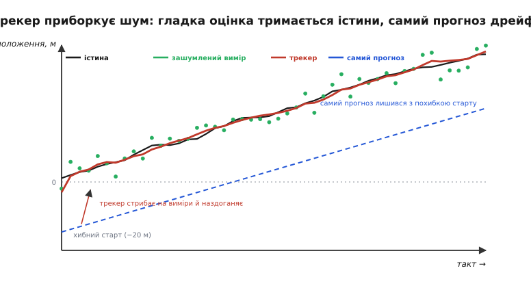
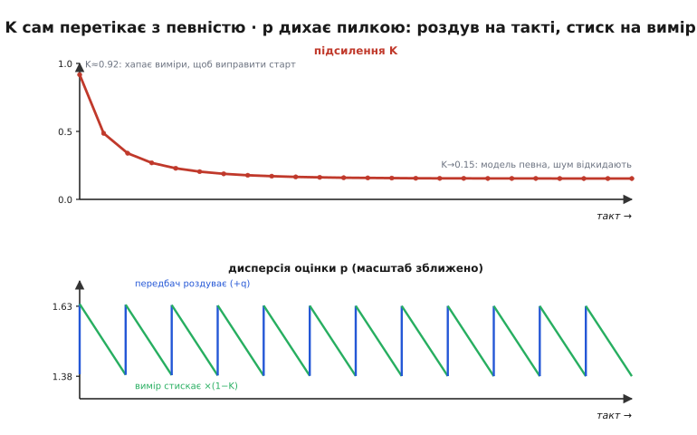
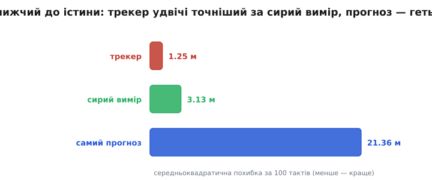

# ⚙️ Трекер «передбач → виправ»: скалярний фільтр проти шуму давача

Давач шле положення рухомого апарата десятки разів на секунду, і кожне число смикається на метри від шуму — а керуванню потрібна гладка, довірена оцінка, порахована за **один такт** і без пам'яті на всю історію. Ось працьовитий скалярний фільтр, що робить саме це: два числа стану, два кроки на такт, стала пам'ять — і потік брудних вимірів перетворюється на певну оцінку.

## Задача

Апарат котиться вздовж однієї осі з приблизно сталою швидкістю. Далекомір щотакту віддає його положення `z`, але з похибкою в кілька метрів — шум давача. Треба на льоту оцінювати справжнє положення так, щоб:

- **гладко** — не смикатися на кожному шумовому сплеску;
- **точно** — триматися ближче до істини, ніж сирий вимір;
- **дешево** — O(1) обчислень і O(1) пам'яті на такт: жодних буферів історії, бо це крутиться на мікроконтролері тисячі разів на секунду роками.

Проста спокуса — усереднити останні N вимірів — валиться на всіх трьох: буфер їсть пам'ять, велике вікно відстає від руху, мале — майже не гладить. Потрібен фільтр з **пам'яттю в одне число**, що сам зважує свіжий вимір проти накопиченого знання.

## Ідея

Увесь трекер — це **два числа**: `x` — найкращий здогад про положення, і `p` — його **дисперсія** (σ², наскільки ми в цьому здогаді непевні). Не саме положення, а положення *разом із мірою довіри до нього*. І два кроки щотакту:

- **Передбачення.** Прокрутити модель уперед: якщо апарат їде зі швидкістю `v`, за час `dt` він зсунеться на `v·dt`, тож `x += v·dt`. Але світ міг штовхнути апарат непередбачувано (нерівність, вітер), і модель цього не знає — тож довіру треба **послабити**: `p += q`, де `q` — дисперсія [шуму процесу](book:algorithms/motion-model). Хмара невпевненості ширшає.
- **Корекція.** Прийшов вимір `z` з дисперсією `r`. Підтягуємо оцінку до нього — але не повністю, а на частку `K`, зважену за відносною певністю. Тоді хмара **звужується**: свіже свідчення додало знання.

Уся хитрість — у підсиленні `K` (англ. *gain* — коефіцієнт підсилення):

```
K = p / (p + r)              # відносна певність, 0..1
x = x + K · (z − x)          # зсув на частку «несподіванки» z−x
p = (1 − K) · p              # хмара звузилась
```

Коли передбачення розпливлося (велика `p`) — `K` близьке до 1, слухаємо вимір. Коли давач шумний (велика `r`) — `K` близьке до 0, тримаємося моделі. Це і є одновимірний випадок [фільтра Калмана](book:algorithms/kalman-filter), а «хмара» — [нормальний розподіл](book:math/normal-distribution) із дисперсією `p`.

## Код

Головна мова тут — **C**: це гаряча функція реального часу з переривання, з лічених операцій. Стан — структура з двох чисел; передбачення й корекція — дві короткі функції; головний цикл жене над згенерованим потоком (справжня траєкторія + гаусів шум) і рахує похибки. Аби приклад **відтворювався** без зовнішніх залежностей, генератор шуму — крихітний детермінований ГВЧ плюс перетворення Бокса — Мюллера.

:::tabs
```c
#include <stdio.h>
#include <math.h>
#include <stdint.h>

/* Стан трекера — лише два числа. */
typedef struct {
    double x;   /* оцінка положення, м */
    double p;   /* її ДИСПЕРСІЯ σ² (не σ!), м² — наскільки ми в ній непевні */
} Tracker;

/* ПЕРЕДБАЧЕННЯ: прокрутити модель на v·dt і роздути невпевненість на q. */
static void predict(Tracker *t, double v, double dt, double q) {
    t->x += v * dt;   /* модель сталої швидкості штовхає оцінку вперед */
    t->p += q;        /* світ міг зрушити непередбачувано → хмара ширшає */
}

/* КОРЕКЦІЯ: підтягнути оцінку до виміру z (дисперсія r); вернути підсилення K. */
static double correct(Tracker *t, double z, double r) {
    double K = t->p / (t->p + r);   /* відносна певність, 0..1 */
    t->x += K * (z - t->x);         /* x + K·(вимір − передбачення) */
    t->p = (1.0 - K) * t->p;        /* хмара звузилась */
    return K;
}

/* --- крихітний детермінований ГВЧ + гаусів шум, щоб приклад відтворювався --- */
static uint64_t rng = 0x2545F4914F6CDD1DULL;
static double urand(void) {                 /* рівномірне (0,1] */
    rng ^= rng << 13; rng ^= rng >> 7; rng ^= rng << 17;
    return ((rng >> 11) + 1.0) * (1.0 / 9007199254740992.0);
}
static double gauss(double sigma) {         /* Бокс–Мюллер: N(0, σ²) */
    double u1 = urand(), u2 = urand();       /* послідовно: спершу u1, потім u2 */
    return sigma * sqrt(-2.0 * log(u1)) * cos(6.283185307179586 * u2);
}

int main(void) {
    const double dt = 1.0, v = 1.0;         /* такт 1 с, відома швидкість 1 м/с */
    const double q  = 0.25, r = 9.0;        /* ДИСПЕРСІЇ шуму процесу й виміру */
    const double sig_proc = 0.5, sig_meas = 3.0;   /* їхні σ: q=σ², r=σ² */
    const int    N = 100;

    double  x_true = 0.0;                    /* істина стартує в 0 */
    Tracker t = { -20.0, 100.0 };            /* навмисне ХИБНИЙ старт, велика p */
    double  x_dead = t.x;                    /* «самий прогноз»: трекер без корекцій */
    double  se_t = 0, se_r = 0, se_d = 0;    /* суми квадратів похибок */

    for (int k = 1; k <= N; k++) {
        x_true += v * dt + gauss(sig_proc);        /* істина: швидкість + поштовхи */
        double z = x_true + gauss(sig_meas);        /* зашумлений вимір давача */

        predict(&t, v, dt, q);                      /* ← передбач */
        double K = correct(&t, z, r);               /* ← виправ  */
        x_dead += v * dt;                           /* прогноз без корекцій дрейфує */

        se_t += (t.x   - x_true) * (t.x   - x_true);
        se_r += (z     - x_true) * (z     - x_true);
        se_d += (x_dead- x_true) * (x_dead- x_true);

        if (k <= 6) printf("k=%d  K=%.3f  p=%.3f\n", k, K, t.p);
    }
    printf("RMS: трекер=%.2f  вимір=%.2f  прогноз=%.2f (м)\n",
           sqrt(se_t / N), sqrt(se_r / N), sqrt(se_d / N));
    return 0;
}
```
```python
import math, random

def predict(x, p, v, dt, q):
    return x + v*dt, p + q                 # прокрутити модель, роздути p

def correct(x, p, z, r):
    K = p / (p + r)                        # відносна певність, 0..1
    return x + K*(z - x), (1 - K)*p, K     # підтягти x, звузити p

dt, v, q, r = 1.0, 1.0, 0.25, 9.0          # ДИСПЕРСІЇ q, r (а не σ!)
sig_proc, sig_meas, N = 0.5, 3.0, 100
random.seed(1)

x_true, x, p, x_dead = 0.0, -20.0, 100.0, -20.0   # навмисне хибний старт
se_t = se_r = se_d = 0.0
for k in range(1, N + 1):
    x_true += v*dt + random.gauss(0, sig_proc)     # істина: швидкість + поштовхи
    z = x_true + random.gauss(0, sig_meas)         # зашумлений вимір

    x, p = predict(x, p, v, dt, q)                 # ← передбач
    x, p, K = correct(x, p, z, r)                  # ← виправ
    x_dead += v*dt                                 # прогноз без корекцій дрейфує

    se_t += (x      - x_true)**2
    se_r += (z      - x_true)**2
    se_d += (x_dead - x_true)**2
    if k <= 6:
        print(f"k={k}  K={K:.3f}  p={p:.3f}")

rms = lambda s: math.sqrt(s / N)
print(f"RMS: трекер={rms(se_t):.2f}  вимір={rms(se_r):.2f}  прогноз={rms(se_d):.2f} (м)")
```
:::

Ось цей трекер у дії. Істина повзе вгору сталою швидкістю; давач сипле зеленими крапками навколо неї; трекер (червоне) стартує з навмисне **хибного** місця, за кілька тактів стрибає на виміри й далі гладко тримається істини. А «самий прогноз» — той самий трекер, але без жодної корекції, — так і лишається зі своєю стартовою похибкою й дрейфує:


*Червоний трекер за 3–4 такти наздоганяє істину з хибного старту й далі гладко її тримається, згладжуючи зелений шум. Синій «самий прогноз» (передбачення без виправлень) назавжди лишається з похибкою старту й повільно дрейфує: без зворотного зв'язку виправляти нічим.*

## Підсилення саме перетікає

Найкрасивіше в цьому фільтрі — те, як `K` **саме** знаходить правильне значення, без жодного налаштування в циклі. Проженіть код і подивіться на перші такти:

```
k=1  K=0.918  p=8.259
k=2  K=0.486  p=4.374
k=3  K=0.339  p=3.055
k=4  K=0.269  p=2.417
k=5  K=0.229  p=2.057
k=6  K=0.204  p=1.837
       ...        ↓
       K→0.153  p→1.380   (усталений режим)
```

На першому такті `p` величезне (стартова невпевненість 100) — тож `K ≈ 0.92`: фільтр майже цілком хапає вимір, аби витягти оцінку з хибного старту. Далі `p` спадає, довіра до накопиченого знання росте — і `K` спадає, аж поки не осідає на `≈ 0.153`. Там воно й лишається: рівновага, де свіжий шумний вимір і певніша модель важать якраз стільки, скільки заслуговують.

І ось найтонше: цей графік `K` **не залежить від самих чисел вимірів**. Дисперсія `p` (а отже й `K`) котиться за власною рекурсією, зіпертою лише на сталі `q`, `r` та початкову `p` — які виміри реально прийдуть, на неї не впливає. Тому весь розклад `K` можна порахувати наперед, ще до першого відліку.


*Угорі — `K` сам перетікає з 0.92 (хапає виміри, щоб виправити хибний старт) до 0.15 (модель певна, шум давача переважно відкидають). Унизу — та сама `p` в усталеному режимі, у зближеному масштабі: щотакту передбачення роздуває її на `q` (синій підйом), а вимір стискає на `×(1−K)` (зелений спад). Виходить рівна пилка між 1.38 і 1.63.*

> 🔧 **Навіщо це.** Розклад `K` детермінований — тож на мікроконтролері його не конче рахувати щотакту. Проженіть рекурсію `p` наперед, візьміть **усталене** `K ≈ 0.153` і зашийте його сталою: тоді гарячий крок стає одним рядком `x += K·(z − x)`, без жодного ділення. Це і є класичний «сталий» (steady-state) фільтр — та сама якість за копійчану ціну, коли `q` і `r` не міняються.

## Дисперсія дихає пилкою

Придивіться до нижньої панелі: `p` не завмирає на числі, а **дихає**. Щотакту передбачення додає `q` (невпевненість росте, бо світ міг зрушити), а корекція множить на `(1−K)` (певність повертається зі свіжим виміром). В усталеному режимі ці два подихи врівноважуються, і `p` ходить рівною пилкою — вгору на `+q`, униз на `×(1−K)`.

Куди саме осідає ця пилка, видно з рівноваги. Позначмо `a` значення `p` одразу після передбачення. Усталеність означає, що після повного такту воно вертається до себе: `a = (1−K)·a + q`, а `K = a/(a+r)`. Підставивши й спростивши:

```
a² − q·a − q·r = 0
a = (q + √(q² + 4·q·r)) / 2

при q=0.25, r=9  (тоді 4·q·r = 9):
a = (0.25 + √(0.0625 + 9)) / 2 = (0.25 + 3.010) / 2 ≈ 1.630
K = a/(a+r) = 1.630 / 10.630 ≈ 0.153
```

Саме до цього `1.630` (після передбачення) і `1.380` (після корекції) сходиться пилка — рівно те, що на графіку. Дисперсія оцінки перестає падати не тому, що фільтр «здався», а тому, що приплив знання від кожного виміру точно врівноважує розмиття від кожного передбачення.

## Наскільки це краще

Гладко — добре, але чи **точніше**? Порахуймо середньоквадратичну похибку (RMS) трьох суперників на одному й тому ж потоці: трекер, сирий вимір давача і «самий прогноз» (передбачення без корекцій — те, що звуть числення шляху, dead reckoning):


*За 100 тактів: трекер помиляється в середньому на 1.25 м — удвічі з половиною точніше за сирий вимір (3.13 м, тобто рівно σ давача). «Самий прогноз» — 21.36 м: без корекцій він назавжди лишається з похибкою старту, а зверху ще й накопичує непередбачувані поштовхи. Різниця між прогнозом і трекером — це ціна зворотного зв'язку від давача.*

Читається одразу. Трекер `≈ 1.25 м` б'є сирий вимір `≈ 3.13 м` — злиття свіжого відліку з передбаченням знає більше, ніж кожне окремо, тому й дисперсія оцінки (`√1.38 ≈ 1.17`) менша за дисперсію самого давача. А «самий прогноз» `≈ 21 м` — катастрофа: він і трекер стартують **однаково** незнаючими (`x = −20`, `p = 100`), уся різниця в тому, що трекер слухає давач, а прогноз — ні. Тут виміри коштують сімнадцятикратного виграшу в точності. (Числа для сирого й прогнозу трохи гуляють від засіву шуму; порядок — трекер найточніший, прогноз найгірший — сталий.)

## Складність і пастки

**Складність.** O(1) обчислень на такт (кілька множень, одне ділення) і O(1) пам'яті (жменя `double`, ніякої історії). Саме тому фільтр живе на мікроконтролері й тягне кілька кілогерців роками — на відміну від віконного усереднення, що тримало б буфер.

Пастки, на яких спотикаються майже всі:

- **`p` — це дисперсія σ², а не σ.** Найпоширеніша помилка. І `p`, і параметри шуму задають у **квадратах**: `r = σ_вим²` (для σ = 3 м це `r = 9`, а не 3), `q = σ_проц²`. Підсунете σ там, де чекають σ², — `K` вийде геть не той, і фільтр або задовірить давачу, або його зігнорує.
- **Ініціалізація `p`.** Стартова `p` каже фільтру, наскільки він певен свого першого `x`. Не знаєте, де апарат, — ставте `p` **велике** (тут 100): тоді `K` стартує біля 1 і фільтр швидко вхоплюється за перші виміри (це й видно на графіку `K`). Поставите `p` замалим — фільтр вважатиме хибний старт істиною й довго повзтиме до правди, ігноруючи виміри.
- **Форма `(1−K)·p`.** Для скаляра це надійно, поки `0 ≤ K ≤ 1` (а так завжди, бо `K = p/(p+r)`). Та коли трекер виросте до багатьох станів — матрична коваріація в цій «скороченій» формі може від округлень втратити симетрію й стати від'ємно визначеною, і фільтр піде врозніс. Загальний захист — форма Джозефа `P = (I−KH)·P·(I−KH)ᵀ + K·R·Kᵀ`, що лишає `P` додатною завжди; про це — у [розширеному фільтрі](book:algorithms/kalman-ekf).
- **`q` — це ручка довіри до моделі.** Замале `q` — фільтр надто вірить моделі: якщо істина розганяється, а модель тримає сталу швидкість, оцінка **відстане**, бо `K` осяде надто низько. Завелике `q` — фільтр женеться за шумом (`K` лишається високим і нічого не гладить). `q` задає, наскільки сильно реальність вільна відхилятися від вашої [моделі руху](book:algorithms/motion-model); це головне, що доводиться чесно налаштовувати.
