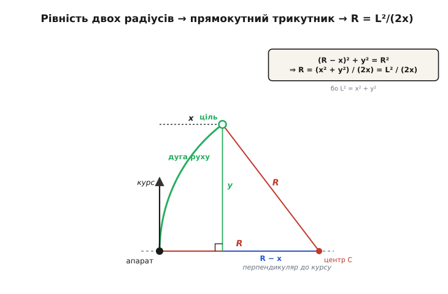
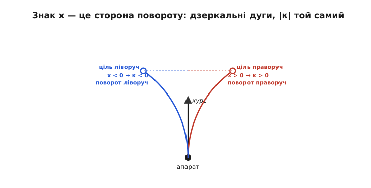

# 🧮 Виведення кривини pure pursuit

Уся навігація pure pursuit тримається на одному рядку: `κ = 2x / L²`. Кривина дуги, якою апарат поїде, дорівнює подвоєному бічному зсуву цілі, поділеному на квадрат випередження. Формула настільки коротка, що спокуса — просто взяти її на віру й користуватися. Але за нею стоїть акуратне геометричне виведення, і поки ти не проведеш його руками, три речі лишаться незрозумілими: **звідки** береться саме `L²/(2x)`, **чому** дуга через апарат і ціль рівно одна (а не безліч), і **що означає знак** `x`. Ця вставка доводить формулу до дна двома незалежними способами й розбирає кожне з цих питань окремо — щоб `κ = 2x/L²` перестало бути магічним заклинанням і стало очевидним.

Сама ідея «гнатися за точкою попереду» старша за роботів. Ще 1732 року французький учений-гідрограф П'єр Буґе (Pierre Bouguer) поставив перед Паризькою академією задачу **кривої погоні** (фр. *courbe de poursuite*): яким шляхом іде піратський корабель, що весь час тримає ніс на купецьке судно? Це усталений історичний факт. Той самий образ — переслідувач, чий курс завжди спрямований на ціль, — через два з половиною століття став навігаційним методом у Робототехнічному інституті Карнеґі-Меллона на апаратах Navlab; описали його Омід Аміді й Чак Торп у праці «Integrated mobile robot control» (1990), а канонічну реалізацію з геометричним виведенням дав технічний звіт Р. Крейґа Култера CMU-RI-TR-92-01 (1992). Метод колективний, не винахід однієї людини; нижче — та сама геометрія, лише розкладена по кісточках.

## Означення: що ми взагалі шукаємо

Спершу чітко зафіксуймо всі величини, бо половина плутанини в pure pursuit — від нечіткої системи координат. Поставмо апарат у **початок координат** і скеруймо вісь так, щоб **курс апарата дивився вздовж осі «вперед»**. Це не спрощення — це просто вибір зручної точки зору, і саме в ній формула виходить чистою.

```
початок (0, 0)   — апарат
вісь ↑ (уперед)  — курс апарата
вісь → (убік)    — перпендикуляр до курсу, праворуч-ліворуч
```

Ціль-точка — це точка на шляху, що лежить від апарата на заданій відстані `L` (випередження). У нашій системі вона має дві координати:

```
x  — бічний зсув цілі: наскільки вона з’їхала вбік від курсу  [м]
y  — поздовжній зсув: наскільки вона попереду                 [м]
L  — пряма відстань апарат → ціль                            [м]
```

Ці три пов’язані теоремою Піфагора, бо `L` — це гіпотенуза прямокутного трикутника з катетами `x` і `y`:

```
L² = x² + y²
```

Цю рівність триматимемо напохваті — вона зробить усе виведення коротким.

Тепер сформулюймо саму задачу як питання геометрії. Апарат котиться й **не може стрибати вбік**: він в’їжджає на будь-яку траєкторію плавно, носом уперед, тобто траєкторія на старті мусить **торкатися курсу** (бути йому дотичною). Серед усіх ліній, що виходять із-під апарата вздовж курсу й приходять у ціль, оберімо найпростішу — **дугу кола**. Питання виведення: **який радіус `R`** має та дуга?

> 🔧 **Навіщо це.** `R` — це не абстракція, а прямий наказ керму. Знаєш радіус, з яким треба гнути, — знаєш, на який кут відхилити колеса ([велосипедна модель](book:algorithms/bicycle-kinematic-model) переводить `R` у кут керма) або яку різницю швидкостей боків задати. Тож усе виведення нижче — це шлях від «де ціль» до «як крутнути кермо», і кривина `κ = 1/R` — валюта, у якій цей наказ видається.

## Інтуїція: де мусить сидіти центр дуги

Перш ніж рахувати, здобудьмо відповідь **очима**. У кола є центр, і дуга завжди перпендикулярна до радіуса в кожній своїй точці. Ми зажадали, щоб дуга **торкалася курсу** під апаратом — тобто в точці апарата курс і дуга йдуть в один бік. Отже радіус, проведений із центра в апарат, мусить бути **перпендикулярний до курсу**.

А перпендикуляр до курсу під апаратом — це наша вісь «вбік». Звідси негайний висновок, який і є ключем до всієї формули: **центр дуги лежить точно на осі «вбік»**, збоку від апарата, на відстані `R`. Не попереду, не позаду — рівно збоку. Якщо ціль з’їхала праворуч, центр праворуч; якщо ліворуч — ліворуч. Ніякої алгебри ще не було, а ми вже знаємо, **де** центр: на перпендикулярі до курсу, на невідомій поки відстані `R`.

Далі — одне-єдине спостереження, що замикає задачу. Ціль **лежить на дузі**, а всі точки дуги рівновіддалені від центра на `R`. Апарат теж лежить на дузі — і теж на відстані `R` від центра (це ж і є визначення радіуса). Отже маємо дві точки, апарат і ціль, обидві на однаковій відстані `R` від одного центра. **Прирівняймо ці дві відстані** — і `R` випаде сам.


*Серце виведення. Центр дуги C сидить на перпендикулярі до курсу (бо дуга дотична до курсу під апаратом), на відстані R збоку. Ставимо два радіуси рівними: C→апарат = R і C→ціль = R. Опустивши з центра прямокутний трикутник до цілі, дістаємо катети R−x (горизонтальний) і y (вертикальний). Піфагор для цього трикутника — це і є рівняння, з якого падає R = L²/(2x).*

## Формальний апарат, спосіб перший: рівність двох радіусів

Тепер порахуймо те, що вже побачили. Оберімо, для означеності, ціль **праворуч** (нехай `x > 0`); ліва сторона вийде дзеркально, і знак ми розберемо окремо. Центр дуги `C` тоді лежить праворуч від апарата на осі «вбік», тобто в точці:

```
C = (R, 0)         ← центр на перпендикулярі до курсу, на відстані R
```

Апарат — у `(0, 0)`, ціль — у `(x, y)`. Запишімо дві відстані до центра й прирівняймо їх (обидві дорівнюють `R`, бо обидві точки на колі). Відстань апарат → центр очевидна:

```
|апарат − C|² = (0 − R)² + (0 − 0)² = R²
```

Це просто `R²` — так і має бути, ми ж помістили центр на відстані `R`. Тепер відстань ціль → центр, теж у квадраті (щоб позбутися кореня):

```
|ціль − C|² = (x − R)² + (y − 0)² = (x − R)² + y²
```

Обидві мають дорівнювати `R²`. Прирівнюємо праву до `R²`:

```
(x − R)² + y² = R²
```

Ось воно — **головне рівняння виведення**. Далі суто шкільна алгебра. Розкриймо квадрат `(x − R)² = x² − 2xR + R²`:

```
x² − 2xR + R² + y² = R²
```

`R²` стоїть по обидва боки — скорочуємо його. Лишається:

```
x² − 2xR + y² = 0
```

Тепер згадаймо ту саму рівність, що приготували наперед: `x² + y² = L²`. Замінюємо `x² + y²` на `L²`:

```
L² − 2xR = 0
```

Одне рівняння з одним невідомим `R`. Переносимо й ділимо:

```
2xR = L²

R = L² / (2x)          ← радіус дуги pure pursuit
```

І кривина — обернена до радіуса:

```
κ = 1/R = 2x / L²       ← кривина, якою кермуємо
```

Усе. Три рядки алгебри після одного рівняння, і формула в руках. Уся хитрість була не в обчисленнях, а в **двох геометричних спостереженнях**: центр — на перпендикулярі до курсу, і обидві точки рівновіддалені від нього. Далі математика зробилася сама.

Той самий висновок читається просто з прямокутного трикутника на малюнку, без розкриття дужок. Опусти з центра `C` вертикаль до рівня цілі: дістанеш прямокутний трикутник із гіпотенузою `R` (радіус C→ціль), вертикальним катетом `y` і горизонтальним катетом `R − x` (від центра, що на `R` праворуч, до цілі, що на `x` праворуч). Піфагор для нього — `(R − x)² + y² = R²` — це буквально те саме головне рівняння. Два погляди, одна відповідь.

## Формальний апарат, спосіб другий: хорда й вписаний кут

Виведення варте того, щоб отримати його **вдруге, зовсім іншим шляхом** — коли дві незалежні дороги приводять в одну точку, у формулі можна вже не сумніватися. Цей другий спосіб ще й показує, звідки в pure pursuit береться кут α, яким часто описують метод.

Проведімо від апарата до цілі пряму — **хорду** нашого кола завдовжки `L` (це ж пряма відстань апарат–ціль). Позначмо `α` — кут між курсом (дотичною до кола під апаратом) і цією хордою. Тут працює класична **теорема про кут між дотичною і хордою**: такий кут дорівнює вписаному куту, що спирається на ту саму хорду, а отже пов’язаний із центральним кутом. Наслідок цієї теореми — знаменита формула довжини хорди через радіус:

```
L = 2·R·sin(α)         ← хорда стягує центральний кут 2α
```

Прочитаймо, звідки вона. Хорда `L` стягує центральний кут `2α` (вписаний/дотичний кут `α` — це половина центрального). Опустивши з центра перпендикуляр на хорду, він ділить її навпіл і утворює прямокутний трикутник із гіпотенузою `R` та протилежним до `α` катетом `L/2`. Звідси `sin(α) = (L/2)/R`, тобто `L = 2R·sin(α)` — рівно наш рядок. Виразимо `R`:

```
R = L / (2·sin α)
```

Лишилося зв’язати `sin α` з координатами. Кут `α` — між курсом (вісь «вперед») і хордою на ціль `(x, y)`. Синус кута до вектора `(x, y)`, відлічений від осі «вперед», — це відношення **бічної** складової до довжини вектора:

```
sin α = x / L          ← бічний катет x, поділений на гіпотенузу L
```

Підставляємо в `R = L/(2 sin α)`:

```
R = L / (2 · x/L) = L² / (2x)
```

**Та сама формула.** Хорда з вписаним кутом привели рівно туди ж, куди рівність радіусів. І принагідно випав корисний вигляд через кут:

```
κ = 2·sin α / L        ← кривина через кут між курсом і напрямом на ціль
```

Ця форма зручна, коли ти оперуєш кутом на ціль напряму (наприклад, узяв його з азимута давача), а не розкладаєш на `x` та `y`. Обидві форми — `2x/L²` і `2 sin α / L` — тотожні, бо `x = L sin α`; яку брати, залежить лише від того, що в тебе під рукою на вході.

## Чому дуга рівно одна

Формула дає єдине число `R` — але чому, власне, дуга через дві точки одна? Через дві точки на площині проходить **безліч** різних кіл: центр може сидіти будь-де на серединному перпендикулярі до відрізка апарат–ціль, і кожне положення дає своє коло. Що ж вибирає з-поміж них рівно одне?

Умова дотику до курсу. Ми зажадали, щоб дуга виходила з-під апарата **точно вздовж курсу** — інакше апарат мусив би стрибнути вбік, чого котюче тіло не вміє. А ця вимога прибиває центр до **однієї-єдиної** прямої: перпендикуляра до курсу під апаратом. Тепер центр не «будь-де на серединному перпендикулярі», а на перетині **двох** прямих:

```
пряма 1: серединний перпендикуляр до хорди апарат–ціль
         (щоб центр був рівновіддалений від обох точок)
пряма 2: перпендикуляр до курсу під апаратом
         (щоб дуга торкалася курсу)
```

Дві прямі на площині перетинаються **в одній точці** (якщо вони не паралельні). Ця точка — єдиний можливий центр, а він однозначно задає радіус і саму дугу. Ось звідки «рівно одна»: не з властивостей кіл узагалі, а з того, що **дотик до курсу забирає одну ступінь свободи**, лишаючи серед нескінченної родини кіл через дві точки точно одне.

Коли ж прямі паралельні? Перпендикуляр до курсу горизонтальний (вісь «вбік»), а серединний перпендикуляр до хорди паралельний йому лише тоді, коли сама хорда вертикальна — тобто ціль строго попереду, `x = 0`. Тоді центр «іде в нескінченність», `R = L²/0 → ∞`, а дуга розпрямляється в **пряму**. І це фізично правильно: ціль точно по курсу — їдь прямо, не гни нікуди. Формула `R = L²/(2x)` сама сигналізує про цей випадок діленням на нуль, а `κ = 2x/L² = 0` каже те саме спокійно: нульова кривина — пряма лінія.

## Що означає знак x

У виведенні першим способом ми взяли `x > 0` (ціль праворуч) — але формула працює й для від’ємного `x`, і знак несе прямий фізичний зміст: **він каже сторону повороту**.

Пройдімо це чесно, тримаючись осей виведення: `x > 0` — ціль **праворуч**, центр у `(+R, 0)`. Якщо ж ціль ліворуч, `x < 0`, то в рівнянні `R = L²/(2x)` знаменник від’ємний, і `R` виходить **від’ємним**. Від’ємний радіус — не безглуздя: він означає, що центр дуги сидить із **протилежного** боку (ліворуч від апарата), і дуга гнеться в інший бік. Кривина `κ = 2x/L²` успадковує знак `x` прямо: `x > 0 → κ > 0` (ціль праворуч — гнемо праворуч), `x < 0 → κ < 0` (ціль ліворуч — гнемо ліворуч). Модуль `|κ|` при однаковому `|x|` той самий — сторони дзеркальні.


*Знак x — це сторона повороту. Ліва й права дуги — точні дзеркала: той самий модуль бічного зсуву |x|, той самий |R|, той самий |κ|. Змінюється лише знак: ціль з одного боку гне апарат туди, ціль з іншого — у протилежний бік. Тому в коді знак x не треба обробляти окремими if — він сам веде кермо в правильну сторону.*

Практична цінність цього — у тому, що в коді **не треба окремо розбирати «ліворуч/праворуч»**. Ти рахуєш `x` зі знаком (проєкцією вектора на ціль на вісь «вбік»), підставляєш у `κ = 2x/L²`, і кривина сама виходить із правильним знаком, а за нею — і кут керма правильної сторони. Один вираз без розгалужень покриває обидва напрями. Єдине, за чим треба стежити, — **узгодженість домовленості**: який бік ти назвав додатнім для `x`, той самий мусить бути додатнім і для кута керма, інакше апарат кермуватиме навпаки. Але це одна перевірка орієнтації осей на старті, а не гілка в гарячому циклі.

## Чому κ прямо пропорційна бічному зсуву

Тепер найважливіше для розуміння **поведінки** методу. Погляньмо на `κ = 2x/L²` як на закон керування й спитаймо: як кривина реагує на те, наскільки ціль з’їхала вбік?

При фіксованому випередженні `L` множник `2/L²` — **стала**. Отже:

```
κ = (2/L²) · x        ← при сталому L: кривина ∝ бічний зсув x
```

Кривина **прямо пропорційна** бічному зсуву `x`. Це і є вся динаміка pure pursuit в одному факті. Ціль точно попереду (`x = 0`) — кривина нуль, їдь прямо. Ціль трохи з’їхала — гнемо трохи. З’їхала вдвічі далі — гнемо вдвічі крутіше. Реакція росте лінійно з відхиленням, без порогів і зламів.

Це впізнаваний закон: **пропорційний регулятор**. Бічний зсув `x` грає роль похибки, а кривина — керувального впливу, і зв’язок між ними лінійний із коефіцієнтом `2/L²`. Той самий кістяк, що в [пропорційній ланці ПІД](book:algorithms/discrete-pid): вихід пропорційний похибці. Тільки тут «похибку» дає не різниця уставки й виміру, а геометрія — бічне положення точки, за якою женемося. Через це pure pursuit і поводиться як пропорційний контролер: м’яко тягне до лінії, сила тяги росте з відхиленням.

А тепер придивімося до `L²` у знаменнику — він керує **чутливістю** цього пропорційного закону:

```
коефіцієнт пропорційності = 2 / L²
```

Він падає як **квадрат** випередження. Подвоїш `L` — коефіцієнт впаде вчетверо, і на той самий бічний зсув `x` апарат відповість учетверо м’якшою кривиною. Ось звідки характер методу: мале `L` — величезний коефіцієнт `2/L²`, гостра реакція на найменше відхилення (апарат нервово смикається до лінії й перелітає її); велике `L` — крихітний коефіцієнт, млява й плавна реакція (апарат майже не помічає дрібних відхилень, зате зрізає повороти). Квадрат тут не випадковий: `L` входить і в чисельник (як `x`, бо далі ціль — більший можливий зсув) і окремо в знаменник, і в чистому вигляді закону лишається саме `L²`. Одне число `L` через цей квадрат керує всім темпераментом регулятора.

> 🔧 **Навіщо це.** Саме тому налаштування pure pursuit — це підбір **одного** числа. Коефіцієнт пропорційності не крутять напряму, як у ПІД; його задає випередження `L` через `2/L²`. Смикається на прямій — збільш `L` (зменш коефіцієнт, пом’якш реакцію). Зрізає повороти, не тримає лінію — зменш `L` (підвищ коефіцієнт, загостри). Одна ручка `L` заміняє окреме налаштування підсилення, бо геометрія вже зшила підсилення з горизонтом погляду.

## Один прожитий приклад

Проженімо формулу на числах, щоб вона стала відчутною, — і в тих самих осях, що й виведення: `x > 0` — ціль праворуч, центр у `(+R, 0)`. Візьмімо ціль, що з’їхала праворуч, і подивімося, як народжуються `R` і `κ`, а тоді перевірмо це трьома незалежними способами.

**Ціль праворуч, помірний зсув.** Випередження `L = 2.0 м`, бічний зсув `x = 0.5 м` (праворуч, додатний). Спершу знайдімо, наскільки ціль попереду, з Піфагора:

```
y  = √(L² − x²) = √(2.0² − 0.5²) = √(4.0 − 0.25) = √3.75 ≈ 1.936 м
```

Тепер радіус і кривина за головною формулою:

```
R  = L² / (2·x) = 4.0 / (2 · 0.5) = 4.0 / 1.0 = 4.0 м
κ  = 2·x / L²   = 1.0 / 4.0       = 0.25  1/м
```

Дуга радіуса 4 метри — апарат м’яко завертає праворуч. Перевірмо тим самим числом **другий спосіб** (через кут). Кут на ціль від курсу:

```
sin α = x / L = 0.5 / 2.0 = 0.25      →  α ≈ 14.48°
R     = L / (2·sin α) = 2.0 / (2 · 0.25) = 2.0 / 0.5 = 4.0 м     ✓
```

Обидві дороги дали `R = 4.0 м`. Тепер **третя** перевірка — чи ціль справді лежить на знайденому колі. Центр при `x > 0` (праворуч) — у точці `(+R, 0) = (4.0, 0)`; відстань від нього до цілі `(0.5, 1.936)` має дорівнювати `R`:

```
|ціль − центр| = √((0.5 − 4.0)² + 1.936²)
              = √((−3.5)² + 3.75) = √(12.25 + 3.75) = √16.0 = 4.0 м     ✓
```

Рівно `R`. Три незалежні шляхи — головна формула, кут-хорда й пряма перевірка на колі — сходяться в одне число, і це найкращий доказ, що виведення без діри. Один нюанс варто закарбувати саме тут: **бік центра мусить жити в тій самій домовленості, що й знак `x`**. Ми поклали ціль праворуч додатною й центр у `(+R, 0)` праворуч — усе зійшлося. Якби в коді знак `x` рахувався з одними осями, а центр (чи кут керма) із дзеркальними, апарат упевнено кермував би **в протилежний бік**, а формула була б ні до чого. Тож правило гігієни одне: зафіксуй, який бік для `x` додатний, і клади центр із того ж боку — тоді `κ = 2x/L²` веде кермо правильно сама, без жодних `if`. Той самий розрахунок у коді:

:::tabs
```cpp
#include <cmath>
#include <cstdio>

int main() {
    // осі виведення: x>0 — ціль праворуч, центр у (+R, 0)
    double L = 2.0, x = 0.5;                 // випередження й бічний зсув [м]
    double y = std::sqrt(L*L - x*x);         // поздовжній зсув [м]

    double R = (L*L) / (2.0*x);              // радіус дуги
    double kappa = 2.0*x / (L*L);            // кривина

    double cx = R, cy = 0.0;                 // центр — на осі «вбік», на R
    double d = std::hypot(x - cx, y - cy);   // відстань центр → ціль (має бути R)

    std::printf("y=%.3f  R=%.3f  kappa=%.3f  |center->goal|=%.3f\n", y, R, kappa, d);
    // друкує: y=1.936  R=4.000  kappa=0.250  |center->goal|=4.000
    return 0;
}
```
```python
import math

# осі виведення: x>0 — ціль праворуч, центр у (+R, 0)
L, x = 2.0, 0.5                          # випередження й бічний зсув [м]
y = math.sqrt(L*L - x*x)                 # поздовжній зсув [м]

R = (L*L) / (2.0*x)                      # радіус дуги
kappa = 2.0*x / (L*L)                    # кривина

cx, cy = R, 0.0                          # центр — на осі «вбік», на R
d = math.hypot(x - cx, y - cy)           # відстань центр → ціль (має бути R)

print(f"y={y:.3f}  R={R:.3f}  kappa={kappa:.3f}  |center->goal|={d:.3f}")
# друкує: y=1.936  R=4.000  kappa=0.250  |center->goal|=4.000
```
:::

Код друкує `y=1.936  R=4.000  kappa=0.250  |center->goal|=4.000` — рядок у рядок те, що ми порахували руками, разом із контрольною відстанню центр → ціль, що дорівнює `R`. Зверни увагу, який він короткий: чотири арифметичні рядки без жодного розгалуження на «ліворуч/праворуч» — уся геометрія pure pursuit справді вміщається в стільки коду, а знак `x` веде кермо в правильний бік сам.

## Де в темі це працює

Уся коротка формула `κ = 2x/L²` живиться цим виведенням, і три його наслідки — це прямо ті ручки, якими pure pursuit керують на практиці:

- **`κ` — це наказ, не прикраса.** Кривина, здобута тут, іде далі як команда керму: для тіла з кермом її переводить у кут відхилення коліс [велосипедна модель](book:algorithms/bicycle-kinematic-model) (`δ = atan(база·κ)`), для гусеничного чи двоколісного — у кутову швидкість `ω = v·κ`, яку розкладають на швидкості боків. Виведення дає **одне число, незалежне від заліза**; тонкий шар під ним перекладає його на конкретний привід.

- **знак `x` знімає розгалуження.** Оскільки `κ` успадковує знак `x`, код не має окремих гілок «повертай ліворуч / праворуч» — одна проєкція вектора на ціль на вісь «вбік» дає `x` зі знаком, а `2x/L²` сама кермує в правильний бік. Це прибирає цілий клас помилок-дзеркал, аби лише домовленість про осі була єдина.

- **`L²` у знаменнику — це ручка характеру.** Пропорційність `κ ∝ x` із коефіцієнтом `2/L²` пояснює, чому єдиний параметр `L` вирішує все: він квадратично керує чутливістю бічного регулятора. Зробити `L` пропорційним швидкості — і той самий закон дає гостре тримання лінії на малому ходу й плавність на великому, без окремого підбору підсилення.

І остання думка, задля якої усе й розписано. `κ = 2x/L²` — не формула, яку треба запам’ятати, а **наслідок двох геометричних фактів**: центр дуги сидить на перпендикулярі до курсу, і апарат із ціллю рівновіддалені від нього. Постав ці два факти рівнянням — `(R−x)² + y² = R²` — і формула випадає за три рядки, а разом із нею й уся поведінка методу: пропорційність зсуву, роль знака, роль випередження. Хто раз провів це виведення, той більше не бачить у pure pursuit чорної скриньки — лише одну дугу через дві точки.
