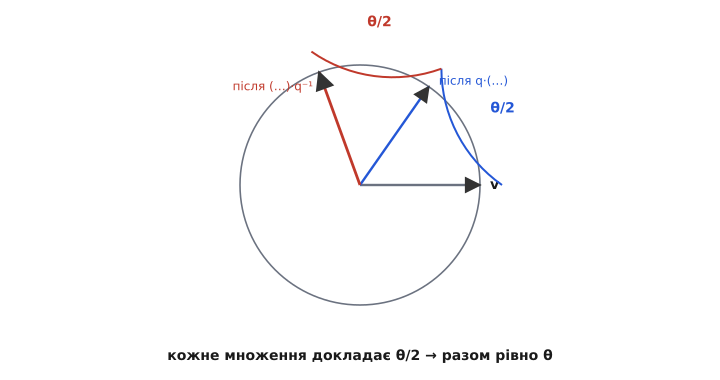
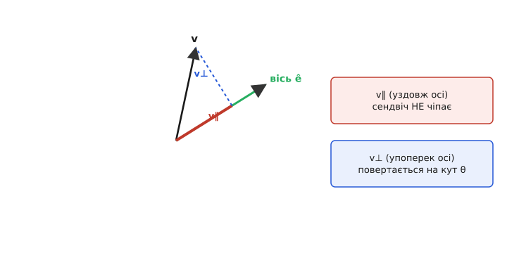

# 🧮 Звідки в кватерніоні повороту береться половина кута

У кватерніоні повороту скалярна частина — це cos(θ/2), а векторна — ê·sin(θ/2). Не cos θ, а саме cos половини. Ця половина спершу дратує: чому не повний кут, як у звичному cos θ для повороту площини? Відповідь не в примсі означення, а в тому, **як** кватерніон повертає вектор. Він робить це не одним множенням, а сендвічем — двома, зліва й справа. І щойно ми розкриємо цей сендвіч чесно, до кінця, половина кута випаде сама, а разом із нею — і те дивне явище, що q та −q описують один і той самий поворот. Розберімо все від першопричини.

## Що взагалі означає «повернути вектор кватерніоном»

Спершу домовимося про матеріал. Кватерніон — четвірка чисел q = (w, x, y, z), і з нею вміють дві дії. **Множення** ⊗ складає повороти, і воно не переставне. **Спряження** q* = (w, −x, −y, −z) для одиничного q дає обернений поворот. Звичайний тривимірний вектор v = (vₓ, v_y, v_z) вкладають у кватерніон із нульовою скалярною частиною — такий називають **чисто уявним** (за аналогією з чисто уявним комплексним числом bi, де немає дійсної частини):

```
v ↦ (0, vₓ, v_y, v_z)      ← чисто уявний кватерніон
```

Повертають вектор так званим **сендвічем** — вектор затиснуто між q і оберненим:

```
v′ = q ⊗ v ⊗ q⁻¹
```

Уже сама форма мала б насторожити. Якби кватерніон діяв, як число на площині — просто множенням v′ = q ⊗ v, — питання половини не стояло б. Але одне множення тут не годиться, і причина глибша за зручність.

> 🔧 **Навіщо це.** Це не абстракція для краси. Прошивка автопілота повертає виміряний вектор «униз» із рамки апарата в рамку світу рівно цим сендвічем, щоб зрозуміти, куди нахилений дрон. Половина кута сидить у кожному такому виклику; хто її не розуміє — не зрозуміє й чому регулятор орієнтації має перевіряти знак похибки, інакше апарат крутнеться «через спину».

## Чому одного множення замало

Уявімо на секунду, що ми спробували повертати одним множенням: v′ = q ⊗ v. Що вийде? Візьмемо для проби найпростіший поворот — навколо осі z. Помножмо кватерніон на чисто уявний вектор і подивимось на результат покомпонентно за правилами кватерніонного добутку (їх векторна частина, до речі, — це знайомі [скалярний](topic:math/dot-product) і [векторний](topic:math/cross-product) добутки, зшиті разом).

Проблема виринає одразу: **добуток q ⊗ v у загальному випадку вже не чисто уявний**. У нього з'являється ненульова скалярна частина — а це означає, що результат перестав бути вектором. Ми хотіли повернути стрілку в просторі, а отримали четвірку, яку як стрілку вже не прочитати. Одне множення виводить нас із простору тривимірних векторів назовні, у повний чотиривимірний кватерніонний світ, і назад саме не повертає.

Ось де народжується сендвіч. Друге множення — справа, на обернений q⁻¹ — рівно **знищує ту паразитну скалярну частину** й повертає результат назад у чисто уявні кватерніони. Це не косметика: без нього немає повороту вектора взагалі. Два множення потрібні структурно — щоб вийти в 4D, покрутити, і чисто повернутися в 3D.

А тепер головне міркування, ще до всякої алгебри. Поворот **накопичується в обох множеннях**. Ліве множення на q докладає свій внесок, праве на q⁻¹ — свій, і два внески **додаються**. Якби в кожному q сидів повний кут θ, сендвіч повернув би вектор на 2θ — удвічі забагато. Щоб на виході вийшло рівно θ, у кожному q має сидіти **половина**: два піврухи по θ/2 складаються в один повний поворот на θ.


*Ліве множення докладає θ/2, праве — ще θ/2; разом виходить рівно поворот на θ, тому в кватерніоні й сидить половина кута.*

Це вже пояснює половину інтуїтивно. Але інтуїцію треба зробити доказом — розкрити сендвіч до кінця й побачити θ на власні очі.

## Розкриваємо сендвіч чесно

Візьмемо одиничний кватерніон у найзагальнішому вигляді, ще не приписуючи йому жодного кута. Розділимо його на скалярну частину s і векторну **u**:

```
q = (s, u),   де s — число, u = (x, y, z) — вектор,   s² + |u|² = 1
```

Правило кватерніонного добутку зручно записати саме через скалярну й векторну частини — тоді видно його нутро. Для двох кватерніонів (a, **a**) і (b, **b**):

```
(a, a) ⊗ (b, b) = ( a·b − a∙b ,   a·b + b·a + a×b )
                     └ скаляр ┘     └──── вектор ────┘
```

Тут `∙` — скалярний добуток векторів (дає число), `×` — векторний (дає вектор). Уся некомутативність кватерніонів схована в одному доданку — `a×b`, бо векторний добуток сам антикомутативний (a×b = −b×a). Приберіть його — і множення стало б переставним; саме `×` робить порядок поворотів важливим.

Тепер прикладемо це двічі до сендвіча q ⊗ v ⊗ q⁻¹, де v = (0, **v**) чисто уявний, а q⁻¹ = (s, −**u**). Спершу внутрішнє множення v ⊗ q⁻¹:

```
(0, v) ⊗ (s, −u) = ( 0·s − v∙(−u) ,   0·(−u) + s·v + v×(−u) )
                  = ( v∙u ,   s·v − v×u )
```

Далі множимо зліва на q = (s, **u**). Розпишемо скалярну й векторну частини результату окремо. Скалярна частина:

```
скаляр = s·(v∙u) − u∙(s·v − v×u)
       = s·(v∙u) − s·(u∙v) + u∙(v×u)
```

Перші два доданки взаємно знищуються (v∙u = u∙v). Останній, u∙(v×u), теж нуль: мішаний добуток із повторюваним вектором завжди нульовий — вектор v×u перпендикулярний до u, тож їхній скалярний добуток зникає. **Скалярна частина виходить нульовою** — результат чисто уявний, як і треба. Сендвіч справді повертає нас у простір векторів; друге множення відпрацювало.

Тепер векторна частина — це і є повернутий вектор **v′**:

```
v′ = s·(s·v − v×u) + (v∙u)·u + u×(s·v − v×u)
```

Розкриємо й згрупуємо, пам'ятаючи тотожність подвійного векторного добутку u×(v×u) = v·(u∙u) − u·(u∙v) = |u|²·v − (u∙v)·u:

```
v′ = s²·v − s·(v×u) + (v∙u)·u + s·(u×v) − u×(v×u)
```

Оскільки u×v = −(v×u), два середні доданки з `s` **подвоюються**: −s·(v×u) + s·(u×v) = −2s·(v×u) = 2s·(u×v). А останній розкривається за тотожністю. Збираємо:

```
v′ = s²·v + 2s·(u×v) + (v∙u)·u − |u|²·v + (u∙v)·u
   = (s² − |u|²)·v + 2·(v∙u)·u + 2s·(u×v)
```

Ось точна формула повороту вектора кватерніоном — поки що без жодного кута, просто через s і **u**:

```
v′ = (s² − |u|²)·v + 2·(u∙v)·u + 2s·(u×v)
```

Три доданки, і кожен ми зараз упізнаємо.

## Де тут кут: підставляємо половину

Тепер — вирішальний крок. Підставимо в цю чисту алгебру означення кватерніона повороту: s = cos(θ/2), **u** = ê·sin(θ/2), де ê — одиничний вектор осі (|ê| = 1). І дивимось, у що перетворюється кожен із трьох доданків.

**Коефіцієнт при v.** Тут з'являється різниця квадратів:

```
s² − |u|² = cos²(θ/2) − sin²(θ/2) = cos θ
```

Це шкільна тотожність подвійного кута — і саме вона перетворює **половину** на **повний** кут. Дві половинки в квадратах, віднявшись, дають cos θ. Ось де математично «складаються два піврухи»: не в якійсь геометричній картинці, а в тотожності cos²α − sin²α = cos 2α. Половина в означенні була рівно для того, щоб тут вигулькнув повний θ.

**Коефіцієнт при u×v (тобто ê×v).** Тут працює друга тотожність подвійного кута:

```
2s = 2·cos(θ/2)
2s·(u×v) = 2·cos(θ/2)·sin(θ/2)·(ê×v) = sin θ·(ê×v)
```

бо 2·sin(θ/2)·cos(θ/2) = sin θ, і множник sin(θ/2) прийшов із самого **u** = ê·sin(θ/2). Знову половинки помножились і дали sin **повного** кута.

**Доданок 2·(u∙v)·u.** Тут |u|² = sin²(θ/2), а вектор u = ê·sin(θ/2), тож:

```
2·(u∙v)·u = 2·sin²(θ/2)·(ê∙v)·ê = (1 − cos θ)·(ê∙v)·ê
```

за тотожністю 2·sin²(θ/2) = 1 − cos θ. Складаємо все докупи:

```
v′ = cos θ·v + (1 − cos θ)·(ê∙v)·ê + sin θ·(ê×v)
```

І це — **формула повороту Родрига** (Olinde Rodrigues), точна формула повороту вектора v на кут θ навколо осі ê. Її вивів Родріг ще 1840 року в «Journal de Mathématiques Pures et Appliquées» через параметри тангенса половинного кута — за три роки до того, як Гамільтон вирізав кватерніони на камені в Дубліні; ту саму сутність вони знайшли незалежно (це усталений історичний факт, і параметри (cos θ/2, ê sin θ/2) досі звуть параметрами Ейлера–Родрига). Ми щойно отримали її **суто з кватерніонного сендвіча**. Тобто кватерніонний поворот і поворот Родрига — та сама операція, записана двома мовами.

## Чому це справді поворот на θ навколо ê

Формулу ми вивели, але треба переконатися, що це геометрично **саме поворот**, а не якесь інше перетворення. Найясніше це видно, якщо розкласти вектор v на дві частини: складову вздовж осі, **v‖** = (ê∙v)·ê, і складову впоперек осі, **v⊥** = v − v‖. Подивімось, що робить формула з кожною.

**Складова вздовж осі не рухається.** Підставмо v = v‖ = (ê∙v)·ê. Тоді ê×v‖ = 0 (векторний добуток колінеарних векторів нульовий), а (ê∙v‖) = (ê∙v). Формула дає:

```
v‖′ = cos θ·v‖ + (1 − cos θ)·v‖ + 0 = v‖
```

Складова вздовж осі лишається собою — рівно як при повороті: те, що лежить на осі, не крутиться. Це і є вісь обертання, точка опори.

**Складова впоперек осі крутиться на θ.** Для v⊥ маємо ê∙v⊥ = 0, тож середній доданок зникає, і лишається:

```
v⊥′ = cos θ·v⊥ + sin θ·(ê×v⊥)
```

А це — точнісінько поворот у площині, перпендикулярній до осі. Вектори v⊥ і ê×v⊥ взаємно перпендикулярні й однакові за довжиною (бо |ê×v⊥| = |v⊥|, оскільки ê⊥v⊥ і |ê|=1), тобто утворюють ортогональну пару, як осі x та y на площині. Формула cos θ·(перша вісь) + sin θ·(друга вісь) — це буквально означення повороту точки на кут θ у цій площині. Довжина зберігається:

```
|v⊥′|² = cos²θ·|v⊥|² + sin²θ·|ê×v⊥|² = (cos²θ + sin²θ)·|v⊥|² = |v⊥|²
```

Отже, сендвіч лишає осьову частину на місці, а поперечну обертає на рівно θ зі збереженням довжини. Це і є визначення повороту твердого тіла навколо осі ê на кут θ. Доведено: сендвіч q ⊗ v ⊗ q⁻¹ з q = (cos θ/2, ê sin θ/2) справді повертає v на θ навколо ê.


*Розклад v на осьову й поперечну складові: перша під сендвічем нерухома, друга обертається на θ — саме так поводиться справжній поворот навколо осі.*

## Аналогія, яка ламається саме там, де треба

Половину кута легко «зрозуміти неправильно» через двовимірну аналогію — і корисно побачити, де вона тріщить. На площині поворот на θ дає [комплексна експонента](topic:math/euler-formula): точку z повертають одним множенням z′ = e^(iθ)·z. Один множник — повний кут, ніякої половини. Чому ж у 3D половина?

Бо в 2D множення на e^(iθ) **не виводить із площини**: добуток двох комплексних чисел — знову комплексне число, тобто знову точка тієї самої площини. Виходити нема куди, тож і повертати назад не треба — вистачає одного множника. У 3D же чисто уявних кватерніонів мало (їх лише три виміри з чотирьох), і одне множення неминуче виштовхує результат у скалярний вимір. Доводиться робити сендвіч, а сендвіч подвоює внесок кута — звідси й половина в кожному множнику.

Аналогія точна саме в цьому місці зламу: комплексне число повертає одним боком, кватерніон — двома, і різниця не випадкова, а йде від розмірності. Тому 2D обходиться повним кутом, а 3D змушене ділити його навпіл. Половина — не дефект кватерніонів, а плата за те, що в трьох вимірах не можна повертати одним множенням, лишаючись у просторі векторів.

## Половина кута породжує подвійне покриття

І остання нитка, найгарніша. Та сама половина кута тягне за собою факт, без якого регулятор орієнтації поводиться дивно: **q та −q описують один і той самий поворот**.

Погляньмо, звідки це. Кут θ і кут θ + 360° — фізично тотожні: повний оберт повертає тіло в те саме положення. Що станеться з кватерніоном? У ньому сидить **половина**, тож зсув осі-кута на повне коло стає зсувом на пів-кола в кватерніоні:

```
θ  →  θ + 360°
θ/2  →  θ/2 + 180°
cos(θ/2 + 180°) = −cos(θ/2)
sin(θ/2 + 180°) = −sin(θ/2)
```

Обидві частини — і скалярна, і векторна — міняють знак. Виходить рівно −q. Той самий фізичний стан (θ і θ+360° нерозрізнимі) описується **двома** кватерніонами, q і −q. Це і є подвійне покриття: група одиничних кватерніонів накриває групу поворотів **двічі** — над кожним поворотом сидять дві антиподальні точки, q і −q (мовою груп: відображення одиничних кватерніонів на повороти — два-до-одного, з ядром {+1, −1}; усталений факт, той самий, що SU(2) двічі накриває SO(3)).

І це не безневинна дрібниця. Сендвіч від −q дає точно той самий v′, що й від q — знаки скорочуються, бо q входить двічі: (−q) ⊗ v ⊗ (−q)⁻¹ = q ⊗ v ⊗ q⁻¹. Фізична орієнтація одна. Але **числа різні**, і якщо алгоритм рахує похибку орієнтації, він може ухопитися то за q, то за −q. Один із них відповідає короткому довороту (кут ≤ 180°, скалярна частина невід'ємна), другий — довгому, майже на повне коло в інший бік. Тому робочий регулятор і перевіряє знак скалярної частини похибки: якщо вона від'ємна, беруть −q_err, і апарат іде найкоротшою дугою замість зайвого оберту. Цей рядок коду — прямий нащадок половини кута.

## Усе зводиться до теореми Ейлера

Крок назад — і видно цілу картину. Ми почали з того, що поворот вектора кватерніоном — це сендвіч q ⊗ v ⊗ q⁻¹, і не інакше: одне множення вивело б із простору векторів. Два множення означають, що кут накопичується двічі, тож у кожному q сидить половина. Розкривши сендвіч чесно, ми дістали формулу повороту Родрига й довели, що осьова складова вектора не рухається, а поперечна обертається на рівно θ.

А те, що будь-який поворот узагалі можна задати **однією** віссю ê й **одним** кутом θ, — це **теорема Ейлера про обертання**: композиція скількох завгодно поворотів твердого тіла з нерухомою точкою завжди зводиться до одного повороту навколо однієї осі. Кватерніон — це просто найощадніший спосіб запакувати цю вісь і кут: вісь ховається у векторну частину (напрямок ê), кут — у скалярну (через cos половини). Половина ж — неминучий слід того, що кватерніон повертає сендвічем, а не одним дотиком. Прийміть це один раз — і вся арифметика орієнтації, від повороту вектора до вибору короткої дуги, перестає бути набором магічних формул і стає однією ясною лінією: вісь, половина кута, два множення, повний поворот.
