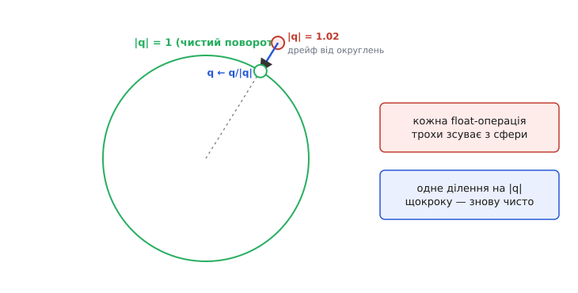
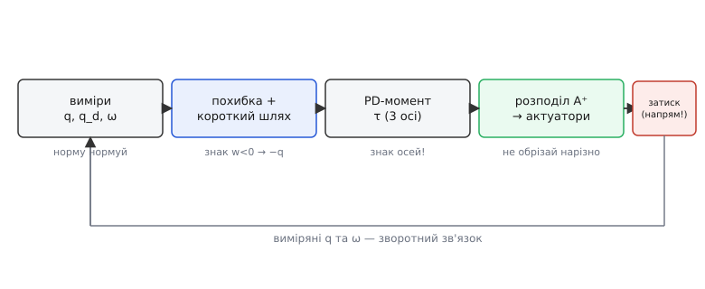

# ⚙️ Модуль керування орієнтацією на кватерніонах — робоча прошивка

Закон керування на кватерніонах на папері вміщається у два рядки: похибка — це доворот q_d ⊗ q⁻¹, а момент — пропорційно-диференціальний за її векторною частиною. Але між цими двома рядками й реальним апаратом, що висить у повітрі, лежить ціла прірва рутини, у якій гине більшість «правильних» реалізацій. Хтось забув нормувати кватерніон — і за хвилину польоту поворот тихо «розтягнувся». Хтось не перевірив знак скалярної частини — і дрон при різкій зміні цілі крутнувся через спину. Хтось порахував три компоненти моменту, а тоді не знав, що з ними робити, бо мотор розуміє лише одне число — свою тягу, а не «момент навколо осі y».

Ця вставка — **повний робочий модуль** для прошивки: від структури кватерніона й чотирьох базових операцій до розкидання порахованого моменту на реальні актуатори, з усіма перевірками, без яких воно ламається в найгіршу мить. Код — справжній C, такий, що компілюється й лягає в мікроконтролер, а не псевдокод «для ілюстрації ідеї». Наприкінці — та сама логіка у **цілій арифметиці** для чипа без апаратних дробових чисел, бо саме там, де апарат найдешевший, float часто задорогий.

Задача, яку розв'язуємо, звучить так. На вхід кожні кілька мілісекунд приходять: **виміряна орієнтація** апарата (кватерніон q від системи оцінки), **цільова орієнтація** (кватерніон q_d, куди треба дивитися) і **кутова швидкість** ω з гіроскопа. На виході потрібні числа для актуаторів — тяги моторів мультиротора, чи моменти маховиків супутника, чи що там крутить конкретний апарат. Між входом і виходом — обчислення похибки, закон керування й розподіл. Розберімо це шар за шаром, і на кожному шарі покажу пастку, що чигає саме тут.

## Шар нуль: структура й чотири операції

Усе тримається на одній маленькій структурі — четвірці чисел. Порядок компонент (спершу скалярна `w`, потім векторні `x, y, z`) — питання смаку, але **щойно ви його обрали, тримайтеся його в усій прошивці**: половина болючих багів у кватерніонному коді — це переплутаний порядок компонент на межі двох бібліотек, коли одна пише `(w,x,y,z)`, а інша `(x,y,z,w)`.

:::tabs
```cpp
#include <math.h>

typedef struct { float w, x, y, z; } quat;

// тотожність — «нічого не роблю», нульовий поворот
static const quat QUAT_IDENTITY = { 1.0f, 0.0f, 0.0f, 0.0f };
```
```python
from dataclasses import dataclass

@dataclass
class Quat:
    w: float
    x: float
    y: float
    z: float

# тотожність — «нічого не роблю», нульовий поворот
QUAT_IDENTITY = Quat(1.0, 0.0, 0.0, 0.0)
```
:::

Перша операція — **множення**, воно ж складання поворотів. Формула виглядає громіздко, та це проста механічна робота, що прямо випливає з Гамільтонової тотожності i² = j² = k² = i·j·k = −1. У коді — рівно чотири рядки, кожен рахує одну компоненту добутку:

:::tabs
```cpp
// r = a ⊗ b  (спершу b, потім a — читаємо справа наліво, як застосування)
quat quat_mul(quat a, quat b) {
    quat r;
    r.w = a.w*b.w - a.x*b.x - a.y*b.y - a.z*b.z;
    r.x = a.w*b.x + a.x*b.w + a.y*b.z - a.z*b.y;
    r.y = a.w*b.y - a.x*b.z + a.y*b.w + a.z*b.x;
    r.z = a.w*b.z + a.x*b.y - a.y*b.x + a.z*b.w;
    return r;
}
```
```python
# r = a ⊗ b  (спершу b, потім a — читаємо справа наліво, як застосування)
def quat_mul(a: Quat, b: Quat) -> Quat:
    return Quat(
        a.w*b.w - a.x*b.x - a.y*b.y - a.z*b.z,
        a.w*b.x + a.x*b.w + a.y*b.z - a.z*b.y,
        a.w*b.y - a.x*b.z + a.y*b.w + a.z*b.x,
        a.w*b.z + a.x*b.y - a.y*b.x + a.z*b.w,
    )
```
:::

Пам'ятайте, що множення **не переставне**: `quat_mul(a, b)` і `quat_mul(b, a)` дають різне, бо в просторі порядок поворотів важить. Плутанина в порядку аргументів — друге за поширеністю джерело загадкових багів після переплутаного порядку компонент.

Друга операція — **спряження**, воно ж обертання повороту назад. Для одиничного кватерніона обернений поворот — це просто зміна знака векторної частини:

:::tabs
```cpp
// q⁻¹ для ОДИНИЧНОГО q — обернений поворот (спряжений)
quat quat_conj(quat q) {
    quat r = { q.w, -q.x, -q.y, -q.z };
    return r;
}
```
```python
# q⁻¹ для ОДИНИЧНОГО q — обернений поворот (спряжений)
def quat_conj(q: Quat) -> Quat:
    return Quat(q.w, -q.x, -q.y, -q.z)
```
:::

Тут захована перша пастка, і вона тиха. Спряження дає обернений поворот **лише для одиничного** кватерніона. Строго обернений — це спряжений, поділений на квадрат норми: q⁻¹ = q̄ / |q|². Поки норма дорівнює одиниці, ділення на неї нічого не міняє, і `quat_conj` — точний обернений. Але якщо норма попливла (а вона попливе, див. нижче), `quat_conj` тихо перестає бути точним оберненим, і похибка орієнтації рахується з невеликим викривленням. Тому спряження працює лише в парі з дисципліною нормування — інакше воно бреше.

Третя операція — те саме **нормування**, наріжна дисципліна всього модуля:

:::tabs
```cpp
// повернути кватерніон на одиничну сферу: q ← q / |q|
void quat_normalize(quat *q) {
    float n2 = q->w*q->w + q->x*q->x + q->y*q->y + q->z*q->z;
    // захист від ділення на нуль (виродження — майже неможливе, але дешеве)
    if (n2 < 1e-12f) { *q = QUAT_IDENTITY; return; }
    float inv = 1.0f / sqrtf(n2);
    q->w *= inv; q->x *= inv; q->y *= inv; q->z *= inv;
}
```
```python
import math

# повернути кватерніон на одиничну сферу: q ← q / |q|
def quat_normalize(q: Quat) -> None:
    n2 = q.w*q.w + q.x*q.x + q.y*q.y + q.z*q.z
    # захист від ділення на нуль (виродження — майже неможливе, але дешеве)
    if n2 < 1e-12:
        q.w, q.x, q.y, q.z = QUAT_IDENTITY.w, QUAT_IDENTITY.x, QUAT_IDENTITY.y, QUAT_IDENTITY.z
        return
    inv = 1.0 / math.sqrt(n2)
    q.w *= inv; q.x *= inv; q.y *= inv; q.z *= inv
```
:::

> 🔧 **Навіщо це.** Усі повороти живуть на одиничній сфері w² + x² + y² + z² = 1. Кожна арифметична операція на float додає крихітну похибку округлення, і після тисяч множень за секунду норма поволі відходить від одиниці. Кватерніон із нормою 1.02 — це вже не чистий поворот: він додає до обертання паразитне розтягнення. Одне ділення на власну довжину щокроку тримає поворот чистим — і це в рази дешевше, ніж відновлювати ортогональність трьох векторів у матриці повороту, де для тієї самої гарантії треба перебудовувати всю трійку осей. Ощадливість тут не в тому, щоб нормувати рідше, а в тому, що саме нормування дешеве.

Коли нормувати? Правило просте: **після кожного кроку, що міг зіпсувати норму**. Проінтегрували гіроскоп у новий кватерніон орієнтації — нормуйте. Перемножили два кватерніони в довгому ланцюзі — нормуйте наприкінці. Один зайвий `sqrtf` на цикл керування — мізерна ціна за поворот, що не «розтягується».


*Норма кватерніона поволі відходить від одиниці через округлення float; нормування щокроку повертає його на одиничну сферу, лишаючи поворот чистим.*

Четверта операція знадобиться рідше, але без неї модуль неповний — **поворот вектора**. Щоб перевести напрямок (скажімо, «униз» у рамці апарата) в рамку світу, беруть сендвіч q ⊗ v ⊗ q⁻¹, де вектор укладено в кватерніон із нульовою скалярною частиною:

:::tabs
```cpp
// повернути 3-вектор v кватерніоном q: r = q ⊗ (0,v) ⊗ q⁻¹
void quat_rotate_vec(quat q, const float v[3], float out[3]) {
    quat qv = { 0.0f, v[0], v[1], v[2] };
    quat r  = quat_mul(quat_mul(q, qv), quat_conj(q));
    out[0] = r.x; out[1] = r.y; out[2] = r.z;
}
```
```python
# повернути 3-вектор v кватерніоном q: r = q ⊗ (0,v) ⊗ q⁻¹
def quat_rotate_vec(q: Quat, v):
    qv = Quat(0.0, v[0], v[1], v[2])
    r = quat_mul(quat_mul(q, qv), quat_conj(q))
    return [r.x, r.y, r.z]
```
:::

Ці чотири операції — уся алгебра, потрібна модулю. Далі йде власне керування, і воно будується виключно на них.

## Шар один: похибка як доворот, з перевіркою знака

Тепер серце. Ми маємо, де апарат зараз (q), і, куди треба (q_d). Наївний порив — відняти одне від одного — безглуздий: віднімати повороти не можна, це не числа на прямій. Правильне питання інше: *який поворот доверне апарат із поточного стану в цільовий?* А поворот з одного стану в інший — знову кватерніон, і рахується множенням цілі на обернений поточний:

:::tabs
```cpp
// похибка орієнтації = доворот, що усуває розбіжність
quat quat_error(quat q_des, quat q_meas) {
    // обидва мають бути одиничні; для одиничного обернений = спряжений
    return quat_mul(q_des, quat_conj(q_meas));
}
```
```python
# похибка орієнтації = доворот, що усуває розбіжність
def quat_error(q_des: Quat, q_meas: Quat) -> Quat:
    # обидва мають бути одиничні; для одиничного обернений = спряжений
    return quat_mul(q_des, quat_conj(q_meas))
```
:::

Векторна частина цієї похибки одразу каже, **уздовж якої осі** й **наскільки** крутити, а скалярна — скільки лишилося. Коли апарат націлений точно, похибка стає тотожністю (1,0,0,0): осі нема, крутити нікуди.

І тут — найпідступніша пастка всього методу, та сама, через яку дрон робить сальто «не туди». **Кожен поворот описується двома кватерніонами: q і −q дають абсолютно однакову орієнтацію.** Це подвійне покриття, наслідок половини кута у формулах: cos і sin від половинного кута міняють знак, коли до кута додати повне коло, а апарат повного кола не бачить. Тож похибка може вийти або «близькою» (короткий доворот на 20°), або записаною як той самий доворот довгою дугою (340° в інший бік). Обидва кватерніони кажуть про **однакову** ціль. Але якщо регулятор ухопиться за «далекий» запис, він поведе апарат майже повним колом замість короткого кивка — це **розкручування** (unwinding).

Ліки — один рядок, і критерій простий: коротшій дузі (кут ≤ 180°) завжди відповідає **невід'ємна скалярна частина** похибки. Тож якщо `w` похибки вийшла від'ємною, беремо −q_err цілком (усі чотири знаки навпаки). Орієнтація та сама, а керунок гарантовано йде найкоротшим шляхом:

:::tabs
```cpp
// вибір короткого шляху: якщо скалярна частина < 0 — інвертувати весь кватерніон
void quat_shortest(quat *e) {
    if (e->w < 0.0f) {
        e->w = -e->w; e->x = -e->x; e->y = -e->y; e->z = -e->z;
    }
}
```
```python
# вибір короткого шляху: якщо скалярна частина < 0 — інвертувати весь кватерніон
def quat_shortest(e: Quat) -> None:
    if e.w < 0.0:
        e.w = -e.w; e.x = -e.x; e.y = -e.y; e.z = -e.z
```
:::

Пропустити цю перевірку — означає інколи (залежно від того, з якого боку прийшла ціль) розкручувати апарат зайвим майже-обертом. На відео дрона це виглядає як раптовий зрив без видимої причини, а причина суто арифметична: керунок пішов довгою дугою, бо ніхто не вибрав коротку. Один `if` — і апарат ніколи не робить зайвого оберту.

## Шар два: PD-закон моменту

Момент, який доверне апарат, будується на диво просто. Він має бути **пропорційний тому, куди й наскільки крутити** — а це і є векторна частина похибки. Плюс демпфування, щоб не проскочити ціль з розгону: віднімаємо доданок за кутовою швидкістю (її гіроскоп дає напряму, без жодних похідних). Виходить знайомий [пропорційно-диференціальний закон](book:algorithms/discrete-pid), тільки замість скалярної похибки — три компоненти вектора:

```
τ = −Kₚ · q_err_v − K_d · ω
```

Три компоненти моменту — по трьох осях апарата. У коді це рівно три множення й три різниці, по осі на рядок:

:::tabs
```cpp
// PD-момент по трьох осях тіла: пружина за похибкою + демпфер за швидкістю
void attitude_pd(quat q_des, quat q_meas, const float omega[3],
                 float Kp, float Kd, float tau[3]) {
    quat e = quat_error(q_des, q_meas);
    quat_shortest(&e);                 // обов'язково: короткий шлях
    tau[0] = -Kp * e.x - Kd * omega[0];
    tau[1] = -Kp * e.y - Kd * omega[1];
    tau[2] = -Kp * e.z - Kd * omega[2];
}
```
```python
# PD-момент по трьох осях тіла: пружина за похибкою + демпфер за швидкістю
def attitude_pd(q_des: Quat, q_meas: Quat, omega, Kp: float, Kd: float):
    e = quat_error(q_des, q_meas)
    quat_shortest(e)                   # обов'язково: короткий шлях
    return [
        -Kp * e.x - Kd * omega[0],
        -Kp * e.y - Kd * omega[1],
        -Kp * e.z - Kd * omega[2],
    ]
```
:::

Чому цього досить, видно з малого кута. Коли похибка невелика, sin(θ/2) ≈ θ/2, тож векторна частина q_err_v ≈ (θ/2)·ê — буквально половина кутової похибки вздовж осі повороту. PD-закон, що тягне за нею, поводиться точно як звичайний кутовий регулятор біля цілі. Але, на відміну від кутів Ейлера, він **не ламається на великих кутах**: формула однакова хоч для 5°, хоч для перевороту на 179°. Немає осей, що зливаються, немає ділення на нуль — момент завжди скінченний. Ось де окупається четверте число.

Одне важливе уточнення про знак осей, бо тут ламаються навіть ті, хто все інше зробив правильно. Знак `Kp·e` штовхає апарат **до** цілі лише тоді, коли осі похибки й осі, навколо яких актуатори створюють момент, дивляться в один бік. Якщо гіроскоп рахує додатний крен «праворуч», а мотори від додатного `tau[0]` кренять «ліворуч», зворотний зв'язок стає додатним — і апарат не гаситиме похибку, а **розгойдуватиме** її до зриву. Це не помилка формули, а неузгодженість рамок; ловиться вона одним обережним випробуванням на столі (нахилив рукою — момент має тягнути назад), а не переглядом коду, бо в коді все «правильно».

**Приклад: момент довороту з реальної похибки.** Апарат нахилений уперед, ціль — рівний горизонт. Похибка вийшла `e = (0.996, 0.0, 0.087, 0.0)` — це поворот на ≈10° навколо осі y. Скалярна частина додатна, отже короткий шлях уже вибрано, інвертувати не треба. При `Kp = 4.0` момент по осі y:

```
tau[1] = −4.0 · 0.087 − K_d · omega[1]
       = −0.348 − (демпфування)      [Н·м]
```

Знак від'ємний — момент штовхає ніс назад до горизонту, а величина падає до нуля в міру вирівнювання. Рівно те, що треба: сильніше тягне, коли похибка більша, і відпускає біля цілі.


*Повний тракт модуля: похибка → короткий шлях → PD-момент → розподіл на актуатори, з поверненням виміряних орієнтації й кутової швидкості на вхід.*

## Шар три: розподіл моменту на актуатори

Ось де більшість реалізацій зупиняється, а робота лише починається. У нас три числа — момент навколо трьох осей тіла. Але **жоден актуатор не вміє «створити момент навколо осі y»**. Мотор мультиротора вміє одне: дати тягу вздовж своєї осі. Маховик супутника вміє одне: розкрутитися й тим створити реактивний момент навколо своєї осі кріплення. Між трьома бажаними моментами й N командами актуаторів лежить крок **розподілу керування** (англ. *control allocation*) — місток, без якого порахований момент нікуди не подінеться.

Ідея місточка тримається на одному факті. Кожен актуатор дає внесок у момент тіла **лінійно** від своєї команди: подвоїв тягу мотора — подвоївся і його внесок у крен, і в тангаж, і в рискання. Тож повний момент — це сума внесків, а зв'язок «команди актуаторів → момент тіла» описується сталою матрицею **A** (її звуть матрицею ефективності, або матрицею розподілу):

```
τ = A · u
```

Тут `u` — вектор команд актуаторів (N чисел: тяги моторів або моменти маховиків), `τ` — три компоненти моменту тіла, а `A` — матриця 3×N, де стовпчик k каже, який момент по трьох осях дає одиниця команди k-го актуатора. Ця матриця повністю визначена **геометрією** апарата: де стоїть кожен актуатор, куди дивиться його вісь, у який бік крутить гвинт. Для класичного квадрокоптера в конфігурації X кожен мотор стоїть на кінці плеча й крутить гвинт у свій бік — звідси й знайома [матриця мікшера](book:algorithms/motor-mixer) з таблицею знаків «+/−» по крену, тангажу й рисканню.

Але нам потрібне зворотне: маємо бажаний `τ`, шукаємо команди `u`. Тобто **обернути** зв'язок. І тут криється тонкість, яка й робить розподіл окремим кроком, а не простим діленням. Якщо актуаторів рівно стільки, скільки керованих осей (три маховики на три осі), матриця квадратна й оборотна — команди знаходяться одним множенням на обернену: u = A⁻¹·τ. Але на мультироторі актуаторів **більше**, ніж осей: чотири мотори (а то й шість, вісім) на три моменти. Система недовизначена — розв'язків безліч, бо надлишок акторів дає свободу. Треба вибрати один, і природний вибір — той, що дає **найменшу суму квадратів команд** (найощадніший за тягою). Його дає **псевдообернена** матриця Мура — Пенроуза:

```
u = A⁺ · τ,   де A⁺ = Aᵀ (A Aᵀ)⁻¹   (для «широкої» A: осей менше, ніж акторів)
```

Це усталений спосіб розподілу керування на мультироторах — саме псевдообернена дає ощадливий розподіл тяги, точно відтворюючи бажаний момент і не перевантажуючи окремий актуатор (докладний вивід і варіанти — у [нарисі про розподіл керування](book:algorithms/actuator-allocation)). Головне для прошивки: **A⁺ рахують один раз** наперед, ще на землі, знаючи геометрію апарата, і зашивають у прошивку як звичайну сталу матрицю N×3. У циклі керування лишається дешеве множення — жодних обертань матриць у реальному часі.

Покажу на квадрокоптері X. Момент має три компоненти; на кожен мотор іде своя лінійна комбінація. Псевдообернена для симетричної X-рами зводиться до знайомої таблиці знаків (плюс спільна тяга, яку кермує окремий канал висоти):

:::tabs
```cpp
#define N_MOTORS 4

// зашита наперед матриця розподілу: рядок = мотор, стовпці = внесок
// моменту по осях (roll, pitch, yaw) у команду цього мотора.
// Для симетричної квадро-X — знаки «+/−» однакової величини.
static const float ALLOC[N_MOTORS][3] = {
    // roll   pitch   yaw
    { +1.0f, +1.0f, +1.0f },   // мотор 1 (перед-право)
    { +1.0f, -1.0f, -1.0f },   // мотор 2 (зад-право)
    { -1.0f, +1.0f, -1.0f },   // мотор 3 (перед-ліво)
    { -1.0f, -1.0f, +1.0f },   // мотор 4 (зад-ліво)
};

// розкидати три компоненти моменту + спільну тягу на N моторів
void allocate(const float tau[3], float thrust_base, float motor[N_MOTORS]) {
    for (int i = 0; i < N_MOTORS; ++i) {
        motor[i] = thrust_base
                 + ALLOC[i][0]*tau[0]    // крен
                 + ALLOC[i][1]*tau[1]    // тангаж
                 + ALLOC[i][2]*tau[2];   // рискання
    }
}
```
```python
N_MOTORS = 4

# зашита наперед матриця розподілу: рядок = мотор, стовпці = внесок
# моменту по осях (roll, pitch, yaw) у команду цього мотора.
# Для симетричної квадро-X — знаки «+/−» однакової величини.
ALLOC = [
    # roll  pitch  yaw
    (+1.0, +1.0, +1.0),   # мотор 1 (перед-право)
    (+1.0, -1.0, -1.0),   # мотор 2 (зад-право)
    (-1.0, +1.0, -1.0),   # мотор 3 (перед-ліво)
    (-1.0, -1.0, +1.0),   # мотор 4 (зад-ліво)
]

# розкидати три компоненти моменту + спільну тягу на N моторів
def allocate(tau, thrust_base: float):
    motor = [0.0] * N_MOTORS
    for i in range(N_MOTORS):
        motor[i] = (thrust_base
                    + ALLOC[i][0]*tau[0]    # крен
                    + ALLOC[i][1]*tau[1]    # тангаж
                    + ALLOC[i][2]*tau[2])   # рискання
    return motor
```
:::

Для супутника з трьома маховиками, вирівняними по осях тіла, матриця ще простіша — одинична: `moment_wheel[k] = −tau[k]` (маховик прикладає до корпусу момент, зворотний своєму розгону, звідси знак). А для косо поставлених маховиків чи гексакоптера саме A⁺ і зробить розкидання правильним — код `allocate` лишається тим самим циклом множень, міняється лише зашита матриця.

## Шар чотири: насичення, без якого розподіл бреше

Порахувати команди — ще не все. Реальний актуатор має **межу**: мотор не дасть більше за максимальну тягу й не дасть від'ємної; маховик не розкрутиться понад свою граничну швидкість. І тут наївний розподіл підводить: якщо PD запросив момент більший, ніж актуатори фізично здатні дати, деякі команди `motor[i]` вискочать за межу. Просто **обрізати** їх на межі — спокуса, але це тихо ламає момент: обрізавши один мотор і лишивши інші, ви зміните співвідношення тяг, а отже, і напрямок сумарного моменту. Апарат отримає не той доворот, що просив регулятор, — і в різкому маневрі це зрив.

Тому затискати треба з розумом. Найдешевший надійний прийом — **зберегти співвідношення**: якщо максимальна з команд вилізла за межу, зменшити **всі** команди одним спільним множником так, щоб найбільша якраз уперлася в межу. Момент трохи послабшає за величиною, але **напрямок довороту збережеться** — а напрямок тут важливіший за силу:

:::tabs
```cpp
#define THR_MIN 0.0f
#define THR_MAX 1.0f

// затиснути команди моторів, зберігши напрямок сумарного моменту
void saturate_preserve(float motor[N_MOTORS]) {
    float hi = motor[0], lo = motor[0];
    for (int i = 1; i < N_MOTORS; ++i) {
        if (motor[i] > hi) hi = motor[i];
        if (motor[i] < lo) lo = motor[i];
    }
    // якщо розмах вилазить за [MIN,MAX] — стиснути всі до одного масштабу
    float span = hi - lo;
    float room = THR_MAX - THR_MIN;
    if (span > room && span > 1e-6f) {
        float scale = room / span;
        for (int i = 0; i < N_MOTORS; ++i)
            motor[i] = (motor[i] - lo) * scale + THR_MIN;
    } else {
        // просто підняти/опустити в діапазон, не міняючи різниць
        float shift = 0.0f;
        if (lo < THR_MIN) shift = THR_MIN - lo;
        else if (hi > THR_MAX) shift = THR_MAX - hi;
        for (int i = 0; i < N_MOTORS; ++i) motor[i] += shift;
    }
}
```
```python
THR_MIN = 0.0
THR_MAX = 1.0

# затиснути команди моторів, зберігши напрямок сумарного моменту
def saturate_preserve(motor) -> None:
    hi = lo = motor[0]
    for i in range(1, N_MOTORS):
        if motor[i] > hi: hi = motor[i]
        if motor[i] < lo: lo = motor[i]
    # якщо розмах вилазить за [MIN,MAX] — стиснути всі до одного масштабу
    span = hi - lo
    room = THR_MAX - THR_MIN
    if span > room and span > 1e-6:
        scale = room / span
        for i in range(N_MOTORS):
            motor[i] = (motor[i] - lo) * scale + THR_MIN
    else:
        # просто підняти/опустити в діапазон, не міняючи різниць
        shift = 0.0
        if lo < THR_MIN: shift = THR_MIN - lo
        elif hi > THR_MAX: shift = THR_MAX - hi
        for i in range(N_MOTORS):
            motor[i] += shift
```
:::

> 🔧 **Навіщо це.** Насичення актуаторів — не рідкісний край, а буденність кожного різкого маневру. На мультироторі його ігнорування коштує зриву: обрізаний окремий мотор перекошує момент. На супутнику з маховиками є ще підступніший бік — маховик, розкручуючись проти постійного збурення, поволі набирає **свій** момент і зрештою впирається в граничну швидкість (насичення маховика). Далі він уже не може створити керувальний момент, і апарат втрачає керунок по цій осі. Тому в реальних системах маховики періодично **розвантажують** — гасять їхню швидкість зовнішнім моментом (магнітними котушками об поле планети чи мікродвигунами), переливаючи накопичений момент назовні. Код керування цього не бачить, але проєктувальник мусить: без розвантаження навіть бездоганний PD рано чи пізно впреться в межу заліза.

## Усе разом: один крок циклу керування

Зберемо шари в одну функцію — рівно те, що викликається кожні кілька мілісекунд у циклі керування. Вона бере виміряну й цільову орієнтацію та кутову швидкість, а віддає готові команди актуаторам:

:::tabs
```cpp
// повний крок керування орієнтацією: вхід — виміри, вихід — команди моторів
void attitude_control_step(quat q_meas, quat q_des, const float omega[3],
                           float thrust_base, float motor[N_MOTORS]) {
    // 0. гігієна: виміряна орієнтація має бути одиничною
    quat_normalize(&q_meas);

    // 1. похибка як доворот + короткий шлях
    quat e = quat_error(q_des, q_meas);
    quat_shortest(&e);

    // 2. PD-момент по трьох осях тіла
    static const float Kp = 4.0f, Kd = 0.5f;
    float tau[3];
    tau[0] = -Kp * e.x - Kd * omega[0];
    tau[1] = -Kp * e.y - Kd * omega[1];
    tau[2] = -Kp * e.z - Kd * omega[2];

    // 3. розкидання моменту на актуатори (зашита матриця розподілу)
    allocate(tau, thrust_base, motor);

    // 4. затиснути в межі, зберігши напрямок моменту
    saturate_preserve(motor);
}
```
```python
# повний крок керування орієнтацією: вхід — виміри, вихід — команди моторів
def attitude_control_step(q_meas: Quat, q_des: Quat, omega, thrust_base: float):
    # 0. гігієна: виміряна орієнтація має бути одиничною
    quat_normalize(q_meas)

    # 1. похибка як доворот + короткий шлях
    e = quat_error(q_des, q_meas)
    quat_shortest(e)

    # 2. PD-момент по трьох осях тіла
    Kp, Kd = 4.0, 0.5
    tau = [
        -Kp * e.x - Kd * omega[0],
        -Kp * e.y - Kd * omega[1],
        -Kp * e.z - Kd * omega[2],
    ]

    # 3. розкидання моменту на актуатори (зашита матриця розподілу)
    motor = allocate(tau, thrust_base)

    # 4. затиснути в межі, зберігши напрямок моменту
    saturate_preserve(motor)
    return motor
```
:::

Кожен рядок тут — окремий шар, і кожен покриває свою пастку: нормування ловить дрейф норми, `quat_shortest` — розкручування, знаки в `ALLOC` мусять узгоджуватися з рамками гіроскопа, `saturate_preserve` — насичення. Приберіть будь-який — і модуль зламається саме там, де його найважче спіймати: не в спокійному висінні, а в різкому маневрі під збуренням.

## Той самий модуль у цілій арифметиці

Останній шар — для чипа без апаратних дробових чисел. На дешевих мікроконтролерах (8-бітний AVR, багато Cortex-M0) операція з комою не виконується нативно, а **емулюється** довгою підпрограмою — десятки тактів на одне множення, тоді як ціле множення процесор робить за такт-два. На циклі керування з тисячами множень за секунду це різниця між «встигає» і «захлинається». Тому кватерніони там тримають **цілими числами у фіксованій комі**: домовляються про масштаб і зберігають дроби як масштабовані цілі (докладно про формат і його пастки — у [реалізації fixed-point](book:algorithms/fixed-point-implementation)).

Кватерніон повороту завжди лежить у [−1, 1], тож ідеально лягає у формат **Q15**: множимо на 2¹⁵ = 32768 і зберігаємо 16-бітним цілим зі знаком. Кутова швидкість і момент теж масштабуються під свій діапазон. Структура стає цілою:

```c
#include <stdint.h>

typedef struct { int16_t w, x, y, z; } quat_q15;   // компоненти в Q15

#define Q15_ONE  32768        // одиниця у Q15 (насправді 1.0 ≈ 32767)
```

Ключова тонкість — **множення**. Перемноживши два Q15-числа, дістаємо подвійний масштаб (Q30); щоб повернутись у Q15, зсуваємо праворуч на 15. Причому проміжну суму **обов'язково** копимо в ширшому 32-бітному (а краще для запасу — з проміжним 64-бітним добутком) акумуляторі, бо сума кількох Q30-добутків легко переповнить 16 біт:

```c
// добуток двох Q15 → назад у Q15, через 32-бітний проміжок і зсув
static inline int16_t qmul(int16_t a, int16_t b) {
    int32_t p = (int32_t)a * (int32_t)b;   // Q15·Q15 = Q30, у 32 бітах
    return (int16_t)(p >> 15);             // повертаємо кому на місце
}

// множення кватерніонів у Q15 (акумулятор 32-бітний, зсув наприкінці)
quat_q15 quat_mul_q15(quat_q15 a, quat_q15 b) {
    int32_t w = (int32_t)a.w*b.w - (int32_t)a.x*b.x - (int32_t)a.y*b.y - (int32_t)a.z*b.z;
    int32_t x = (int32_t)a.w*b.x + (int32_t)a.x*b.w + (int32_t)a.y*b.z - (int32_t)a.z*b.y;
    int32_t y = (int32_t)a.w*b.y - (int32_t)a.x*b.z + (int32_t)a.y*b.w + (int32_t)a.z*b.x;
    int32_t z = (int32_t)a.w*b.z + (int32_t)a.x*b.y - (int32_t)a.y*b.x + (int32_t)a.z*b.w;
    quat_q15 r = { (int16_t)(w >> 15), (int16_t)(x >> 15),
                   (int16_t)(y >> 15), (int16_t)(z >> 15) };
    return r;
}
```

Нормування у цілій арифметиці — найдорожча операція, бо в ній корінь. Обчислюємо суму квадратів у 32-бітному акумуляторі (кожен квадрат Q15-числа — Q30, чотири їх ще влазять у 32 біти зі знаком, бо кожна компонента ≤ 1), беремо цілий квадратний корінь і ділимо. Цілий `isqrt` реалізують без апаратного кореня — двійковим уточненням:

```c
// цілий квадратний корінь (для нормування без апаратного sqrt)
static uint32_t isqrt32(uint32_t v) {
    uint32_t r = 0, bit = 1UL << 30;
    while (bit > v) bit >>= 2;
    while (bit) {
        if (v >= r + bit) { v -= r + bit; r = (r >> 1) + bit; }
        else r >>= 1;
        bit >>= 2;
    }
    return r;
}

// нормування Q15-кватерніона: q ← q / |q|
void quat_normalize_q15(quat_q15 *q) {
    int32_t n2 = (int32_t)q->w*q->w + (int32_t)q->x*q->x
               + (int32_t)q->y*q->y + (int32_t)q->z*q->z;   // Q30
    if (n2 <= 0) { q->w = Q15_ONE - 1; q->x = q->y = q->z = 0; return; }
    // |q| у Q15: корінь із Q30 дає Q15
    uint32_t norm = isqrt32((uint32_t)n2);
    if (norm == 0) return;
    // q / |q| : ділимо Q15 на Q15 → множимо на Q15/norm
    q->w = (int16_t)(((int32_t)q->w << 15) / (int32_t)norm);
    q->x = (int16_t)(((int32_t)q->x << 15) / (int32_t)norm);
    q->y = (int16_t)(((int32_t)q->y << 15) / (int32_t)norm);
    q->z = (int16_t)(((int32_t)q->z << 15) / (int32_t)norm);
}
```

Уся решта — похибка, перевірка знака, PD, розподіл — переноситься у Q15 механічно: скрізь замість `*` ставимо `qmul`, суми копимо в `int32_t`, а результат зсуваємо назад. Перевірка знака взагалі безкоштовна — `if (e.w < 0)` однаково працює з цілим зі знаком (доповняльний код). PD-множення на коефіцієнт роблять через `qmul`, підібравши масштаб `Kp`, `Kd` так, щоб момент лишався в діапазоні.

Три пастки саме цілого шляху, кожна тиха й кожна вбивча. **Переповнення**: забув розширити добуток до 32 біт перед сумуванням — і на середині множення кватерніонів число «загорнеться» з плюс-максимуму в мінус-максимум, поворот стрибне в дичину. **Втрата точності**: Q15 має крок 1/32768 ≈ 0.00003, і після сотень множень дрібні похибки округлення накопичуються — рятує те саме нормування, що заразом і чистить норму, і не дає дрейфу рости. **Плутанина масштабів**: перемножив Q15 на Q7, забувши зсув, — і коефіцієнт «поїхав» у сотні разів; тому масштаб мусить бути однаковий і задокументований у всьому тракті. Жодна з трьох не видасть себе попередженням компілятора — усі троє проявляються лише в польоті, і саме тому цілий шлях вимагає вдвічі більше уважності за float.

## Складність і головні пастки

За обчисленнями модуль до смішного дешевий. Похибка — одне множення кватерніонів (28 множень і 12 додавань), перевірка знака — одне порівняння, PD — три множення й три різниці, розподіл — N×3 множень (для квадро — 12), насичення — прохід по N командах. Разом кілька десятків множень на крок, стала складність O(N) за числом актуаторів. Нормування додає один квадратний корінь. На будь-якому сучасному польотному контролері це мікросекунди; навіть у Q15 на дешевому AVR — сотні тактів, тобто тисячі кроків керування за секунду з великим запасом. Вузьке місце ніколи не тут, а в оцінці орієнтації (фільтр, що дає q) — сам керунок майже безкоштовний.

Дорожча не арифметика, а **дисципліна**, і кожна пропущена осторога має свій характерний зрив:

- **Втрата норми.** Забув нормувати — поворот поволі «розтягується», спряження перестає бути точним оберненим, похибка рахується з викривленням. Проявляється не одразу, а через хвилини польоту як повільний відхід. Лік: `quat_normalize` після кожного кроку, що псує норму.
- **Розкручування без перевірки знака.** Пропустив `quat_shortest` — і при частині цілей апарат іде довгою дугою, роблячи зайвий майже-оберт. Виглядає як раптовий зрив без причини. Лік: один `if (e.w < 0)`.
- **Знак осей.** Осі похибки не узгоджені з осями, навколо яких актуатори дають момент, — зворотний зв'язок стає додатним, і замість гасити похибку регулятор її розгойдує до зриву. У коді все «правильно» — ловиться лише випробуванням на столі.
- **Насичення актуаторів.** Обрізав окремий мотор на межі — перекосив напрямок сумарного моменту, апарат отримав не той доворот. На маховиках — ще й повзуче насичення самого маховика, що зрештою забирає керунок по осі, поки його не розвантажать. Лік: `saturate_preserve` (спільний масштаб) плюс, для маховиків, зовнішнє розвантаження моменту.
- **Фіксована точка на MCU.** Переповнення акумулятора, накопичення похибки округлення, плутанина Q-масштабів — усе тихе, усе проявляється лише в польоті. Лік: широкий акумулятор, нормування щокроку, єдиний задокументований масштаб.

Спільне в усіх п'яти — вони не помітні на папері й не ловляться компілятором. Модуль, що бездоганно рахує похибку й момент, зривається саме на цих дрібницях рутини, і то не в спокійному висінні, а в різкому маневрі під збуренням — там, де перевірка знака, широкий акумулятор і збережений напрямок моменту й вирішують, чи втримається апарат. Уся ціна за керування, що не ламається там, де наочні кути безпорадні, — одне нормування, одна перевірка знака й один розумний затиск на кожен крок циклу.
