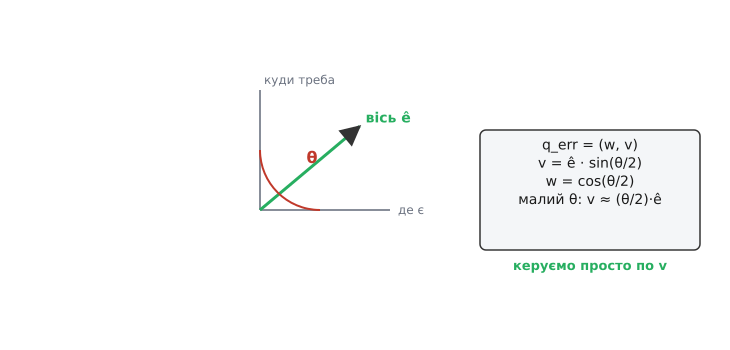
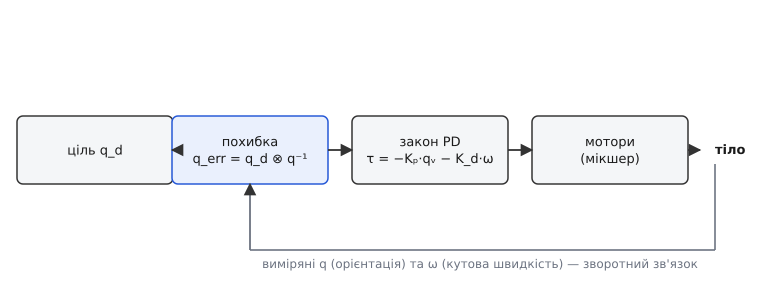
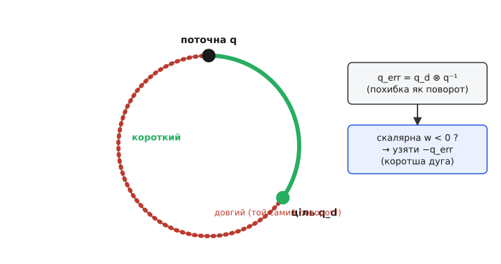

# Кватерніонне керування орієнтацією

Дрон висить у повітрі й тримає горизонт. Камера на підвісі дивиться в одну точку, поки апарат нахиляється. Супутник розвертається, щоб націлити антену. У кожному випадку керунок робить дві речі: **розуміє, як апарат повернутий зараз**, і **вираховує момент, що доверне його туди, куди треба**. Питання лише в тому, якими числами описати «як повернутий» — і від цього вибору залежить, чи не зламається керунок у найгіршу мить.

Природна відповідь — три кути: нахил уперед, крен убік, поворот навколо вертикалі (кути Ейлера, roll-pitch-yaw). Вони наочні, ними зручно ставити ціль. Але в трьох кутах ховається пастка: коли апарат задирається до вертикалі, дві осі обертання зливаються, і система втрачає одну ступінь свободи — це **карданний замок** (gimbal lock). У цю мить рівняння діляться на нуль, а команда керування підстрибує в нескінченність. Для дрона, що робить сальто, чи для акробатичного апарата це не абстракція, а реальна причина зриву.

> 🔧 **Навіщо це.** Автопілоти на ArduPilot і PX4, стабілізатори підвісів, орієнтація супутників — усі всередині тримають орієнтацію **кватерніоном** саме тому, що він не має карданного замка й дешево нормується щокроку. Кути Ейлера лишаються тільки як зручний «людський» інтерфейс: пілот каже «нахил 15°», а керунок усередині перекладає це в кватерніон і працює з ним.

Кватерніон (лат. *quaternio* — четвірка) — це якраз спосіб описати поворот **чотирма** числами замість трьох, і саме зайве, четверте число прибирає особливість. Розберімо, чому четвірка рятує там, де трійка ламається, і як на ній будується робочий регулятор.

## Поворот — це вісь і кут

Будь-який поворот твердого тіла в просторі, хоч який заплутаний, зводиться до одного простого: є **вісь**, навколо якої крутимо, і **кут**, на який крутимо. Це теорема Ейлера про обертання — не очевидна, але точна: скільки б разів апарат не перевертався, підсумок завжди — один поворот навколо однієї осі.

Кватерніон пакує саме ці дві речі. Візьмемо одиничний вектор осі **ê = (eₓ, e_y, e_z)** і кут повороту **θ**. Кватерніон повороту — четвірка:

```
q = (w, x, y, z)
w = cos(θ/2)                  ← скалярна частина
(x, y, z) = ê · sin(θ/2)      ← векторна частина
```

Звідки половина кута — побачимо трохи згодом; поки прийміть як факт. Головне видно вже тут: **векторна частина показує вісь, скалярна — «наскільки повернуто»**. Коли кута нема (θ = 0), маємо q = (1, 0, 0, 0) — «нічого не роблю». Коли поворот великий, векторна частина росте, скалярна спадає.


*Похибка «де є → куди треба» — це один поворот навколо осі ê на кут θ; керунок бере просто векторну частину.*

Усі повороти живуть на **одиничних** кватерніонах: w² + x² + y² + z² = 1. Це не примха, а прямий наслідок формул: cos²(θ/2) + sin²(θ/2) = 1. Якщо через накопичення похибок норма попливла, поворот перестає бути «чистим» — його розтягує чи стискає. Тому щокроку кватерніон **нормують**: ділять на власну довжину. Одне ділення на крок — і поворот знову чистий. Порівняйте з матрицею повороту, де для тієї самої гарантії треба відновлювати ортогональність трьох векторів — набагато дорожче.

## Множення кватерніонів — це складання поворотів

Уся сила в тому, що **повороти складаються множенням кватерніонів**. Спершу повернули на q₁, потім на q₂ — сумарний поворот це добуток q₂ ⊗ q₁ (порядок читаємо справа наліво, як застосування). Знак ⊗ нагадує: множення кватерніонів **не переставне** — q₂ ⊗ q₁ ≠ q₁ ⊗ q₂. І це правильно: у просторі порядок поворотів важить. Нахиліть телефон уперед, потім поверніть його плазом — і зробіть навпаки; екран дивиться в різні боки.

Формула добутку виглядає громіздко, але це проста механічна річ:

```
q = a ⊗ b, де a = (aw, ax, ay, az), b = (bw, bx, by, bz):
w = aw·bw − ax·bx − ay·by − az·bz
x = aw·bx + ax·bw + ay·bz − az·by
y = aw·by − ax·bz + ay·bw + az·bx
z = aw·bz + ax·by − ay·bx + az·bw
```

Виведення цих правил — з тотожності, яку Гамільтон вирізав ножем на камені Брум-брідж у Дубліні 16 жовтня 1843 року: **i² = j² = k² = i·j·k = −1** (це усталений історичний факт; докладніше про походження — у [нарисі про історію](book:algorithms/quaternion-attitude-control/hist-hamilton.md)). З цієї єдиної рівності випливає вся арифметика; у коді ж досить чотирьох рядків вище.

Ще дві дії потрібні постійно. **Спряження** обертає поворот назад — просто міняємо знак векторної частини:

```
q⁻¹ = (w, −x, −y, −z)      ← для одиничного q це і є обернений поворот
```

А щоб повернути сам **вектор** (наприклад, напрямок «униз» із рамки апарата в рамку світу), беремо сендвіч q ⊗ v ⊗ q⁻¹, де вектор укладено у кватерніон із нульовою скалярною частиною. Це той самий поворот, лише застосований до точки, а не складений з іншим поворотом.

## Похибка орієнтації — теж поворот

Тепер головна ідея керування. У нас є **де апарат зараз** (виміряний кватерніон q) і **куди треба** (ціль q_d). Наївно було б відняти одне від одного — але віднімати повороти безглуздо. Правильне питання: *який поворот доверне апарат з поточного стану в цільовий?* А поворот з одного в інший — це знову кватерніон, і рахується він множенням на обернений:

```
q_err = q_d ⊗ q⁻¹
```

Це серце методу. **Похибка орієнтації сама є кватерніоном повороту** — тим єдиним доворотом, що усуває розбіжність. Її векторна частина показує вісь, уздовж якої треба крутити, а скалярна — наскільки лишилося. Коли апарат націлений точно, q_err = (1, 0, 0, 0): вісь зникла, крутити нікуди.

Звідки виміряний q? Його дає система оцінки орієнтації — [поєднання давачів](book:communications/sensor-fusion) гіроскопа й акселерометра (а з магнітометром — і курс). Практично це або [комплементарний фільтр](book:algorithms/complementary-filter), або [фільтр Калмана](book:algorithms/kalman-ekf), що видають орієнтацію одразу кватерніоном. Тобто вся ланка — від давачів до керунку — говорить однією мовою кватерніонів, без переходів у кути й назад.


*Замкнений контур на кватерніонах: похибка → момент → мотори → тіло, а виміряні орієнтація й кутова швидкість повертаються на вхід.*

## Закон керування: тягнемо за векторну частину

Момент, який доверне апарат, будуємо на диво просто. Він має бути **пропорційний тому, куди й наскільки треба крутити** — а це і є векторна частина похибки. Плюс демпфування, щоб не проскочити ціль з розгону: віднімаємо доданок за кутовою швидкістю ω (її дає гіроскоп напряму). Виходить знайомий [пропорційно-диференціальний закон](book:algorithms/discrete-pid), тільки замість скалярної похибки — вектор:

```
τ = −Kₚ · q_err_v − K_d · ω
```

Тут **q_err_v** — векторна частина похибки (три числа: x, y, z), **ω** — виміряна кутова швидкість (три числа), **Kₚ, K_d** — коефіцієнти. Момент τ — теж три числа, по осях апарата. Далі його розкидає [мікшер](book:algorithms/motor-mixer) на окремі мотори (чи маховики на супутнику, чи [розподільник тяги](book:algorithms/quaternion-attitude-control/proj-error-quaternion-c.md) на іншому апараті).

Чому цього досить — видно з малого кута. Коли похибка невелика, sin(θ/2) ≈ θ/2, тож векторна частина **q_err_v ≈ (θ/2)·ê**. Це буквально «половина кутової похибки вздовж осі повороту». PD-закон, що тягне за нею, поводиться точно як звичайний кутовий регулятор біля цілі — але, на відміну від кутів Ейлера, він **не ламається на великих кутах**: формула однакова хоч для 5°, хоч для перевороту на 179°. Ось де окупається четверте число: немає осей, що зливаються, немає ділення на нуль, момент завжди скінченний.

**Приклад: момент довороту з похибки-кватерніона.** Апарат нахилений, ціль — рівний горизонт; порахуймо векторну частину похибки й момент по одній осі.

:::tabs
```c
typedef struct { float w, x, y, z; } quat;

// q_err = q_d ⊗ q_meas⁻¹  (обидва одиничні)
quat quat_error(quat qd, quat qm) {
    quat qi = { qm.w, -qm.x, -qm.y, -qm.z };   // обернений = спряжений
    quat e;
    e.w = qd.w*qi.w - qd.x*qi.x - qd.y*qi.y - qd.z*qi.z;
    e.x = qd.w*qi.x + qd.x*qi.w + qd.y*qi.z - qd.z*qi.y;
    e.y = qd.w*qi.y - qd.x*qi.z + qd.y*qi.w + qd.z*qi.x;
    e.z = qd.w*qi.z + qd.x*qi.y - qd.y*qi.x + qd.z*qi.w;
    return e;
}

// момент по трьох осях: PD за векторною частиною + демпфування по ω
void attitude_torque(quat qd, quat qm, const float w[3],
                     float Kp, float Kd, float tau[3]) {
    quat e = quat_error(qd, qm);
    if (e.w < 0.0f) {           // короткий шлях: не крутити «навколо світу»
        e.x = -e.x; e.y = -e.y; e.z = -e.z;
    }
    tau[0] = -Kp*e.x - Kd*w[0];
    tau[1] = -Kp*e.y - Kd*w[1];
    tau[2] = -Kp*e.z - Kd*w[2];
}
```
```python
# кватерніон — четвірка (w, x, y, z)

def quat_error(qd, qm):
    """q_err = q_d ⊗ q_meas⁻¹  (обидва одиничні)"""
    qi = (qm[0], -qm[1], -qm[2], -qm[3])   # обернений = спряжений
    aw, ax, ay, az = qd
    bw, bx, by, bz = qi
    return (
        aw*bw - ax*bx - ay*by - az*bz,
        aw*bx + ax*bw + ay*bz - az*by,
        aw*by - ax*bz + ay*bw + az*bx,
        aw*bz + ax*by - ay*bx + az*bw,
    )

def attitude_torque(qd, qm, w, Kp, Kd):
    """момент по трьох осях: PD за векторною частиною + демпфування по ω"""
    ew, ex, ey, ez = quat_error(qd, qm)
    if ew < 0.0:           # короткий шлях: не крутити «навколо світу»
        ex, ey, ez = -ex, -ey, -ez
    return (
        -Kp*ex - Kd*w[0],
        -Kp*ey - Kd*w[1],
        -Kp*ez - Kd*w[2],
    )
```
:::

Нехай похибка вийшла невеликою: `e = (0.996, 0.00, 0.087, 0.00)` — це поворот на ≈10° навколо осі y (нахил уперед). Тоді при `Kp = 4.0` момент по осі y:

```
tau[1] = −4.0 · 0.087 − Kd·w[1]
       = −0.35 − (демпфування)   [Н·м]
```

Знак від'ємний — момент штовхає апарат назад до горизонту, а величина падає до нуля в міру вирівнювання. Рівно те, що треба.

## Пастка подвійного покриття

Лишилася одна тонкість, яку той рядок `if (e.w < 0.0f)` тихо розв'язує — і без нього регулятор поводиться дивно. **Кожен поворот описується двома кватерніонами: q і −q дають абсолютно однакову орієнтацію** (це подвійне покриття, усталений математичний факт). Причина в половині кута: θ і θ + 360° — той самий фізичний стан, але cos і sin від половинного кута міняють знак. Апарат не бачить різниці; арифметика — бачить.

І тут криється капость. Похибка може вийти або «близькою» (короткий доворот на 20°), або «далекою» (той самий доворот, але записаний як 340° в інший бік). Обидва кватерніони кажуть про **однакову** ціль, та якщо керунок ухопиться за «далекий», він поведе апарат довгою дугою — зайвий оберт майже на повне коло замість короткого кивка. Це явище так і звуть — **розкручування** (unwinding).


*Той самий поворот двома шляхами; критерій короткого — від'ємна скалярна частина похибки, тоді беремо −q_err.*

Ліки — той самий рядок коду. Коротшому шляху завжди відповідає **невід'ємна скалярна частина** похибки (кут довороту ≤ 180°). Тож правило просте: якщо w похибки вийшла від'ємною, беремо −q_err (усі чотири знаки навпаки). Орієнтація та сама, а керунок тепер гарантовано веде найкоротшою дугою. Один рядок — і апарат ніколи не робить зайвого оберту.

> 🔧 **Навіщо це.** Без перевірки знака дрон при різкій зміні цілі може несподівано крутнутися «через спину» замість коротко довернутись — на відео це виглядає як раптовий зрив, а причина суто арифметична. Той самий критерій знака потрібен і при плавній інтерполяції між орієнтаціями (щоб камера на підвісі йшла коротким шляхом), і в плануванні розворотів супутника, де зайвий оберт — це витрачене пальне.

## Чому саме половина кута

Тепер борг: звідки θ/2. Пригляньмося до сендвіча q ⊗ v ⊗ q⁻¹, яким кватерніон повертає вектор. Кватерніон стоїть у формулі **двічі** — зліва множимо на q, справа на обернений. Кожне множення «докладає» свій кут, і щоб вектор повернувся рівно на θ, у кожному q має сидіти **половина** — тоді два піврухи складуться в повний. Це не хитрість заради краси: саме подвійна поява кватерніона робить поворот вектора коректним при будь-якій осі, і саме вона породжує подвійне покриття, з яким ми щойно розібралися. Повне виведення сендвіча й того, чому він дає ортогональний поворот, — у [математичному додатку](book:algorithms/quaternion-attitude-control/math-half-angle.md).

## Що лишається пам'ятати

Кватерніон описує поворот чотирма числами — віссю (векторна частина) і половинним кутом (скалярна), — і завдяки зайвому четвертому числу не має карданного замка, який ламає керування на кутах Ейлера. Повороти складаються множенням, обертаються спряженням, а **похибка орієнтації сама є кватерніоном** — доворотом q_d ⊗ q⁻¹, чия векторна частина одразу каже, куди й наскільки крутити. Звідси простий і скрізь надійний закон керування: момент τ = −Kₚ·q_err_v − K_d·ω, той самий пропорційно-диференціальний, але стійкий на будь-яких кутах. Єдина обов'язкова осторога — перевірити знак скалярної частини й за потреби взяти −q_err, щоб апарат ішов найкоротшою дугою, а не розкручувався зайвим обертом. Одне нормування й одна перевірка знака на крок — уся ціна за керування, що не зривається там, де наочні кути безпорадні.
