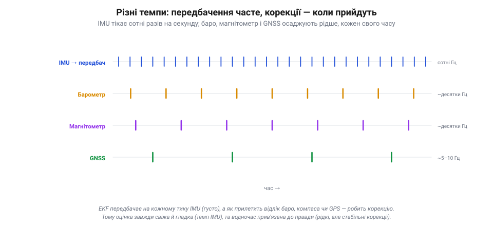

# Поєднання у польоті: IMU + баро + GNSS + магнітометр

[Фільтр Калмана](book:algorithms/kalman-ekf) з його циклом «передбач → виправ» і хмарою-коваріацією — це механізм. Подивімося на нього **в роботі**: як саме на дроні чотири давачі (гіроскоп з акселерометром, барометр, GNSS і магнітометр) поєднуються в одну оцінку стану. Тут абстракція стає конкретикою: видно, **хто** з давачів що робить і чому всі вони потрібні.

### Розподіл праці: хто веде, хто осаджує

Перше, що треба вкласти в голову: давачі **не рівноправні** у поєднанні. Один із них — **IMU** — особливий: він веде [передбачення](book:algorithms/motion-model). Гіроскоп і акселерометр швидкі (сотні разів на секунду), тож саме вони щомиті штовхають оцінку вперед — це кістяк, основа. Решта давачів — баро, GNSS, магнітометр — приходять рідше й роблять [корекцію](book:algorithms/predict-vs-measure): кожен осаджує дрейф IMU у **своїй** частині стану.

*Рис. Поділ праці в поєднанні. IMU (гіро + акселерометр) швидкий, тож веде **передбачення** всього стану — це кістяк. Повільніші магнітометр, барометр і GNSS роблять **корекцію**, кожен осаджуючи дрейф IMU у своїй частині: компас — курс, баро — висоту, GNSS — положення і швидкість. Швидка дрейфлива основа плюс рідкі стабільні «якорі».*

Чому так? Бо IMU **самодостатній і швидкий**, але дрейфливий; а кожен із інших **повільний, зате стабільний** у своєму. Тож природний поділ: IMU несе оцінку між корекціями, а зовнішні давачі раз у раз «прив'язують» її до правди. Це те саме [поєднання «швидке + стабільне»](book:algorithms/sensor-insufficiency), тільки тепер розписане по конкретних приладах.

### Хто що утримує

Тепер найважливіше для розуміння — **яку частину стану утримує який давач**. Кожну величину хтось **передбачає** (завжди IMU) і хтось **прив'язує** (свій коректор).

*Рис. Хто яку величину утримує. Кожну штовхає вперед IMU (передбачення), а прив'язує до правди свій коректор: нахил — акселерометр (гравітація), курс — магнітометр, висоту — барометр (+GNSS), горизонтальне положення — GNSS. Два вузькі місця: курс тримає **лише** компас, позицію — **лише** GPS; відпаде — замінити нема ким.*

- **Крен і тангаж** (нахил): гіроскоп передбачає, **акселерометр** прив'язує — бо в спокої він [«бачить» вектор гравітації](book:electronics/imu-barometer), тобто де низ. Так оцінка нахилу не дрейфує.
- **Курс** (yaw, поворот навколо вертикалі): гіроскоп передбачає, а прив'язує найчастіше **магнітометр** (він бачить, де північ). Та він не єдиний: сучасний ArduPilot уміє брати курс і з **двоантенного GPS** (*moving baseline*), із зовнішньої навігації (*ExternalNav*), ба навіть оцінювати його з рухів за GPS (фільтр **GSF**) — тож компас тут хоч і головний, але **замінний**.
- **Висота**: акселерометр передбачає (подвійний інтеграл), **барометр** прив'язує (швидкий вертикальний орієнтир), а GNSS додає грубу абсолютну прив'язку.
- **Горизонтальне положення й швидкість**: акселерометр передбачає, а прив'язує зазвичай **GNSS** — найдоступніше джерело абсолютних координат. (Але не єдине: у приміщенні чи без супутників позицію дають **оптичний потік**, зовнішня навігація (*ExternalNav*, камери типу T265), радіомаяки чи системи на кшталт Vicon.)

Зверни увагу на два типові **вузькі місця**: у звичайному наборі (IMU + GNSS + баро + компас) курс тримає **компас**, а горизонтальну позицію — **GPS**. Інші джерела (GPS-курс, оптичний потік, зовнішня навігація, маяки) існують, та коли їх нема — саме ці дві прив'язки стають найслабшою ланкою, бо замінити їх нема ким.

> 🔧 **Навіщо це.** Звідси читаються типові негаразди. «Поплив» курс, апарат повертає кудись не туди в авто-режимах — підозрюй **магнітометр** (близько мотор, струм, залізо), бо курс більше нема кому виправити. «Попливла» позиція, дрон дрейфує в режимі утримання — це **GPS** (погане небо). А хитається нахил у спокої — дивись **акселерометр** і вібрації. Знаючи, хто що прив'язує, ти зразу знаєш, де копати.

### Різні темпи, один потік

Усі ці давачі ще й **різношвидкісні**, і фільтр спокійно це переварює.

*Рис. Різні темпи, один потік. IMU тікає сотні разів на секунду — і на кожному тику фільтр передбачає. Барометр і магнітометр корегують десятки разів на секунду, GNSS — лише кілька (5–10 Гц). Корекцію вставляють тоді, коли прилетів відлік. Тому оцінка свіжа й гладка (темп IMU) і водночас прив'язана до правди (рідкі стабільні корекції).*

IMU тікає сотні разів на секунду — і на **кожному** його тику фільтр робить передбачення. А корекції прилітають **коли прийдуть**: барометр і магнітометр — десятки разів на секунду, GNSS — лише кілька (5–10 Гц). Щойно прилетів відлік будь-якого давача, фільтр вставляє корекцію саме за ним, для його частини стану. Тому оцінка завжди **свіжа й гладка** (у темпі IMU) і водночас **прив'язана до правди** (рідкими, зате стабільними корекціями). Жодної потреби, щоб давачі йшли в ногу: кожен зважується тоді, коли має що сказати.

### Коли давач відпав: плавна деградація

І ось де поділ праці показує всю свою красу — у відмові. Що буде, якщо один давач замовкне?

*Рис. Плавна деградація. Поки все працює, кожна частина стану прив'язана (ліворуч, зелене). Зник GPS — і лише **горизонтальне положення** втрачає прив'язку й дрейфує на IMU (праворуч, червоне); нахил, курс і висота тримаються своїми корекціями. Апарат не «сліпо падає», а **керовано реагує** (у ручному режимі летить далі; у GPS-залежних автономних — EKF-failsafe зазвичай саджає) — деградація сходинкою, не обвалом.*

Уяви, що **GPS пропав** (заїхали під міст, погане небо, глушилка). Що станеться? Горизонтальне положення втратить єдину свою прив'язку й почне **дрейфувати** на самому IMU — його хмара поповзе ширшати. Але **нахил, курс і висота — цілі**: їх тримають акселерометр, компас і баро, яким до GPS байдуже. Що буде далі — залежить від режиму. У **ручному** режимі (де позиція й не потрібна) апарат летить собі далі, лише втративши утримання точки. А от у **автономних, GPS-залежних** режимах (Loiter, Auto, RTL…) контролер це помічає (хмара тієї частини стану росте) і вмикає **EKF-failsafe** — типово **переходить на посадку** (саме щоб погана оцінка не спричинила «втечу»/flyaway). Тобто апарат не «сліпо падає», а **керовано реагує**. Це й є [деградація сходинкою](book:programming/redundancy), а не обвалом: відмова однієї прив'язки забирає одну здатність, а не весь політ.

Так само з рештою: збився компас — попливе курс, а позиція й висота тримаються; завадив баро потік від гвинтів — засмикається висота, а решта ціла. У доброму разі фільтр втрачає приблизно стільки, скільки забрав відмовлений давач, — бо кожну частину стану стереже свій коректор. Але це не гарантія: давач, що **бреше правдоподібно** (повільний відхід компаса, «глітч» GPS), може на якийсь час потягти за собою й оцінку — аж поки його не зловить «брама» чи EKF-failsafe. Тому здоров'я оцінювача моніторять окремо.

> 📜 Що апарат можна вести, **довіряючи самим приладам**, людство вперше довело 1929 року. 24 вересня лейтенант **Джиммі Дуліттл** (*Jimmy Doolittle*) піднявся в небо над аеродромом Мітчел-Філд із **накритою ковпаком** кабіною — нічого не бачачи назовні — і виконав перший в історії повністю «сліпий» зліт, політ і посадку лише за приладами. Серцем були щойно винайдені **гіроскопічний авіагоризонт** і **курсовий гіроскоп** Сперрі (плюс точний висотомір Кольсмана): авіагоризонт показував крен і тангаж, курсовий гіроскоп — напрям. Це той самий набір величин — нахил, курс, висота, — що його сьогодні зводить EKF дрона з копійчаних MEMS. Дуліттл довів принцип; фільтр Калмана через тридцять років зробив його дешевим, точним і автоматичним.

### Підсумок теми

Поєднання в польоті — це поділ праці між давачами. **IMU** (швидкий, та дрейфливий) веде передбачення всього стану, а повільні, зате стабільні **коректори** осаджують його дрейф, кожен у своїй частині: акселерометр тримає **нахил**, магнітометр — **курс**, барометр — **висоту**, GNSS — **горизонтальне положення**. Фільтр передбачає на кожному тику IMU й вставляє корекцію щоразу, коли прилітає відлік будь-якого давача, хоч які різні їхні темпи. А коли давач відпадає, поєднання **деградує плавно**: губиться лише та частина стану, яку він прив'язував, а решта тримається — звідси й автоматична зміна режиму при втраті GPS. Лишається одне велике застереження: уся ця злагода тримається на тому, що кожен відлік приходить **вчасно й коректно позначений у часі** — а [затримки й неузгодженість у часі](book:algorithms/latency-sync) здатні непомітно зіпсувати навіть бездоганний за рештою фільтр.

---
