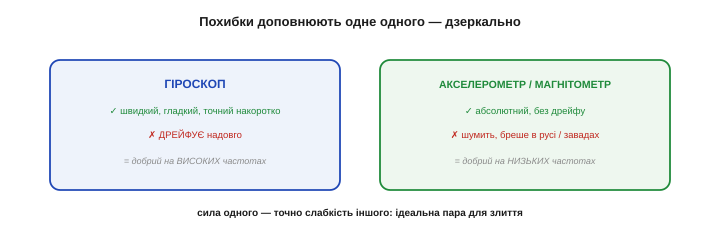
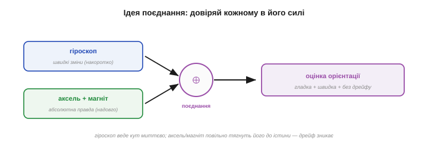
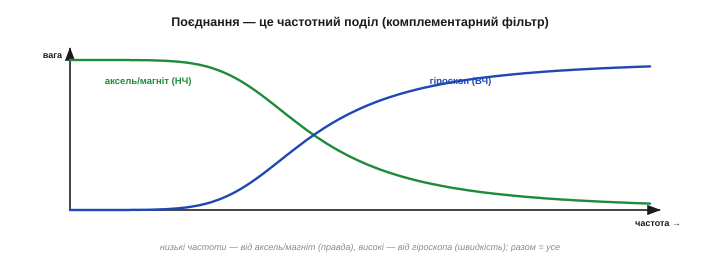
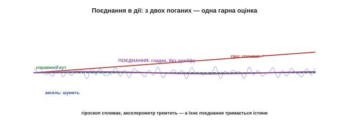
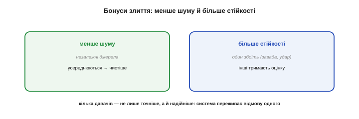

# Чому потрібен фьюжн

Є висновок, що збирає всю інженерію інерціальних давачів докупи: **жоден** давач IMU сам по собі не дає надійної орієнтації. Акселерометр шумить і плутає рух із гравітацією, гіроскоп невпинно дрейфує, магнітометр піддається завадам. Та є рятівна обставина: їхні вади **дзеркальні**, тож, **поєднавши** давачі, можна дістати оцінку, кращу за будь-який із них окремо. Це й зветься **фьюжном** (сенсорним злиттям). Ця тема — про те, **чому** він необхідний і **як** давачі доповнюють одне одного.

Варто одразу сказати ширше: **фьюжн** — не вузький прийом для IMU, а одна з найважливіших ідей усієї інженерії давачів. Будь-де, де є кілька недосконалих джерел тієї самої величини, їх вигідно **поєднати**, щоб дістати краще за кожне окремо: GPS зливають з IMU (супутник дає абсолютну позицію рідко й грубо, IMU — швидко й гладко між оновленнями), камеру з IMU (візуальна одометрія), кілька термометрів чи мікрофонів. Опанувавши фьюжн тут, на IMU, ви матимете рамку, що працює всюди.

Уся будова інерціальних давачів — як вони влаштовані, що міряють, чому помиляються — зрештою веде саме сюди: до розуміння, що **поодинці вони безпорадні, а разом потужні**. Фьюжн — не додаткова опція, а спосіб узагалі зробити дешеві [MEMS](book:electronics/mems) придатними для серйозної орієнтації. Без нього три копійчані чипи лишилися б трьома джерелами сміття; з ним стають надійним органом чуття.

### Похибки доповнюють одне одного

На одній властивості стоїть усе. [Гіроскоп](book:electronics/gyroscope) **швидкий, гладкий і точний накоротко**, але **дрейфує** надовго. [Акселерометр](book:electronics/accelerometer) і [магнітометр](book:electronics/magnetometer) — навпаки: **абсолютні й бездрейфові** (гравітація й поле Землі — вічні орієнтири), але **шумлять** і брешуть під час руху чи завад. Сила одного — точно слабкість іншого.


*Рис. Ідеальна пара антиподів. **Гіроскоп**: швидкий, гладкий, точний накоротко — але дрейфує (добрий на **високих** частотах). **Акселерометр/магнітометр**: абсолютні, без дрейфу — але шумні й чутливі до руху/завад (добрі на **низьких** частотах). Сила одного — слабкість іншого, тож разом вони покривають усі режими. Саме ця дзеркальність і робить злиття можливим.*

Ця дзеркальність — не випадковість, а **подарунок**: якби обидва давачі мали **однакові** вади, поєднання нічого б не дало. А оскільки вади **протилежні**, то там, де один сліпне, другий бачить — і навпаки.

Кожен абсолютний орієнтир лікує **свою** грань дрейфу. Акселерометр прибиває дрейф **нахилу** (крен і тангаж), бо знає «низ». Та про **курс** (yaw) гравітація мовчить — вектор сили тяжіння вертикальний і не змінюється від повороту навколо вертикалі, тож дрейф yaw акселерометр **не** виправить. Його закриває **магнітометр**, що знає «північ». Тому повний фьюжн потребує **всіх трьох**: гіроскоп веде динаміку, акселерометр тримає нахил, магнітометр — курс. Прибери магнітометр — і yaw поволі попливе, навіть якщо крен і тангаж тримаються міцно.

Видно, навіщо так ретельно розкладати [похибки кожного давача](book:electronics/imu-noise-bias-drift): не задля каталогу вад, а щоб виявити саме цю **дзеркальність**. Бо весь фьюжн стоїть на ній: якби давачі помилялися однаково, складати їх не було б сенсу. Розуміння **протилежності** їхніх вад — і є та підстава, на якій будується злиття.

### Ідея фьюжну: довіряй кожному в його силі

Звідси й сама ідея злиття, проста й елегантна: **довіряй кожному давачу там, де він сильний**. Швидкі, миттєві зміни орієнтації бери від **гіроскопа** (він тут точний і гладкий), а повільну, **абсолютну** правду — від акселерометра й магнітометра (вони знають справжні «низ» і «північ»). Тоді гіроскоп веде кут миттєво й гладко, а акселерометр з магнітометром раз у раз **підправляють** його, не даючи дрейфу спливти.


*Рис. Як зливають. Швидкі зміни беруть від гіроскопа (точний накоротко), абсолютну прив'язку — від акселерометра й магнітометра (правда надовго). Злиття (⊕) видає оцінку орієнтації, що поєднує **гладкість і швидкість** гіроскопа з **бездрейфовою істиною** акселерометра. Кожному давачу довіряють рівно в тому, у чому він сильний.*

Результат — оцінка орієнтації, що **гладка й швидка** (як гіроскоп) **і водночас не дрейфує** (як акселерометр). Жоден давач окремо такого не дає; дає лише їхнє поєднання — і це, по суті, саме визначення сенсорного злиття: ціле, що перевершує кожну зі своїх частин окремо.

Тонкість у тому, **наскільки** довіряти кожному, і добрий фьюжн робить це **за обставинами**. Коли апарат нерухомий, акселерометру можна вірити більше (його показ — чиста гравітація); коли він трясеться чи рвучко прискорюється, довіру до акселерометра **знижують** (бо в ньому тепер багато руху) і більше покладаються на гіроскоп. Просте злиття бере сталі ваги, розумніше — підлаштовує їх під ситуацію. Але навіть найпростіша стала вага вже творить диво проти самотнього давача.

### Це частотний поділ

А тепер — найкрасивіше. Поділ цього «довіряй кожному в його силі» — це насправді **поділ за частотою**, той самий, яким [спектр сигналу](book:math/spectrum) розкладають на [фільтрах](book:algorithms/filter-as-spectrum-shaper). Дрейф гіроскопа — повільний, тобто **низькочастотний**; його шум і затримка — на високих частотах він якраз гарний. Шум акселерометра — швидкий, **високочастотний**; на низьких він якраз правдивий (стала гравітація).


*Рис. Злиття як комплементарний фільтр. Низькі частоти (повільна правда) беруть від акселерометра/магнітометра — наче крізь **низькочастотний** фільтр. Високі (швидка динаміка) — від гіроскопа, наче крізь **високочастотний**. Дві ваги в сумі дають одиницю на всіх частотах, тож разом давачі покривають увесь діапазон без дірок. Це і є [комплементарний фільтр](book:algorithms/complementary-filter) — пряме застосування фільтрації до пари давачів.*

Тож фьюжн у найпростішому вигляді — це **комплементарний фільтр**: пропусти гіроскоп крізь **високочастотний** фільтр (узяти лише швидке, відкинути дрейф), акселерометр — крізь **низькочастотний** (узяти лише повільну правду, відкинути шум), і **склади**. Дві ваги в сумі дають одиницю, тож разом вони покривають **усі** частоти. Саме тому фільтри так важливі: вони — мова, якою описують злиття.

Одне число керує цим поділом — **коефіцієнт довіри** (у комплементарному фільтрі його ховає та сама α, що в [експоненційному згладжуванні](book:algorithms/ema)). Він задає **частоту переходу** між «вірити гіроскопу» й «вірити акселерометру»: вище за неї панує гіроскоп, нижче — акселерометр. Зрушиш межу вище — фільтр швидший і гладкіший, але повільніше виправляє дрейф; нижче — навпаки. Це той самий [компроміс свіжості проти стабільності](book:algorithms/smoothing-vs-lag), тепер у налаштуванні злиття.

І найприємніше — це **копійчано**: комплементарний фільтр коштує рівно стільки ж, скільки [експоненційне згладжування](book:algorithms/ema), бо це воно і є, тільки застосоване до двох входів. Тож надійна орієнтація дається не дорогим давачем чи важким алгоритмом, а розумним злиттям дешевих — кілька множень на крок.

Чому злиття не спотворює самого сигналу? Бо ваги двох гілок у сумі дають **рівно одиницю** на кожній частоті: що низькочастотний фільтр пропустив, високочастотний доповнив, і навпаки. Тож **справжня** орієнтація проходить крізь злиття **незмінною** — фільтри ділять між собою лише похибки (дрейф іде в один бік, шум — в інший), а корисний сигнал лишається цілим. У цьому й елегантність комплементарної пари: вона прибирає вади, не чіпаючи правди.

### Фьюжн у дії

Подивімося, що це дає в часі. Поодинці гіроскоп повільно спливає геть від істини, акселерометр тремтить навколо неї — обидва погані. А їхнє злиття **тримається правди**: гладко, як гіроскоп, і без дрейфу, як акселерометр.


*Рис. Злиття на ділі. Гіроскоп (червоне) гладкий, та невпинно **спливає**. Акселерометр (блакитне) тримається середнього, та сильно **тремтить**. А фьюжн (фіолетове) поєднує найкраще: він і гладкий (як гіроскоп), і прив'язаний до істини (як акселерометр). Дві недосконалі оцінки дають одну, кращу за обидві, — у цьому вся суть.*

**Приклад (найпростіший фьюжн кута).** Комплементарний фільтр в одному рядку:

```
кут ← 0.98 · (кут + гіро·Δt)  +  0.02 · кут_з_акселерометра
      └─ 98% гіроскопу: гладко й швидко ─┘   └─ 2% акселерометру ─┘
що відбувається: гіроскоп веде кут миттєво (інтегрує швидкість),
а ті 2% акселерометра щокроку трохи тягнуть оцінку до справжнього «низу»
→ гладкий, швидкий І бездрейфовий кут із двох недосконалих давачів
```

Магія в тих 2%: вони замалі, щоб впустити шум акселерометра, але достатні, щоб за багато кроків **не дати** дрейфу гіроскопа накопичитись. Гіроскоп дає 98% гладкості, акселерометр — 2% правди, і разом виходить майже ідеальний кут одним множенням-додаванням на крок.

Комплементарний фільтр — найпростіший фьюжн; є й розумніший — [фільтр Калмана](book:algorithms/kalman-filter). Він робить те саме поєднання «швидкого, але дрейфливого» з «повільним, але правдивим», та підбирає ваги **оптимально**, виходячи з відомих рівнів шуму кожного давача, ще й веде оцінку власної **невпевненості**. За це платять складністю; для багатьох же задач простого комплементарного фільтра цілком досить. Та обидва — про одне: розумно зважити недосконалі покази в одну добру оцінку.

За всім цим стоїть глибока ідея **оцінювання**: правду здобувають не з одного ідеального виміру (його не буває), а **зважено поєднуючи** багато недосконалих. Кожен вимір — голос зі своєю довірою; мудрий висновок зважує голоси за їхньою надійністю. Фьюжн давачів — окремий випадок цього способу думати, що пронизує всю науку про вимірювання: не шукай досконалого приладу, а розумно склади недосконалі.

### Бонуси: надмірність і стійкість

Окрім головного — приборкання дрейфу, — злиття дарує ще два бонуси. По-перше, **менше шуму**: кілька **незалежних** джерел тієї самої величини, усереднені, дають чистіший результат (та сама [√N-перевага усереднення](book:algorithms/moving-average)). По-друге, **стійкість**: якщо один давач тимчасово збоїть (магнітометр потрапив у заваду, акселерометр — у різкий удар), інші **підхоплять** оцінку, і система не «осліпне».

Це не теорія: на цьому стоїть безпека реальних апаратів. Дрон, чий магнітометр на мить «осліп» біля лінії електропередач, утримує курс гіроскопом, поки завада не мине. Окуляри доповненої реальності, чий акселерометр смикнувся від удару, ведуть голову гіроскопом ту частку секунди. Скрізь надмірність давачів рятує систему від поодинокого збою — і це окрема, безцінна причина зливати, навіть якби точності одного давача й вистачало.

А зменшення шуму від незалежних джерел — це окремий, давно відомий ефект «**мудрості натовпу**»: усереднення багатьох незалежних оцінок тієї самої величини дає точніший результат, ніж кожна окремо, бо їхні випадкові помилки частково гасять одна одну. Те, що дає [усереднення одного сигналу](book:algorithms/moving-average), тут працює **через** давачі: кілька незалежних поглядів на ту саму орієнтацію, зважені разом, дають чистішу оцінку, ніж будь-який один.

Підсумок-несподіванка: усе це — точність, гладкість, бездрейфовість, стійкість — дається **майже задарма**. Жодного дорогого давача, жодного важкого обчислення: три копійчані чипи в одному корпусі плюс кілька множень-додавань злиття на крок. Інженерна мудрість тут не в грошах, а в **ідеї** поєднати недосконале розумно. Це, можливо, найкращий урок усього модуля: добрий результат частіше здобувають головою, ніж гаманцем.


*Рис. Два бонуси злиття. **Менше шуму**: незалежні джерела, усереднені, дають чистіший результат. **Більше стійкості**: якщо один давач збоїть (удар, магнітна завада), інші тримають оцінку, і система переживає відмову. Тому кілька давачів — це не лише точніше, а й **надійніше**, ніж один.*

> 🔧 **Навіщо це.** Залізне правило роботи з IMU: **ніколи не покладайтеся на один давач** для орієнтації — завжди зливайте. Голий гіроскоп спливе, голий акселерометр затремтить і збреше в русі, голий магнітометр обдурить завада. Лише їхнє поєднання дає кут, якому можна вірити і миттєво, і годинами. Якщо ваша орієнтація «їде» чи «стрибає» — найімовірніше, ви довіряєте одному давачу там, де потрібен фьюжн.

### Що дає фьюжн: ланцюг від давачів до орієнтації

Із трьох недосконалих, копійчаних давачів фьюжн робить оцінку орієнтації, що **швидка, бездрейфова й стійка** одночасно — жодної з цих рис ні гіроскоп, ні акселерометр, ні магнітометр сам по собі не дає. Ціле виходить **більше за суму частин**. Саме заради цього [IMU](book:electronics/mems) й зводить три давачі в один корпус: не щоб мати три окремі прилади, а щоб **злити** їх в одне надійне чуття орієнтації.

Систему, що зводить інерціальні давачі в орієнтацію, інженери звуть **AHRS** (*Attitude and Heading Reference System*) — «система відліку положення й курсу». Вона — серце кожного апарата, що мусить знати, як він повернений: дрона (щоб триматися в повітрі), робота (щоб балансувати), окулярів VR (щоб стежити за головою), стабілізатора камери (щоб гасити тремтіння). Усюди один і той самий ланцюг: сирі давачі → фьюжн → орієнтація → дія.

Фьюжн — ланка, що з'єднує «відчути» з «діяти». Зліва від нього — сирі покази інерціальних давачів; справа — орієнтація апарата в просторі й керування, що цю орієнтацію утримує. Сам по собі фьюжн перетворює потік чисел на знання про положення тіла, з якого далі народжується дія.


*Рис. Куди це веде. Три давачі IMU → **фьюжн** (AHRS) → оцінка орієнтації (кути чи кватерніон) → **ПІД-керування**, що цю орієнтацію утримує. Орієнтація — місток між «відчути» і «втримати».*

> 🔧 **Навіщо це.** Перед злиттям не забудьте **підготувати** кожен давач: [відкалібрувати зсуви](book:electronics/calibration), прибрати [hard/soft-iron магнітометра](book:electronics/magnetometer), за потреби легко [відфільтрувати шум](book:algorithms/choosing-a-filter). Фьюжн — не чарівна паличка, що виправить будь-яке сміття: він зливає **підготовлені** покази, а не сирі. Гарне злиття починається з гарних входів.

> 🔧 **Навіщо це.** Готові IMU й бібліотеки часто вже **роблять фьюжн за вас** (вбудований DMP у MPU-серії, бібліотеки Madgwick/Mahony віддають готову орієнтацію). Тому, перш ніж писати злиття вручну, погляньте, чи не дає ваш чип чи бібліотека вже готовий кут — це заощадить багато роботи. А розуміти, **що** там усередині (той-таки [комплементарний фільтр](book:algorithms/complementary-filter)), усе одно варто, щоб довіряти результату осмислено.

Отже, картина цілісна: ми знаємо, **як** влаштовані [інерціальні давачі](book:electronics/mems) (крихітні машини в кремнії), **що** кожен міряє (прискорення, обертання, поле), **чому** кожен недосконалий (шум, зсув, дрейф) — і **чому** їх рятує лише поєднання. За фьюжном лишається ще один крок: перетворити три потоки чисел на **орієнтацію** в просторі й навчити апарат цю орієнтацію **утримувати**. Це вже задача алгоритмів злиття ([комплементарного фільтра](book:algorithms/complementary-filter) і [Калмана](book:algorithms/kalman-filter)) та [керування зі зворотним зв'язком](book:algorithms/discrete-pid): кілька простих формул, що спираються на цю саму математику давачів і фільтрів, навчають апарат **сам тримати рівновагу** — і абстрактні фільтри й давачі обертаються на живий, стабільний політ чи балансування.
