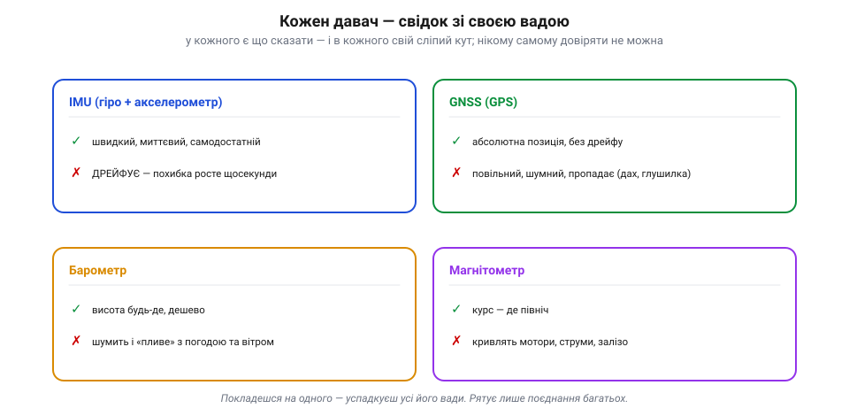
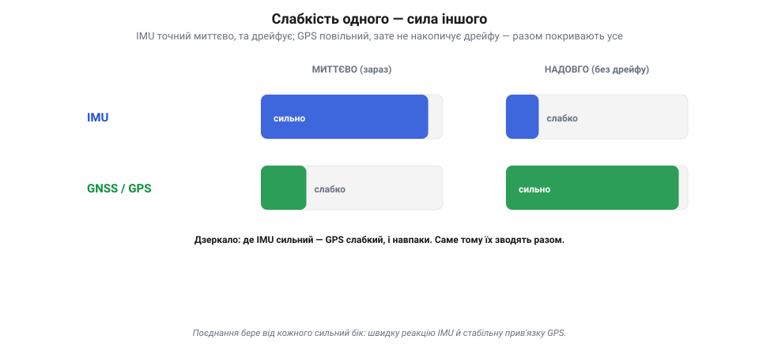
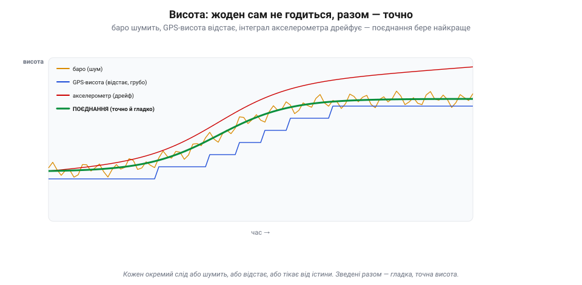
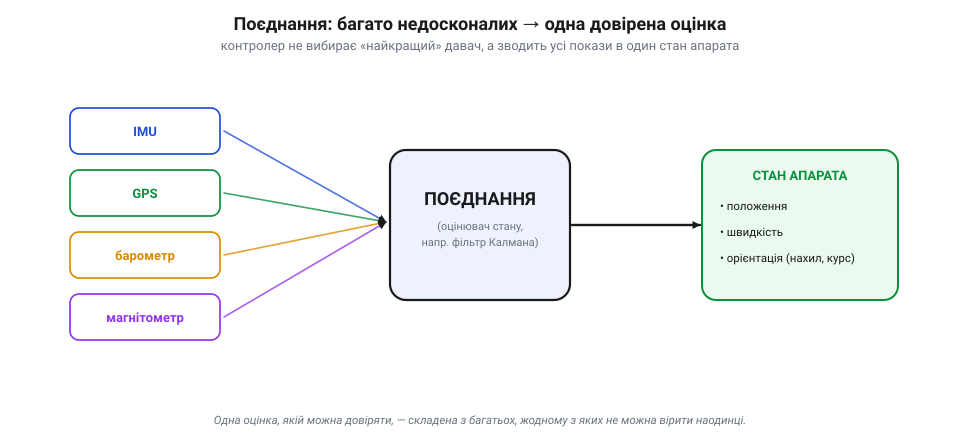

# Чому жоден давач не достатній сам

### Кожен давач — свідок зі своєю вадою

Уяви, що збираєш свідчення про подію від кількох очевидців. Один бачив зблизька, але лише мить; другий — здалеку й невиразно, зате весь час; третій точний, та інколи зовсім замовкає. Жодному не можна вірити **наосліп** — у кожного свій сліпий кут. Давачі апарата — рівно такі свідки: кожен каже щось правдиве про рух, і кожен у чомусь систематично хибить.

*Рис. «Галерея свідків» апарата. У кожного давача є сильний бік (✓) і вроджена вада (✗): IMU швидкий, але дрейфує; GNSS абсолютний, та повільний і зникний; барометр усюдисущий, та шумний і чутливий до погоди; магнітометр єдиний знає курс, але його кривлять мотори й залізо. Бездоганного свідка немає — отож і не можна вірити жодному наодинці.*

Пройдімося по «свідках» нашого апарата:
- **[IMU](book:electronics/imu-barometer)** (гіроскоп + акселерометр) — швидкий і самодостатній, відповідає **миттєво** й на будь-який рух. Але його оцінка **дрейфує**: похибки інтегруються, і за секунди-хвилини вона «попливе».
- **[GNSS](book:communications/gnss) (GPS)** — дає **абсолютну** позицію на Землі й, на відміну від інерції, **не накопичує інтеграційного дрейфу**. Зате **повільний** (оновлюється кілька разів на секунду), **шумний** (метри розкиду), запізнюється, має власні похибки (геометрія супутників, перевідбиття-*multipath*, атмосфера, глушіння — від них позиція може повільно «повзти» чи стрибнути) й узагалі **пропадає** під дахом, у каньйоні вулиць чи під глушилкою.
- **Барометр** — міряє висоту за тиском **будь-де** й дешево. Та його показ **шумить** і «пливе» зі зміною погоди, а потік від гвинтів і вітер збивають тиск біля апарата.
- **Магнітометр** — каже **курс** (де північ), якого не знає більше ніхто. Але магнітне поле Землі слабке, і його легко **кривлять** струми моторів, залізо та електроніка самого апарата.

Бачиш закономірність: **бездоганного свідка немає**. У кожного давача є те, що він уміє добре, і те, у чому він безнадійний. Покладешся на одного — успадкуєш усі його вади разом із чеснотами.

> 🔧 **Навіщо це.** Коли апарат поводиться дивно — стрибає висота, «пливе» позиція, хитається курс, — не питай «який давач зламався», а думай «**якому давачеві тут не можна вірити**». Висота скаче — підозрюй баро (вітер, гвинти); курс крутить — магнітометр (близько мотор чи залізо); позиція гуляє — GPS (погана видимість неба). Знання слабких місць кожного давача — половина діагностики.

### Слабкість одного — сила іншого

Якби вади давачів збігалися, поєднання було б безсиле: десять однаково сліпих свідків не бачать краще за одного. Та нам пощастило — їхні сильні й слабкі сторони **доповнюються**. Найяскравіша пара — IMU і GPS.

*Рис. Чому поєднання працює: вади доповнюються. IMU сильний «миттєво» (добре ловить кожен порух тут і зараз), але слабкий «надовго» (дрейфує). GNSS — дзеркальне відображення: шумний на коротку мить, зате стабільний надовго (не накопичує інтеграційного дрейфу). Склади їх — і кожен затуляє діру іншого: IMU дає гладку миттєву реакцію, GPS осаджує дрейф назад до істини.*

IMU **добрий миттєво**: між поштовхами він чітко ловить рух на коротку мить — але **дрейфує надовго** (заважають зсув-*bias*, температурний дрейф, вібрації, насичення). GPS — дзеркало: **неточний на коротку мить** (повільний, шумний, із власними похибками), зате **стабільний надовго** (не накопичує інтеграційного дрейфу). Склади їх — і одне затуляє слабкість іншого: IMU дає **гладку, миттєву** реакцію між рідкими відліками GPS, а GPS раз у раз **осаджує** інерціальний дрейф назад до правди. Разом вони покривають і коротку, і довгу дистанцію, чого жоден не вміє сам.

Те саме з рештою: барометр дає миттєву висоту між повільними відліками GPS-висоти; магнітометр дає абсолютний курс, який утримує гіроскоп між його замірами. Скрізь та сама логіка — **взаємодоповнення похибок**: швидке плюс стабільне, відносне плюс абсолютне, тихе плюс певне.

> 📜 Це не винахід електроніки — так навігували століттями. Моряки вели **числення шляху** (*dead reckoning*): за курсом і швидкістю рахували, де корабель, — швидко, та з похибкою, що росла з кожною годиною. І періодично «осаджували» її **астрономічним визначенням** за сонцем чи зорями — точним, але рідкісним і можливим лише в ясну погоду. Швидке-та-дрейфливе числення плюс повільний-та-абсолютний астрономічний фікс — це те саме поєднання IMU+GPS, лише за двісті років до нього. Інженери не вигадали ідею, а дали їй математику.

> 🔧 **Навіщо це.** Добираючи давачі, дивись не на «найкращий», а на **взаємодоповнення**: пара «швидкий, але дрейфливий» + «повільний, зате стабільний» сильніша за два однакових. Саме тому в кожному польотному контролері навмисне стоять і IMU, і баро, і компас, і приймач GNSS — не для дублювання, а щоб затуляти діри одне одного.

### Приклад на висоті: жоден сам, разом — точно

Зведімо все на одному конкретному числі — **висоті**, бо її апарат міряє аж трьома способами, і кожен по-своєму поганий.

*Рис. Висота трьома поганими способами — і одним добрим. Барометр (бурштиновий) тремтить від шуму; GPS-висота (синя) йде грубими сходинками й відстає; подвійний інтеграл акселерометра (червоний) гладкий, але дрейфує геть. Зведена оцінка (товста зелена) бере від кожного найкраще: гладкість акселерометра, прив'язку баро й GPS — і виходить точною та спокійною. Ціле краще за будь-яку частину.*

**Барометр** дає висоту щомиті, але його слід **тремтить** від шуму й поривів. **GPS-висота** не накопичує дрейфу, проте йде **грубими сходинками**, відстає, шумить і по вертикалі взагалі неточна. **Подвійний інтеграл акселерометра** ідеально гладкий на коротку мить, але **тікає** від істини — дрейфує. Кожен слід окремо — або шумить, або відстає, або пливе; жодному не можна довірити висоту самому.

А тепер поглянь на **зведену** оцінку (товста зелена): вона гладка, як інтеграл акселерометра, **не тремтить**, як баро, і **не дрейфує**, бо її прив'язують GPS і барометр. Поєднання взяло від кожного давача його сильний бік і відкинуло слабкий. Оце і є сенс усього розділу в одній картинці: **ціле виходить кращим за будь-яку зі своїх частин**.

### Від багатьох недосконалих — до одного стану

Зберімо ідею докупи. Польотний контролер не сидить і не вибирає «найкращий давач на цю мить». Він робить інше: **безперервно поєднує** покази геть усіх давачів в одну-єдину, найкращу можливу оцінку — **стан апарата**.

*Рис. Суть розділу однією схемою. Контролер не вибирає «найкращий» давач, а зводить покази всіх — IMU, GPS, барометра, магнітометра — поєднанням (оцінювачем на кшталт фільтра Калмана) в одну довірену **оцінку стану**: положення, швидкість, орієнтація. Саме цим станом, а не сирими давачами, живе все керування апарата.*

«Стан» — це повний набір чисел, що описує апарат **тут і зараз**: де він (положення), куди й як швидко рухається (швидкість), як обернутий у просторі (орієнтація — нахил і курс). Саме цей стан потрібен [керуванню](book:programming/flight-controller), щоб тримати апарат рівно, летіти в точку й вертатися додому. І дає його не якийсь один прилад, а **оцінювач** — алгоритм, що раз по раз поєднує всі давачі, зважуючи кожен за його надійністю. Найвідоміший такий оцінювач — [фільтр Калмана](book:algorithms/kalman-ekf).

Тобто питання «який давач найкращий?» — хибне від початку. Правильне питання — «**як найкраще їх поєднати?**». Відповідь на нього будується у два кроки: спершу [передбачити рух моделлю](book:algorithms/motion-model), тоді [зважити це передбачення проти свіжого виміру](book:algorithms/predict-vs-measure) — і саме цей цикл «передбач і виправ» лежить в основі будь-якого оцінювача стану.

> 🔧 **Навіщо це.** Запам'ятай головну установку розділу: апарат живе не «показами давачів», а **оцінкою стану**, складеною з них. Тому й у логах дивись не лише на сирий давач, а на оцінку (*estimate*) — і на те, як поєднання вирішило суперечку між давачами. Коли оцінка стану хибна, апарат робить дурниці, хоч би якими справними були окремі давачі.

### Підсумок теми

Жоден давач не достатній сам, бо в кожного свій сліпий кут: IMU швидкий, та дрейфує; GPS абсолютний, та повільний і зникний; баро всюдисуще, та шумне; компас єдиний знає курс, та його кривлять. Рятує те, що їхні вади **доповнюються**: швидке стуляють зі стабільним, відносне з абсолютним — і ціле виходить кращим за будь-яку частину, як добре видно на прикладі висоти. Тому апарат не вибирає давач, а **зводить** усі в одну довірену **оцінку стану** — положення, швидкість, орієнтацію. Як саме звести — і є наука поєднання; перший її крок — навчитися [передбачати рух наперед](book:algorithms/motion-model), аби було з чим порівнювати виміри.

---
