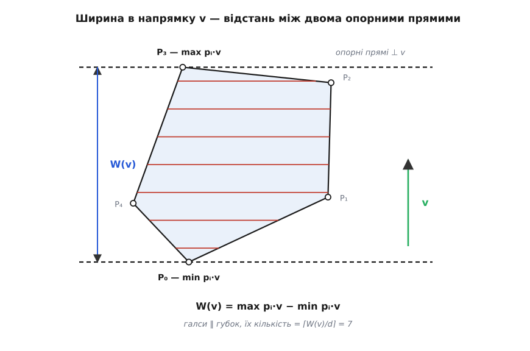
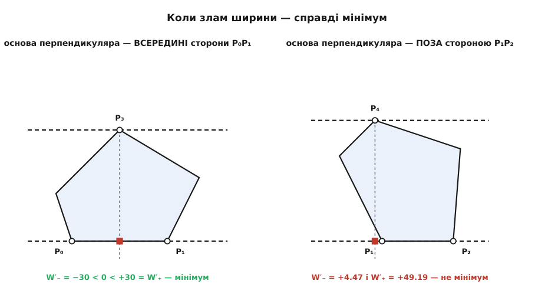
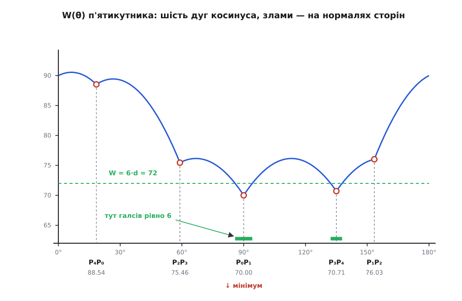

# 🧮 Ширина многокутника й напрямок галсів

Напрямків на площині нескінченно багато, а перевірити треба скінченну кількість — і саме це тут доводиться. Виписавши функцію ширини через опорні вершини, ми побачимо, що між зламами вона є дугою косинуса без внутрішнього мінімуму; звідси мінімум завжди сидить на зламі, а злам — це положення, коли опорна пряма лягла на цілу сторону. Далі — точний критерій, який зі зламів справді мінімум, алгоритм обертових губок за `O(n)` і повний числовий розрахунок на п'ятикутнику.

## Ширина як функція напрямку

Нехай опуклий многокутник заданий вершинами p₀, p₁, …, pₙ₋₁, а напрямок — одиничним вектором

```
v(θ) = (cos θ, sin θ)
```

Уся конструкція тримається на одній операції: [скалярний добуток](book:math/dot-product) pᵢ·v дорівнює довжині проєкції вектора pᵢ на напрямок v, узятій зі знаком — додатній, коли pᵢ дивиться в бік v. Прокотімо через цю проєкцію всі вершини й візьмімо крайні:

```
h(θ) = max pᵢ·v(θ)                     — опорна функція
W(θ) = max pᵢ·v(θ) − min pᵢ·v(θ)       — ширина в напрямку v
```

Чому це справді ширина. Пряма, перпендикулярна до v, — це множина точок з однаковою проєкцією, тобто рівняння p·v = c; змінюючи c, ми совгаємо пряму вздовж v, не повертаючи її. Вершина з найбільшою проєкцією — найдальша точка фігури в бік v, і пряма з c = h(θ) її торкається, а вся фігура лишається з одного боку. Це й є опорна пряма. Друга така сама притискає фігуру з протилежного боку при c = min pᵢ·v. Відстань між паралельними прямими p·v = c₁ і p·v = c₂ дорівнює |c₁ − c₂| саме тому, що v одиничний. Отже W(θ) — відстань між губками, і жодного окремого означення ширини вводити не треба.



*Полотно повернуто так, щоб v дивився вгору: тоді проєкція вершини — це просто її висота, а губки лягають горизонтально. Ширина W(v) — різниця найбільшої й найменшої висоти.*

Два наслідки, що знадобляться далі. Перший: W(θ + 180°) = W(θ), бо заміна v на −v міняє максимум і мінімум місцями, а їхня різниця лишається тією самою. Тому весь пошук живе на піврозвороті θ ∈ [0°, 180°). Другий: крайні значення досить шукати по **вершинах**, а не по всіх точках фігури. Проєкція — лінійна функція, а будь-яка точка відрізка є зваженою сумою його кінців із невід'ємними вагами, що дають у сумі одиницю; отже, її проєкція лежить між проєкціями кінців і крайньою бути не може. Максимум відсувається до вершини — або лягає на цілу сторону, коли обидва її кінці дають однакове значення. Саме цей другий випадок і виявиться ключовим.

## Кожна вершина дає власну косинусоїду

Розпишімо проєкцію однієї вершини pᵢ = (xᵢ, yᵢ):

```
fᵢ(θ) = pᵢ·v(θ) = xᵢ·cos θ + yᵢ·sin θ
```

Сума синуса й косинуса з фіксованими коефіцієнтами завжди згортається в одну гармоніку: a·cos θ + b·sin θ = R·cos(θ − φ), де R = √(a² + b²), а φ = atan2(b, a) — це тотожність додавання гармонік ([тригонометричні тотожності](book:math/trig-identities)). Отже

```
fᵢ(θ) = |pᵢ| · cos(θ − φᵢ),    φᵢ = atan2(yᵢ, xᵢ)
```

Кожна вершина — чиста косинусоїда, амплітуда якої дорівнює відстані вершини від початку координат, а фаза — кутовому положенню самої вершини. Опорна функція h — верхня обгортка n таких косинусоїд, і саме тому вона не гладка: обгортка перескакує з однієї косинусоїди на іншу там, де вони перетинаються.

Ширина складається з двох таких обгорток одразу, і це варто записати одним виразом. Мінімум — це максимум із протилежним знаком, тож

```
W(θ) = max fᵢ(θ) − min fⱼ(θ)        max і min — по всіх вершинах
     = max fᵢ(θ) + max (−fⱼ(θ))     бо −min z = max (−z)
     = max ( fᵢ(θ) − fⱼ(θ) )        максимум тепер береться по ПАРАХ (i, j)
```

Різниця двох косинусоїд однакової частоти — знову косинусоїда, причому

```
fᵢ(θ) − fⱼ(θ) = (pᵢ − pⱼ)·v(θ) = |pᵢ − pⱼ| · cos(θ − θᵢⱼ)
```

де θᵢⱼ — кут нахилу відрізка pᵢpⱼ. Амплітуда тепер має прозорий геометричний зміст: це **довжина відрізка** між двома вершинами. Ширина — верхня обгортка сімейства таких косинусоїд, по одній на кожну впорядковану пару вершин.

Із цього запису падає ще один факт, з якого метод колись і почався. З одного боку, проєкція будь-якого відрізка на одиничний вектор не довша за сам відрізок, тож W(θ) ≤ max |pᵢ − pⱼ| при кожному θ. З другого — візьмімо v уздовж найдовшого відрізка: його проєкція дорівнює повній довжині, а W не менша за неї. Дві нерівності затискають величину з обох боків, отже **максимум ширини точно дорівнює діаметру фігури**. На п'ятикутнику нижче обидва числа справді збігаються: 90.554.

## Дуга косинуса не має внутрішнього мінімуму

Візьмімо будь-який проміжок кутів, на якому крайня пара (i, j) стала — на ньому W(θ) = |pᵢ − pⱼ| · cos(θ − θᵢⱼ) без жодних застережень. Многокутник невироджений, тож W(θ) > 0, а амплітуда додатна; отже cos(θ − θᵢⱼ) > 0, і весь проміжок лежить усередині проміжку (θᵢⱼ − 90°, θᵢⱼ + 90°), де косинус додатний.

А там косинус — це один-єдиний горб: строго зростає до θᵢⱼ і строго спадає після. Далі все вирішується перебором трьох випадків. Нехай θ₀ лежить строго всередині нашого проміжку [α, β]. Якщо θ₀ < θᵢⱼ, то ліворуч від θ₀ функція ще зростала, а отже W(α) < W(θ₀). Якщо θ₀ > θᵢⱼ, то праворуч вона вже спадає, і W(β) < W(θ₀). Якщо ж θ₀ = θᵢⱼ, це верхівка горба, тобто максимум. У жодному з випадків θ₀ мінімумом не є — а край проміжку завжди знаходиться нижчий.

> 🔧 **Навіщо це.** Мінімум неперервної функції на колі наївно шукають перебором кутів із дрібним кроком — і це не лише дорого, а й неточно: між двома пробами справжній мінімум ховається безкарно. Доведене щойно означає, що перебирати нема чого: кандидатів рівно стільки, скільки сторін, і відповідь виходить точною, а не наближеною. Ціна помилки не косметична — біля мінімуму ширина росте майже лінійно, і щойно вона перетне черговий кратний кроку рівень, у плані з'являється зайвий галс із власним розворотом.

Лишається зрозуміти, що таке край проміжку. Проміжок обривається там, де змінюється крайня вершина: до цього кута максимум давала вершина p_a, після — p_b. Рівно в точці зміни обидві дають однаково: p_a·v = p_b·v, тобто (p_b − p_a)·v = 0 — вектор v перпендикулярний до відрізка p_a p_b. Але водночас обидві вершини в цю мить лежать на опорній прямій, а вся фігура — з одного її боку; отже весь відрізок між ними належить межі многокутника. А відрізок межі між двома вершинами — це **сторона**.

> **Мінімум ширини опуклого многокутника завжди досягається в напрямку, перпендикулярному до однієї з його сторін.**

У кожної сторони є одна нормаль з точністю до знака, а W має період 180° — тож кандидатів не більше n. Пошук найвужчого напрямку зводиться до обходу сторін: для кожної порахувати, як далеко від неї відстоїть найдальша вершина.

## Не кожен злам — мінімум

Кандидатів n, але не всі вони мінімуми, і це не дрібниця: алгоритм має знати, які пари сторона–вершина взагалі перевіряти. Порахуймо похідну.

На проміжку зі сталою парою W(θ) = (pᵢ − pⱼ)·v(θ), а похідна одиничного вектора за кутом — це той самий вектор, повернутий на 90°: dv/dθ = (−sin θ, cos θ) = v⊥. Тому

```
W′(θ) = (pᵢ − pⱼ) · v⊥(θ)
```

У зламі похідної немає, зате є дві однобічні — зліва й справа ([похідна](book:math/derivative)). Позначмо сторону, що лягла на губку, як p_a p_b, а вершину, якою фігура впирається в протилежну губку, — q. Ліворуч від зламу крайня пара була (q, p_a), праворуч стала (q, p_b), тож

```
W′₋ = (q − p_a) · v⊥        W′₊ = (q − p_b) · v⊥
```

Перше, що варто про них знати, ми вже, по суті, вивели: W — верхня обгортка сімейства гладких косинусоїд, а обгортка максимумів ламається лише **вгору**. У точці, де активна функція міняється, далі веде та з двох, що росте швидше, — отже права похідна не менша за ліву. Кожен злам W — це «пташка» V, ніколи не «дах» Λ.

Тепер віднімімо одну похідну від другої:

```
W′₊ − W′₋ = (p_a − p_b) · v⊥
```

Сторона перпендикулярна до v, а отже **паралельна** до v⊥ — тож цей добуток дорівнює довжині сторони зі знаком. А знак ми щойно з'ясували: він додатний. Значить, v⊥ дивиться від p_b до p_a, і

```
W′₊ − W′₋ = L,   де L = |p_a p_b|
```

Стрибок похідної дорівнює довжині сторони, що лягла на губку, — і більш нічому. Лишилося прочитати самі похідні. Опустімо з вершини q перпендикуляр на пряму сторони; його основа ділить сторону, а її зсув від кінця p_a вздовж сторони позначмо t. Оскільки v⊥ паралельний стороні й спрямований від p_b до p_a, обидва добутки — це просто зсуви:

```
W′₋ = −t          W′₊ = L − t
```

Звідси критерій. Мінімум у зламі є тоді й лише тоді, коли W′₋ < 0 < W′₊, тобто коли 0 < t < L: **основа перпендикуляра з вершини q лягла строго всередину сторони p_a p_b**. Якщо вона випала за кінець (t < 0 або t > L), обидві похідні мають однаковий знак, ширина проходить крізь злам монотонно й не спиняється.

Пари сторона–вершина, що проходять цей тест, звуть **антиподальними**; саме їх і перебирає алгоритм.



*Червоний квадратик — основа перпендикуляра, опущеного з протилежної вершини на пряму сторони. Ліворуч вона ділить сторону на 30 і 30 — звідси й похідні −30 та +30, тобто мінімум. Праворуч вона не дотягує до кінця сторони на 4.47 — обидві похідні додатні, і ширина проходить крізь злам далі вниз.*

## П'ятикутник: усе в числах

Візьмімо конкретну фігуру:

```
P₀ = (0, 0)   P₁ = (60, 0)   P₂ = (80, 40)   P₃ = (30, 70)   P₄ = (−10, 30)
```

Вона опукла, і це не на око: векторні добутки сусідніх сторін при обході P₀→P₁→P₂→P₃→P₄ дорівнюють 2400, 2600, 3200, 1600, 1800 — усі додатні, тобто обхід іде проти годинникової стрілки й ніде не завертає в інший бік.

**Ширина при опорній прямій на стороні P₀P₁.** Сторона лежить на осі x, тож нормаль вертикальна: v = (0, 1), θ = 90°, і проєкція вершини — це просто її ордината.

```
P₀·v = 0·0 +  0·1 =  0
P₁·v = 60·0 +  0·1 =  0
P₂·v = 80·0 + 40·1 = 40
P₃·v = 30·0 + 70·1 = 70
P₄·v = −10·0 + 30·1 = 30

max = 70 (вершина P₃),   min = 0 (сторона P₀P₁ уся)
W(90°) = 70 − 0 = 70
```

**Ширина при опорній прямій на стороні P₁P₂.** Тут зручніше рахувати не проєкції, а відстані від прямої сторони — це те саме число.

```
e = P₂ − P₁ = (20, 40),   |e| = √(20² + 40²) = √2000 = 44.7214
відстань точки p від прямої:  |eₓ·(pᵧ − P₁ᵧ) − eᵧ·(pₓ − P₁ₓ)| / |e|

P₀:  |20·(0 − 0)  − 40·(0 − 60)|   / 44.7214 = 2400 / 44.7214 = 53.666
P₃:  |20·(70 − 0) − 40·(30 − 60)|  / 44.7214 = 2600 / 44.7214 = 58.138
P₄:  |20·(30 − 0) − 40·(−10 − 60)| / 44.7214 = 3400 / 44.7214 = 76.026

W = 76.026,  найдальша вершина — P₄
```

Так само по решті сторін. Ось повна таблиця кандидатів; в останній колонці — частка t/L, тобто зсув основи перпендикуляра, відлічений від першого кінця сторони в порядку обходу й поділений на її довжину: 0 і 1 — самі кінці.

| сторона | довжина L | θ нормалі | найдальша вершина | ширина W | t/L |
|---|---|---|---|---|---|
| P₀P₁ | 60.000 | 90.000° | P₃ | **70.000** | 0.50 — усередині |
| P₁P₂ | 44.721 | 153.435° | P₄ | 76.026 | −0.10 — **поза** |
| P₂P₃ | 58.310 | 59.036° | P₀ | 75.459 | 0.82 — усередині |
| P₃P₄ | 56.569 | 135.000° | P₁ | 70.711 | 0.50 — усередині |
| P₄P₀ | 31.623 | 18.435° | P₂ | 88.544 | 0.60 — усередині |

Найвужчий напрямок — θ = 90° при ширині 70, коли губки лягають на сторону P₀P₁ і на вершину P₃. Галси йдуть **уздовж** цієї сторони, тобто перпендикулярно до напрямку найменшої ширини.

Тепер розкладемо W(θ) на дуги. П'ять нормалей ділять піврозворот на шість проміжків; на кожному стала своя пара вершин:

```
проміжок θ              пара (max, min)   W(θ)                    амплітуда |pᵢ−pⱼ|
  0.000° … 18.435°      (P₂, P₄)          90·cos θ + 10·sin θ      90.554
 18.435° … 59.036°      (P₂, P₀)          80·cos θ + 40·sin θ      89.443
 59.036° … 90.000°      (P₃, P₀)          30·cos θ + 70·sin θ      76.158
 90.000° … 135.000°     (P₃, P₁)         −30·cos θ + 70·sin θ      76.158
135.000° … 153.435°     (P₄, P₁)         −70·cos θ + 30·sin θ      76.158
153.435° … 180.000°     (P₄, P₂)         −90·cos θ − 10·sin θ      90.554
```

Дуги стикуються без розривів: при θ = 90° третій рядок дає 30·0 + 70·1 = 70, четвертий — −30·0 + 70·1 = 70. Найбільша амплітуда, 90.554, — це |P₂P₄|, найдовший відрізок між вершинами, тобто діаметр; він і є максимумом ширини.



*Уся функція складена з дуг косинуса. Гладких мінімумів нема — тільки злами, і кожен із них дивиться вгору. Зелена лінія — рівень 6·d при d = 12; смуги під нею позначають кути, що дають однакову кількість галсів.*

Однобічні похідні в зламах (на радіан) підтверджують і критерій, і напрямок стрибка:

```
злам       сторона     W′₋        W′₊      висновок
 18.435°   P₄P₀     −18.974   +12.649    мінімум
 59.036°   P₂P₃     −48.019   +10.290    мінімум
 90.000°   P₀P₁     −30.000   +30.000    МІНІМУМ (глобальний)
135.000°   P₃P₄     −28.284   +28.284    мінімум
153.435°   P₁P₂      +4.472   +49.194    не мінімум
```

Відніміть у будь-якому рядку ліву похідну від правої — вийде довжина відповідної сторони з першої таблиці; це і є тотожність W′₊ − W′₋ = L (останній показаний розряд гуляє на одиницю через заокруглення доданків, сама рівність точна). Так само справджується й друге прочитання: W′₋ = −t. У рядку 90° основа перпендикуляра ділить сторону навпіл, t = 30 — і ліва похідна дорівнює −30. В останньому рядку основа не дотягує до кінця P₁, тобто t = −4.472, ліва похідна виходить додатною, і ширина проходить крізь цей злам, не спиняючись.

## Чому міряють ширину опуклої оболонки

Якщо фігура невипукла, губки її вм'ятин просто не відчувають, і це не хиба методу, а тотожність. Максимум лінійної функції p ↦ p·v по фігурі дорівнює максимуму по її опуклій оболонці: кожна точка оболонки є зваженою сумою вершин фігури з невід'ємними вагами, що дають у сумі одиницю, а проєкція такої суми є тією самою сумою проєкцій — і не перевищує найбільшої з них. Отже h збігається для фігури та її оболонки в **кожному** напрямку, а разом із ним і W. Ширина невипуклої фігури — це, по суті, ширина її оболонки, іншої просто не існує.

Через це рахунок веде найменша опукла фігура, що містить усі вершини вихідної, — [опукла оболонка](book:algorithms/convex-hull); вона будується за `O(n log n)` і має не більше вершин, ніж оригінал.

Тут же варто сказати, де межа цієї тотожності. Кількість смуг завширшки d, що перекривають фігуру, справді дорівнює ⌈W/d⌉ — і в опуклому випадку кожна смуга дає рівно один суцільний прохід. У невипуклому одна смуга може перетинати фігуру кількома окремими шматками, і кожен шматок — самостійний прохід із власними розворотами. Проєкція зв'язної фігури на напрямок v — завжди відрізок, тож порожніх смуг не буває, і ⌈W/d⌉ лишається чесною **нижньою** межею числа проходів. Але мінімізуючи ширину оболонки, ми мінімізуємо саме цю нижню межу, а не справжнє число проходів; для фігури з глибокими вм'ятинами найвужчий напрямок оболонки не зобов'язаний бути найкращим.

## Обертові губки: `O(n)` після оболонки

Прямолінійний рахунок за таблицею вище коштує `O(n²)`: для кожної з n сторін перебрати всі n вершин. Це зайве, і причина — у монотонності.

Обходьмо сторони в порядку многокутника. Зовнішні нормалі сторін опуклої фігури впорядковані за кутом — саме це й означає опуклість. Найдальша від сторони вершина — та, що максимізує проєкцію в напрямку, протилежному до нормалі; коли нормаль повертається монотонно, монотонно повертається й цей напрямок, а крайня вершина обходить межу в тому самому сталому напрямку й ніколи не вертається назад. Отже досить двох покажчиків: один іде по сторонах, другий — по вершинах, і кожен за весь прогін робить не більше n кроків. Разом — лінійно.

```cpp
#include <cmath>
#include <cstddef>
#include <vector>

struct Pt { double x, y; };

// подвоєна орієнтована площа трикутника oab; її модуль, поділений на |ab|,
// дорівнює відстані точки b від прямої oa
static double cross(Pt o, Pt a, Pt b) {
    return (a.x - o.x) * (b.y - o.y) - (a.y - o.y) * (b.x - o.x);
}

// hull — вершини опуклої оболонки проти годинникової стрілки, без повторів і
// без трьох точок на одній прямій. Повертає найменшу ширину; у *bestEdge —
// індекс сторони, на яку лягла опорна пряма.
double minWidth(const std::vector<Pt>& hull, std::size_t* bestEdge) {
    const std::size_t n = hull.size();
    if (n < 3) return 0.0;

    std::size_t apex = 1;                 // вершина навпроти сторони 0
    double best = HUGE_VAL;
    for (std::size_t k = 0; k < n; ++k) {
        const Pt a = hull[k];
        const Pt b = hull[(k + 1) % n];
        // губка пішла за стороною k; апекс іде лише вперед, поки відстань росте
        while (std::fabs(cross(a, b, hull[(apex + 1) % n])) >
               std::fabs(cross(a, b, hull[apex])))
            apex = (apex + 1) % n;

        const double len = std::hypot(b.x - a.x, b.y - a.y);
        const double w   = std::fabs(cross(a, b, hull[apex])) / len;
        if (w < best) { best = w; if (bestEdge) *bestEdge = k; }
    }
    return best;
}
```

Внутрішній `while` не має власної межі повторів, і це навмисно: покажчик `apex` не скидається між сторонами, тому за всі n проходів зовнішнього циклу він разом зробить не більше n кроків. Прогін на нашому п'ятикутнику дає рівно 6 просувань апекса при 5 сторонах — і послідовно ті самі ширини, що в таблиці: 70.000, 76.026, 75.459, 70.711, 88.544.

Умова `>` замість `>=` тут не косметична. Для сталої сторони відстані до вершин при обході межі спершу ростуть, потім спадають — маємо один горб. Строга нерівність спиняє покажчик на першій вершині плато, і це правильна відповідь за значенням, а головне — виключає нескінченне обертання, коли дві сусідні вершини рівновіддалені (прямокутник). Вартість усього — `O(n)` після побудови оболонки за `O(n log n)`, тож панує саме оболонка; про самі позначення — в статті про [асимптотичну складність](book:algorithms/asymptotic-complexity).

Ідею обертати губки запропонував Майкл Шеймос (Michael Shamos) у докторській праці 1978 року — там вона перебирала антиподальні пари вершин і давала діаметр фігури. Назву «обертові губки» (rotating calipers) вигадав канадський дослідник Ґодфрід Туссен (Godfried Toussaint), який 1983 року показав, що тим самим обходом розв'язується ціле сімейство задач; окремо алгоритм ширини він розібрав у співавторстві з Гулом (Houle) у праці «Computing the width of a set». Статус цих відомостей — усталений: обидві роботи задокументовані в первинній літературі й перейшли до підручників обчислювальної геометрії.

## Цільова функція — сходинка, а не гладка крива

Кількість галсів при кроці d — це не сама ширина, а її частка від d, заокруглена вгору:

```
N(θ) = ⌈ W(θ) / d ⌉
```

Функція W неперервна, `N` — ні: вона стрибає на одиницю щоразу, коли W перетинає кратне d. Через це множина однаково добрих напрямків не точка, а множина рівня:

```
{ θ : N(θ) ≤ m } = { θ : W(θ) ≤ m·d }
```

На кожній дузі косинуса нерівність W ≤ m·d задає підпроміжок, тож уся множина — скінченне об'єднання замкнених дуг. Порахуймо це для п'ятикутника при d = 12. Мінімальна ширина 70 дає ⌈70/12⌉ = 6 галсів, отже цікавить рівень 6·12 = 72, а нижче за нього пірнають лише три середні дуги — усі з амплітудою A = 76.158 і фазами 66.801°, 113.199°, 156.801°. На дузі W = A·cos(θ − φ) умова W ≤ 72 переписується напряму:

```
A·cos(θ − φ) ≤ 72   ⟺   |θ − φ| ≥ arccos(72 / A)

arccos(72 / 76.158) = arccos(0.945397) = 19.023°

біля мінімуму 90°:    ліва межа  66.801° + 19.023° = 85.824°
                      права межа 113.199° − 19.023° = 94.176°

біля мінімуму 135°:   ліва межа  113.199° + 19.023° = 132.222°
                      права межа 156.801° − 19.023° = 137.778°
```

Отже

```
N(θ) = 6   ⟺   θ ∈ [85.82°, 94.18°]  ∪  [132.22°, 137.78°]
```

Дві смуги завширшки 8.35° і 5.56°, і всередині кожної **будь-який** напрямок дає ту саму шістку галсів. Множина рівня не зобов'язана бути зв'язною: друга смуга сидить біля іншого локального мінімуму, 70.711 при 135°, який теж пролізає під 72.

Оцінити ширину такої смуги можна й без арккосинуса — через похідну. Біля мінімуму ширина росте майже лінійно з нахилом |W′|, і при 90° цей нахил дорівнює 30 на радіан:

```
Δθ ≈ ΔW / |W′| = (72 − 70) / 30 = 0.0667 рад = 3.82°
```

Точна межа — 4.18°, тобто смуга виходить ширшою за лінійну оцінку, і це не випадковість. Друга похідна дуги дорівнює самій дузі зі знаком мінус:

```
W = A·cos(θ − φ)   ⟹   W″ = −A·cos(θ − φ) = −W < 0
```

Друга похідна від'ємна на всій дузі, тобто дуга загинається вниз і всюди лежить нижче за свою дотичну. Тому справжня ширина набирається повільніше, ніж обіцяє нахил, а поріг відсувається далі, ніж каже лінійна оцінка. Ця оцінка, отже, завжди обережна: вона занижує запас свободи, і смугу, порахувану через неї, можна брати без побоювань.
