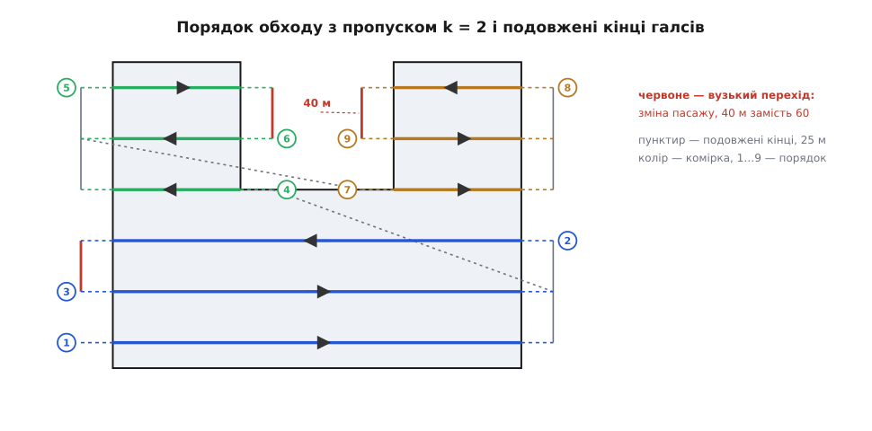

# ⚙️ Генератор галсів на C: від вершин полігона до списку точок

Це та сама функція, без якої планувальник місії не планувальник: на вході — контур ділянки, крок між лініями й те, що вміє апарат, на виході — ламана, яку автопілот пройде точка за точкою. Нижче вона ціла, робоча, з прогоном на конкретному полігоні й розбором місць, де вона мовчки бреше, якщо написати її «як здається».

## Що приходить і що йде далі

Полігон приходить у метрах **місцевої пласкої системи**: початок десь у центрі ділянки, вісь x на схід, вісь y на північ, викривлення Землі на кількох кілометрах уже стерто. Це принципово — паралельні прямі «з кроком 40» у градусах широти й довготи не мають сенсу, бо градус довготи на екваторі й на 50-й паралелі — різні відстані; переведення туди й назад робить [місцева дотична площина](topic:math/local-tangent-plane), і геометрія починається вже після нього.

Крім вершин, функції треба ще чотири числа: кут, під яким лягають галси (його дає окремий крок — пошук найменшої ширини фігури), крок між сусідніми галсами `d`, найменший радіус розвороту апарата `R` і подовження кінців `ext`. Виходить масив точок.

```c
#include <math.h>
#include <stdio.h>

/* Точка в місцевій пласкій системі, метри. */
typedef struct { double x, y; } Pt;

/* Один галс у системі галсів: горизонтальний відрізок [x0, x1] на висоті y. */
typedef struct { double y, x0, x1; int cell; } Seg;

#define MAX_V    256    /* вершин полігона                                  */
#define MAX_CUT   64    /* перетинів однієї січної з контуром               */
#define MAX_SEG  512    /* галсів у плані                                   */
#define EPS     1e-9    /* «нуль» у частках смуги, не в метрах              */
#define Y_TOL   1e-6    /* ближче за мікрон до вершини — вважаємо «в неї»   */
#define Y_STEP  1e-5    /* на стільки зсуваємо січну, щоб зійти з вершини   */
```

Мова тут не з примхи. Ця функція живе там, де живе автопілот: у прошивці польотного контролера або в бортовому комп'ютері поруч із ним, часто без операційної системи й без динамічного розподілу пам'яті. Тому — жодного `malloc`: буфери дає той, хто викликає, а межі стоять у `#define` і чесно перевіряються. На мікроконтролері ці масиви оголошують статичними, бо шістнадцять кілобайтів на стеку там ніхто не дасть.

## Одна дія, що знімає половину задачі

Полігон лежить під довільним кутом, галси мають іти під своїм. Різати фігуру косими прямими можна, але кожен рядок коду буде про кут: проєкції, напрямні вектори, порівняння вздовж похилої осі.

Замість цього повернімо **систему координат** так, щоб напрямок галсів збігся з віссю x. Тепер січні — це просто `y = const`, «упоперек» означає «за y», «вздовж» означає «за x», а порівняння двох галсів між собою зводиться до порівняння двох чисел. Двовимірна задача розпалася на стос одновимірних. Наприкінці точки повертають назад тим самим поворотом із протилежним знаком — і замовник навіть не знає, що всередині щось крутилося.


*Поворот системи — не косметика, а те, що робить решту коду одновимірною. Після нього кожна січна дає впорядкований набір чисел, і все, що лишається, — правильно розбити його на пари.*

Далі — п'ять кроків: повернути, розсікти, згрупувати в комірки, упорядкувати з пропуском, подовжити й повернути назад.

## Розсічення: перетини й правило парності

Найдрібніша цеглинка — перетини однієї січної з контуром. Проходимо всі сторони, для кожної питаємо, чи перетинає її пряма `y = const`, і якщо так — рахуємо `x`:

```c
static Pt rot(Pt p, double c, double s)
{
    Pt q;
    q.x = p.x * c - p.y * s;
    q.y = p.x * s + p.y * c;
    return q;
}

/* Перетини січної y = const із контуром. Повертає їхню кількість або −1. */
static int cuts_at(const Pt *P, int n, double y, double *xs, int cap)
{
    int i, c = 0;
    for (i = 0; i < n; i++) {
        Pt a = P[i], b = P[(i + 1) % n];
        /* Напівінтервал [a.y, b.y): нижній кінець сторони «свій», верхній — ні.
           Горизонтальна сторона (a.y == b.y) дає порожній інтервал і випадає
           сама — ділення на нуль нижче стає неможливим. */
        if (!((a.y <= y && y < b.y) || (b.y <= y && y < a.y)))
            continue;
        if (c >= cap) return -1;
        xs[c++] = a.x + (y - a.y) * (b.x - a.x) / (b.y - a.y);
    }
    return c;
}

static void isort(double *a, int n)
{
    int i, j;
    for (i = 1; i < n; i++) {
        double v = a[i];
        for (j = i - 1; j >= 0 && a[j] > v; j--)
            a[j + 1] = a[j];
        a[j + 1] = v;
    }
}
```

Відсортувавши перетини за `x`, беремо проміжки **через один**: від першого до другого, від третього до четвертого. Це те саме правило парності, за яким перевіряють [належність точки багатокутнику](topic:math/point-in-polygon), тільки застосоване не до однієї точки, а до цілої прямої відразу: рухаючись уздовж січної, ми щоразу на перетині або входимо у фігуру, або виходимо з неї, і всередині ми саме на непарних проміжках.

Найцінніше в цьому правилі те, чого від нього не чекаєш: воно **нічого не знає про форму фігури**. Вм'ятина, виступ, дірка-перешкода посеред ділянки — усе одно. Контур дірки просто додають до списку сторін окремим замкненим обходом: січна перетне його ще двічі, парність на цьому проміжку перевернеться, і те, що всередині дірки, само випаде з пар. Напрямок обходу тут навіть не важить — умова в `cuts_at` симетрична щодо кінців сторони (у який бік обходити, важить для інших речей, як-от підрахунку площі). Жодного окремого коду для «складних випадків» писати не треба — і це головна причина віддати перевагу саме такому розсіченню.

Сортування тут — вставками, а не `qsort`. Перетинів на одній лінії зазвичай два, зрідка чотири-шість; на таких довжинах вставки просто швидші за виклик через покажчик на функцію, а код лишається без залежностей.

## Січна не сміє лягти на вершину

Правило напівінтервалу вже розв'язує половину проблеми з вершинами. Погляньмо, що буває, коли січна проходить рівно крізь вершину `V`, і порахуймо перетини для трьох випадків.

```
контур іде крізь V знизу вгору:  ребро під V дає 0 (верхній кінець «чужий»)
                                 ребро над V дає 1 (нижній кінець «свій»)
                                 разом 1 — справжній перетин ✔

V — низ «галочки» (обидва сусіди вище):   обидва ребра дають по 1
                                 разом 2 — дотик, парність збережено ✔

V — верх «шпиля» (обидва сусіди нижче):   обидва ребра дають по 0
                                 разом 0 — дотик, парність збережено ✔
```

Наскрізний прохід дає непарну одиницю, дотик — парний нуль або двійку. Саме те, що треба: парність не ламається, а дотик у найгіршому разі народжує відрізок нульової довжини, який ми потім викинемо за довжиною.

І тут приходить те, що ламає всю цю акуратність. Вершин із **точно однаковим** `y` після повороту не буває. Наш демонстраційний полігон має два кути дірки на одній висоті — у вихідних цілих координатах вони ідеально рівні. Після повороту:

```
ордината правого кута: 140.00000000000000
ордината лівого кута:  140.00000000000003
```

Різниця — одна одиниця останнього розряду, близько 3·10⁻¹⁴ метра: у тисячі разів менше за атом. Але для оператора `<` вона цілком реальна: січна `y = 140.0` лягає **рівно** на правий кут дірки й проходить **під** лівим. Права стінка дірки дає перетин, майже горизонтальне дно — ще один у тій самій точці, а ліва стінка не дає жодного:

```
20.0   240.0   240.0   340.0     замість   20.0   120.0   240.0   340.0
```

Чотири перетини на місці, парність не порушена — і саме тому нічого не впаде. Пари стають `[20, 240]` і `[240, 340]`, перший «галс» іде просто крізь заборонену дірку, помилки не буде, попередження не буде: апарат полетить туди, куди летіти не можна. Це та порода багів, через яку [порівняння чисел із рухомою комою](topic:algorithms/float-formats) в геометрії ніколи не роблять наївно — рівність, яку задумав автор полігона, у бітах не збереглася, а код, що на неї спирався, про це не дізнається.

Виправлення напрошується просте й правильне: **не пускати січну на рівень жодної вершини взагалі**. Зсув на десять мікронів фізично не значить нічого — це на п'ять порядків менше за точність, з якою апарат тримає лінію, — зате знімає геть усі виродження разом.

```c
/* Зсунути січну з рівня будь-якої вершини. Кроків не більше, ніж вершин:
   кожен крок віддаляє y від того рівня, на який він щойно натрапив. */
static double clear_of_vertices(double y, const Pt *P, int n)
{
    int pass, i, hit;
    for (pass = 0; pass <= n; pass++) {
        hit = 0;
        for (i = 0; i < n; i++)
            if (fabs(P[i].y - y) < Y_TOL) { hit = 1; break; }
        if (!hit) break;
        y += Y_STEP;
    }
    return y;
}
```

Правило напівінтервалу після цього не зайве — воно лишається другою лінією оборони й, головне, саме воно рятує від сторони, що лежить **уздовж** січної. Якби умова була замкнена з обох боків (`min ≤ y ≤ max`), горизонтальна сторона проходила б перевірку, а наступний рядок ділив би на `b.y − a.y = 0`. З напівінтервалом вона просто не потрапляє в перебір, і її кінці правильно обробляють сусідні сторони.

## Збирання галсів і комірок

```c
int coverage_segments(const Pt *world, int n, double ang, double d,
                      double minlen, Seg *segs, int cap)
{
    Pt P[MAX_V];
    double xs[MAX_CUT], a0[MAX_CUT / 2], a1[MAX_CUT / 2];
    double c, s, lo, hi, H, step, y;
    int i, j, m, cnt, kept, ns = 0, base = 0, freecell = 0, prev = -1;

    if (n < 3 || n > MAX_V || d <= 0.0) return -1;

    /* 1. У систему галсів: поворот на −ang робить січні горизонтальними. */
    c = cos(ang); s = sin(ang);
    for (i = 0; i < n; i++) P[i] = rot(world[i], c, -s);

    lo = hi = P[0].y;
    for (i = 1; i < n; i++) {
        if (P[i].y < lo) lo = P[i].y;
        if (P[i].y > hi) hi = P[i].y;
    }
    H = hi - lo;

    /* 2. Скільки смуг завширшки d накриють висоту H. Мінус EPS — щоб при H,
          кратній d, шум останнього знака не додав зайвої порожньої смуги. */
    m = (int)ceil(H / d - EPS);
    if (m < 1) m = 1;
    step = H / m;          /* трохи менше за d: лінії лягають по центрах смуг */

    for (i = 0; i < m; i++) {
        y = clear_of_vertices(lo + (i + 0.5) * step, P, n);
        cnt = cuts_at(P, n, y, xs, MAX_CUT);
        if (cnt < 0) return -1;
        isort(xs, cnt);

        /* 3. Правило парності: усередині фігури лежать проміжки через один. */
        kept = 0;
        for (j = 0; j + 1 < cnt; j += 2)
            if (xs[j + 1] - xs[j] >= minlen) {
                a0[kept] = xs[j]; a1[kept] = xs[j + 1]; kept++;
            }

        /* Поки кількість шматків не міняється, j-й шматок кожної лінії — це
           та сама комірка. Зміна кількості означає критичну вершину: там
           комірки закінчуються й починаються нові. */
        if (kept != prev) { base = freecell; freecell += kept; prev = kept; }

        for (j = 0; j < kept; j++) {
            if (ns >= cap) return -1;
            segs[ns].y = y;  segs[ns].x0 = a0[j];  segs[ns].x1 = a1[j];
            segs[ns].cell = base + j;
            ns++;
        }
    }
    return ns;
}
```

Два місця тут варті погляду.

Перше — `step = H / m` замість просто `d`. Різати з кроком рівно `d` означає лишити нагорі недорізаний окраєць довільної ширини; поділивши висоту на `m` рівних смуг і поставивши лінії **по їхніх центрах**, ми дістаємо крок трохи менший за `d` (тобто перекриття трохи більше за замовлене — у безпечний бік) і кожну лінію не далі як `d/2` від краю фігури.

Друге — призначення комірок за кількістю шматків. Це не повний розклад фігури на комірки, а його дешевий замінник, який працює саме тоді, коли треба: поки січна ріже фігуру на однакову кількість шматків, лівий шматок лишається лівим, правий — правим, і кожен з них тягнеться як окрема комірка. Змінилася кількість — минули критичну вершину, старі комірки закрито, нові відкрито. Замінник цей не універсальний: якщо на одній лінії одна комірка закінчилася, а поруч інша почалася, кількість не зміниться, і дві різні комірки злипнуться в одну. Для ділянок, які справді малюють замовники, така конфігурація рідкісна — але знати про неї треба, бо помітно її буде вже в повітрі.

## Порядок обходу й подовжені кінці

```c
int coverage_route(const Seg *segs, int nseg, double ang, double d, double R,
                   double ext, Pt *out, int cap, double *worst_turn)
{
    int order[MAX_SEG], idx[MAX_SEG];
    int i, r, t, k, cl, last, cnt, ncell = 0, no = 0, np = 0;
    double c, s, cur = 0.0, worst = 1e30;

    if (nseg <= 0 || nseg > MAX_SEG || d <= 0.0) return -1;

    /* 4. Пропуск: розворот діаметром k·d має вмістити коло радіуса R. */
    k = (int)ceil(2.0 * R / d - EPS);
    if (k < 1) k = 1;

    for (i = 0; i < nseg; i++)
        if (segs[i].cell >= ncell) ncell = segs[i].cell + 1;

    for (cl = 0; cl < ncell; cl++) {
        cnt = 0;
        for (i = 0; i < nseg; i++)              /* уже за зростанням y */
            if (segs[i].cell == cl) idx[cnt++] = i;
        /* Пасаж r бере лінії r, r+k, r+2k…; напрямок пасажів чергується. */
        for (r = 0; r < k && r < cnt; r++) {
            if (r % 2 == 0) {
                for (i = r; i < cnt; i += k) order[no++] = idx[i];
            } else {
                last = r;
                while (last + k < cnt) last += k;
                for (i = last; i >= 0; i -= k) order[no++] = idx[i];
            }
        }
    }

    /* Найвужчий розворот усередині комірки. Якщо в жодній комірці немає двох
       ліній, лишається 1e30: розвертатися тут просто ніде. */
    for (t = 1; t < no; t++) {
        const Seg *a = &segs[order[t - 1]], *b = &segs[order[t]];
        double gap = fabs(b->y - a->y);
        if (a->cell == b->cell && gap < worst) worst = gap;
    }
    if (worst_turn) *worst_turn = worst;

    /* 5. Кінці подовжуємо, точки повертаємо назад у місцеву систему. */
    c = cos(ang); s = sin(ang);
    for (t = 0; t < no; t++) {
        const Seg *g = &segs[order[t]];
        Pt A, B, tmp;
        A.x = g->x0 - ext;  A.y = g->y;
        B.x = g->x1 + ext;  B.y = g->y;
        /* Обидва кінці на одній лінії, тож ближчий — той, чий x ближчий. */
        if (t > 0 && fabs(B.x - cur) < fabs(A.x - cur)) { tmp = A; A = B; B = tmp; }
        if (np + 2 > cap) return -1;
        out[np++] = rot(A, c, s);
        out[np++] = rot(B, c, s);
        cur = B.x;
    }
    return np;
}
```

Пропуск `k = ⌈2R/d⌉` бере комірку не поспіль, а пасажами: пасаж нуль іде лініями 0, k, 2k… знизу вгору, пасаж один вертається лініями 1, 1+k, 1+2k… згори вниз, і так `k` разів. Кожен розворот усередині пасажу має діаметр `k·d ≥ 2R` — саме те, що апарат уміє.

Напрямок кожного галса не задають прапорцем, а виводять: заходимо тим кінцем, що ближчий до місця, де скінчився попередній. Обидва кінці лежать на одній лінії, тож із двох відстаней різниться лише доданок за `x` — порівнювати повну відстань зайве. Змійка виходить сама, і так само сам собою обирається бік входу в нову комірку.

Подовження кінців — не запас «про всяк випадок». Керування веде апарат не в останню точку, а в точку **попереду** себе: [навігація pure pursuit](topic:algorithms/pure-pursuit-navigation) цілиться в точку на ламаній, віддалену на довжину випередження, і починає доводити курс до наступного галса ще до кінця поточного. Якщо останню точку поставити рівно на межі ділянки, апарат почне зрізати кут за десятки метрів до неї, і край ділянки лишиться незнятим.

## Прогін

Полігон навмисне такий, щоб зачепити все складне разом: він невипуклий, має прямокутну виїмку, його кути дірки лежать на одній висоті, а сама висота фігури кратна кроку.

```c
int main(void)
{
    static const Pt field[] = {
        {  16,  12 }, { 272, 204 }, { 128, 396 }, {  48, 336 },
        { 108, 256 }, {  12, 184 }, { -48, 264 }, { -128, 204 }
    };
    const int    n   = (int)(sizeof field / sizeof field[0]);
    const double ang = atan2(0.6, 0.8);   /* 36.87°, дає крок «напрямок»   */
    const double d   = 40.0;              /* крок між галсами, м           */
    const double R   = 30.0;              /* мінімальний радіус розвороту  */
    const double ext = 25.0;              /* подовження кінців, м          */

    Seg segs[MAX_SEG];
    Pt  route[2 * MAX_SEG];
    double worst = 0.0;
    int nseg, np, i;

    nseg = coverage_segments(field, n, ang, d, d, segs, MAX_SEG);
    if (nseg < 0) { printf("полігон не вмістився\n"); return 1; }
    np = coverage_route(segs, nseg, ang, d, R, ext, route, 2 * MAX_SEG, &worst);
    if (np < 0) { printf("маршрут не вмістився\n"); return 1; }

    printf("галсів %d, точок %d, k = %d, найвужчий розворот %.1f м (треба %.1f)\n",
           nseg, np, (int)ceil(2.0 * R / d - EPS), worst, 2.0 * R);
    printf("  #  комірка         y        x0        x1   довжина\n");
    for (i = 0; i < nseg; i++)
        printf("%3d  %7d  %8.1f  %8.1f  %8.1f  %8.1f\n", i, segs[i].cell,
               segs[i].y, segs[i].x0, segs[i].x1, segs[i].x1 - segs[i].x0);
    printf("маршрут, метри місцевої системи:\n");
    for (i = 0; i < np; i++)
        printf("%3d  %9.1f  %9.1f\n", i, route[i].x, route[i].y);
    return 0;
}
```

Вивід:

```
галсів 9, точок 18, k = 2, найвужчий розворот 40.0 м (треба 60.0)
  #  комірка         y        x0        x1   довжина
  0        0      20.0      20.0     340.0     320.0
  1        0      60.0      20.0     340.0     320.0
  2        0     100.0      20.0     340.0     320.0
  3        1     140.0      20.0     120.0     100.0
  4        2     140.0     240.0     340.0     100.0
  5        1     180.0      20.0     120.0     100.0
  6        2     180.0     240.0     340.0     100.0
  7        1     220.0      20.0     120.0     100.0
  8        2     220.0     240.0     340.0     100.0
маршрут, метри місцевої системи:
  0      -16.0       13.0
  1      280.0      235.0
  2      232.0      299.0
  3      -64.0       77.0
  4      -40.0       45.0
  5      256.0      267.0
  6       32.0      199.0
  7      -88.0      109.0
  8     -136.0      173.0
  9      -16.0      263.0
 10        8.0      231.0
 11     -112.0      141.0
 12       88.0      241.0
 13      208.0      331.0
 14      160.0      395.0
 15       40.0      305.0
 16       64.0      273.0
 17      184.0      363.0
```

Табличка галсів читається як зріз фігури знизу вгору. Перші три лінії дають по одному відрізку завширшки 320 м — це суцільна нижня частина, комірка 0. З лінії `y = 140` починається виїмка: перетинів стає чотири, галс розпадається на `[20, 120]` і `[240, 340]`, і замість однієї комірки з'являються дві — 1 і 2. На виїмку не пішло жодного окремого рядка коду: правило парності побачило її саме.

Маршрут перевіряється очима. Точки 0 і 1 — перший галс зліва направо, точки 2 і 3 — другий у зворотний бік. Але другий пройдено не по лінії `y = 60`, а по `y = 100`: пропуск `k = 2` погнав апарат через одну. Лінія `y = 60` дістається третьою — це зворотний пасаж.



*Кожна комірка — свій колір, номер стоїть із того боку, яким апарат у галс заходить. Суцільні сірі відрізки — розвороти по 80 м, які пропуск і мав дати; червоні — перехід із пасажу в пасаж, той самий, що не влазить; сірий пунктир навскіс — переліт із комірки в комірку, за який нічого не знімається.*

Функція сама й видала присуд: найвужчий розворот 40 м проти потрібних 60. Пропуск робить широкими **всі** розвороти всередині пасажу, але місце, де апарат перекладається з одного пасажу на другий, лишається вузьким. У комірці з трьох ліній інакше й бути не може: пар ліній, віддалених щонайменше на дві позиції, тут лише одна — крайні; а шлях через три вузли потребує двох переходів. Хоч як переставляй, один вузький лишиться.

З чотирьох ліній вихід уже є: порядок 1 → 3 → 0 → 2 дає відстані 2, 3 і 2 кроки, тобто всі розвороти широкі, ціною одного довгого перельоту через увесь блок. Це і є справжній вибір планувальника — вузький розворот, який доводиться робити «крапельним» із виходом за межу ділянки, чи зайвий переліт. Значення `worst_turn` для того й повертається: воно каже, чи цей вибір узагалі стоїть.

Ще два числа з прогону варто пояснити, бо вони спантеличують. Сума довжин галсів — 1560 м, а площа, поділена на крок, — 1620 м. Різниця сидить у смузі, де починається виїмка: одна лінія в її середині представляє смугу, половина якої ще суцільна. На реальному покритті це закриває сусідня смуга — вона-бо ширша за крок рівно на перекриття. І друге: разом із подовженнями (дев'ять галсів по 50 м) і переходами між лініями та комірками апарат пролітає 2828 м проти теоретичних 1620. На полігоні розміром із футбольне поле накладні витрати такі й є; на ділянці в кілометри вони падають до кількох відсотків, бо ростуть із кількістю галсів, а не з їхньою довжиною.

## Де ще підстелити

**`⌈H/d⌉` на кратній висоті.** Наш полігон після повороту дав рівно 240 м висоти — але досить посунути те саме поле так, щоб його нижній кут ліг у початок координат, і поворот поверне `H = 240.00000000000006`. Тоді `H/d = 6.0000000000000018`, і чесне `ceil` дасть **сім** смуг замість шести: зайвий галс, що ліг би на самий край фігури й нічого не покрив. Відняти `EPS` перед заокругленням — не забобон: `1e-9` у частках смуги на кроці 40 м означає сорок нанометрів, тож зіпсувати цим справжній випадок неможливо.

**Уламки й порожні комірки.** У гострому кутку фігури січна вирізає відрізок завдовжки метр. Летіти його — два розвороти й п'ятдесят метрів подовжених хвостів заради метра покриття. Тому `minlen` (у прогоні — рівно `d`) викидає такі уламки; дотик у вершині, що дає відрізок нульової довжини, відсівається тим самим порогом. Ціна чесна й мусить бути названа: викинуте покриває сусідня смуга, бо вона ширша за крок, — але на самому краю фігури цієї сусідки може й не бути.

**Хвости, що лізуть, куди не можна.** Подивіться на малюнок порядку обходу: подовжені кінці галсів комірок 1 і 2 заходять на 25 м усередину виїмки — з обох її боків. Якщо виїмка — це не просто край поля, а заборонена зона, план щойно завів апарат туди, куди не можна. Кінці треба або обтинати об контур обмежень, або вирішувати це заздалегідь — [зсувом контуру](topic:algorithms/polygon-offset) всередину на ширину подовження, ще до розсічення. Друге простіше й надійніше, бо тоді генератор працює з уже безпечною фігурою й може не знати про обмеження нічого.

## Скільки це коштує

Головний цикл проходить `m` січних, і для кожної перебирає всі `n` сторін. Сортування додає небагато: перетинів на лінії `c`, а `c` — це двійка чи четвірка, тож `c²` вставок ховається в шумі.

```
розсічення:    O(n·m) + Σ O(cᵢ²),   m = ⌈H/d⌉
зсув із вершини: O(n) на січну — той самий порядок
впорядкування:  O(nseg·ncell) на перебір комірок
```

Для типової місії це нічого: контур із двадцяти вершин і триста галсів — шість тисяч перевірок сторони, тобто мікросекунди. Але `m` росте, коли крок дрібнішає, а `n` — коли контур узято з карти: берегова лінія затоки чи межа лісового масиву легко дає тисячі вершин. Добуток `n·m` тоді сягає мільйонів, і планувальник починає думати помітно довго.

Виправлення в тому, що кожна січна перебирає всі сторони, хоча перетинає лише деякі. Сторона живе на відрізку висот `[min y, max y)` — поза ним вона перевіряється дарма. Тож замість перебору по колу зробімо **прохід за подіями**: зібрати `2n` подій «сторона починається» й «сторона закінчується», відсортувати їх за `y` за `O(n log n)`, а потім вести січну знизу вгору, тримаючи набір **активних** сторін — тих, що зараз її перетинають. Перед кожною лінією додаємо ті, що почалися, викидаємо ті, що скінчилися, і рахуємо перетини лише з активними.

```
було:  O(n·m)
стало: O(n log n + m + k),   k — усього перетинів на виході
```

Останній доданок нічим не зменшити: `k` — це і є розмір відповіді, кожна активна сторона дає рівно один перетин. Такий прохід за подіями — стандартний прийом обчислювальної геометрії ([замітальна пряма](topic:algorithms/sweep-line)), і в задачі покриття він лягає найприродніше, бо січні тут і так рухаються в один бік із рівним кроком.

Одну дрібницю при цьому легко проґавити, і вона з'їдає весь виграш. Зсув із вершини теж перебирає всі `n` ординат на кожній лінії — лишити його як є означає лишити `O(n·m)` на місці. У проході за подіями він робиться задарма: список подій уже відсортовано за `y`, тож найближчий рівень вершини — це сусідня подія, і перевірити треба не всі, а одну.

Чи варто його писати відразу — питання чесне. Для полігонів на десятки вершин наївний варіант коротший, і його легше перевірити очима; поріг, за яким прохід за подіями окупається, лежить десь на сотнях вершин. Але правило парності, напівінтервал, зсув із вершини й перевірка найвужчого розвороту потрібні в обох варіантах однаково — саме вони, а не швидкість, відрізняють план, який летить, від плану, який виглядає гарно.
