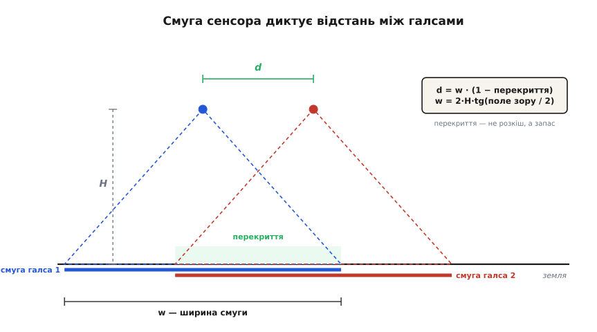
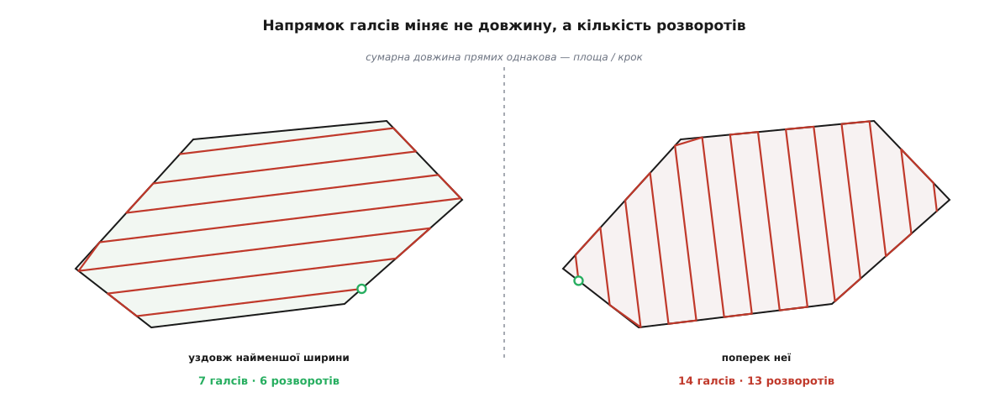
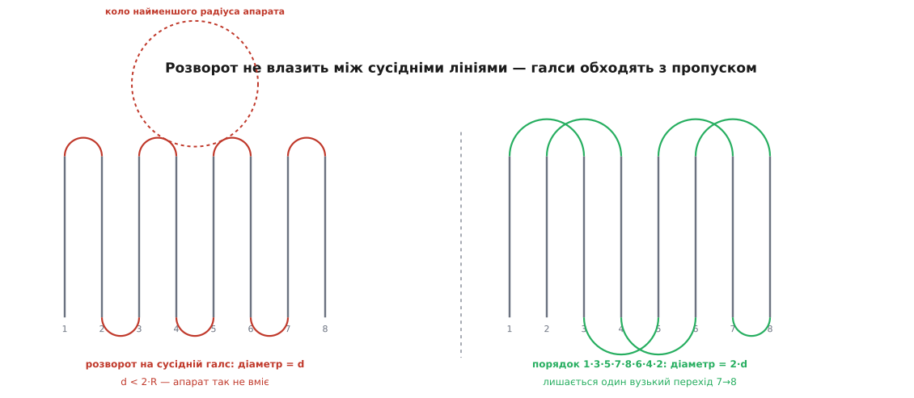
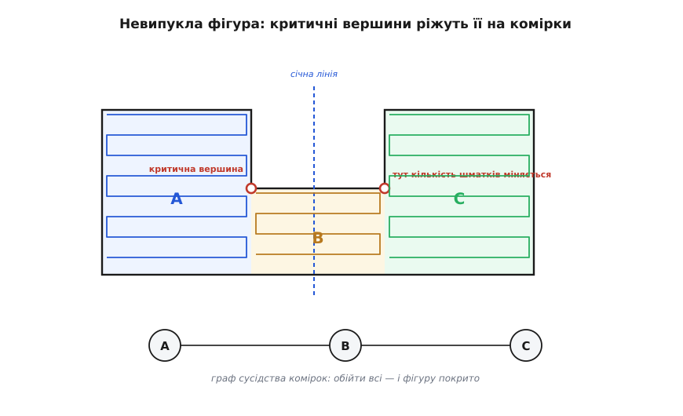

# Покриття полігону галсами: планування зйомки

<preknowlist>
- [Місцева дотична площина](book:math/local-tangent-plane) — як шматок земної поверхні стає пласкою площиною з координатами в метрах.
- [Картографічні проєкції](book:math/map-projections) — чому широту й довготу не можна брати як звичайні координати й що з ними роблять.
- [Орієнтована площа многокутника](book:math/shoelace-area) — площа фігури просто з координат вершин.
- [Належність точки багатокутнику](book:math/point-in-polygon) — правило парності перетинів: що всередині фігури, а що зовні.
- [Модель камери-обскури](book:algorithms/camera-model) — фокусна відстань, розмір матриці й те, як з висоти народжується розмір кадру на землі.
- [Навігація pure pursuit](book:algorithms/pure-pursuit-navigation) — як апарат насправді їде вздовж заданої ламаної й чому він зрізає кути.
</preknowlist>

Замовник показує на карті шматок землі — поле, кар'єр, ділянку узбережжя — і каже: «зніми це». Апарат несе камеру, яка бачить під собою пляму завширшки трохи більше сотні метрів. Ділянка — кілометри. Питання, на яке треба відповісти до зльоту: **якою лінією провести апарат, щоб під камерою побував кожен без винятку клаптик ділянки** — і щоб на це пішло якнайменше часу, бо часу в акумулятора рівно стільки, скільки є.

Спокуса відповісти одразу: «змійкою, звісно». Але перш ніж малювати змійку, треба знати, **що в цій задачі взагалі можна виграти, а що зафіксовано природою речей** — бо саме ця межа й задає форму плану.

## Скільки шляху потрібно щонайменше

Камера (чи сонар, чи обприскувач — байдуже) бачить під апаратом **смугу** сталої ширини `w`. Апарат тягне цю смугу за собою; усе, чого смуга торкнулася, — покрито. Тепер найпростіше можливе міркування: за час, поки апарат подолав шлях завдовжки `L`, смуга замела площу **не більшу** за `w · L`. Не більшу — бо якщо шлях звивається чи двічі проходить те саме місце, смуга накриває вже накрите, і замітається менше. Отже, щоб накрити ділянку площею `S`, конче потрібно

```
L ≥ S / w
```

Це не порада й не евристика, а нижня межа: жоден план на світі її не обійде. І з неї випливає перший висновок, що визначає все далі: **пряма довжина маршруту практично зафіксована**. Ділянка задана, ширина смуги задана — отже, кілометраж уже відомий із точністю до кількох відсотків. Оптимізувати шлях «щоб коротший» майже нема куди.

Тоді де ж лишається свобода? Рівно в тих трьох місцях, де реальність відступає від ідеалу `w · L`:

- **смуги мусять налягати одна на одну**, тож кожен метр шляху дає не `w`, а менше нової площі;
- **розвороти** на кінцях: апарат витрачає час і шлях там, де нічого корисного не знімає;
- **переліт** до ділянки й між її частинами.

Цей поділ і є кістяком планування: три перелічені втрати — єдине, з чим тут узагалі можна боротися, і кожне рішення в плані б'є рівно по одній із них.

## Чому смуга налягає на смугу

Прямі лінії, якими ходить апарат, у морській справі й у зйомці звуть **галсами** (нідерл. *hals* — «шия»; у вітрильному ділі галс — це курс судна щодо вітру, і змінити галс означає розвернутися). Один галс — це один прямий прохід від краю до краю ділянки; між галсами апарат розвертається.

Смуга під камерою має ширину, яку легко порахувати з висоти й геометрії об'єктива. Але класти галси так, щоб смуги стикалися край у край, не можна. Причина не в естетиці, а в тому, що **край смуги — це найгірше, що є в кадрі**: там об'єктив дає найбільші спотворення, там точка знята під найкосішим кутом, і саме там будь-яка неточність польоту виносить смугу за розрахункове місце. Тому сусідні смуги навмисно накладають — на 60–75 % ширини для фотограмметрії, менше для простого огляду. Відстань між сусідніми галсами тоді

```
d = w · (1 − перекриття)
```

і саме `d`, а не `w`, стоїть у нижній межі довжини: `L ≥ S / d`. Перекриття 70 % означає, що кожен метр шляху додає лише 30 % ширини нової площі — маршрут виходить більш ніж утричі довший за наївну оцінку. Це найдорожча плата в усій задачі, і платять її свідомо.


*Погляд упоперек напрямку польоту. Ширина смуги `w` росте з висотою; перекриття сусідніх смуг з'їдає частину цієї ширини, і на план іде вже `d = w·(1 − перекриття)`. Уся подальша арифметика — кількість галсів, довжина маршруту, час — рахується від `d`, а не від `w`.*

**Приклад: від бажаної деталізації до кроку між галсами.** Камера з матрицею 4000 × 3000 пікселів, крок пікселя 1.55 мкм, фокусна відстань 4.5 мм. Летимо на 100 м над землею, бічне перекриття беремо 70 %.

```
розмір пікселя на землі (GSD):
  GSD = крок_пікселя · H / f
      = 1.55·10⁻⁶ м · 100 м / 0.0045 м
      = 0.0344 м/піксель        ≈ 3.4 см на піксель

ширина смуги (4000 пікселів упоперек курсу):
  w = 4000 · 0.0344 = 137.8 м

довжина кадру вздовж курсу (3000 пікселів):
  l = 3000 · 0.0344 = 103.3 м

крок між галсами:
  d = 137.8 · (1 − 0.70) = 41.3 м
```

Три рядки — і план уже майже готовий: усе інше рахується від `d`. Зауважте, як щільно все зчеплено: захотіли деталізацію вдвічі кращу — мусите вдвічі знизитися, і смуга звузиться вдвічі, і галсів стане вдвічі більше, і маршрут подовшає вдвічі. **Деталізація коштує часу лінійно** — це найважливіше число, яке треба узгодити із замовником до, а не після польоту.

> 🔧 **Навіщо це.** Той самий ланцюжок рахують перед кожним вильотом на аерофотозйомку — тільки зазвичай його ховає планувальник місії, куди ви вводите бажаний GSD і перекриття. Коли ви розумієте ланцюжок, ви бачите, чому програма пропонує саме таку висоту, і можете свідомо торгуватися: знизити перекриття з 75 % до 65 % на рівному полі — і виграти півтори хвилини польоту; підняти висоту на 20 м — і вкластися в одну батарею замість двох.

## Напрямок галсів: те, що справді можна виграти

Тепер про свободу, яку ми відшукали. Розвернімо ділянку подумки й покладімо галси в іншому напрямку. Що зміниться?

Сумарна довжина прямих — **майже нічого**. Вона дорівнює площі, поділеній на крок, а площа від повороту системи координат не залежить. Скільки б ми не крутили сітку ліній, сума довжин відрізків, що вирізає з фігури набір паралельних прямих із кроком `d`, лишається `≈ S/d`.

А от кількість галсів змінюється дуже помітно. Галсів рівно стільки, скільки прямих із кроком `d` уміщається впоперек фігури:

```
кількість галсів = ⌈ ширина_поперек / d ⌉
кількість розворотів = кількість галсів − 1
```

І ця «ширина поперек» напряму залежить від того, як фігуру повернути. Ось де ховається вся оптимізація: **напрямок не міняє довжини прямих, він міняє кількість розворотів**.


*Обидва плани покривають фігуру повністю й проходять однаковий кілометраж по прямій. Різниця — у кількості розворотів: удвічі. Саме тому напрямок галсів обирають за геометрією фігури, а не «як зручніше дивитися на карту».*

**Приклад: прямокутне поле 600 × 400 м.** Крок `d = 41.3 м` із попереднього розрахунку, площа `S = 240 000 м²`.

```
галси вздовж довгої сторони:
  поперек = 400 м → ⌈400 / 41.3⌉ = 10 галсів по 600 м = 6000 м, 9 розворотів

галси вздовж короткої сторони:
  поперек = 600 м → ⌈600 / 41.3⌉ = 15 галсів по 400 м = 6000 м, 14 розворотів

нижня межа:  S / d = 240000 / 41.3 = 5811 м
```

Пряма довжина в обох випадках однакова з точністю до заокруглення вгору. Різниця — п'ять зайвих розворотів. Для мультикоптера, що на кожному розвороті гальмує з 10 м/с, обертається й розганяється назад, це секунд по десять — майже хвилина з нічого. Для літакового апарата з радіусом розвороту в десятки метрів різниця більша в рази.

Отже, задача звузилася до чіткого геометричного питання: **у якому напрямку фігура найвужча?** Ширина фігури в напрямку `v` — це відстань між двома опорними прямими, перпендикулярними до `v`, що затискають фігуру з обох боків, наче губки штангенциркуля. Галси треба класти **перпендикулярно** до напрямку найменшої ширини — тобто вздовж «довгої осі» фігури.

Наївно шукати мінімум перебором кутів — крок за кроком по колу — і дорого, і неточно. Але тут працює гарний факт: перебирати треба лише **напрямки сторін фігури**, а їх скінченна кількість. Причина проста. Поки при повороті напрямку та сама пара вершин лишається крайньою (одна впирається в верхню губку, друга в нижню), ширина дорівнює проєкції відрізка між ними на напрямок `v` — тобто косинусу, помноженому на сталу довжину. Косинус на такому проміжку не має внутрішнього мінімуму: він має там максимум, а мінімуми — по краях проміжку. А край проміжку — це якраз момент, коли губка лягає на **цілу сторону**, а не на одну вершину. Тому мінімум ширини завжди досягається, коли одна з опорних прямих збігається зі стороною фігури.

> 🧮 Повне доведення — як записується функція ширини через опорні вершини, чому на кожному проміжку вона є дугою косинуса й звідки випливає, що мінімум сидить рівно на стороні, — плюс алгоритм «обертових губок», що знаходить його за один обхід, розписано у вставці [Ширина многокутника й напрямок галсів](book:algorithms/survey-grid-coverage/math-min-width.md).

Дві поправки, без яких цей рецепт бреше. Перша: губки не бачать вм'ятин фігури, тому ширину рахують не для самої фігури, а для її [опуклої оболонки](book:algorithms/convex-hull) — найменшої опуклої фігури, що містить усі вершини; вона будується за `O(n log n)` і має не більше вершин, ніж вихідна. Друга: кількість галсів — це стеля-заокруглення `⌈W/d⌉`, тобто **сходинка**, а не гладка функція. Цілий діапазон напрямків дає ту саму кількість галсів, і всередині цього діапазону вибір вільний — його віддають іншим міркуванням: летіти вздовж вітру чи впоперек (бічний вітер зносить кадр), уздовж горизонталей схилу (щоб не гуляла висота над землею), уздовж борозен поля, подалі від сонячного відблиску на воді.

## Розворот, який не влазить

Досі розворот був абстрактною «платою». Тепер подивимося, чому він буває просто неможливим.

Апарат не вміє повертати як завгодно круто. Літаковий апарат тримається в повороті нахилом крил: горизонтальна складова піднімальної сили дає [доцентрове прискорення](book:physics/centripetal-acceleration), і з рівності `v²/R = g·tg φ` радіус віражу виходить

```
R = v² / (g · tg φ)
```

**Приклад.** Апарат літакової схеми, швидкість `20 м/с`, робочий крен `30°`:

```
R = 20² / (9.81 · tg 30°) = 400 / (9.81 · 0.577) = 70.6 м
діаметр розвороту = 2R = 141 м
```

А крок між галсами в нас `41.3 м`. Розворот «через сусідню лінію» вимагає півкола діаметром рівно `d` — тобто радіуса `20.7 м`, більш ніж утричі меншого за той, що апарат фізично може. Класична змійка «1-2-3-4…» для такого апарата **неможлива в принципі**.

Вихід — не міняти план, а міняти **порядок обходу**. Якщо летіти не на сусідній галс, а через `k` ліній, діаметр розвороту стає `k·d`, і потрібне `k` рахується одним рядком:

```
k = ⌈ 2R / d ⌉ = ⌈ 141 / 41.3 ⌉ = 4
```

Тобто апарат іде галсами 1, 5, 9, 13 …, а на зворотному ході добирає пропущені 2, 6, 10 … Кожен розворот тепер широкий і спокійний, а покриття лишається тим самим — важить-бо, які лінії пройдено, а не в якому порядку.


*Порядок обходу — окремий важіль, незалежний від напрямку й кроку. Пропуск через `k` ліній множить радіус розвороту на `k`, не змінюючи ні покриття, ні сумарної довжини прямих. Один вузький перехід на дальньому краю все ж лишається — його роблять «крапельним» розворотом із виходом за межу ділянки.*

Мультикоптер має іншу ціну розвороту: радіус для нього нуль, зате гальмування й розгін коштують часу. Гальмування з `10 м/с` при `2 м/с²` — це п'ять секунд і двадцять п'ять метрів вибігу, стільки ж на розгін, плюс поворот навколо своєї осі. Разом близько десяти-дванадцяти секунд і півсотні метрів **за межею** ділянки. Звідси два практичні наслідки. По-перше, у хвилинну арифметику місії розворот входить окремим доданком, а не дрібницею. По-друге, апарат мусить мати право вийти за контур ділянки — а це вже питання до [геозони](book:algorithms/geofence-algorithm): якщо межу зйомки й межу дозволеного простору задано однією й тією самою фігурою, автопілот або зріже розворот, або впреться в огорожу посеред маневру.

Тому робочий контур галсів і контур ділянки — різні фігури. Ділянку **розширюють** назовні на пів-смуги, щоб крайні галси накрили її край, і ще на радіус розвороту, щоб було де маневрувати; або, навпаки, **звужують** усередину, коли за межу виходити не можна, і тоді смуга крайнього галса має дотягтися до контуру сама. Обидві операції — це [зсув контуру многокутника](book:algorithms/polygon-offset), і робиться він до генерації галсів, а не після.

## Коли фігура не проста

Усе дотепер мовчки вважало фігуру опуклою: січна лінія входить у неї один раз і виходить один раз, галс — один суцільний відрізок. Реальна ділянка так не виглядає. Поле обходить лісосмугу, кар'єр має виступ, посеред ділянки стоїть вежа з забороненою зоною навколо.

Щойно фігура має вм'ятину, січна лінія перетинає її **чотири рази** замість двох, і галс розпадається на два окремі відрізки. Наївна змійка, що йде по лінії від краю до краю, змушена перелітати між шматками — і ці перельоти швидко з'їдають усе, що ми вигравали на напрямку.

Правильна відповідь — не рятувати змійку, а **порізати фігуру на шматки, у кожному з яких змійка знову працює**. Уявіть, як січна лінія повільно посувається фігурою зліва направо, і стежте лише за одним числом: на скільки окремих відрізків вона розсічена. Здебільшого це число не міняється. Міняється воно тільки в окремих вершинах — там, де контур роздвоюється (відрізок розпався на два) або зростається (два злилися в один). Такі вершини звуть **критичними**; вони й ріжуть фігуру на **комірки**. Усередині комірки перетин завжди один суцільний відрізок — а це рівно та умова, за якої проста змійка покриває все без перельотів.


*Розклад зводить складну фігуру до набору простих. Кожна комірка покривається змійкою окремо; лишається обійти всі комірки, і сусідство комірок утворює граф, за яким цей обхід і планують.*

Далі задача змінює природу. Комірки покриті — треба лише вирішити, **в якому порядку** їх відвідати й де в кожну входити. Сусідні комірки дотикаються, тож із них складається граф: вершина — комірка, ребро — можливість перейти між ними задарма. Обійти всі вершини графа з найменшим сумарним перельотом — це вже [задача комівояжера](book:algorithms/traveling-salesperson-problem) у чистому вигляді (точніше — її узагальнення, бо в кожну комірку можна входити з різних боків, і вибір входу теж частина розв'язку). Для десятка комірок її розв'язують точно перебором, для сотні — евристиками.

> 📜 Слово для цієї змійки прийшло з давньогрецького письма, а метод розкладу на комірки має конкретних авторів і конкретний рік. Теорію Морса, класифікацію критичних точок та алгоритм суцільного покриття розібрано в окремій статті [Бустрофедонний клітинний розклад та покриття площ](book:algorithms/boustrophedon-coverage).

Тут є пастка, про яку варто сказати чесно. Напрямок різання й напрямок галсів — це один і той самий напрямок, і він обирається один раз на всю фігуру. Для фігури складної форми буває вигідніше різати її на частини й у **кожній** частині класти галси по-своєму: тоді сумарна кількість розворотів менша, зате додаються перельоти між частинами. Точний оптимум по всіх можливих розбиттях — задача комбінаторно важка, її розв'язують перебором обмеженого набору варіантів або евристиками, і жоден планувальник не обіцяє тут глобального мінімуму.

## Від фігури до списку точок

Тепер зберімо генератор — те, що з полігона й двох чисел робить маршрут.

Перше, з чого він починається, — **система координат**. Полігон приходить у широті й довготі, а «паралельні прямі з кроком 41.3 м» у градусах не мають сенсу: градус довготи на екваторі й на 50-й паралелі — це різні відстані. Тому першою дією полігон переводять у місцеву пласку систему з початком у центрі ділянки й осями в метрах; уся геометрія рахується там, а назад у координати переводяться вже готові точки маршруту.

Сам генератор — це п'ять кроків, кожен із яких прямо випливає з уже сказаного:

1. **Порахувати опуклу оболонку** й на ній знайти напрямок найменшої ширини — це напрямок, поперек якого підуть галси.
2. **Повернути** полігон так, щоб галси стали горизонтальними: тоді січні лінії — просто `y = const`, і вся подальша робота стає одновимірною.
3. **Розсікти** полігон горизонталями з кроком `d`. Для кожної лінії пройти всі сторони полігона, зібрати перетини, відсортувати їх за `x` — і взяти проміжки **через один**: перший-другий, третій-четвертий і так далі. Це те саме правило парності, за яким перевіряють належність точки фігурі, тільки застосоване до цілої лінії відразу; воно само собою правильно обробляє і вм'ятини, і дірки-перешкоди, якщо їхні контури обійти в протилежному напрямку.
4. **Упорядкувати** відрізки: змійкою в межах комірки, з потрібним пропуском `k`, і в обраному порядку комірок.
5. **Розвернути назад** і подовжити кожен галс на кілька десятків метрів за межу фігури — інакше апарат, що йде за ламаною з випередженням, почне повертати ще до кінця лінії й зріже край ділянки. Ця добавка — не запас «про всяк випадок», а прямий наслідок того, як працює керування по точках: воно цілиться в точку **попереду** себе, тож остання точка галса має лежати далі, ніж потрібно накрити.

> ⚙️ Робочий генератор на C — розворот системи, розсічення полігона з правилом парності, впорядкування галсів із пропуском, подовження кінців і видача списку точок, з покроковим прогоном на конкретному полігоні, розбором крайових випадків (лінія проходить точно крізь вершину, сторона паралельна січній) і оцінкою складності — у вставці [Генератор галсів на C](book:algorithms/survey-grid-coverage/proj-coverage-c.md).

## Запас, який з'їдає реальність

Лишилося головне питання довіри до плану: чому перекриття беруть таким великим, якщо геометрично вистачило б і кількох відсотків? Бо між планом і землею стоїть апарат, що ніколи не летить ідеально. Порахуймо, скільки саме з'їдає кожна неідеальність — на тих самих числах: `w = 137.8 м`, `d = 41.3 м`, `H = 100 м`.

**Крен.** Камера дивиться вниз відносно апарата, тож коли апарат хитнуло на кут `φ`, пляма на землі поїхала вбік на `H · tg φ`. Крен у `5°` — це `8.7 м`, тобто п'ята частина всього кроку між галсами. Одного разу — не страшно; систематичний крен через бічний вітер зсуває **всі** смуги в один бік.

**Рельєф.** Смуга росте з висотою **над землею**, а не над точкою зльоту. Якщо земля піднялася на `Δh`, смуга звузилася до `w·(H − Δh)/H`. Умова «без дірок» — щоб звужена смуга була не меншою за крок:

```
w · (H − Δh) / H  ≥  d = w · (1 − перекриття)
⇒  Δh ≤ H · перекриття
```

Результат вартий того, щоб його запам'ятати: **перепад рельєфу, який витримує план, дорівнює висоті польоту, помноженій на частку перекриття**. При `H = 100 м` і перекритті 70 % це 70 м — пагорб такої висоти ще пробачається, вищий дає дірку в покритті. Звідси й практичне правило: що різкіша місцевість, то більше перекриття доводиться закладати — або то обов'язковіше летіти з підтримкою рельєфу, тримаючи сталу висоту над землею, а не над точкою зльоту.

**Знос вітром.** У бічному вітрі апарат летить, розвернувши ніс на кут `β` проти вітру, — а камера, жорстко пов'язана з корпусом, разом із ним. Кадр стає косим щодо лінії руху. Смуга, яку такий кадр накриває **гарантовано** (а не подекуди, залежно від того, коли клацнув затвор), звужується до `w·cos β − l·sin β`, де `l` — довжина кадру вздовж курсу:

```
знос β = 10°:  137.8·0.985 − 103.3·0.174 = 117.8 м → перекриття падає до 65 %
знос β = 20°:  137.8·0.940 − 103.3·0.342 =  94.2 м → перекриття падає до 56 %
```

Видно, чому довгий кадр упоперек курсу гірший за короткий: у другому доданку стоїть саме `l`, і чим кадр витягнутіший уздовж польоту, тим болючіше він реагує на знос.

Складіть три поправки разом — і сімдесят відсотків перекриття перестають виглядати марнотратством. Це не перестраховка, а рахований бюджет: стільки, скільки з'їдять крен, рельєф і вітер, плюс те, що лишиться на фотограмметрію.

> 🔧 **Навіщо це.** Дірка в покритті виявляється не в полі, а через кілька годин, коли програма зшивання видає карту з білою плямою посередині. Повернутися й дознімати саме ту смугу зазвичай неможливо: інше світло, інші тіні, інша висота сонця — шматок не зшиється з рештою. Тому запас закладають до вильоту, а не після; єдиний спосіб перевірити план — рахувати його на найгірші, а не на середні умови.

## Що з цього виходить

План зйомки цілком визначають два числа й одна фігура. Крок `d` приходить із потрібної деталізації через висоту й перекриття. Мінімальний радіус `R` приходить із апарата. Фігура задає, у якому напрямку її різати, на скільки комірок і скільки галсів у кожній. Усе інше — арифметика: напрямок обирається за найменшою шириною, кількість галсів дорівнює ширині поділити на крок, порядок обходу — за відношенням `2R/d`, довжина маршруту — за площею поділити на крок, час — за довжиною плюс розвороти.

Свобода, яка при цьому лишається, значно вужча, ніж здається на початку, і сидить вона не там, де її шукають. Виграти на «коротшому маршруті» неможливо — довжина зафіксована площею. Виграти можна на трьох речах: на напрямку (кількість розворотів), на порядку обходу (щоб кожен розворот був широким і швидким) і на чесності бюджету перекриття (щоб не платити зайвого й не отримати дірку). Планувальник, який показує лише «змійку на карті» й ховає ці три важелі, приховує саме те, чим у цій задачі й керують.
