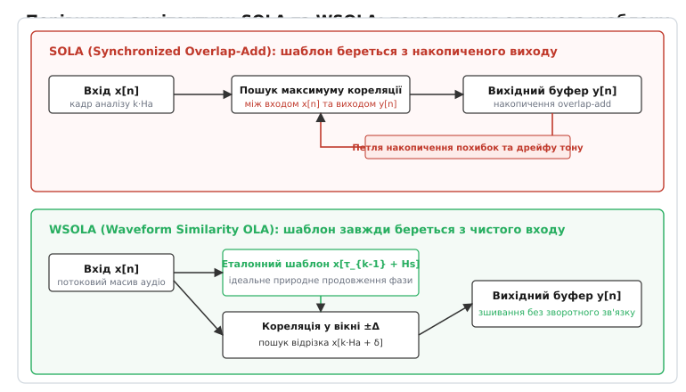
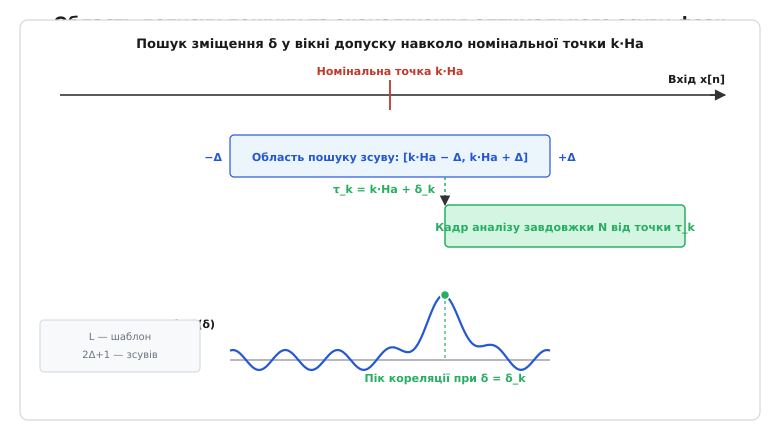
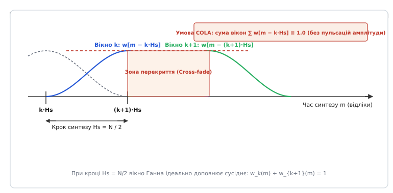
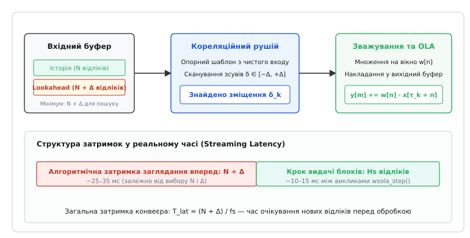

# Алгоритм масштабування аудіо в часі WSOLA (Waveform Similarity Overlap-Add)

<preknowlist>
- [Масштабування аудіо в часі](topic:algorithms/audio-time-scaling) — концепція зміни швидкості звучання без зміни тону через маніпуляцію сегментами сигналу.
- [Швидке перетворення Фур'є](topic:algorithms/fft) — розклад дискретного сигналу на спектральні складові та циклічна крос-кореляція.
- [Обчислення з фіксованою комою](topic:algorithms/fixed-point-implementation) — запобігання переповненню акумуляторів при кореляційному аналізі на мікроконтролерах.
</preknowlist>

Коли потоковий медіаплеєр намагається прискорити відтворення лекції в 1.5 раза простим розрізанням аудіопотоку на рівні 30-мілісекундні блоки з наступним їх накладанням, голос диктора миттєво спотворюється різким тріском і металевим відлунням. Причина криється у фазовій випадковості: якщо взяти відрізок синусоїди частотою 200 Гц і накласти його на сусідній блок зі зміщенням у чверть періоду (1.25 мс), різнойменні фази коливань повітря віднімуться, створивши глибокий провал амплітуди та високочастотний стрибок тиску. Щоб часове масштабування звучало природно, місця стиків повинні обиратися не сліпо за годинником, а синхронізуватися з коливаннями самого сигналу. Алгоритм WSOLA (*Waveform Similarity Overlap-Add* — додавання перекриттів за подібністю форми хвилі) розв'язує цю задачу в реальному часі без виділення частоти основного тону й без дорогих спектральних перетворень.

### Чому сліпе нарізання руйнує фазову узгодженість

Зміна темпу аудіосигналу без зміни висоти його тону (*Time-Scale Modification*, TSM) вимагає зміни загальної тривалості фонограми при збереженні незмінними періодів усіх її частотних складових. Звичайна зміна частоти дискретизації (*resampling*) стискає або розтягує хвилі разом із часовою віссю, неминуче змінюючи висоту тону. Єдиний спосіб зберегти висоту тону в часовій області — це повторювати окремі фрагменти хвилі при сповільненні або пропускати їх при прискоренні.

У наївному методі перекриття-додавання (*Overlap-Add*, OLA) вхідний сигнал `x[n]` розрізають на послідовні кадри фіксованої довжини `N` із кроком аналізу `Hₐ`, множать кожен кадр на згладжувальну віконну функцію `w[n]` (вікно Ганна або трикутне вікно) і підсумовують у вихідному масиві `y[m]` із фіксованим кроком синтезу `Hₛ`. Відношення кроків задає коефіцієнт зміни темпу:

```
α = Hₐ / Hₛ    [α > 1.0 — прискорення темпу, α < 1.0 — сповільнення темпу]
```

Якщо `Hₛ < Hₐ`, кадри у вихідному сигналі вкладаються щільніше, ніж вирізалися з входу: частина матеріалу відкидається, і тривалість зменшується. Якщо `Hₛ > Hₐ`, кадри розсуваються, між ними утворюються зони перекриття однакових або сусідніх хвиль, і тривалість збільшується.

Проте регулярна сітка взяття кадрів `k · Hₐ` не враховує внутрішній період коливань сигналу. На стику двох сусідніх кадрів гребінь хвилі одного блоку може накластися на западину іншого. Виникає деструктивна інтерференція (лат. *inter* — взаємно, *ferio* — вдаряю), яка призводить до двох важких акустичних дефектів:
1. **Гребінчаста фільтрація (*comb filtering*):** регулярні фазові провали на стиках діють як фільтр, що вирізає цілі смуги частот, надаючи звуку характерного порожнього «бляшаного» забарвлення.
2. **Амплітудна модуляція та клацання:** коли фази коливань то збігаються, то віднімаються, гучність результуючого сигналу починає пульсувати з частотою проходження кадрів (30–50 Гц), що сприймається слухом як низькочастотне гарчання або дрібний тріск.

### Пастка детектування пітчу: чому PSOLA не є універсальною

Першою спробою подолати фазовий злам став алгоритм PSOLA (*Pitch-Synchronous Overlap-Add* — синхронне за пітчем додавання з перекриттям). У ньому центри вікон прив'язувалися до моментів замикання голосових складок — маркерів основного тону (*pitch marks*). Коли крок розміщення вікон строго дорівнює періоду коливань голосових зв'язок, накладання завжди відбувається «пік у пік», і фаза не розривається.

Проте виділення основного тону в реальному часі є класичною некоректно поставленою задачею обробки сигналів. Детектор пітчу чудово працює на чистому сольному вокалі, але миттєво дає збій у типових практичних сценаріях:
- **Глухі приголосні звуки та шепіт:** звуки «с», «ш», «т», «ф» є широкосмуговим шумом і не мають періоду взагалі. Детектор пітчу починає хаотично стрибати, розриваючи шумові звуки на неприродні тональні свисти.
- **Поліфонічна музика:** якщо в записі одночасно звучать бас-гітара (80 Гц), вокал (220 Гц) і скрипка (440 Гц), єдиного періоду сигналу не існує. Синхронізація за одним інструментом руйнує фази всіх інших.
- **Помилки подвоєння та поділу октави:** фоновий шум або реверберація призводять до того, що алгоритм оцінки частоти помиляється вдвічі, спричиняючи різкі тріски й фазовий скрегіт.

Потрібен був алгоритм, здатний знаходити найкращу точку склеювання без прямого вимірювання частоти сигналу та без жодних припущень про наявність вокалізованого тону.

### Еволюція ідеї: від вади SOLA до чистоти WSOLA

У 1985 році було запропоновано алгоритм SOLA (*Synchronized Overlap-Add*). Замість жорсткого прив'язування до маркерів пітчу SOLA ввів поняття **вікна допуску**: кадр береться не строго в точці `k · Hₐ`, а з невеликим часовим люфтом `δ` у межах інтервалу `[-Δ, +Δ]`. Зсув `δ` обирався так, щоб максимізувати взаємну кореляцію між новим кадром та вже викладеним у вихідний буфер сигналом.

Однак у схемі SOLA ховалася фундаментальна архітектурна помилка: **еталон для порівняння брався з вихідного акумулятора `y[m]`**.


*Принципова різниця між SOLA та WSOLA. У SOLA шаблон береться з накопиченого вихідного буфера, створюючи петлю зворотного зв'язку, де кожна похибка спотворює наступні кореляції. У WSOLA опорний шаблон завжди береться з чистого вхідного сигналу на відстані природного кроку синтезу, що повністю виключає накопичення фазового дрейфу.*

Коли вихідний сигнал `y[m]` формується з кількох перекритих кадрів, на його форму накладаються згладжувальні вікна та можливі дрібні спотворення попередніх склеювань. Використання такого деформованого сигналу як еталона створює петлю накопичення похибок (*error accumulation*):
- Випадковий фазовий зсув на першому кроці змушує другий кадр зміститися ще далі;
- Алгоритм починає систематично «промахуватися» повз справжній період хвилі;
- Виникає повільний дрейф тону (*pitch drift*) і локальні розтягування сигналу, що сприймаються слухом як плаваюча висота нот.

У 1993 році бельгійські вчені Вернер Верхельст і Марк Руландс запропонували просте й елегантне вирішення цієї проблеми, створивши алгоритм WSOLA (*Waveform Similarity Overlap-Add*). Головна теза WSOLA звучить так: **найкраще природне продовження будь-якого сегмента аудіосигналу вже існує у первинному вхідному сигналі**.

Детальний історичний огляд появи та конкуренції цих методів викладено в окремому нарисі.

> 📜 **Історія:** [Від синхронного OLA до подібності форми хвилі: історія виникнення WSOLA](topic:algorithms/wsola-algorithm/hist-wsola.md). Хроніка створення часових методів масштабування звуку: фазовий вокодер Фленагана 1966 року, поява SOLA в BBN Laboratories, обмеження французького PSOLA та брюссельський прорив Верхельста й Руландса 1993 року.

### Геометрія алгоритму WSOLA: покроковий механізм

Розглянемо повний цикл обробки одного кадру в алгоритмі WSOLA. Нехай попередній `(k-1)`-й кадр було вирізано з вхідного сигналу `x[n]` з фактичної позиції `τ[k-1]`.

```
Послідовність координат для кроку k:
1. Номінальна позиція аналізу:   t_nom[k] = k · Hₐ = k · (α · Hₛ)
2. Область локального пошуку:    [k · Hₐ − Δ,  k · Hₐ + Δ]
3. Позиція еталонного шаблону:   τ_ref[k] = τ[k-1] + Hₛ
4. Оптимальна фактична позиція:  τ[k] = k · Hₐ + δ[k],   де δ[k] ∈ [−Δ, +Δ]
```

Процедура складається з чотирьох послідовних кроків:

#### Крок 1. Формування еталонного шаблону з чистого входу

Ми хочемо, щоб новий `k`-й кадр ідеально продовжив звучання попереднього кадру у вихідному сигналі. Оскільки у вихідному буфері кадри розташовуються на відстані кроку синтезу `Hₛ`, ідеальним продовженням попереднього кадру є фрагмент вхідного сигналу, що починається рівно через `Hₛ` відліків після точки `τ[k-1]`:

```
x_ref[m] = x[τ[k-1] + Hₛ + m],    m ∈ [0, L-1]
```

де `L` — довжина еталонного шаблону (зазвичай обирається рівною `Hₛ` або `N / 2`). Цей шаблон вилучається з **оригінального вхідного сигналу**, тому він не містить жодних спотворень вікон чи накладання.

#### Крок 2. Сканування області допуску

Номінальне положення нового кадру на осі входу диктується коефіцієнтом масштабування `α` і дорівнює `k · Hₐ`. Проте ми дозволяємо алгоритму відхилитися від цієї точки на величину `δ ∈ [-Δ, +Δ]`.

Для кожного можливого цілочислового зміщення `δ` формується кандидатський відрізок вхідного сигналу:

```
x_cand[δ, m] = x[k · Hₐ + δ + m],    m ∈ [0, L-1]
```


*Сканування області допуску вхідного сигналу. Навколо номінальної точки k·Ha визначається інтервал [-Δ, +Δ]. Для кожного положення обчислюється кореляція з еталонним шаблоном, що задає природне продовження фази. Точка максимуму функції кореляції визначає фактичну позицію взяття кадру τ_k.*

#### Крок 3. Обчислення міри схожості форми хвилі

Між еталонним шаблоном `x_ref` та кожним кандидатом `x_cand[δ]` обчислюється функція взаємної кореляції (скалярний добуток):

```
C(δ) = ∑_{m=0}^{L-1} x[τ[k-1] + Hₛ + m] · x[k · Hₐ + δ + m]
```

Коли форми сигналів збігаються за фазою, однойменні знаки відліків перемножуються, даючи великі додатні добутки, і сума сягає різкого локального максимуму. Зсув, за якого кореляція максимальна, обирається як оптимальне зміщення:

```
δ[k] = argmax_{δ ∈ [-Δ, +Δ]} C(δ)
```

Фактична позиція взяття кадру фіксується як:

```
τ[k] = k · Hₐ + δ[k]
```

#### Крок 4. Зважування вікном та накладання у вихідний буфер

З точки `τ[k]` вхідного сигналу вирізається повний кадр довжиною `N` відліків, множиться на вагові коефіцієнти віконної функції `w[n]` і підсумовується з накопиченим вмістом вихідного буфера в позиції `k · Hₛ`:

```
y[k · Hₛ + n] += w[n] · x[τ[k] + n],    n ∈ [0, N-1]
```

Після додавання чергового кадру перші `Hₛ` відліків вихідного буфера вважаються повністю сформованими й готовими до вивантаження в аудіотракт. Сам вихідний буфер зсувається на `Hₛ` відліків уліво, готуючись до наступного циклу.

Строге математичне обґрунтування нормованих мір схожості, функцій різниці амплітуд та доведення обмеженості накопиченої похибки наведено в математичній вставці.

> 🧮 **Математика:** [Математичні засади кореляційного узгодження та фазової неперервності у WSOLA](topic:algorithms/wsola-algorithm/math-cross-correlation.md). Формальний апарат оптимізації подібності, нормований коефіцієнт крос-кореляції Пірсона, метрики SAD/AMDF, збереження стаціонарної фази та теорема про обмеженість часового дрейфу.

### Віконні функції та умова постійності додавання (COLA)

Вибір віконної функції `w[n]` визначає плавність переходу між сусідніми кадрами. Щоб реконструйований сигнал не зазнавав паразитних коливань загальної гучності, вікно та крок синтезу `Hₛ` повинні строго задовольняти умову постійності додавання перекриттів (*Constant Overlap-Add*, COLA):

```
∑_{k = -∞}^{+∞} w[m − k · Hₛ] ≡ 1.0    [умова відсутності модуляції амплітуди]
```


*Формування вихідного сигналу за принципом перекриття-додавання. При виборі кроку синтезу Hs = N / 2 спадна гілка поточного вікна Ганна та наростаюча гілка наступного вікна в сумі дають строгу константу 1.0, що гарантує збереження початкової амплітуди сигналу без пульсацій.*

Найчастіше застосовують вікно Ганна (*Hann window*):

```
w[n] = 0.5 · (1.0 − cos(2π · n / N)),    n ∈ [0, N-1]
```

Для вікна Ганна умова COLA строго виконується при виборі ступеня перекриття 50% (`Hₛ = N / 2`) або 75% (`Hₛ = N / 4`). У зоні перекриття двох вікон довжиною `N / 2` відбувається ідеальний лінійний перехресний перехід (*cross-fade*): старий кадр плавно згасає від 1.0 до 0.0, а новий наростає від 0.0 до 1.0.

> 🔧 **Навіщо це.** Якщо використати прямокутне вікно або порушити умову `Hₛ = N / 2`, сума вікон стане хвилеподібною. Навіть якщо фази хвиль збіглися ідеально, на вихідний сигнал накладеться паразитна амплітудна модуляція з глибиною до 30–50%, що сприйматиметься на слух як неприємне тремоло. Дотримання умови COLA повністю ізолює процес масштабування від коливань потужності.

### Повний числовий приклад розрахунку параметрів

Розрахуємо параметри рушія WSOLA для реальної системи потокової передачі голосу та музики.

**Вихідні умови:**
- Частота дискретизації сигналу: `fs = 48000` Гц;
- Бажана тривалість кадру: `30` мс;
- Найнижча частота сигналу, фазу якої треба зберегти: `f_min = 80` Гц (чоловічий голос або бас);
- Необхідний коефіцієнт зміни темпу: `α = 1.6` (прискорення відтворення в 1.6 раза).

**Покроковий розрахунок констант:**

```
1. Довжина кадру у відліках:
   N = fs · 0.030 = 48000 · 0.030 = 1440 відліків

2. Крок синтезу (перекриття 50%):
   Hₛ = N / 2 = 1440 / 2 = 720 відліків (15 мс)

3. Крок аналізу для прискорення в 1.6 раза:
   Hₐ = Hₛ · α = 720 · 1.6 = 1152 відліки (24 мс)

4. Мінімальний період найнижчої частоти:
   T_max = fs / f_min = 48000 / 80 = 600 відліків (12.5 мс)

5. Радіус вікна пошуку (з запасом перекриття):
   Δ = 600 відліків (±12.5 мс навколо номінальної точки)

6. Довжина еталонного шаблону:
   L = Hₛ = 720 відліків (15 мс)
```

**Аналіз руху за часовими мітками на перших двох кроках:**

```
Крок k = 0:
  τ[0] = 0 (початковий кадр береться з початку входу)

Крок k = 1:
  Номінальна позиція:  t_nom[1] = 1 · Hₐ = 1152 відліки
  Позиція еталону:     τ_ref[1] = τ[0] + Hₛ = 0 + 720 = 720 відліків
  Область пошуку:      [1152 − 600, 1152 + 600] = [552, 1752] відліки
  Кількість зсувів:    2 · Δ + 1 = 2 · 600 + 1 = 1201 позиція
```

У результаті обчислення кореляції для 1201 можливого зміщення знайдено максимум при `δ[1] = +48` відліків. Фактична позиція взяття кадру становить:

```
τ[1] = 1152 + 48 = 1200 відліків
```

Зверніть увагу: якби ми взяли кадр у номінальній точці 1152, ми б пропустили 1152 відліки входу на 720 відліків виходу. Оскільки оптимальна точка виявилася на позначці 1200, ми пропустили трохи більше (1200 відліків), але потрапили точно на той самий гребінь періодичної хвилі, що й у попередньому кадрі. Стик вийшов абсолютно гладким.

### Програмна реалізація ядра пошуку кореляції

Ось як виглядає ядро пошуку оптимального зміщення на мовах C та C++:

:::tabs
```c
#include <stdint.h>

/* Пошук оптимального зміщення δ за критерієм максимуму кореляції.
   ref_buf  — вказівник на початок еталонного шаблону x[τ_{k-1} + Hs]
   cand_buf — вказівник на початок області пошуку x[k*Ha - seek_range]
   L        — довжина шаблону (template_size)
   seek     — радіус пошуку Δ (seek_range)
*/
int wsola_find_best_shift_c(const float *ref_buf, const float *cand_buf, int L, int seek) {
    float max_corr = -1e30f;
    int best_delta = 0;

    for (int d = -seek; d <= seek; ++d) {
        const float *cand = cand_buf + (d + seek);
        float corr = 0.0f;

        /* Внутрішній цикл: обчислення скалярного добутку векторів */
        for (int m = 0; m < L; ++m) {
            corr += ref_buf[m] * cand[m];
        }

        if (corr > max_corr) {
            max_corr = corr;
            best_delta = d;
        }
    }

    return best_delta;
}
```
```cpp
#include <span>
#include <algorithm>
#include <numeric>

/* Ідіоматична C++ реалізація пошуку зміщення через std::span */
[[nodiscard]] int wsola_find_best_shift_cpp(
    std::span<const float> ref,
    std::span<const float> search_region,
    int seek_range) noexcept {
    
    const size_t L = ref.size();
    float max_corr = -1e30f;
    int best_delta = 0;

    for (int d = -seek_range; d <= seek_range; ++d) {
        const size_t offset = static_cast<size_t>(d + seek_range);
        auto cand = search_region.subspan(offset, L);

        // Скалярний добуток через стандартний алгоритм
        const float corr = std::inner_product(
            ref.begin(), ref.end(), cand.begin(), 0.0f);

        if (corr > max_corr) {
            max_corr = corr;
            best_delta = d;
        }
    }

    return best_delta;
}
```
:::

Повну реалізацію потокового рушія WSOLA з керуванням буферами, циклом кроків та вивільненням пам'яті винесено в окремий практичний проект.

> ⚙️ **Код:** [Потоковий рушій масштабування аудіо WSOLA](topic:algorithms/wsola-algorithm/proj-wsola-engine.md). Повнофункціональна бібліотека на C та C++: інкрементальна буферизація, кореляційний аналіз, віконна фільтрація, захист від виходу за межі пам'яті та приклад інтеграції у звуковий конвеєр.

### Потокова архітектура та алгоритмічна затримка

При роботі в режимі реального часу (IP-телефонія, голосові помічники, слухові апарати) критичним параметром є **затримка обробки** (*algorithmic latency*).


*Конвеєр потокової обробки WSOLA. Щоб виконати один крок синтезу, алгоритм повинен накопичити у вхідному кільцевому буфері історію та заглянути вперед на N + Δ відліків. Це визначає строгу нижню межу апаратної затримки системи.*

Щоб знайти оптимальне зміщення для кадру `k`, алгоритм повинен мати можливість прочитати дані аж до точки `k · Hₐ + Δ + N`. Отже, мінімальний обсяг вхідних даних, необхідний перед запуском кроку, становить:

```
Заглядання вперед (Lookahead):  L_ahead = N + Δ відліків
Алгоритмічна затримка:          T_latency = (N + Δ) / fs секунд
```

При типових значеннях для голосу (`N = 1200`, `Δ = 576` при `fs = 48000` Гц) затримка становить:

```
T_latency = (1200 + 576) / 48000 = 1776 / 48000 = 0.037 c = 37 мс
```

Затримка у 37 мс цілком вкладається у міжнародний норматив ITU-T G.114 для двостороннього телефонного зв'язку (до 150 мс), що робить WSOLA ідеальним інструментом для динамічного підлаштування розміру [буфера джитера](topic:algorithms/jitter-buffer).

Повні таблиці параметрів для різних сценаріїв (від ультранизької затримки до студійного аудіо) наведено в довіднику інтерфейсу.

> 📋 **Специфікація:** [Специфікація параметрів, контракт інтерфейсу та конфігураційні профілі WSOLA](topic:algorithms/wsola-algorithm/api-wsola-parameters.md). Таблиці констант для різних частот дискретизації, розрахунок витрат оперативної пам'яті, оцінка складності MAC та готові пресети конфігурації.

### Оптимізація обчислювальної складності

Прямий перебір `(2Δ + 1)` зсувів із обчисленням суми з `L` доданків вимагає `O(Δ · L)` операцій множення-додавання на кожен кадр. При `Δ = 600` та `L = 720` це становить близько 865 000 множень на кадр, що при частоті кадрів 66 Гц створює навантаження понад 57 мільйонів операцій на секунду (MFLOPS).

Для малопотужних мікроконтролерів (ARM Cortex-M4/M7, ESP32) застосовують дві класичні оптимізації:

#### 1. Багаторівневий пірамідальний пошук (Multi-scale Search)

Сигнал проріджують (*decimation*) у 4 рази (береться кожен 4-й відлік).
1. **Грубий пошук:** на прорідженому сигналі перебирають зсуви з кроком 4 відліки. Кількість операцій скорочується в `4 · 4 = 16` разів.
2. **Локальне уточнення:** навколо знайденого грубого піку виконується точний пошук на повній сітці в діапазоні лише `[-3, +3]` відліки.
Загальне прискорення сягає 10–14 разів при практично невідчутній втраті якості.

#### 2. Обчислення кореляції через ШПФ (FFT Correlation)

За теоремою Вінера-Хінчина взаємна кореляція в часовій області відповідає множенню спектрів у частотній області:

```
R_xy = IFFT( FFT(x_cand) · conj(FFT(x_ref)) )
```

Складність пошуку падає з квадратичної `O(Δ · L)` до логарифмічної `O(M · log M)`, де `M` — найближчий степінь двійки, що накриває `L + 2Δ`. Для великих вікон пошуку (`Δ > 1024`) метод ШПФ є безальтернативно найшвидшим.

### Крайові випадки, артефакти та межі застосування

Попри універсальність, алгоритм WSOLA має специфічні обмеження, про які необхідно пам'ятати під час проектування аудіосистем:

1. **Розмиття перкусійних атак (транзієнтів):** Удар по барабану або щипок струни триває лише 5–10 мс. Якщо точка склеювання припаде на середину атаки, через перекриття вікон удар прозвучить двічі або змажеться (ефект «подвійного удару» або форшлагу). Для боротьби з цим перед WSOLA встановлюють детектор транзієнтів: коли виявляється різкий сплеск енергії, алгоритм тимчасово блокує пошук зміщення й переносить весь блок атаки без розрізання.
2. **Ефект псевдотональності на білому шумі:** Якщо вхідний сигнал є чистим шумом (наприклад, шипіння вітру), кореляційний пошук усе одно намагатиметься знайти «найбільш схожі» випадкові сплески. Це може надати шуму слабкого резонансного або свистячого відтінку на частоті `1 / Δ`. Щоб запобігти цьому, при падінні максимальної кореляції нижче порогового значення зміщення `δ` обирають строго нульовим.
3. **Екстремальні коефіцієнти темпу (`α < 0.4` або `α > 2.5`):** При сильному сповільненні (більш ніж у 2.5 раза) однакові періоди сигналу повторюються занадто багато разів, створюючи враження штучного металевого застигання звуку. У таких діапазонах якісніший результат дають гібридні спектрально-часові вокодери.

### Підсумкове порівняння технологій масштабування часу

| Критерій | Наївний OLA | SOLA | PSOLA | Фазовий вокодер | **WSOLA** |
| :--- | :--- | :--- | :--- | :--- | :--- |
| **Складність алгоритму** | Мінімальна `O(N)` | Низька `O(Δ·L)` | Середня `O(N)` | Висока `O(N log N)` | **Низька `O(Δ·L)`** |
| **Потреба в детекторі пітчу** | Немає | Немає | Сувора обов'язковість | Немає | **Немає** |
| **Робота з шумом та музикою** | Провали фази | Дрейф тону | Повний збій | Фазове розмиття | **Відмінна якість** |
| **Фазова стабільність** | Руйнується | Накопичує дрейф | Висока (на голосі) | Середня (phasiness) | **Ідеальна неперервність** |
| **Апаратні вимоги** | Будь-який MCU | Будь-який MCU | MCU з DSP | Потужний CPU/DSP | **Мікроконтролер (DSP/FPU)** |

WSOLA залишається одним із найбільш гармонійних інженерних алгоритмів цифрової обробки сигналів: замінивши лише одну хибну передумову (пошук за виходом) на правильну (пошук за входом), він перетворив зашумлений і нестабільний метод склеювання на надійний промисловий стандарт мовних і мультимедійних комунікацій.
