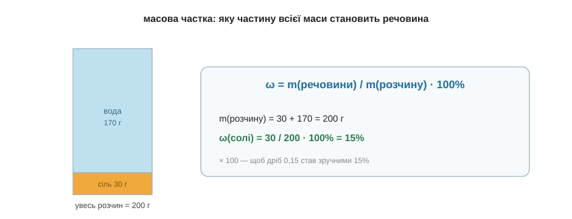

# Масова частка

На пляшці мінералки пишуть «мінералізація 4 г/л», на банці — «розчин солі 10 %», морська вода «солона на 3,5 %». Усюди якісь частки й відсотки. Розберімо, що це число означає й звідки береться, — і виявиться, що це найпростіша арифметика на світі.

Уяви, що ти розчинив 30 грамів солі у 170 грамах води. Скільки всього вийшло розчину? Очевидно, 30 + 170 = 200 грамів — сіль нікуди не зникла, вона тепер у воді (це ми бачили ще в модулі про розчини). А тепер питання: яку частину цієї маси становить сама сіль? Та просто масу солі поділити на масу всього розчину: 30 поділити на 200. Виходить 0,15 — тобто сіль це 15 сотих усієї маси. Дроби читати незручно, тож їх за звичаєм множать на 100 і дописують значок «%»: 0,15 — це 15 %. Оце число й називають **масовою часткою** і позначають грецькою буквою ω («омега»):

```
ω = m(речовини) / m(розчину) · 100%

ω        — масова частка, %
m(речовини) — маса розчиненої речовини, г
m(розчину)  — маса всього розчину (речовина + розчинник), г
```


*Рис. 6.2.1-1. Масова частка — це частина від цілого: маса солі ділена на масу всього розчину, помножена на 100 для зручних відсотків.*

Найкорисніше, що ця формула працює в обидва боки — залежно від того, чого в задачі не вистачає. Якщо знаєш маси й шукаєш частку — ділиш, як щойно. А якщо навпаки, відома частка й треба дізнатися, скільки чого взяти, — множиш. Скажімо, тобі треба приготувати 200 грамів 15-відсоткового розчину солі. Скільки солі відважити? Береш ту саму формулу й виражаєш із неї масу солі: m(солі) = ω · m(розчину) = 0,15 · 200 = 30 грамів (а води — решта, 170 г). Та сама рівність, просто дивимось на неї з іншого боку, як ми вже робили з трикутником у попередньому розділі.

Спробуй тепер сам, для певності. Ти розмішав 5 грамів цукру в 95 грамах води — яка масова частка цукру в цьому сиропі?.. Маса всього розчину 5 + 95 = 100 грамів, тож ω = 5 / 100 · 100 % = 5 %. (Коли маса розчину виходить рівно 100 грамів, частка у відсотках просто дорівнює масі речовини — зручний збіг, не більше.)

> 🏠 Написи «10 % розчину», «40 % спирту», «солоність 3,5 %» на етикетках — це все вона, масова частка: скільки грамів речовини припадає на кожні 100 грамів рідини.
