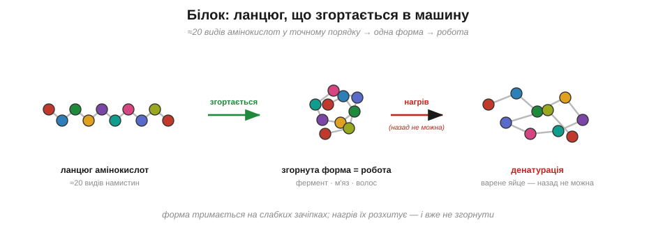

# Жири і білки

Розтоплене масло, охолонувши, застигає назад без жодного сліду — наче й не топилося. А зварене яйце не «розвариш» назад нізащо: побіліло — і вже навіки. Обидва — їжа, обидва ми просто нагріли, але одна зміна виявляється оборотною, а друга — остаточною. Чому ж так?

Почнімо з жиру. Будова в нього проста: гліцеринова голова й три довгі хвости-жирні кислоти, причеплені до неї.

> 🔗 Жир — це естер: гліцерин зчеплений із трьома довгими молекулами жирних кислот, і саме їхні хвости несуть запас енергії. [читати](book:chemistry/esters-fats)

Та навіщо тіло взагалі його запасає? А тому, що ті хвости напхані тими самими зв'язками Карбон–Гідроген, що й пальне в бензині, — отже, жир є найщільнішим складом енергії, який тільки буває: грам жиру дає десь удвічі більше енергії, ніж грам цукру. Саме тому й ведмідь перед зимою, і ми з тобою відкладаємо про запас на голодний час саме жир, а не цукор.

*Хвости жиру напхані зв'язками Карбон–Гідроген — тим самим пальним, що й бензин, тому грам жиру несе удвічі більше енергії, ніж грам цукру.*

А ось біле в яйці — це вже **білок**, і влаштований він зовсім інакше. Уяви близько двадцяти видів дрібних намистин — їх називають **амінокислотами** — нанизаних в один ланцюг у певному, наперед заданому порядку (а який саме порядок, диктують гени). Вийде довгий ланцюг — це й є білок. Поки що це просто нитка з намиста, і нічого особливого в ній наче немає. Але нитка не лишається ниткою. Вона **згортається** сама на себе в одну точну просторову форму — і саме ця форма й робить усю роботу. Згорнеться ланцюг у кишеньку, що хапає глюкозу, — вийде фермент, тобто білкові «ножиці», що ріжуть або зшивають інші молекули, самі лишаючись цілими; складеться у довге волокно — буде м'яз чи волосина; скрутиться в трубку — буде канал, яким речовини входять у клітину. Білки — це машини й балки тіла, і вся їхня вправність схована саме у згортанні.

*Ланцюг амінокислот згортається в точну форму, що й виконує роботу; нагрів розхитує слабкі зачіпки — ланцюг сплутується назавжди (денатурація).*

А тримається та згорнута форма на безлічі слабеньких зачіпок — і ось тут ми нарешті повертаємося до яйця. Нагрій білок: тепло розхитує ті слабкі зачіпки, ланцюг розкручується й безнадійно сплутується в безладний жмут, який згорнутися назад у свою точну форму вже не може. Це й називають **денатурацією** — і вона остаточна. Сирий яєчний білок прозорий і рідкий саме тому, що його ланцюги згорнуті правильно; звари його — і вони розкрутяться, переплутаються й побіліють, і жодним холодом сире вже не повернути. Тепер видно й відповідь на нашу загадку: масло лише плавилося й застигало — його молекули цілі; а яйце пережило денатурацію, незворотне розкручування білків, яке видно очима.

> 🏠 Уся смажена-варена їжа — це денатурація в дії: біліє яйце, твердне на пательні стейк, скисле молоко зсідається в сир — скрізь нагрів або кислота розкручують білки назавжди.
