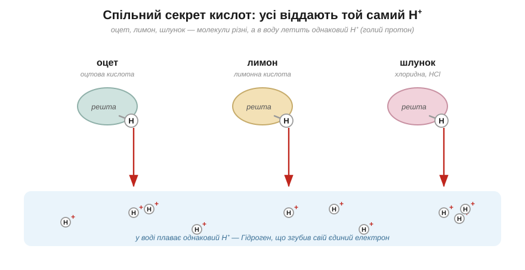
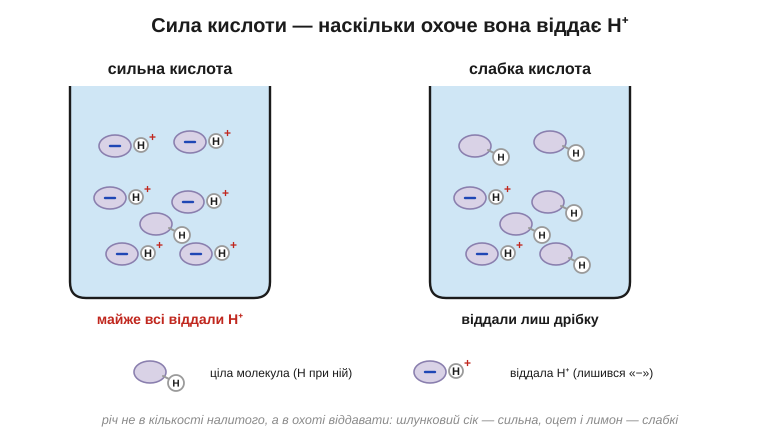

# Кислоти

Лимон, оцет, кисле молоко, шлунковий сік — на смак усі вони однакові: різкі, кислі, аж вилиці зводить. Продукти ж бо геть різні, а відчуття чомусь те саме. Що в них усіх спільного — і, дивна річ, чому той самий смак, який лоскоче язик, ще й роз'їдає метал?

Увесь секрет — в одній-єдиній крихітній частинці. Багато речовин, потрапивши у воду, не просто розчиняються, а розпадаються на заряджені уламки — іони. Так от, кислоти — це ціла родина речовин, яку об'єднує одне: у воді кожна з них відпускає на волю ту саму частинку — іон Гідрогену **H⁺**.

> 🔗 Розчиняючись у воді, чимало речовин розщеплюється на заряджені частинки — іони: наприклад, кухонна сіль розпадається на «плюс» і «мінус», що вільно плавають окремо. Саме така мандрівка вільних іонів і стоїть за поведінкою кислот. [читати](book:chemistry/ions-solution)

А H⁺ — це, по суті, голий протон: атом Гідрогену, що загубив свій єдиний електрон, і лишилося від нього саме ядро з зарядом «плюс». Самі молекули різних кислот несхожі між собою: в оцті це оцтова кислота, у лимоні — лимонна, у шлунку — хлоридна. Але в кожній з них є той Гідроген, який у воді зривається з молекули й пускається плавати окремо. Тож найкоротше означення звучить так: **кислота — це постачальник вільного H⁺**.

*Рис. 4.2.1-1. Молекули кислот несхожі, а у воду кожна пускає однаковий H⁺ — голий протон; саме спільний H⁺ і робить їх усі кислотами.*

А коли зрозумієш, що головна дійова особа одна, то й увесь різноманітний характер кислоти виявляється витівками того самого H⁺. На язику він діє на ті клітини, що чують кисле, — тому всі кислоти й кислять на один копил. У метал H⁺ впивається й видирає з його атомів електрони: метал від цього поволі розчиняється, а звільнені атоми Гідрогену зчіплюються по двоє й тікають геть бульбашками водню — ось чому й кажуть, що кислота «їсть» цвях. А капни тією ж кислотою на соду — і H⁺ вибиває з неї вуглекислий газ, аж вона скипає піною. Три зовсім різні на вигляд фокуси — а виконавець один і той самий.

Чому ж тоді шлункова кислота роз'їдає, а лимонна лише приємно кисла, хоч обидві — кислоти? Бо сила кислоти — це зовсім не про смак і навіть не про те, скільки її налили, а лише про одне: наскільки охоче молекула віддає свій H⁺. **Сильна** кислота розщедрюється майже на весь свій Гідроген — і у воді аж кишить вільними H⁺. **Слабка** ж притримує його при собі, відпускаючи тільки дещицю, — тому й діє куди м'якше. Лимонна й оцтова — слабкі; а те, що залите в автомобільний акумулятор чи виділяється в шлунку, — сильні. Спробуй застосувати це сам: маємо дві кислоти, одна з содою скипає бурхливою піною, друга ледь-ледь шипить — котра з них сильніша?.. Звісно, перша: раз вона дає більше газу, значить, відпустила у воду більше H⁺, а отже, охочіша віддавати — тобто сильніша.

*Рис. 4.2.1-2. Сильна кислота віддала майже всі H⁺, слабка — лише дрібку; різниця не в кількості налитого, а в охоті віддавати.*

З цього, до речі, випливає й цілком серйозна осторога. Куштувати «на кислинку» можна тільки добре знайому їжу. Незнайома рідина, що пахне кисло, легко може виявитися не лимонним соком, а їдкою сильною кислотою, яка зробить твоєму язику те саме, що щойно робила цвяхові.

> 🏠 Кислота в шлунку — це справжня хлоридна кислота, і досить сильна: вона розщеплює їжу й убиває проковтнутих мікробів, а сам шлунок боронить від неї зсередини шар захисного слизу.
