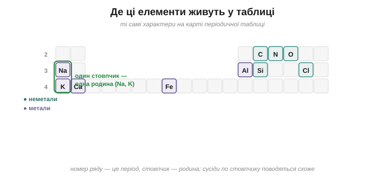

# Елементи навколо

Уся ця книжка крутилася навколо кількох десятків елементів, та в щоденному житті ти насправді маєш справу лише з жменею головних. Тож познайомимося з ними наостанок — не як із рядками в таблиці властивостей, а як із живими характерами, пройшовшись просто там, де кожен із них живе.

Почнімо з повітря, яким дихаємо. Майже чотири його п'ятих — це азот, проста речовина елемента **Нітрогену**: спокійний відлюдник, що майже ні з чим не хоче реагувати, — і саме завдяки його байдужості повітря не спалахує від першої-ліпшої іскри. А та життєдайна п'ята частина, що лишається, — це кисень, проста речовина **Оксигену**, жадібного до електронів трударя, яким ми дихаємо і який живить кожне багаття й кожну іржу. Тепер озирнімося на все живе довкола — і в його основі знайдемо **Карбон** (його прості речовини — це графіт, алмаз і сажа). Це єдиний елемент, здатний будувати з себе нескінченні ланцюги, а тому саме на ньому тримається кожна молекула життя; він такий важливий, що хімія його сполук виросла в окрему велику галузь — органічну хімію.

> 🔗 **Органічна хімія** — це хімія сполук Карбону, від простих вуглеводнів до білків і жирів живої клітини; саме здатність Карбону зчіплювати атоми в довгі ланцюги й кільця дає мільйони таких речовин. [читати](book:chemistry/carbon)

Опустимо тепер погляд під ноги. Камінь, пісок і скло — це здебільшого **Силіцій**, зчеплений з Оксигеном; і той самий Силіцій, очищений до блиску, став серцем мікросхем у твоєму телефоні. А те, чим ми будуємо, — це передусім **Ферум**, тобто залізо: дешевий силач, із якого зведено каркаси будинків і мостів, а заразом і носій кисню в нашій крові. Поруч із ним — **Алюміній**, легкий метал бляшанок, фольги та літаків, якого повно у звичайнісінькій глині під ногами.

Зазирнімо насамкінець усередину себе. Кістки й зуби тримає **Кальцій** — і він же та сама крейда й вапно зі стін. А **Натрій** із **Калієм** — це солона пара, на якій біжить кожен нервовий сигнал і б'ється серце. До речі, спробуй пояснити сам, чому ці двоє поводяться так схоже, що їх і ставлять поряд?.. Бо вони стоять в одному стовпчику періодичної таблиці, а отже, мають однакову зовнішню поличку — той самий один електрон, готовий до віддачі; саме спільна зовнішня поличка й робить їх близькою ріднею. І останній у нашій галереї — **Хлор**, друга половинка кухонної солі. Як проста речовина це отруйний зеленкуватий газ; але як спокійний іон у крові, у морі чи у воді басейну він цілком мирний і навіть знезаражує воду.

*Рис. 4.4.2-1. Десяток найважливіших елементів побуту й тіла: неметали повітря, життя та солі — і метали, якими будуємо й живемо.*

Кожен із цих характерів має своє місце в періодичній таблиці, і саме положення пояснює його вдачу: метали юрмляться ліворуч і знизу, активні неметали — праворуч і вгорі, а сусіди по стовпчику поводяться як близька рідня. Тож гляньмо насамкінець, де ця наша галерея сидить на самій карті.

*Рис. 4.4.2-2. Ті самі характери на карті-таблиці: Натрій і Калій стоять в одному стовпчику — тому й поводяться схоже.*

> 💡 **Що про це скаже великий підручник.** Наш «ряд активності» там називають електрохімічним рядом напруг металів, а саме повільне руйнування металів киснем і вологою — корозією, і їй присвячують окремі параграфи. Усе про воду, кислоти, основи, солі й елементи там зветься неорганічною хімією; шукай у ній великі розділи «Метали» й «Неметали», а в них окремі параграфи про кожен елемент — Оксиген, Нітроген, Карбон, Ферум — з їхніми валентностями й реакціями.
