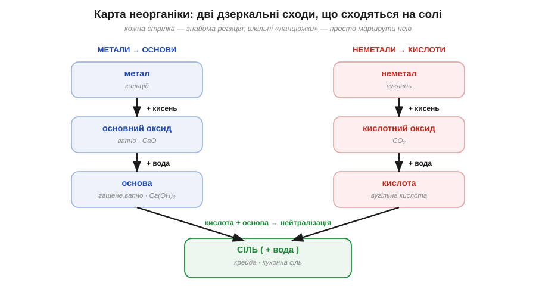
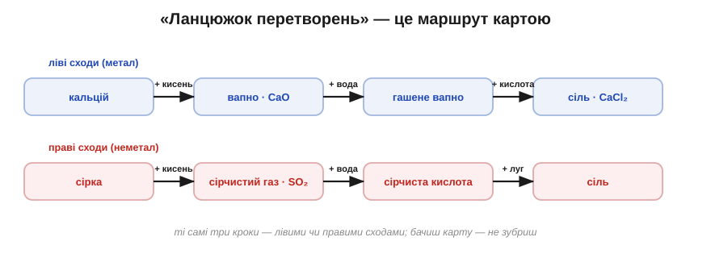

# Карта неорганіки

У школі дітей часто лякають «ланцюжками перетворень»: кальцій → оксид → гідроксид → сіль — низка стрілок із формулами, яку нібито треба визубрити підряд. Та насправді зубрити там нема чого. Усі ці ланцюжки — то просто прогулянки однією маленькою картою, і зараз ми складемо її з того, що вже й так знаємо.

Уся неорганіка ділиться на два знайомі нам табори. Ліворуч розташуймо метали, праворуч — неметали, і кожен бік будується однаково, дзеркально до іншого. Візьми метал і дай йому кисень — вийде **оксид**; додай тому оксидові води — дістанеш **основу**. А тепер повтори те саме праворуч: візьми неметал, дай йому кисень — вийде оксид; додай води — дістанеш **кислоту**. Дві однакові сходинки, «плюс кисень», а тоді «плюс вода», просто пройдені з різних боків.

*Рис. 4.3.3-1. Ліві сходи (метал → оксид → основа) і праві (неметал → оксид → кислота) спускаються до спільного нижнього поверху — солі.*

А внизу обидві сходи сходяться на одному поверсі. Бо коли кислота з правого боку зустрічає основу з лівого, вони, як ми щойно бачили, нейтралізуються — і дають **сіль**. Сіль — це те місце, де світ металів тисне руку світові неметалів. Ось і вся карта: двоє дзеркальних сходів, що збігаються внизу на солі.

А найкраще в цій карті те, що кожна стрілка на ній — це реакція, яку ти вже розумієш. «Плюс кисень» — це горіння елемента в оксид. «Плюс вода» — це коли оксид стає основою чи кислотою. «Кислота плюс основа» — це нейтралізація в сіль. Тому страшний шкільний ланцюжок «кальцій → вапно → гашене вапно → сіль» — насправді не загадка, а просто спуск лівими сходами, крок за кроком. Спробуй прочитати так само правий ланцюжок: сірка → ? → ? → сіль. Якими сходами він іде і що на кожному кроці?.. Правими: сірка плюс кисень дає її оксид, оксид плюс вода — кислоту, а кислота плюс якась основа — сіль. Карта, звісно, дещо спрощує — деякі оксиди хитрі й уміють поводитися на обидва боки, — але кістяк саме такий, і з ним будь-який «ланцюжок» читається вже не як список для зубріння, а як зрозумілий маршрут.

*Рис. 4.3.3-2. Той самий набір кроків лівими чи правими сходами: «ланцюжок перетворень» — це просто маршрут, а не список для зубріння.*

> 🏠 Тепер шкільне завдання «здійсни перетворення» читається зовсім інакше: не «пригадай потрібні формули», а «знайди на карті, з якої клітинки в яку треба йти».
