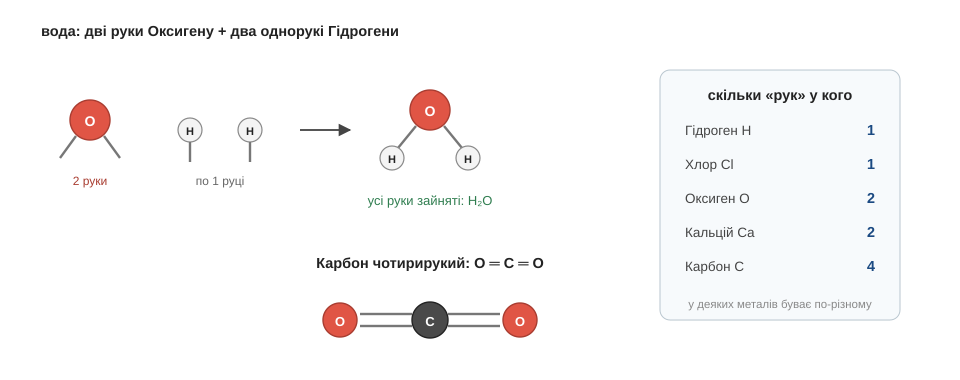

# Валентність

Поставмо собі питання, яке на перший погляд здається дивним: а чому вода — це саме H₂O? Чому не HO, не HO₃, не якесь H₅O₂? Адже природа ніколи не помиляється в рецепті: вода завжди виходить з рівно двох Гідрогенів на один Оксиген, ніколи інакше. Отже, щось чітко диктує цю пропорцію. І розгадка вже лежить у нас у кишені — вона прямо випливає з ковалентного зв'язку, з яким ми познайомилися в попередньому розділі.

Згадаймо суть ковалентного зв'язку: двоє атомів тримаються разом спільною парою електронів, і кожна така пара затуляє одне вільне місце на зовнішній поличці. А тепер поставмо ключове питання: скільки всього зв'язків здатен утворити один атом? Очевидно, рівно стільки, скільки вільних місць йому треба затулити до повної полички. Оксигену, як ми з'ясували, до повного бракує двох електронів — отже, він може утворити два зв'язки, у нього дві «руки», якими він хапається за сусідів. А Гідрогену бракує одного — тож у нього рука лише одна. Тепер складімо з цих рук воду: Оксиген простягає дві руки, і за кожну має вхопитися окремий Гідроген, бо в того рука лише одна. Дві руки Оксигену — два Гідрогени. От і вийшло H₂O — не з примхи й не з зазубреного правила, а як проста арифметика рук.

Цю кількість рук для зв'язку називають **валентністю**. Гідроген завжди одновалентний — одна рука. Оксиген у своїх сполуках двовалентний. А Карбон — аж чотирирукий, і саме ця надзвичайна щедрість на руки зробить його головним героєм останнього модуля. Щоправда, у багатьох металів кількість задіяних рук буває різною в різних сполуках — тому на упаковках вітамінів чи в підручнику пишуть «Ферум(II)» або «Ферум(III)»: оця римська цифра в дужках просто уточнює, скількома руками залізо тримається саме в цій конкретній речовині. А чому в одних атомів валентність тверда, а в інших гнучка, — питання глибше, ніж потрібно нам зараз, і його ми лишаємо великій книзі.

Найкращий спосіб переконатися, що ти справді вловив ідею рук, — скласти формулу самому, перш ніж я її назву. Візьмімо Нітроген: до повної полички йому бракує трьох електронів, тобто в нього три руки. І сполучимо його з Гідрогеном, у якого рука одна. Скільки Гідрогенів знадобиться, щоб зайняти всі три руки Нітрогену, і яка вийде формула?.. Саме так — потрібно три Гідрогени, по одному на кожну руку, і формула виходить NH₃. Це аміак, той самий, чий різкий дух знайомий з нашатирного спирту. Бачиш: знаючи самі лише руки, ти передбачив склад речовини, якої перед тим у вічі не бачив.

Перевірмо арифметику ще й на вуглекислому газі, бо там ховається цікавинка. Карбон має чотири руки, а кожен Оксиген — дві. Як їх поєднати? Природа робить це елегантно: Карбон хапає кожен Оксиген обома його руками одразу — дві руки на один Оксиген ліворуч, дві на другий праворуч. Усі чотири руки Карбону зайняті, обидві руки кожного Оксигену теж — усі задоволені, виходить CO₂. Коли два атоми тримаються не однією, а одразу двома парами рук, кажуть про подвійний зв'язок — запам'ятай це слово мимохідь, воно ще яскраво спрацює в органіці.

І нарешті ще одне слово, яке в шкільному підручнику живе поряд із валентністю, — **ступінь окиснення**. Якщо зовсім коротко, то це та сама лічба задіяних електронів, але вже зі знаками: атом, що перетягнув спільні електрони до себе, рахують у «мінусі», а той, що віддав, — у «плюсі». Ці знаки стануть нам у пригоді трохи згодом, у модулі про реакції, коли треба буде стежити, хто в кого забрав електрони. Та в основі — все та сама ідея рук, лише з позначками напрямку.

Отже, тепер формули не просто читаються — нам уже видно, **чому** вони саме такі. Лишився останній інструмент цього розділу, і він розв'язує задачу, що досі здавалася неможливою: як полічити атоми, яких не видно.

*Рис. 2.2.2-1. Дві руки Оксигену займають два однорукі Гідрогени — виходить H₂O; чотирирукий Карбон тримає кожен Оксиген двома руками — виходить CO₂.*

> 🏠 «Ферум(III)» на упаковці вітамінів — то не код партії й не загадка: римська цифра просто каже, скількома руками залізо тримається в цій сполуці.
