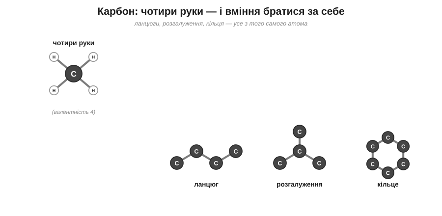
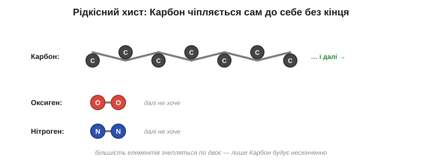

# Карбон

Озирнися ще раз довкола, тепер уже прицільно. Деревина столу, пластик ручки, бензин у баку машини, цукор у чаї, ліки в аптечці — і ти сам — усе це збудовано здебільшого з одного елемента, Карбону. Як один-єдиний сорт атомів примудряється давати і тверду деревину, і рідке пальне, і живу клітину? Розгадка — у двох його особливостях, і перша з них — це руки атома.

> 🔗 Валентність — це кількість «рук», якими атом чіпляється за сусідів: скільки спільних пар він здатен утримати, стільки в нього й зв'язків. [читати](book:chemistry/valence)

У Карбону цих рук рівно чотири, і всі вони міцні. Саме по собі це вже чимало — чотирма руками можна вхопити аж чотирьох партнерів водночас. Але справжня сила Карбону криється не в самому числі рук, бо чотирирукі атоми є й серед інших елементів. Головне — його рідкісний хист: Карбон однаково радо подає руку **іншому Карбону**. Більшість елементів так не вміють — зчепляться між собою по двоє, ну по троє, та й по всьому. А карбонові атоми беруться за руки практично без кінця: вони вишиковуються в довжелезні ланцюги, пускають із них бічні відгалуження, замикаються в кільця — і при цьому в кожного ще лишаються вільні руки, щоб причепити Гідроген чи якісь інші атоми. Виходить, що з одного-єдиного сорту цеглинок можна збудувати каркаси геть будь-якої форми й довжини.

*Рис. 5.1.1-1. Чотири руки Карбону плюс уміння братися за інший Карбон дають каркаси будь-якої форми: ланцюг, розгалуження, кільце.*

Щоб відчути, наскільки це рідкісний дар, спробуй уявити на місці Карбону, скажімо, Оксиген. У Оксигену рук лише дві — то чи побудуєш ти з нього довгий ланцюг?.. Ні, далеко не зайдеш: маючи дві руки, атом може хіба вхопити сусіда з одного боку й ще одного з другого — вийде коротка низка, що швидко обірветься. А чотири руки Карбону, та ще й охота братися за свого ж брата, — це саме те поєднання, якого більше ні в кого немає, і саме воно відмикає нескінченність.

А з тієї нескінченності форм випливає й уся незліченність органіки. Карбонові скелети бувають якої завгодно довжини й вигляду, а на них іще навішуються різні «прикраси» з інших атомів — тож сполук Карбону наука знає вже мільйони, більше, ніж усіх інших речовин на світі разом узятих. Цей величезний світ і називають **органічною хімією** — хімією сполук Карбону. А «органічною» вона зветься тому, що все живе збудоване саме так, на карбонових скелетах: колись люди гадали, що творити такі речовини здатне лише живе, лише сама природа.

*Рис. 5.1.1-2. Більшість елементів зчіплюються між собою хіба по двоє; тільки Карбон тягне ланцюг без кінця — звідси й мільйони його сполук.*

> 📜 А перша штучна органічна фарба народилася з невдачі. У 1856 році вісімнадцятирічний лондонський студент Вільям Перкін на канікулах намагався добути зі смоли кам'яного вугілля ліки від малярії — хінін. Дослід геть провалився: у колбі лишилася якась чорна гидь. Та коли Перкін заходився відмивати її спиртом, розчин раптом засяяв яскравим бузковим кольором. Замість ліків у нього вийшов перший у світі штучний барвник, який назвали «мовеїном». Доти всі фарби добували з рослин та молюсків, і пурпуровий колір був недешевою розкішшю, — а тепер його можна було варити з відходів газових заводів. Юнак облишив навчання, узяв патент і збудував фабрику, а бузковий відтінок став модою, яку носила навіть королева. Так невдалий студентський дослід заснував цілу хімічну промисловість.

> 🏠 Майже все «неживе», що горить або тягнеться, — це теж органіка: свічка, поліетилен, гас, віск, гума — усі вони далекі родичі по Карбону.
