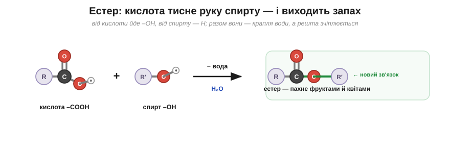
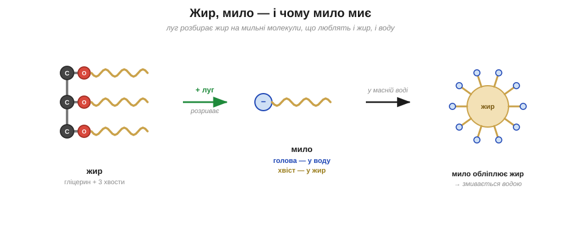

# Естери і жири

Запах груші в цукерці, банана в морозиві, квітів у парфумах — це дуже часто ніяка не груша, не банан і не квітка, а проста зустріч двох знайомих із попередньої теми: кислоти й спирту. Що ж пахуче народжується від їхньої зустрічі — і до чого тут, як обіцяно, жир та мило?

Зведімо разом карбонову кислоту з її групою –COOH і спирт з його групою –OH. З'єднуються вони так: від кислоти відходить –OH, від спирту — H, ці двоє разом полишають молекулу у вигляді краплі води, а два залишки, що лишилися, зчіплюються між собою через Оксиген. Те, що при цьому виходить, називають **естером**. І саме дрібні естери — це і є ті фруктові запахи: грушевий, яблучний, ананасовий; на них тримається вся парфумерія й добра половина харчових ароматів.

*Рис. 5.2.2-1. Кислота й спирт зчіплюються, відпустивши краплю води; новий зв'язок через Оксиген — це естер, і дрібні естери пахнуть фруктами.*

А з того самого з'єднання природа будує й дещо значно більше. Візьми **гліцерин** — невелику молекулу, що має аж три руки-–OH — і причепи до кожної з трьох рук по довгому хвосту жирної кислоти, знову ж таки через естерний зв'язок. Молекула, що вийде, з трьома довгими хвостами, і є **жир**: гліцеринова голова та три довгі хвости. А хвости ці — чистісінький вуглеводень, гладенький і незаряджений, — і саме тому жир не мішається з водою, точно як олія на самому початку нашої книги.

А тепер найцікавіше — звідки береться мило. Щоб його дістати, жир треба розібрати назад, але не водою (вона з ним не дружить), а лугом. Луг розриває естерні зв'язки й відчіплює всі три хвости від гліцерину. І кожен звільнений хвіст дістає на місці розриву заряджену голову — ось ця молекула, з довгим жирним хвостом і зарядженою головою, і є **мило**. Згадай тепер, що ми мигцем казали в розділі про основи — буцімто луг «перетворює жир на мило»; ось він, той самий механізм, тепер уже зрозумілий до кінця.

*Рис. 5.2.2-2. Луг розриває жир на мильні молекули; кожна одним кінцем чіпляється за жир, другим — за воду, тому обліплює жирну краплю й зносить її водою.*

І ось ця дволикість мильної молекули — жирний хвіст з одного кінця й водолюбна заряджена голова з другого — і є вся таємниця прання. Спробуй здогадатися сам, як саме мило знімає жирну пляму, якщо один його кінець любить жир, а другий — воду?.. Мильні молекули встромляють свої хвости в краплю жиру, а заряджені голови виставляють назовні, у воду, — і кожна жирна крапля опиняється загорнута в мильну кульку, дружню до води. Сама собою вода з жиру лише зісковзує, не беручи його; а мило хапає жир за хвіст і зносить його разом із водою геть. Оце й уся хитрість, на якій тримається миття.

> 🏠 Саме тому масний посуд відмиває мило чи засіб, а не сама вода: їхні молекули чіпляються одним кінцем за жир, другим за воду — і стягують бруд у злив.
