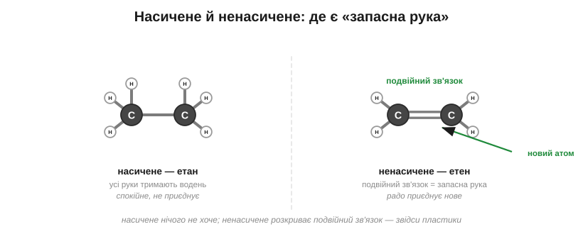

# Вуглеводні

Блакитний вогник на плиті, бензин у баку, червоний балон із газом, свічка на столі — придивившись, помічаєш дивну річ: світ щодня рухається й гріється, спалюючи майже одне й те саме. Що ж це за паливо, з якого зіткані й крихітний вогник сірника, і ревучий струмінь реактивного літака?

Це найпростіше, що взагалі можна зліпити з карбонових скелетів попередньої теми. Візьми ланцюжок із атомів Карбону й на кожну його вільну руку почепи по атому Гідрогену — і дістанеш **вуглеводень**, тобто молекулу лише з двох сортів атомів, Карбону й Гідрогену. Найкоротший із них — **метан**: один атом Карбону, що тримає чотири Гідрогени. Це і є природний газ, який горить у тебе на плиті.

А далі вибудовується проста драбинка за довжиною ланцюга — і, що цікаво, із самою лише довжиною змінюється весь характер речовини. Один Карбон — це метан, газ. Три Карбони в ланцюжку — це пропан, теж газ, але вже такий, що його легко стиснути в балон. Сім-вісім Карбонів поспіль — і перед нами вже не газ, а рідина, бензин; іще довші ланцюги дають гас; а зовсім довгі застигають уже твердими — це віск та асфальт. Речовина по суті та сама, з тих самих C і H, лиш ланцюг дедалі довшає — і вона помалу повзе з газу в рідину, а тоді й у тверде.

*Рис. 5.1.2-1. Ті самі Карбон і Гідроген: що довший ланцюг, то «важча» речовина — від газу метану до твердого воску.*

Тепер тонша, але важлива відмінність, яка нам ще знадобиться. Якщо кожна вільна рука Карбону тримає свій окремий Гідроген, молекулу називають **насиченою** — вона ніби повна, лінива, усі руки при ділі. Та буває й інакше: два сусідні Карбони хапаються один за одного одразу двома руками — це **подвійний зв'язок**, з яким ми мигцем стрічалися ще в розмові про валентність. Тоді Гідрогенів у молекулі стає менше, зате в неї з'являється мовби запасна, готова до дії рука: таку молекулу звуть **ненасиченою**. І ось чому це важливо: подвійний зв'язок здатен розкритися й приєднати до себе нові атоми. Спробуй здогадатися сам: котра з двох молекул охочіша вступати в реакції — насичена, де всі руки зайняті воднем, чи ненасичена із запасною рукою?.. Звісно, ненасичена: їй є чим хапати, тож вона радо приєднує нове, тоді як насичена поводиться спокійно й незворушно. Саме на цій охоті ненасичених приєднувати й виростуть пластики наступної теми.

*Рис. 5.1.2-2. У насиченій молекулі всі руки тримають водень; у ненасиченій два Карбони з'єднані подвійним зв'язком, готовим розкритися й приєднати нове.*

Та хоч би які різні були вуглеводні завдовжки й за насиченістю, головна робота в них одна — горіти. Кожна така молекула напхана зв'язками Карбон–Гідроген; зустрівши кисень, вони згоряють на вже знайомі нам вуглекислий газ та воду, вивільняючи при цьому купу тепла. Саме це тепло крутить двигуни машин, гріє наші домівки й варить їжу. Ось чому скромні на вигляд ланцюжки з C і H — це головне паливо всього світу.

> 🏠 Природний газ у трубі — це метан; у балоні й у запальничці — його трохи довші родичі пропан і бутан; а бензин та гас — це вже рідкі ланцюги, ще довші. Уся різниця між ними — лише в довжині ланцюга.
