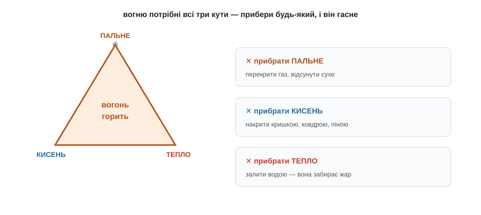
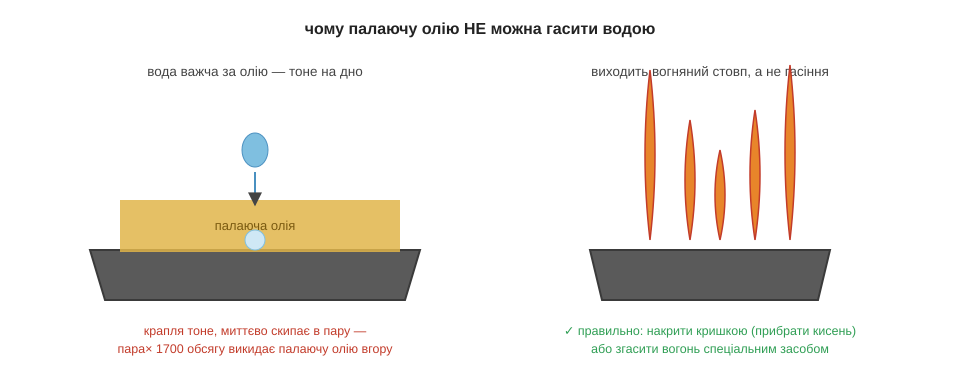

# Горіння

Підпалити сірник просто — а от загасити вогонь буває несподівано хитро. Питання здається аж дитячим: лий воду, та й по всьому. Але тут чигає підступ. Та сама вода, що чудово рятує від палаючого паперу, перетворює палаючу олію на сковорідці на справжній вогняний стовп до стелі. Щоб розуміти, чим і коли гасити, спершу треба зрозуміти, чим вогонь живиться.

Горіння — це швидка екзотермічна реакція, і їй конче потрібні три речі **водночас**.

> 🔗 Реакцію називають екзотермічною, коли вона віддає енергію назовні — гріє, світить, штовхає: зв'язки в продуктах міцніші, ніж у вихідних речовин, і різниця вивільняється як тепло. [читати](book:chemistry/reaction-energy)

Перша — **пальне**, тобто те, що, власне, горить: дрова, газ, олія. Друга — **кисень**, той партнер, з яким пальне з'єднується; саме тому в закупореній банці без повітря нічого не горітиме. І третя — **тепло**, потрібне, щоб утримувати реакцію за бар'єром активації, бо варто їй охолонути нижче порога — і вона згасне. Цю трійцю незамінних умов так і називають — **трикутник вогню**, і найважливіше в ньому слово — «водночас». Бо щойно прибрати бодай один із трьох кутів, як вогонь одразу гасне. Уся пожежна справа, по суті, зводиться до цього одного речення.

Звідси самі собою випливають і всі способи гасіння — і кожен з них прибирає свій кут трикутника. Перекрив газ на плиті — забрав **пальне**, і горіти стало нічому. Накрив сковорідку кришкою, збив полум'я цупкою ковдрою чи піною з вогнегасника — відрізав доступ **кисню**, і реакція задихнулася. Хлюпнув води на багаття — забрав **тепло**: вода жадібно вбирає жар і сама на нього скипає, температура падає нижче бар'єра, і реакція спиняється. Три прийоми — три кути; який зручніший у даній ситуації, той і застосовуй.

А тепер спробуй пояснити одну буденну дивовижу. Чому, коли дмухнути на сірник, він гасне, а коли роздмухувати міхами горно в кузні — вогонь, навпаки, розгоряється ще лютіше?.. Бо дмух на маленький сірник здуває гаряче повітря й охолоджує крихітне полум'я нижче бар'єра — ми прибираємо кут «тепло». А струмінь повітря в горно, де жару й так удосталь, не охолоджує, зате приносить свіжий **кисень** до великого шару вугілля — ми, навпаки, підсилюємо кут «кисень». Той самий подув, а наслідок протилежний — усе залежить від того, який кут трикутника він зачепить.

Тепер повернімося до олії, заради якої все й писалося. Чому ж палаючу олію не можна гасити водою? Бо вода важча за олію й не змішується з нею — вилита крапля не лишається зверху, а провалюється під розпечений масляний шар на самісіньке дно. А там вона миттю скипає, і пара, що утворюється, займає в сотні разів більший обсяг, ніж була краплина. Цей раптовий струмінь пари вибухово викидає палаючу олію вгору хмарою дрібних бризок. І кожна така бризка — це крапелька пального, тепер уже з усіх боків оточена киснем повітря: усі три кути трикутника разом помножилися, і замість гасіння виходить спалах до стелі. Палаючу олію гасять зовсім інакше — просто накривають кришкою, відрізаючи кисень. Усе той самий трикутник вогню, лише обрано для нього безпечний кут.

*Рис. 3.2.2-1. Вогню потрібні всі три кути разом — пальне, кисень і тепло; гасіння — це прибирання будь-якого одного з них.*

*Рис. 3.2.2-2. Вода провалюється під олію, скипає на дні й вибухом пари викидає палаюче пальне вгору — а правильно ж накрити кришкою, відрізавши кисень.*

> 🏠 На кухні запам'ятай головне правило: палаючу сковороду накривають кришкою або мокрим рушником — і ніколи, ніколи не заливають водою.

Отже, весь вогонь тримається на трьох кутах разом, і вся пожежна справа — це вміння прибрати хоча б один із них: пальне, кисень або тепло. Підпалити горіння треба тому, що реакції спершу потрібен поштовх через бар'єр активації, а спинити — тому, що, охолонувши нижче цього порога, вона сама гасне.

> 🔗 Будь-яка реакція мусить спершу подолати «гірку» — бар'єр активації: щоб зв'язки розірвалися й перебудувалися, молекулам треба зіткнутися досить різко. Тепло дає цей поштовх, а нижче порога реакція не йде. [читати](book:chemistry/reaction-rate)
