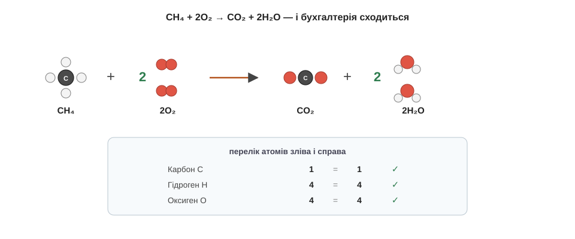

# Рівняння

Найзручніше уявляти хімічне рівняння як звичайний кухонний рецепт. На картці пишуть приблизно так: «2 яйця + склянка борошна + молоко → 8 млинців». Ліворуч перелічено, що взяти, праворуч — що з того вийде, а стрілка читається просто «перетворюється на». Хімічне рівняння влаштоване точнісінько так само, тільки замість продуктів із крамниці в ньому стоять речовини, записані формулами. Є, щоправда, одне залізне правило, якого звичайна кухня не знає, — але про нього за хвилину, спершу просто навчімося читати.

Візьмімо знайому реакцію — горіння газу в плиті. Газ цей зветься метан і має формулу CH₄: чотирирукий Карбон, що тримає чотири Гідрогени. Коли метан горить, він з'єднується з киснем повітря й дає вуглекислий газ та водяну пару. Запишімо це просто як є, нічого поки не підправляючи: CH₄ + O₂ → CO₂ + H₂O. Ліворуч від стрілки стоять **реагенти** — те, що ми беремо; праворуч — **продукти**, тобто те, що утворюється. Прочитати таке рівняння нескладно: «метан з киснем перетворюються на вуглекислий газ і воду».

А тепер згадаймо те залізне правило з попередньої теми: у реакції жоден атом не зникає й не береться нізвідки. Перевірмо наш запис чесною бухгалтерією — порахуймо атоми кожного сорту з обох боків стрілки. Ліворуч: один Карбон, чотири Гідрогени і два Оксигени. Праворуч: один Карбон — гаразд, сходиться; але Гідрогенів лише два замість чотирьох, а Оксигенів аж три замість двох. Виходить, двоє Гідрогенів кудись поділися, а один Оксиген узявся нізвідки. Такий запис описує неможливе — отже, рівняння треба **зрівняти**.

Інструмент для цього рівно один — великі числа перед формулами, які звуть **коефіцієнтами**; ми вже мигцем стрічали їх у розділі про формули. Підбираймо їх по черзі, дивлячись, що не сходиться:

```
CH₄ + O₂  → CO₂ + H₂O        Гідроген: ліворуч 4, праворуч 2 — не сходиться
CH₄ + O₂  → CO₂ + 2H₂O       тепер Гідрогену 4 = 4 ✓, але Оксигену 2 проти 4
CH₄ + 2O₂ → CO₂ + 2H₂O       тепер і Оксигену 4 = 4 ✓ — баланс зійшовся
```

І ось чого робити аж ніяк **не можна** — це чіпати індекси, оті маленькі нижні числа всередині формул. Може здатися, ніби простіше було б замість зайвого коефіцієнта дописати H₂O₂ — і баланс начебто теж зійдеться. Але H₂O₂ — це вже не вода, а пероксид, зовсім інша, їдка рідина: ми б у рецепті підмінили один продукт іншим. Індекс — це паспорт речовини, він недоторканний; зрівнювати рівняння дозволено тільки коефіцієнтами, тобто кількістю цілих молекул.

Спробуй тепер зрівняти одне рівняння сам — це найкращий спосіб відчути, як воно працює. Водень горить у кисні, даючи воду: H₂ + O₂ → H₂O. Порахуй Оксиген з обох боків і добери коефіцієнти, щоб усе зійшлося… Ліворуч Оксигену два (молекула O₂), праворуч лише один — тож постав перед водою двійку: H₂ + O₂ → 2H₂O. Тепер Оксигену по два з кожного боку, зате Гідрогену праворуч стало чотири, а ліворуч два — додай двійку й там: 2H₂ + O₂ → 2H₂O. Перелічи ще раз: чотири Гідрогени і два Оксигени з обох боків. Зійшлося.

Тож зрівняти рівняння означає підібрати коефіцієнти так, щоб кожного сорту атомів ліворуч і праворуч було порівну, — і це не шкільна формальність, а просто записаний значками закон збереження маси. А винагорода за цю роботу ось яка: зрівняні коефіцієнти заразом кажуть і пропорції в молях. Запис «CH₄ + 2O₂» означає не лише «метан з киснем», а й точну міру — на один моль метану треба рівно два молі кисню. Рецепт став кількісним: тепер ми знаємо не тільки що з чим змішати, а й скільки саме.


*Рис. 3.1.2-1. Кожен сорт атомів ліворуч і праворуч сходиться один в один: рівняння — це рецепт, що поважає закон збереження маси.*

> 🏠 Якщо кисню до метану надходить менше, ніж велить рецепт, газ згоряє «неповно» — і серед продуктів з'являється отруйний чадний газ; саме тому газові плити й колонки такі вимогливі до припливу свіжого повітря.
